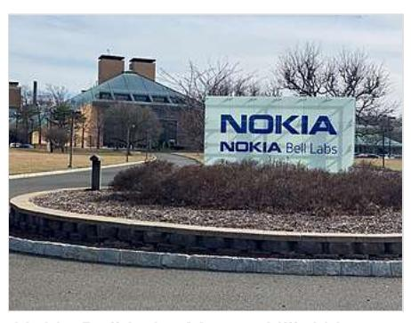
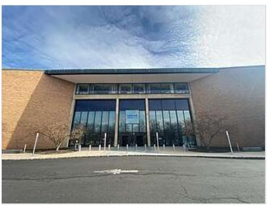
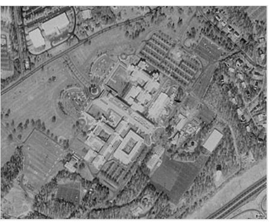

## WIKIPEDIA

# Bell Laboratories

Die Bell Laboratories (auch Bell Labs, früher Bell Telephone Laboratories, kurz BTL) sind die ehemalige Forschungsabteilung der Telefongesellschaft AT&T, in der im Laufe des 20. Jahrhunderts zahlreiche wichtige Durchbrüche in der Telekommunikationstechnik, Mathematik, Physik, Materialforschung und Informatik erzielt wurden. Für an den Bell-Laboratories durchgeführte Forschung wurden zehn Nobelpreise und mehrere Turing-Awards verliehen.[1]

Heute sind die Bell Laboratories Teil der Forschungs- und Entwicklungsabteilung von Nokia. Der Hauptsitz der Bell Labs ist in Murray Hill, New Jersey, in den Vereinigten Staaten. Nokia betreibt mehrere Bell Labs Forschungs- und Entwicklungseinrichtungen weltweit, darunter die Bell Labs Stuttgart und München.[2]

Die Bell Bell Labs sind organisatorisch in in drei Unternehmensbereiche eingeteilt: Forschung, Systemtechnik und Entwicklung.

In der Forschung gewann man grundlegende Erkenntnisse für die Telekommunikation aus den Bereichen Mathematik, Physik, Materialforschung und Informatik.

Nokia Bell Labs Murray Hill, NJ

Haupteingang Nokia Bell Labs Murray Hill, NJ

In der Entwicklung, dem größten Unternehmensbereich, wurde die Hard- und Software entwickelt, mit der das Telekommunikationsnetz des Bell-Systems aufgebaut wurde.

## Inhaltsverzeichnis

Geschichte Meilensteine Literatur Weblinks Einzelnachweise

### Geschichte

Die Bell Telephone Laboratories Inc. gehen zurück auf die im Jahr 1877 von Gardiner Greene Hubbard, Alexander Graham Bell, Thomas Sanders und Thomas Watson gegründete Bell Telephone Company.[0] Im Jahr 1925 wurden sie durch Walter Gifford (später Präsident von AT&T) als separate Einheit für die Forschungs- und Entwicklungsarbeit von Western Electric neu https://de.wikipedia.org/wiki/Bell\_Laboratories

formiert. Erster Präsident wurde Frank B. Jewett. Anteilseigner waren zu gleichen Teilen Western Electric und AT&T. Die Hauptaufgabe bestand im Entwickeln von Vermittlungsstellen für Western Electric, die an Firmen verkauft wurden, die das Bell Telephone System einsetzten. 41

Später wurden auch militärische Projekte, wie zum Beispiel der Bau der Rakete Nike, unterstützt.

1996 gliederte AT&T die Bell Labs, zusammen mit dem größten Teil der Geräteherstellung, in das neue Unternehmen Lucent Technologies aus. AT&T behielt eine kleinere Anzahl Forscher, aus denen die AT&T Laboratories gebildet wurden.

Luftbild der Bell Labs in Murray Hill

Mit der Übernahme von Alcatel-Lucent durch Nokia im Jahr 2016 kamen auch die Bell-Labs zu Nokia. 51

### Meilensteine

- 1926 Nachweis der Beugung von Elektronen an Kristallen durch Clinton Davisson und Lester Germer. Davisson erhielt dafür 1937 den Nobelpreis für Physik.
- 1932 entdeckte Karl Guthe Jansky, dass aus der Mitte unserer Galaxie Radiowellen emittiert wurden, während er nach den Ursachens bei Langstrecken-Funkverbindungen forschte - dies war der Beginn der Radioastronomie.
- ab 1936 arbeitete Hendrik Wade Bode (Bode-Diagramm) bei den Bell Labs. Im April 1945 veröffentlichte er das Buch "Network Analysis and Feedback Amplifier Design".
- 1940 führte George Stibitz den von ihm bei den Bell Labs entwickelten Complex Number Calculator, eine elektrische Relais-basierte Rechenmaschine für komplexe Zahlen ferngesteuert über eine Telefonleitung von einer Tagung der American Mathematical Society vor.
- 1943 bis 1945 folgten weitere Relais-Rechner für die Flak-Zielführung und ballistische Berechnungen.
- Der erste funktionierende Bipolartransistor wurde 1947 in der von John R. Pierce geführten Forschungsgruppe in den Bell Laboratories gebaut und von ihm so getauft. Die Wissenschaftler John Bardeen, William Bradford Shockley, und Walter Houser Brattain erhielten dafür den Physik-Nobelpreis von 1956.
- Claude Shannon, Mathematiker an den Bell Labs, veröffentlichte 1948 Die mathematische Theorie der Kommunikation im Bell System Technical Journal, wobei er sich auf frühere Erkenntnisse von Harry Nyquist und Ralph Hartley auf dem Gebiet der Informationstheorie stützte.
- Daryl Chapin, Calvin Souther Fuller und Gerald Pearson entwickelten 1953 und produzierten an den Bell Labs die ersten technisch interessanten Silizium-Solarzellen mit über 4 % Wirkungsgrad (eine hatte sogar 6 % Wirkungsgrad). Sie bauten dabei auf vielen neuen Entwicklungen der vergangenen Jahre auf.
- 1957 entwickelte Max Mathews die erste Version seines MUSIC-N-Programms zur Komposition von Computermusik.
- 1960, nur knapp ein halbes Jahr nach dem ersten Laser von Theodore Maiman stellt die Arbeitsgruppe von Ali Javan den Helium-Neon-Laser vor, es ist der erste Gaslaser.
- 1962 erfanden Gerhard M. Sessler und James Edward Maceo West das Elektret-Mikrofon.
- 1964 entdeckten Arno Penzias und Robert Woodrow Wilson den kosmischen Mikrowellenhintergrund, der von George Gamow als ein Überbleibsel der heißen Frühphase

des Universums vorhergesagt worden war. Penzias und Wilson erhielten dafür 1978 den Nobelpreis in Physik.

- 1964 Chandra Kumar N. Patel entwickelt mit dem Kohlendioxidlaser eine Laserstrahlquelle mit hoher Dauerleistung und hohem Wirkungsgrad.
- 1969 entwickelten Willard Boyle und George E. Smith den CCD-Sensor, der heute vor allem in Digitalkameras Verwendung findet. Sie erhielten dafür 2009 ebenfalls den Nobelpreis in Physik.
- Ende 1960er entwickelten John R. Arthur und Alfred Y. Cho die Molekularstrahlepitaxie (englisch molecular beam epitaxy, MBE) zum Abscheiden einkristalliner Schichtsysteme, welche die Grundlage für die heutige Optoelektronik bilden.
- Ab Ende der 1960er waren die Bell Labs der Ursprung des Unix-Betriebssystems und der Programmiersprache C, entwickelt von Dennis Ritchie und Ken Thompson in den frühen 1970ern, sowie dessen objektorierter Erweiterung C++ von Bjarne Stroustrup in den 1980ern. Auch die statistische Programmiersprache S hat ihren Ursprung an den Bell Labs.

### Literatur

■ Jon Gertner: The Idea Factory: Bell Labs and the Great Age of American Innovation. Penguin Books, New York 2012, ISBN 978-1-59420-328-2

### Weblinks

Commons: Bell Labs (https://commons.wikimedia.org/wiki/Category:Bell\_Labs? uselang=de) – Sammlung von Bildern, Videos und Audiodateien

■ Homepage der Bell Labs (https://www.bell-labs.com/) (englisch)

## Finzelnachweise

- 1. Webseite der Bell Labs. (https://www.bell-labs.com/about/recognition/) Abgerufen am 11. September 2019.
- 2. Karte (https://d1p0gxngcu0lvz.cloudfront.net/images/Map Locations April21.original.png) der Bell Labs Standorte unter Nokia, April 2021. Profil Bell Labs Stuttgart (https://www.bell-labs.co m/about/locations/stuttgart-germany) und Bell Labs München (https://www.bell-labs.com/about/ locations/munich-germany).
- 3. Pizer, Russell A. The Tangled Web of Patent #174465 (https://books.google.com/books?id=4Vj yz9fgs6sC), AuthorHouse, 2009, S. 123f. ISBN 1-4389-8402-2
- 4. Bell Labs (http://ethw.org/Bell Labs) im Engineering and Technology History Wiki
- 5. Jürgen Berke: Fusion mit Alcatel-Lucent. (http://www.wiwo.de/unternehmen/it/fusion-mit-alcatel -lucent-das-ist-der-neue-nokia-konzern/12826016.html) Das ist der neue Nokia-Konzern. In: Wirtschaftswoche. 13. Januar 2016, abgerufen am 2. März 2016.

Normdaten (Körperschaft): GND: 214072-X | LCCN: n79093275 | NDL: 001142519 | VIAF: 124654056

Abgerufen von "https://de.wikipedia.org/w/index.php?title=Bell\_Laboratories&oldid=248014702"

Diese Seite wurde zuletzt am 24. August 2024 um 20:57 Uhr bearbeitet.

#### Bell Laboratories – Wikipedia

Der Text ist unter der Lizenz "Creative-Commons Namensnennung – Weitergabe unter gleichen Bedingungen" verfügbar; Informationen zu den Urhebern und zum Lizenzstatus eingebundener Mediendateien (etwa Bilder oder Videos) können im Regelfall durch Anklicken dieser abgerufen werden. Möglicherweise unterliegen die Inhalte jeweils zusätzlichen Bedingungen. Durch die Nutzung dieser Website erklären Sie sich mit den Nutzungsbedingungen und der Datenschutzrichtlinie einverstanden.

Wikipedia® ist eine eingetragene Marke der Wikimedia Foundation Inc.