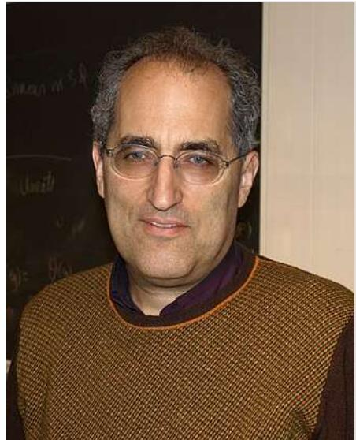
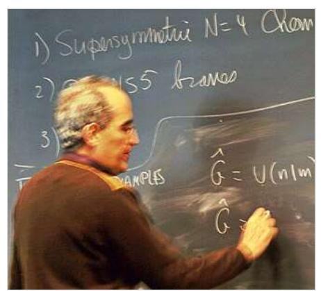

### WIKIPEDIA

# Edward Witten

Edward Witten (\* 26. August 1951 in Baltimore, Maryland) ist ein US-amerikanischer Mathematiker und Physiker. Er ist vor allem bekannt als einflussreicher und vielzitierter Wissenschaftler im Bereich der Stringtheorien und Quantenfeldtheorien und zugehöriger Gebiete der reinen Mathematik. Im Jahr 1990 erhielt er als bisher einziger Physiker mathematischen Auszeichnungen.

### Inhaltsverzeichnis

Leben Lehre Auszeichnungen Namensgebungen Schriften (Auswahl) Sekundärliteratur Weblinks Einzelnachweise

Edward Witten an der Technischen Hochschule Chalmers, Göteborg Schweden

## Leben

Witten, der Sohn des Physikers Louis Witten, machte seinen Bachelor-Abschluss 1971 an der Brandeis University, wobei er zunächst Geschichte studierte, ging dann an die Princeton University, wo er 1974 seinen Master-Abschluss in Physik machte und 1976 promovierte mit der Dissertation Some problems in the short distance analysis of gauge theories. 1976 ging er als Post-Doc an die Harvard University, wo er 1977 bis 1980 Junior Fellow war. 1980 wurde er Professor in Princeton und 1987 Charles-Simonyi-Professor für Mathematische Physik am Institute for Advanced Study in Princeton,11] Seit Juni 2022 ist er Prof. Emeritus.[2][3]

Im Oktober 2016 veröffentlichte Witten gemeinsam mit Todd Gitlin, Peter Beinart, Michael Walzer, Adam Hochschild u. a. einen offenen Brief im New York Review of Books, der zu einem gezielten Boykott israelischer Siedlungen in den besetzten Gebieten auffordert.[4]

Witten ist seit 1979 mit der italienischen Physikerin Chiara Nappi verheiratet.[5] Das Paar hat drei Kinder, zwei Töchter und einen Sohn (Daniela, Ilana und Rafael).60 Witten hat insgesamt vier Geschwister, drei Brüder und eine Schwester. Sein Bruder Matt Witten ist TV-Drehbuchschreiber und Produzent (u. a. Dr. House).

Sein Hobby ist das Tennis-Spiel.

Witten ist Agnostiker. 19 Gegenüber seiner jüdischen Herkunft erklärte er 2010 in einem Interview: "I'm sentimentally attached to the Jewish tradition in which i was raised in, but i don't take seriously the truth value of my own tradition or of other religious traditions." In einem Interview aus dem Jahr 2017 antwortete er auf die Frage "Do you have any ideas about the meaning of existence?" mit "No."[10]

#### Lehre

Edward Witten hat viele bedeutende Beiträge zur Physik und Mathematik geleistet. Am bekanntesten sind seine grundlegenden Arbeiten zur Stringtheorie der 1980er Jahre (er ist mit Michael Green und John Schwarz Autor des zweibändigen Standardwerks Superstrings von 1986), doch er war auch maßgeblich an der "Zweiten Superstring-Revolution" in den 1990er Jahren beteiligt, der Entdeckung von Dualitäts-Zusammenhängen zwischen den verschiedenen damals bekannten Superstring-Theorien und ihrer Lösungen. Die Liste seiner wichtigen Arbeiten auf diesem Gebiet ist sehr lang.

Den letzten Schritt zu einer Vereinheitlichung der fünf verschiedenen Superstringtheorien und der elfdimensionalen Supergravitation in der M-Theorie (M wahlweise für "magisch", "rätselhaft" [Original: "mystery"] oder "Membrane", wie Witten einst schrieb. [1] ursprünglich aber "Membrane" meinend[12) legte er 1995 in einer Vorlesung an der University of Southern California dar. Die M-Theorie, die zurzeit noch nicht experimentell überprüft werden kann, wird von Stringtheoretikern als derzeit aussichtsreichster Kandidat für eine vereinheitlichende Theorie angesehen, welche die Quantenmechanik und die allgemeine Relativitätstheorie vereinen könnte.

Die Mathematiker beeindruckte Witten in den 1980er-Jahren durch neue Ideen für Knoteninvarianten (aus der Integration von Quantenfeldtheorien) 31 und andere neue topologische Strukturen, die sich aus der Übertragung von Ideen der Quantenfeldtheorie ergeben (topologische Quantenfeldtheorien[14] und andere). Auch die Invarianten von Simon K. Donaldson und Andreas Floer werden so neu interpretiert. Er erhielt dafür 1990 als bisher einziger Physiker die Fields-Medaille, den bedeutendsten Mathematik-Preis. Insbesondere untersuchte er auch exakt lösbare Modelle von Yang-Mills-Theorien mit Nathan Seiberg (Seiberg-Witten-Theorie). In "Supersymmetry and Morse theory"[15] leitete er 1982 die Morse-Ungleichungen aus der supersymmetrischen

Edward Witten bei einem Vortrag an der Technischen Hochschule Chalmers

Quantenmechanik ab (diese Ideen führten kurze Zeit später auch zu neuen Beweisen des Atiyah-Singer-Indextheorems). 2007 brachte er mit Anton Kapustin das geometrische Langlands-Programm mit S-Dualität in Verbindung.[16]

1981 gab er einen vereinfachten Beweis der Positivität der Energie in der Allgemeinen Relativitätstheorie (ursprünglich 1979 von Shing-Tung Yau und Richard Schoen bewiesen).[1]

Laut XStructure ist Witten der mit großem Abstand meistzitierte Autor der Publikationen auf dem Preprintserver ArXiv im Bereich "Black hole; Field theory; Magnetic field; Phase transition" ("Schwarzes Loch; Feldtheorie; Magnetisches Feld; Phasenübergang").189

#### Auszeichnungen

1982 war Witten MacArthur Fellow. Im Jahre 1985 wurde er mit der Dirac-Medaille (ICTP) und der Albert-Einstein-Medaille ausgezeichnet; 1990 erhielt er als bisher einziger Physiker die Fields-Medaille, 2000 den Nemmers-Preis für Mathematik, 2001 den Clay Research Award und 2004 die National Medal of Science. 2006 erhielt er den Henri-Poincaré-Preis. 2002 hielt er einen Plenarvortrag auf dem Internationalen Mathematikerkongress in Peking (Singularities in String Theory) und 1986 war er Invited Speaker auf dem ICM in Berkeley (Physics and Geometry). 2010 wurde er mit der Lorentz-Medaille und der Isaac-Newton-Medaille ausgezeichnet. 2012 erhielt er den Fundamental Physics Prize, 2014 den Kyoto-Preis und 2016 den Albert Einstein World Award of Science. Für 2023 wurde Witten der Hamburger Preis für Theoretische Physik zugesprochen. 2024 wurde er mit dem Basic Science Lifetime Award for Theoretical Physics ausgezeichnet.1199

Witten ist Fellow der American Mathematical Society und Mitglied der American Academy of Arts and Sciences (1984), der National Academy of Sciences (1988), der American Philosophical Society (1993), der Royal Society (1999), der Académie des sciences und der Päpstlichen Akademie der Wissenschaften. 2019 wurde er Ehrenmitglied der London Mathematical Society.

#### Namensgebungen

Nach Michail Gromow und Edward Witten wurde die Gromov-Witten-Invariante bezeichnet. Der Asteroid des inneren Hauptgürtels (11349) Witten wurde am 26. Juli 2000 nach Edward Witten benannt.

## Schriften (Auswahl)

- mit Michael Boris Green, John Schwarz: Superstring Theory (2 Bände), Cambridge University Press, 1987
	- 1. Introduction. Cambridge u. a., ISBN 0-521-32384-3, ISBN 0-521-35752-7.
	- · 2. Loop amplitudes, anomalies and phenomenology. Cambridge u. a., ISBN 0-521-32999-X, ISBN 0-521-35753-5.
- mit Pierre Deligne und anderen: Quantum Fields and Strings: A Course for Mathematicians, 2 Bände, American Mathematical Society 1999
- Herausgeber mit Bruno Zumino, Sam Treiman, Roman Jackiw: Current Algebra and Anomalies, World Scientific 1985

### Sekundärliteratur

▪ Ludwig Faddejew, Michael Atiyah: On the Work of Edward Witten in Ichirō Satake (Hrsg.): Proceedings of the International Congress of Mathematicians, August 21-29, 1990, Kyoto, Japan, Springer, 1991 (englisch; Laudatio für Fields-Medaille 1990; online (http://www.mathuni on.org/o/General/Prizes/Fields/1990/Witten/page1.html))

- Ich bevorzuge Einsteins Vision. Interview mit Rüdiger Vaas in bild der wissenschaft Nr. 5 (2013), S. 58-60.
- = Edward Witten (https://www.munzinger.de/document/00000022589) in: Internationales Biographisches Archiv 35/1998 vom 17. August 1998, im Munzinger-Archiv (Artikelanfang frei abrufbar)

### Weblinks

#### ക Commons: Edward Witten (https://commons.wikimedia.org/wiki/Category:Edwa

rd\_Witten?uselang=de) – Sammlung von Bildern, Videos und Audiodateien

- Homepage von Edward Witten am Institute for Advanced Study, mit einigen seiner populäreren Arbeiten (https://www.ias.edu/sns/witten)
- · Veröffentlichungen von Edward Witten (http://inspirehep.net/search?p=find+a+Witten%2CEdw ard) bei SPIRES
- Edward Witten (http://arxiv.org/find/grp\_physics,grp\_math/1/au:+witten\_edward/0/1/0/all/0/1?sk ip=0). In: arXiv.org
- Hier finden sich auch einige ältere Preprints vor 1990 (http://www-lib.kek.jp/KlSS/kiss\_prepri.ht ml )
- John J. O'Connor, Edmund F. Robertson: Edward Witten. (https://mathshistory.st-andrews.ac.u k/Biographies/Witten/) In: MacTutor History of Mathematics archive (englisch).
- Laudatio von Jaffe anlässlich der Verleihung des Poincare Preises 2006 (https://www.iamp.org/ poincare/ew06-laud.html)
- Natalie Wolchover, A Physicist Ponders the Nature of Reality, Interview mit Witten, Quanta Magazine, 28. November 2017 (https://www.quantamagazine.org/edward-witten-ponde rs-the-nature-of-reality-20171128/)

# Einzelnachweise

- 1. Edward Witten Vita. (https://www.ias.edu/sites/default/files/Witten%20CV%20Updated%20Ma y%202022.pdf) (PDF) 2022, abgerufen am 6. Dezember 2022 (englisch).
- 2. Edward Witten Scholars | Institute for Advanced Study. (https://www.ias.edu/scholars/witten) 9. Dezember 2019, abgerufen am 7. Dezember 2024 (englisch).
- 3. Edward Witten Vita (Update). (https://www.ias.edu/sites/default/files/Witten%20CV%20Update d%209.18.24.pdf) Abgerufen am 8. Dezember 2024 (englisch).
- 4. For an Economic Boycott and Political Nonrecognition of the Israeli Settlements in the Occupied Territories (https://www.nybooks.com/articles/2016/10/13/economic-boycott-israeli-se ttlements/), New York Review of Books, 13. Oktober 2016; Over 70 American Intellectuals Call for 'Targeted Boycott' of Israeli Settlements (http://www.haaretz.com/israel-news/1.744238), Haaretz, 25. September 2016.
- 5. Arthur Jaffe: Laudatio anlässlich der Verleihung des Poincare Preises. (http://www.iamp.org/poi ncare/ew06-laud.html) 2006, abgerufen am 6. Dezember 2022 (englisch).
- 6. Edward Witten Biography life, children, history, school, son, born, time, year, Career, Sidelights - Newsmakers Cumulation. (https://www.notablebiographies.com/newsmakers2/200 6-Ra-Z/Witten-Edward.html) Abgerufen am 3. Dezember 2024.
- 7. Nathalie Wolchover: A Physicist's Physicist Ponders the Nature of Reality. (https://www.quanta magazine.org/edward-witten-ponders-the-nature-of-reality-20171128/) In: quantamagazine.org. 28. November 2017, abgerufen am 6. Dezember 2022 (englisch, Interview).
- 8. vpro extra: Of Beauty and Consolation Episode 9 Edward Witten. (https://www.youtube.com/wa tch?v=RfwsvSjXkJU) 21. Juli 2014, abgerufen am 26. Oktober 2024.
- 9. Institute of Physics: Newton Medal winner (2010): Edward Witten. (https://www.youtube.com/w atch?v=06yXsnTFF-U&t=134s) 20. März 2013, abgerufen am 7. Dezember 2024.
- 10. Edward Witten Ponders the Nature of Reality. (https://www.quantamagazine.org/edward-wittenponders-the-nature-of-reality-20171128/) 28. November 2017, abgerufen am 7. Dezember 2024 (englisch).
- 11. Edward Witten, Five-branes and M-Theory On An Orbifold, Nucl. Phys. B, Band 463, 1996, S. 383-397, Arxiv (https://arxiv.org/abs/hep-th/9512219).
- 12. John Schwarz: The Power of M Theory. Phys. Lett. B, Band 367, 1996, S. 97-103, Arxiv (http s://arxiv.org/abs/hep-th/9510086)
- 13. E. Witten: Quantum Field Theory and the Jones Polynomial. Comm. Math. Phys., Band 121, 1989, S. 351, Project Euclid (https://projecteuclid.org/euclid.cmp/1104178138)
- 14. Witten, Topological Quantum Field Theory. Comm. Math. Phys., Band 117, 1988, S. 353-386, Project Euclid (https://projecteuclid.org/euclid.cmp/1104161738)
- 15. Witten, Supersymmetry and Morse Theory. J. Diff. Geom., Band 17, 1982, S. 661-692, Project Euclid (https://projecteuclid.org/euclid.jdg/1214437492)
- 16. Kapustin, Witten, Electric-magnetic duality and the geometric Langlands program, Communications in Number Theory and Physics, Band 1, 2007, S. 1-236, Arxiv (https://arxiv.or g/abs/hep-th/0604151)
- 17. Witten A simple proof of the positive energy theorem, Commun. Math. Phys., Band 80, 1981, S. 381-402.
- 18. Summe der Zitationen eines Autors auf dem ArXiv (http://xstructure.inr.ac.ru/x-bin/themeauthor s3.py?level=5&index1=248472&skip=0)
- 19. Basic Science Lifetime Award 2024 (https://www.icbs.cn/site/pages/index/index?pageId=930f0 000-54af-a6e2-31c3-08dc45561427)

Normdaten (Person): GND: 113972682X | LCCN: n85180832 | VIAF: 93348818 |

Abgerufen von "https://de.wikipedia.org/w/index.php?title=Edward Witten&oldid=2521190622"

#### Diese Seite wurde zuletzt am 10. Januar 2025 um 17:58 Uhr bearbeitet.

Der Text ist unter der Lizenz "Creative-Commons Namensnennung - Weitergabe unter gleichen Bedingungen" verfügbar; Informationen zu den Urhebern und zum Lizenzstatus eingebundener Mediendateien (etwa Bilder oder Videos) können im Regelfall durch Anklicken dieser abgerufen werden. Möglicherweise unterliegen die Inhalte jeweils zusätzlichen Bedingungen. Durch die Nutzung dieser Website erklären Sie sich mit den Nutzungsbedingungen und der Datenschutzrichtlinie einverstanden.

Wikipedia® ist eine eingetragene Marke der Wikimedia Foundation Inc.