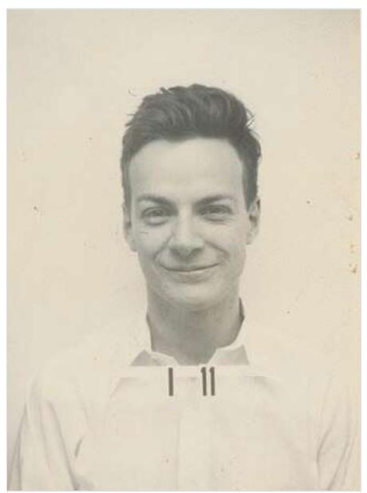
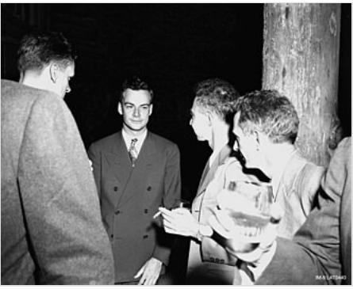
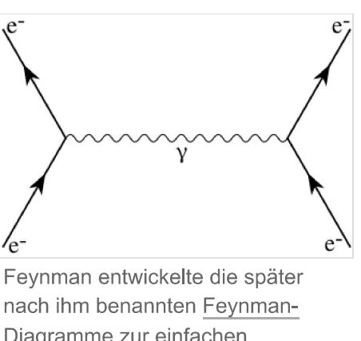
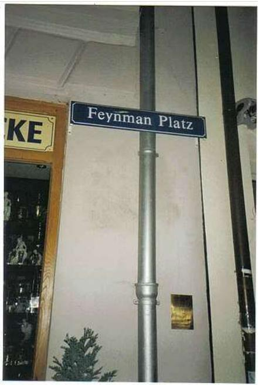

# WIKIPEDIA

# Richard Feynman

Richard Phillips Feynman [ˈfammən] (\* 11. Mai 1918 in Queens, New York; + 15. Februar 1988 in Los Angeles) war ein US-amerikanischer Physiker und Nobelpreisträger des Jahres 1965.

Feynman gilt als einer der großen Physiker des 20. Jahrhunderts, der wesentliche Beiträge zum Verständnis der Quantenfeldtheorien geliefert hat. Zusammen mit Shin'ichirō Tomonaga und Julian Schwinger erhielt er 1965 den Nobelpreis für seine Arbeit zur Quantenelektrodynamik (QED). Seine anschauliche Darstellung quantenfeldtheoretischer elementarer Wechselwirkungen durch Feynman-Diagramme ist heute ein De-facto-Standard. 11

Für Feynman war es immer wichtig, die unanschaulichen Gesetzmäßigkeiten der Quantenphysik Laien und Studenten nahezubringen und verständlich zu machen. An Universitäten ist seine Vorlesungsreihe (The Feynman Lectures on Physics) weit verbreitet. In Büchern wie QED: Die seltsame Theorie des Lichts und der Materiel und Character of Physical Law wandte er sich an ein breiteres Publikum. Sein Charisma und die Fähigkeit, auf seine Zuhörerschaft einzugehen, ließen seine Vorlesungen und Vorträge legendär werden.

Seine unkonventionelle und nonkonformistische Art zeigte sich auch in seinen autobiographisch geprägten Büchern wie Sie belieben wohl zu scherzen, Mr. Feynman. Abenteuer eines neugierigen Physikers und Kümmert Sie, was andere Leute denken? In einem gleichnamigen Essay prägte er den Begriff der "Cargo-Kult-Wissenschaft" (Cargo Cult Science) für eine wissenschaftliche Disziplin, welche zwar der Form genügt, aber den Ansprüchen an den Inhalt nicht gerecht wird. 3.

Richard Feynman, 1984

Richard Feynman (Los-Alamos-Dienstausweis während des Zweiten Weltkriegs)

# Inhaltsverzeichnis

#### Biografie

Mitarbeit am Manhattan-Projekt Nach dem Zweiten Weltkrieg Nobelpreis Arbeitsweise und Challenger-Untersuchung

#### Feynman als Biologe

Gen-Mutationen

| mRNA |  |  |  |
|------|--|--|--|
|------|--|--|--|

#### Weitere Arbeiten

#### Anekdoten und Trivia

#### Ehrungen

#### Zitate

#### Werke

Bücher von Feynman über Physik Wichtige Aufsätze (Auswahl) Bücher von Feynman über Feynman Bücher von Feynman über anderes Siehe auch Literatur lm Film Videos Weblinks Einzelnachweise

### Biografie

Richard ("Dick") Feynman wurde in Far Rockaway, einem Viertel im New Yorker Stadtbezirk Queens, geboren. Er bezeichnete seine jüdischen Eltern, deren Vorfahren aus Russland und Polen eingewandert waren, als erklärte Atheisten.[4][5] Seine neun Jahre jüngere Schwester Joan lieferte als Astrophysikerin Beiträge zur Wechselwirkung zwischen Erde und Sonnenwind. 60

Auf Drängen seines Vaters, dem ein Studium verwehrt war, wurde der junge Feynman schon früh in wissenschaftlichem Denken trainiert und - wie er in seinem Buch Sie belieben wohl zu scherzen, Mr. Feynman erzählt - auf den Unterschied einer wirklichen Erklärung und bloßer Namensgebung hingewiesen. Feynman zeigte auch sehr früh technisches Talent: Er war ein Elektro-Hobbybastler und verdiente sich mit der Reparatur von Radios zusätzliches Taschengeld. Sein Talent zeigte sich auch in den naturwissenschaftlichen Schulfächern, wo sein Lehrer den gelangweilten Feynman mit Mathematikbüchern für Fortgeschrittene versorgte.

Feynman studierte Physik als undergraduate von 1935 bis 1939 am MIT, die Ergebnisse seiner Bachelor-Abschlussarbeit 2 sind heute unter dem Namen Hellmann-Feynman-Theorem bekannt. Von 1939 bis 1943 besuchte er die Universität von Princeton, wo er Assistent von John Archibald Wheeler wurde. In seiner Dissertation bei Wheeler 1942 entwickelte er auch seine Pfadintegralformulierung der Quantenphysik, wobei er an eine Idee des Nobelpreisträgers Paul Dirac anknüpfte.[8]

#### Mitarbeit am Manhattan-Projekt

Während des Zweiten Weltkrieges beteiligte er sich wie viele amerikanische Physiker in Los Alamos am Manhattan-Projekt, dem Bau der ersten Atombombe. Eine seiner Aufgaben war die Organisation der notwendigen umfangreichen numerischen Rechnungen, doch blieb ihm noch genügend Zeit für Streiche, wie er in dem Aufsatz Los Alamos from below berichtet. Er brachte es zu einer wahren Meisterschaft im Öffnen der Dokumentensafes seiner Kollegen. In Los Alamos entdeckte Feynman als eine seiner Leidenschaften das Trommeln (ein bekanntes Foto aus seinen Büchern zeigt ihn mit Bongo-Trommeln), worin er sich während eines Aufenthalts in Brasilien noch verbesserte.

Seine spätere Frau Arline Greenbaum lernte er bereits als Teenager kennen, sie kamen sich aber erst nach Ende der High School näher. Als er nach Princeton wechselte, war sie schon schwer erkrankt. Es dauerte jedoch lange, bis die Arzte die Diagnose einer lebensbedrohlichen Form der Tuberkulose stellten. Er sorgte später dafür, dass sie (inzwischen seine Ehefrau) in einem Hospital nahe seinem Studienort Princeton unterkam. Auch in seiner Zeit in Los Alamos wurde ein Krankenhaus im 100 Meilen entfernten Albuquerque gefunden, wohin Feynman so oft wie möglich per Anhalter reiste. Trotz

Richard Feynman (Mitte) und Robert Oppenheimer (rechts von Feynman) in Los Alamos während des Manhattan-Projekts

der schweren Krankheit waren die beiden bei seinen Kollegen als humorvolles Paar bekannt. Seine Frau starb am 16. Juni 1945. Die Geschichte wurde 1996 von Matthew Broderick, der auch die Hauptrolle neben Patricia Arquette verkörperte, als Infinity verfilmt.19

#### Nach dem Zweiten Weltkrieg

Nach dem Krieg war er maßgeblich an einer Formulierung der Quantenelektrodynamik beteiligt, die 1947 auf der Shelter Island Konferenz vorgestellt wurde. Sein unmittelbarer Chef in Los Alamos, der Nobelpreisträger Hans Bethe, berief ihn zu seinem ersten Lehrauftrag an die Cornell University im Staat New York, wo er bis 1951 blieb. Danach war er Professor für Theoretische Physik am Caltech in Pasadena (ab 1959 "Richard-Chase-Tolman"-Professur) und blieb dort für den Rest seiner akademischen Laufbahn. Dort widmete er sich intensiv der Lehre, und es entstanden in den Jahren 1961/62 die bekannten Feynman Lectures on Physics, die durchweg einen originellen Zugang beschreiten. Sie entstanden aus einem Projekt zur Reform der Physik-Einführungsvorlesungen am Caltech mit Matthew Sands und Robert B. Leighton. Für seine Leistungen in der Vermittlung der Physik erhielt er 1972 die Oersted Medal der American Association of Physics Teachers. Eine eigentliche Schule hat Feynman allerdings nicht begründet, auch hatte er nur wenige Doktoranden.

In den 1950er Jahren wandte er sich der Festkörperphysik zu und untersuchte unter anderem die Suprafluidität (einen makroskopischen Quantenzustand, den man bei tiefen Temperaturen beispielsweise bei flüssigem Helium beobachten kann). Zusammen mit dem Nobelpreisträger Murray Gell-Mann entwickelte er eine neue Formulierung der Gesetze der schwachen Wechselwirkung (Vektor-Axialvektor-Form), die die damals gerade entdeckte Paritätsverletzung beim Betazerfall widerspiegelte.[10]

Am 29. Dezember 1959 hielt er am Caltech seine berühmte Rede There's Plenty of Room at the Bottom (dt. Ganz unten ist eine Menge Platz oder Viel Spielraum nach unten),[1] die von der Nanotechnologie gern als ihre Gründungsschrift angesehen wird.

Von 1961 bis 1963 hielt er eine Vorlesungsreihe zur Einführung in die Physik. Die daraus entstandene Lehrbuchsammlung ist inzwischen frei verfügbar 122 und wird beschrieben als "simplicity, beauty, unity ... presented with enthusiasm and insight" (dt. "einfach, schön, zusammenhängend ... präsentiert mit Begeisterung und Einsicht")[13].

#### Nobelpreis

Im Jahr 1965 wurde ihm für seine Beiträge zur Entwicklung der Quantenelektrodynamik der Nobelpreis verliehen. Ende der 1960er und in den 70er Jahren arbeitete er an dem Ausbau des Parton-Bildes hochenergetischer Streuprozesse, das heute in die Quantenchromodynamik integriert ist. Dabei akzeptierte er durchaus das Quark-Bild seines Caltech-Kollegen Murray Gell-Mann, als es in den 1970er Jahren experimentell immer besser bestätigt wurde, und war selbst ein Pionier von Yang-Mills-Theorien (nicht-abelschen Eichtheorien), mit denen die fundamentalen Wechselwirkungen heute beschrieben werden: In den 1960er Jahren untersuchte er sie im Zusammenhang mit der Quantisierung der Gravitation. Zur in den 1980er Jahren boomenden Stringtheorie blieb er bis zu seinem Tod skeptisch eingestellt,141 da sie sich seiner Meinung nach zu weit von experimentellen Vorhersagen entfernt bewegte.

1981 stellte Feynman auf einem der ersten Workshops zum

Diagramme zur einfachen Darstellung subatomarer Wechselwirkungen. Die Abbildung zeigt eine Elektron-Elektron-Streuung durch Austausch eines virtuellen Photons (Zeitachse von unten nach oben).

Thema Physics and Computation (Physik und Berechenbarkeit) die Frage Can (quantum) physics be (efficiently) simulated by (classical) computers? (dt.: Kann Quantenphysik wirksam von klassischen Computern simuliert werden?) und kam zu dem Schluss, dass das am besten mit Quantencomputern geschieht, einem heute sehr aktuellen Forschungsgebiet. Sein Interesse für Computer führte auch dass er technischer Berater in der Firma Thinking Machines von Daniel Hillis wurde, welche die massiv parallele "connection machine" herstellte. Am Caltech hielt er auch interdisziplinäre Kurse "Lectures on computation", die später als Buch publiziert wurden.

#### Arbeitsweise und Challenger-Untersuchung

Feynman praktizierte zeitlebens einen unmittelbar seiner physikalischen Intuition folgenden praxisnahen und anschaulichen Zugang zur Physik. Abgehobenen und zu abstrakten Diskussionen sowie schematischem, oberflächlichem Denken begegnete er schnell mit Ungeduld. Viele seiner Beiträge zur Physik übermittelte er nur mündlich in Diskussionen an Kollegen, wo sie Teil der "Folklore" wurden und oft erst viel später publiziert wurden.[15] In dieser Hinsicht ähnelte sein Verhalten dem von Wolfgang Pauli, dem Physik-Nobelpreisträger von 1945, dessen Motto lautete: "Ich kann es mir leisten, nicht zitiert zu werden."

1986 wurde er in die Untersuchungskommission zur Challenger-Katastrophe (Rogers-Kommission) berufen. Bekannt wurde sein öffentlicher Auftritt, in dem er die Folgen von Frost an den Dichtringen der Feststoff-Treibstofftanks mit einem Glas Eiswasser vorführte. Sein von der Mehrheit abweichender Bericht äußerte sich kritisch zur bürokratischen Organisation der NASA. Nur gegen Widerstand wurde sein Minderheitsbericht dem offiziellen als Anhang beigefügt. Feynman hatte gedroht, im Fall der Nichtberücksichtigung seiner Standpunkte öffentlichkeitswirksam aus der Kommission auszutreten. Sein Bericht endete mit der sarkastischen bzw. für die NASA-Verantwortlichen vernichtenden Feststellung: "For a successful technology, reality must take precedence over public relations, for nature cannot be fooled." (deutsch etwa "Für eine erfolgreiche Technologie muss die Realität Vorrang gegenüber der Öffentlichkeitsarbeit haben, denn die Natur lässt sich nicht zum Narren halten.")161

Eine seit vielen Jahren latente Krebserkrankung wurde 1987 akut. Nachdem er sich schon einige Jahre vorher deswegen einer Operation unterzogen hatte, entschied sich Feynman, weitere Behandlungen zu unterlassen. Zwei Wochen vor seinem Tod hielt er seine letzte Vorlesung. Er starb am 15. Februar 1988. Seine letzten Worte waren: "Gut, dass man nur einmal sterben muss, es ist so langweilig."

Feynman war dreimal verheiratet: Seine erste Frau Arline, geb. Greenbaum, heiratete er 1941, sie starb 1945 während seiner Zeit in Los Alamos an Tuberkulose; mit Mary Louise, geb. Bell, war er von 1952 bis 1956 verheiratet; und seit 1960 mit Gweneth; mit ihr hatte er den Sohn Carl und die Adoptivtochter Michelle.

### Feynman als Biologe

Feynman begann sich in der sommerlichen vorlesungsfreien Zeit und in seinem Sabbatjahr 1959/60 intensiver für Biologie zu interessieren. Ihn faszinierte an diesem Teilgebiet der Naturwissenschaften, dass es einfach zu formulierende Fragen gab, auf die niemand eine Antwort wusste. Er hatte schon zuvor Kurse und Seminare bei E. Newton Harvey besucht und das Interesse wurde durch Vorträge von James D. Watson und anderen wieder angeregt.

#### Gen-Mutationen

Die Bekanntschaft mit Max Delbrück ermöglichte ihm, in der Bakteriophagen-Gruppe am Caltech zu arbeiten. Delbrück war berühmt für seine Bakteriophagenexperimente, hatte aber inzwischen seinen Themenschwerpunkt verlagert und diese Forschung damals seinem Post-Doktoranden Robert S. Edgar überlassen. In dessen Labor führte Feynman Rückmutationen an Bakteriophagen aus. Dabei entdeckte er, dass sich Mutationen an benachbarten Stellen des Gens manchmal aufhoben, manchmal jedoch nicht. Für Francis Crick und Kollegen waren ähnliche Experimentel 177 wenig später ein Schlüssel zur Aufklärung des genetischen Codes (und sie zitieren auch eine mündliche Kommunikation von Feynman in ihrer Veröffentlichung). Feynman und Kollegen18119 entging jedoch die korrekte Erklärung und zentrale Einsicht von Crick und Kollegen, dass drei Basen für eine Aminosäure stehen und eine Einzelmutation, die eine Base entfernt oder hinzufügt, das Auslesen verschiebt, zwei Mutationen an benachbarten Stellen wegen der Länge drei aber wieder "Normalität" herstellen können. Stattdessen stellte er sich eine Änderung des pH-Werts einer Aminosäure vor, die durch eine weitere Mutation ausgeglichen wurde.[20] Immerhin führten die Experimente zu einer Einladung zu einem Vortrag in Harvard durch Watson.

#### mRNA

Danach befasste er sich unter Matthew Meselson und unter anderem mit J. D. Smith mit Ribosomen-Forschung, was aber nicht gut lief: Er konnte seine Experimente nicht reproduzieren.1211 Feynman, der acht Monate daran gearbeitet hatte, verlor daraufhin das Interesse an experimenteller biologischer Forschung. Hinzu kam, dass ein entscheidendes Experiment aufgrund einer Laborverunreinigung, für die er letztlich verantwortlich war, misslang. Er wollte mit der erfahrenen Molekularbiologin Hildegard Lamfrom (1922–1984) 22 nachweisen, dass aus E. coli isolierte Bakterienribosomen mit (aus heutiger Sicht) Messenger-RNA aus Erbsen Erbsen-Proteine produzieren konnten. Das wäre ein Beitrag zur Universalität des genetischen Codes gewesen, aber wie er selbst schrieb und zutiefst bedauerte, stellte er sich "wie ein Amateur an - dumm und schlampig", indem er einen Monat alte, von ihm und Meselson präparierte, aber inzwischen kontaminierte Ribosomen-Charge aus dem Kühlschrank benutzte, statt sie neu zu präparieren.123 Sein Fazit war aber nicht durchgehend negativ, denn er lernte bekannte Molekularbiologen wie Francis Crick und James Watson kennen und befreundete sich mit diesen, und ihn freute, dass er zusätzlich während seiner Ausbildung bei Edgar Studenten als Teaching Assistant in Labortechniken unterrichten durfte.

# Weitere Arbeiten

Feynman besuchte in seinen lebensjahren auch Deutschland, wo er 1987 auf der Insel Wangerooge "kurte" und dabei an einer Konferenz über Variationsverfahren in der Quantenfeldtheorie teilnahm. Dort kritisierte er die gängigen Anwendungen und die "Gittermethoden" der 1970er und -80er Jahre, die er einfallslos fand. Noch Anfang der 1980er Jahre versuchte er, mit Pfadintegralmethoden (engl. Feynman path integral) zum qualitativen Verständnis von Yang-Mills-Theorien (confinement, mass gap) beizutragen.

Eugene Paul Wigner lud Feynman 1941 in Princeton zu einem Seminarvortrag am Institute for Advanced Study (IAS) ein, in dem er über seine Arbeit mit Wheeler an einer Neuformulierung der klassischen Elektrodynamik ("action at a distance"-Theorie) berichtete. Diese hatte zum Ziel, Divergenzen, die sich schon in der klassischen Theorie aus der Selbstwechselwirkung des Elektrons ergeben, zu untersuchen (eine Diskussion dieser Divergenzen findet sich in den Feynman Lectures, Band 2). Anwesend waren unter anderen die Wissenschaftler John von Neumann, Henry Norris Russell, Wolfgang Pauli und Albert Einstein wies ihn dabei auf seine eigenen Arbeiten und Diskussionen mit Walter Ritz hin, wie Feynman in seinem Nobelvortrag erzählt. In dieser Zusammenarbeit mit John Archibald Wheeler wurden schon Grundlagen für seine spätere Formulierung der QED gelegt.

# Anekdoten und Trivia

In München haben Bürger eine Straßenecke zum Feynman-Platz ernannt, da die Straßen, die dort zusammenlaufen, ein bestimmtes Feynman-Diagramm bilden. Nördlich und westlich verläuft die Kanalstraße; südlich die Liebherrstraße und östlich die Mannhardtstraße.

Richard Feynman hatte, wie schon sein Vater, stets liberale Ansichten. Feynman erzählt in seinen Memoiren, dass die Freude am Zeichnen ihn in seiner Zeit am Caltech auch dazu führte, professionelles Aktzeichnen zu betreiben. Vorgeblich zu diesem Zweck besuchte er auch fünf- bis sechsmal pro Woche einen Nachtklub, wo er sogar einige Werke verkaufen konnte. Als die "Obenohne-Bar" nach einer Razzia geschlossen werden sollte, fragte der Wirt die Gäste, ob sie für ihn aussagen würden. Feynman willigte trotz seiner herausgehobenen Position als einziger ein. Vor Gericht erklärte er: "Hier verkehren Angestellte, Handwerker, Geschäftsleute, Techniker, ein Physikprofessor […]".

In seinem Buch Sie belieben wohl zu scherzen, Mr. Feynman beschreibt Feynman im Kapitel I want my Dollar (dt.: Ich will meinen Dollar), wie er auf skurrile Weise Inhaber des Patents auf das Atom-Flugzeug wurde und sogar einen Dollar dafür bekam, den er sich allerdings gegen eine bürokratische Hürde erkämpfen musste.[25]

Während eines Urlaubs in Mexiko entzifferte er ohne Kenntnis der Hieroglyphen astronomische Periodizitäten (Venus) und Berechnungen in einer Buchausgabe des Codex Dresdensis der Maya. Er hielt darüber auch einen Vortrag und berichtet darüber in seinem Buch Sie belieben wohl zu scherzen, Mr. Feynman, publizierte aber nichts.

In den 1980er Jahren versuchten Feynman und sein Freund Ralph Leighton, 120 mitten im Kalten Krieg, die Tuwinische ASSR zu bereisen. Ihnen gelang es, in Kooperation mit der sowjetischen Akademie der Wissenschaften eine Ausstellung tuwinischer Kunstgegenstände in den USA zu organisieren, und sie konnten dadurch eine Einreiseerlaubnis in das für Ausländer sonst gesperrte Gebiet erhalten. Feynman starb jedoch wenige Monate vor der Abreise.[27]

In seiner Anfangszeit an der High School unterzog sich Feynman wie auch seine Mitschüler einem IQ-Test, der ein respektables, aber nicht außergewöhnliches Ergebnis von 125 ergab, wie Feynman selbst bemerkte, als er anlässlich der Nobelpreisverleihung seine Schulzeugnisse überprüfte.[28] Eine Einladung, Mitglied der Hochbegabtenvereinigung Mensa zu

Schild für den Feynman-Platz zwischen Kanalstraße und Liebherrstraße unweit des Isartors in München (Studentenscherz)

werden, die er nach dem Gewinn des Nobelpreises erhalten hatte, lehnte er ab, da er den Mindest-IQ von 130 verfehlt habe.

Als Student in den Anfangssemestern machte er schnell durch seine mathematischen Fähigkeiten auf sich aufmerksam; unter anderem gewann er 1939 als MIT-Student den angesehenen, damals das zweite Mal stattfindenden Putnam-Wettbewerb.129 Dabei kamen ihm Fertigkeiten im Kopfrechnen zum Beispiel zur Manipulation von Reihen und Integralen zugute, die er sich schon als Schüler angeeignet hatte und für die er eigenständige Methoden entwickelte, die ihm auch bei der analytischen Behandlung der Feynmanintegrale zustattenkamen.

In einem Briefwechsel mit dem am Institute of Advanced Study unzufriedenen Stephen Wolfram riet er ihm 1985, sich künftig so wenig wie möglich mit technisch nicht-versierten zu umgeben – abgesehen davon, sich richtig zu verlieben. Die Wolfram vorschwebende Einrichtung einer Institution zur Erforschung komplexer Systeme tat Feynman als unnötig ab; bereits ein Jahr zuvor hatte sich mit dem Santa Fe Institute eine der wichtigsten Einrichtungen des Feldes gegründet. [30]

In Benjamin Labatuts Roman "Maniac"101 beschreibt Feynman seine Erlebnisse in Los Alamos als Mitarbeiter des Manhattan Projects. Im selben Buch(32) beschreibt er die Explosion der ersten Wasserstoffbombe im Pazifik.

### Ehrungen

Nach der Nobelpreisverleihung wurden Feynman diverse Ehrendoktorwürden angetragen, er lehnte dies aber grundsätzlich ab, weil er nichts von Ehrendoktorwürden hielt.[3] 1954 erhielt er den Albert Einstein Award (den er auch aufgrund einer Aversion gegen Lewis Strauss zunächst ablehnen wollte, dann aber auf Anraten von I. I. Rabi doch noch annahm). 1955 wurde er Sloan Research Fellow. 30 Er war Fellow der Royal Society und der National Academy of Sciences (1954), trat aus dieser aber wenig später aus, da er nach Besuch einiger ihrer Sitzungen Zweifel an ihrer wissenschaftlichen Arbeit hatte.

Am 22. April 1997 wurde ein Asteroid nach ihm benannt: (7495) Feynman.[35]

Das Foresight Institute vergibt ihm zu Ehren seit 1993 den Feynman Prize in Nanotechnology.

Max Tegmark entwickelt seit 2020 den rekursiven multidimensionalen symbolischen Regressionsalgorithmus AI Feynman zur Herleitung formalisierbarer Zusammenhänge aus Beobachtungsdaten. 361

### Zitate

"Nachdem ich Feynmans Beschreibung einer Rose gelesen hatte – in der er erläuterte, dass er den Duft und die Schönheit der Blume zu würdigen wisse wie jeder andere, dass aber seine physikalischen Kenntnisse dieses Erlebnis außerordentlich intensivierten, weil er auch das Wunder und die Herrlichkeit der zugrunde liegenden molekularen, atomaren und subatomaren Prozesse einbeziehen könne -, war ich den Naturwissenschaften auf immer verfallen."

- BRIAN GREENF[37]

"Wir müssen unbedingt Raum für Zweifel lassen, sonst gibt es keinen Fortschritt, kein Dazulernen. Man kann nichts Neues herausfinden, wenn man nicht vorher eine Frage stellt. Und um zu fragen, bedarf es des Zweifelns."

- RICHARD P. FEYNMAN 381

"Naturwissenschaft ist der Glaube an die Unwissenheit der Experten."

- RICHARD P. FEYNMAN 1966[39]

"Es gab eine Zeit, als Zeitungen sagten, nur zwölf Menschen verstünden die Relativitätstheorie. Ich glaube nicht, dass es jemals eine solche Zeit gab. Auf der anderen Seite glaube ich, sicher sagen zu können, dass niemand die Quantenmechanik versteht."

– RICHARD P. FEYNMAN[40]

# Werke

### Bücher von Feynman über Physik

- · mit Robert B. Leighton und Matthew Sands: The Feynman Lectures on Physics. 3 Bände, ISBN 0-201-02115-3 (dt. Feynman-Vorlesungen über Physik. 5. Bände, 6. Aufl. De Gruyter 2015), zuerst 1963/1965 bei Addison/Wesley (in Band 3 Quantenmechanik über Diracs Bra-Ket-Notation behandelt, als Anwendung Maser, Transistor, Josephson-Effekt), Die englische Originalausgabe ist online verfügbar (http://www.feynmanlectures.caltech.edu/)
- QED: The Strange Theory of Light and Matter 1985 (dt. QED: Die seltsame Theorie des Lichts

und der Materie. 1987, ISBN 3-492-21562-9)

- Six Easy Pieces. penguin 1998 (dt. Sechs physikalische Fingerübungen. Piper, 2003, ISBN 3-492-04283-X) (Sechs Kapitel aus den Feynman Lectures über Atome, Gravitation, Quantentheorie, Verhältnis Physik zu anderen Wissenschaften)
- · Six Not So Easy Pieces. penguin 1999 (dt. Physikalische Fingerübungen für Fortgeschrittene. Piper, 2004, ISBN 3-492-04425-5) (Sechs weitere Kapitel aus den Feynman Lectures über Relativitätstheorie, Symmetrie, Raumzeit)
- The Character of Physical Law (dt. Vom Wesen physikalischer Gesetze. ISBN 3-492-21748-6) (Messenger Lectures Cornell 1964 sowie BBC Serie)
- Theory of Fundamental Processes. 1961 (Caltech lectures von 1959), neu Addison-Wesley, 1998, ISBN 0-201-36077-2.
- Quantenelektrodynamik. Bl Hochschultaschenbuch 1969 (im Anhang Abdruck einiger Physical-Review-Artikel von ihm zur QED, diese Aufsätze sind auch in Schwinger (Hrsg.): Selected papers on QED. dover)
- = Photon-Hadron Interactions. Addison-Wesley 1972, ISBN 0-8053-2511-5 (Parton-Bild)
- · Lectures on Gravitation. zuerst mimeographierte Notizen Caltech 1962/63, neu Addison-Wesley, 1995, ISBN 0-201-62734-5.
- Gauge Theories. Les Houches lectures Band 29, 1976 (auch in Selected Papers)
- · Statistical Mechanics a Set of Lectures. Frontiers in Physics 1972 (u. a. Suprafluidität, Supraleitung)
- Quantum Mechanics and Path Integrals (zusammen mit A. R. Hibbs) 1965, ISBN 0-07-020650-3.
- · Elementary Particles and the Laws of Physics. Dirac Memorial Lectures 1986. Cambridge University Press, 1987, ISBN 0-521-34000-4 (dort gibt er die elementare Ableitung des Spin-Statistik-Theorems, die er schon in seinen Lectures on Physics Band 3 ankündigte; im gleichen Band auch Vorlesung von Weinberg)
- · Anthony Hey (Hrsg.) und Robin Allen (Hrsg.): Lectures on Computation. Addison-Wesley, 1996, ISBN 0-201-48991-0.
- Laurie Brown (Hrsg.): Selected Papers of Richard Feynman, with Commentary. World Scientific, 2000, ISBN 981-02-4130-5.
- David Goodstein (Hrsg.) und Judith Goodstein (Hrsg.): Feynman's Lost Lecture. W. W. Norton, 1999, ISBN 0-393-31995-4 (geometrische Ableitung Keplergesetz aus 1/r Potential, Feynman auf Newtons Spuren)
- Laurie Brown (Hrsg.): Feynmans Thesis. World Scientific, 2005, ISBN 981-256-366-0 (Feynmans Dissertation von 1942, mit den beiden Aufsätzen von Dirac und Feynman zur Begründung der Wegintegrale)
- Tipps zur Physik. 1. Auflage. 2009, Oldenbourg Wissenschaftsverlag. ISBN 978-3-486-58932-0 (weitere bis dato unveröffentlichte Vorlesungen Feynmans)
- Quantenelektrodynamik. Eine Vorlesungsmitschrift. 4. Auflage. 1997, Oldenbourg Wissenschaftsverlag. ISBN 978-3-486-24337-6.

### Wichtige Aufsätze (Auswahl)

- = Forces in molecules. In: Physical Review. Band 56, 1939, S. 340-343.
- mit John Archibald Wheeler: The interaction with the absorber as the mechanism for radiation. In: Reviews of modern physics. Band 17, 1945, S. 157-181, doi:10.1103/RevModPhys: 17.157, sowie Classical electrodynamics in terms of direct interparticle action. In: Reviews of modern physics. Band 21, 1949, S. 425-433, doi:10.1103/RevModPhys.21.425 ("action at a distance"-Formulierung der Elektrodynamik, symmetrisch in retardierten und avancierten Potentialen)
- Space-time approach to non relativistic quantum mechanics. In: Reviews of modern physics. Band 20, 1948, S. 367-387, doi:10.1103/RevModPhys.20.367 (Pfadintegral Formulierung Quantenmechanik, aus seiner Dissertation 1942 bei Wheeler)
- Theory of positrons. In: Physical Review. Band 76, 1949, S. 749-759, doi:10.1103/PhysRev.76.749 (Antiteilchen rückläufig in Zeit)
- · Spacetime approach to Quantum Electrodynamics. In: Physical Review. Band 76, 1949, S. 769—789, doi:10.1103/PhysRev.76.769
- Mathematical formulation of the quantum theory of electromagnetic interaction. In: Physical Review. Band 80, 1950, S. 440-457 doi:10.1103/PhysRev.80.440 (mit den vorherigen zwei Aufsätzen Feynman-Diagramm-Formulierung QED)
- · Atomic theory of lambda transition in Helium. In: Physical Review. Band 91, 1953, S. 1291-1301 doi:10.1103/PhysRev.91.1291, sowie Atomic theory of liguid Helium near absolute zero, ibid, S. 1301-1308 doi:10.1103/PhysRev.91.1301 (schon von Landau postulierte Roton-Anregungen von flüssigem Helium)
- Slow electrons in a polar crystal. In: Physical Review. Band 97, 1955, S. 660-665 doi:10.1103/PhysRev.97.660 (elegante Wegintegral-Behandlung der Polaron-Anregung in lonenkristallen, auch in seinen Vorlesungen über Statistiche Mechanik behandelt)
- · mit Murray Gell-Mann: Theory of Fermi interaction. In: Physical Review. Band 109. 1958. S. 193-198 doi:10.1103/PhysRev.109.193 (V-A-Theorie schwache Wechselwirkung)
- · There is plenty of room at the bottom. Engineering and Science 1960 (Caltech Hauszeitschrift, gilt als Gründungsschrift der Nanotechnologie, vielfach online)
- Quantum theory of gravitation. In: Acta physica polonica. Band 24, 1963, S. 697 (Einführung von ghost-Freiheitsgraden in Eichtheorien, ausgeführt in der Wheeler-Festschrift Klauder (Hrsg.): Magic without Magic. 1972. Alle diese Arbeiten auch in Selected Papers)
- The development of the spacetime view of QED (http://nobelprize.org/nobel\_prizes/lau reates/1965/feynman-lecture.html). Nobel lectures 1965
- · Very high energy collisions of hadrons. In: Physical Review Letters. Band 23, 1969, S. 1415– 1417 doi:10.1103/PhysRevLett.23.1415 (Partonen)
- Qualitative theory of Yang-Mills fields in 2+1 dimensions. In: Nuclear physics B. Band 188, 1981, S. 479-512 doi:10.1016/0550-3213(81)90005-5 (Variationsrechnungs-Zugang)
- Quantum mechanical computers. In: Foundations of physics. Band 16. 1986. S. 507-531 doi:10.1007/BF01886518 (reversible Computer, keine theoretischen Verbote aus dem zweiten Hauptsatz bis zur Quantengrenze, nachgedruckt in den Lectures on computation und in Selected Papers)

### Bücher von Feynman über Feynman

- Surely You're Joking, Mr. Feynman. 1985 (dt. Sie belieben wohl zu scherzen, Mr. Feynman. Abenteuer eines neugierigen Physikers. Piper 2018, ISBN 3-492-31319-1) (u. a. Safe-Knacken in Los Alamos, seine Zeit in Brasilien, Las Vegas, John Lilly's "Think tanks", frühe Jobs in einer Analogrechner-Fabrik, Erfahrung mit Militärpsychiatern)
- What do you care what other people Think?! Norton 1988 (dt. Kümmert Sie, was andere Leute denken? Neue Abenteuer eines neugierigen Physikers. ISBN 3-492-22166-1) (u. a. über die Challenger-Katastrophe, sein Hobby Zeichnen, seine erste Frau Arlene, seinen Vater; mit dem Vortrag The value of science)

### Bücher von Feynman über anderes

- The Art of Richard P. Feynman. Images by a Curious Character. ISBN 2-88449-047-7.
- The Meaning of it all (dt. Was soll das alles? Gedanken eines Physikers. ISBN 3-492-23316-3) (drei populäre Vorlesungen Anfang der 60er Jahre an University of Washington, u. a. value of science)
- The Pleasure of Finding Things out. The Best Short Works of Richard P. Feynman. Penguin 2001 (dt. Es ist so einfach. Vom Vergnügen, Dinge zu entdecken. ISBN 3-492-04251-1) (u. a. seine Aufsätze There is plenty of room at the bottom, The value of science, Los Alamos from below)
- Deutsche Ubersetzung Wert der Wissenschaft (http://onlinelibrary.wiley.com/doi/10.1002/ph bl.19580140102/abstract)
- Michelle Feynman (Hrsg.): Perfectly reasonable deviations from the beaten track. 2005 (dt. Absolut vernünftige Abweichungen vom ausgetretenen Pfad. ISBN 3-492-04744-0) (Briefsammlung, herausgegeben von seiner Tochter)

# Siehe auch

- = Hellmann-Feynman-Theorem
- Feynman-Kac-Formel .
- Feynman-Parameter I
- Feynman-Punkt ■
- Feynmans verschollene Vorlesung: Die Bewegung der Planeten um die Sonne
- Morrie's Law

# Literatur

- = Lawrence Krauss: Quantum man = Richard Feynman's life in science, Norton 2011
- John Gribbin und Mary Gribbin: Richard Feynman A Life in Science. 1997 (dt. Richard Feynman. Biographie eines Genies, 2000, ISBN 3-492-04041-1)
- James Gleick: Genius. The Life and Science of Richard Feynman. 1992 (dt. Richard Feynman - Leben und Werk des genialen Physikers. ISBN 3-426-26679-2)
- · Jagdish Mehra: The Beat of a Different Drum. The Life and Science of Richard Feynman. 1994, ISBN 0-19-851887-0 (ging aus Gesprächen hervor, die Mehra noch bis kurz vor dessen Tod mit Feynman führte)
- Jagdish Mehra: Meine letzte Begegnung mit Richard Feynman. In: Physikalische Blätter. Band 44, 1988, S. 146-148, doi:10.1002/phbl.19880440509.
- Christopher Sykes: No Ordinary Genius. The Illustrated Richard Feynman. ISBN 0-393-31393-X.
- Ralph Leighton: TUVA or BUST. Richard Feynman's Last Journey. ISBN 0-393-32069-3.
- · Physics today, Feynman memorial issue. Februar 1989 (Biorken zu Partonen, Schwinger zu QED, Erinnerungen von Dyson, Gell-Mann und Wheeler, Goodstein zu Feynman als Lehrer, Hillis zu Feynman und connection machine, Pines zu Feynman und Festkörperphysik, Zeichnungen von Feynman)
- Freeman Dyson: Disturbing the universe. 1979 (berichtet über die Zusammenarbeit mit Feynman Ende der 1940er Jahre)
- Jörg Resag: Feynman und die Physik. Leben und Forschung eines außergewöhnlichen Menschen. Springer 2018, ISBN 978-3-662-54796-0.
- = Silvan S. Schweber: Quantum Electrodynamics and the men who made it. Princeton University Press, 1994
- = Leonard Mlodinow: Feynman's Rainbow. A Search for Beauty in Physics and in Life. 2003 (dt. Feynmans Regenbogen. Die Suche nach Schönheit in der Physik und im Leben. Reclam, 2005, ISBN 3-379-00826-5) – beschreibt autobiografisch die Zeit des Autors Anfang der 1980er Jahre am Caltech, wo er mit Feynman zusammenarbeitete
- Theodore Welton: Memories of Richard Feynman, Physics Today, Februar 2007
- H. D. Zeh: Feynman's interpretation of quantum theory. In: The European Physical Journal H. Band 36, Nr. 1, 2011, S. 63-74, doi:10.1140/epjh/e2011-10035-2 (https://doi.org/10.1140/epjh%2Fe2011-10035-2), arxiv:0804.3348v6 (https://arxiv.org/abs/0804.3348v6).

# Im Film

- Im Fernsehfilm The Challenger von 2013 wird Feynman von William Hurt gespielt.
- In der Fernsehserie Eureka Die geheime Stadt wird jedes Jahr der Feynman-Tag mit Streichen gefeiert.
- Eine Liebe für die Unendlichkeit (Infinity) ist ein Film von 1996 mit Matthew Broderick
- In der Sitcom The Big Bang Theory zeigen sich die Protagonisten mehrfach als große Fans von Feynmans Schaffen. In der 3. Folge der 9. Staffel leihen sie sich Feynmans Van für einen Ausflug. In der 2. Folge der 11. Staffel treffen sie sich an Feynmans Grab, um ihn mit einer Runde romulanischem Ale (ein Getränk aus der fiktionalen Fernsehserie Raumschiff Enterprise) zu würdigen.
- Im Film Oppenheimer, welcher die Ereignisse rund um das Manhattan Project in Los Alamos zeigt, wird Feynman von dem Schauspieler Jack Quaid verkörpert

# Videos

▪ The 1979 The Sir Douglas Robb Lectures (http://www.vega.org.uk/video/subseries/8) University of Auckland, vierteiliges Video, Grundlage des populärwissenschaftlichen Buches: QED: Die seltsame Theorie des Lichts und der Materie.

# Weblinks

#### ക്ക് Commons: Richard Feynman (https://commons.wikimedia.org/wiki/Category:Ri

- chard\_Feynman?uselang=de) Sammlung von Bildern, Videos und Audiodateien
- •») Wikiquote: Richard Feynman Zitate
- Informationen (https://www.nobelprize.org/prizes/physics/1965/summary/) der Nobelstiftung zur Preisverleihung 1965 an Richard Feynman (englisch)
- Feynmans Nobel-Vortrag (http://nobelprize.org/nobel prizes/physics/laureates/1965/feynman-l ecture.html)
- Literatur von und über Richard Feynman (https://portal.dnb.de/opac.htm?method=simpleSearc h&query=118827545) im Katalog der Deutschen Nationalbibliothek
- Werke von und über Richard Feynman (https://www.deutsche-digitale-bibliothek.de/person/gn d/118827545) in der Deutschen Digitalen Bibliothek
- = There's plenty of Room at the Bottom (http://www.zyvex.com/nanotech/feynman.html)
- Viel Spielraum nach unten, deutsche Übersetzung von There's plenty of Room at the Bottom (http://www.deutsches-museum.de/fileadmin/Content/data/020 Dokumente/040 KuT Artikel/2 000/24-1-1.pdf)
- = Ralph Leighton über Tuva und Feynman (http://www.fotuva.org/)
- Los Alamos Reports von Feynmans (http://www.fas.org/sgp/othergov/doe/lanl/index.html)
- Dieter Zeh: Feynman's Quantum Theory (http://www.rzuser.uni-heidelberg.de/~as3/FeynmanQ T.pdf)
- John J. O'Connor, Edmund F. Robertson: Richard Phillips Feynman. (https://mathshistory.st-an drews.ac.uk/Biographies/Feynman/) In: MacTutor History of Mathematics archive (englisch).
- Nachruf, The New York Times, 17. Februar 1988 (http://www.nytimes.com/1988/02/17/obituarie s/richard-feynman-dead-at-69-leading-theoretical-physicist.html)

# Einzelnachweise

- 1. Dargestellt in David Kaiser, Drawing theories apart. The dispersion of Feynman diagrams in post-war physics, University of Chicago Press 2005.
- 2. Richard Feynman: The 1979 The Sir Douglas Robb Lectures (http://www.vega.org.uk/video/su bseries/8) Teile 1-4, University of Auckland, Grundlage des populärwissenschaftlichen Buches: QED: Die seltsame Theorie des Lichts und der Materie.
- 3. Richard P. Feynman: Cargo Cult Science: Some remarks on science, pseudoscience, and learning how to not fool yourself. Caltech's 1974 commencement address. Ihttp://calteches.libr ary.caltech.edu/51/2/CargoCult.htm) In: caltech.edu. Abgerufen am 11. Mai 2018 (englisch).
- 4. Übersicht über Feynmans Biographie (englisch) (https://web.archive.org/web/2013031907400 3/http://www.nobel-winners.com/Physics/richard\_phillips\_feynman.html/) (Memento vom 19. März 2013 im Internet Archive)
- 5. Richard P. Feynman: What Do You Care What Other People Think? Further Adventures of a Curious Character. Hrsg. Ralph Leighton. W. W. Norton & Co., 1988, ISBN 0-393-02659-0.
- 6. Charles Hirshberg: My Mother, the Scientist. In: Popular Science. 18. April 2002 (popsci.com (h ttps://www.popsci.com/scitech/article/2002-04/my-mother-scientist)).
- 7. R. P. Feynman: Forces in Molecules. In: Physical Review. Band 56, Nr. 4, 1939, S. 340-343, doi:10.1103/PhysRev.56.340 (https://doi.org/10.1103/PhysRev.56.340), bibcode:1939PhRv...56..340F (https://ui.adsabs.harvard.edu/abs/1939PhRv...56..340F).
- 8. Richard Feynman (https://www.mathgenealogy.org/id.php?id=91222) im Mathematics Genealogy Project (englisch) .
- 9. Eine Liebe für die Unendlichkeit (https://www.imdb.com/title/tt0116635/) bei IMDb.
- 10. diese Theorie wurde auch unabhängig von George Sudarshan und Robert Marshak etwa zur gleichen Zeit entwickelt.
- 11. Richard Feynman: R. P. Feynman: There's Plenty of Room at the Bottom. In: Engineering and Science. Band 23, Nr. 5, 1960, ISSN 0013-7812 (https://zdb-katalog.de/list.xhtml?t=iss%3D%220013-7812%22&key=cql), S. 22-36 (englisch, caltech.edu (http://resolver.caltech.edu/CaltechES:23.5.1960Bottom) [abgerufen am 27. Februar 2018]).
- 12. The Feynman Lectures on Physics. (https://www.feynmanlectures.caltech.edu/) California Institute of Technology, 2022, abgerufen am 20. Juli 2023 (englisch).
- 13. Phillips, Rob: In retrospect: The Feynman Lectures on Physics. In: Nature. Nr. 504, 5. Dezember 2013, ISSN 0028-0836 (https://zdb-katalog.de/list.xhtml?t=iss%3D%220028-0836%22&key=cql), S.30-31.
- 14. Interview in Davies, Brown ed. superstrings 1988.
- 15. Beispiele erwähnt Bjorken in physics today, Februar 1989. Ein weiteres Beispiel ist seine kombinatorische Behandlung des Ising-Modells, die er in seinen "Lectures on statistical mechanics" darstellt, aber schon lange vorher Mark Kac mitteilte.
- 16. R. P. Feynman: Appendix F Personal observations on the reliability of the Shuttle. (https://we b.archive.org/web/20120911052800/http://science.ksc.nasa.gov/shuttle/missions/51-l/docs/rog ers-commission/Appendix-F.txt) (Memento vom 11. September 2012 im Internet Archive) Persönlicher Anhang von Feynman zum Bericht der Untersuchungskommission zur Challenger-Katastrophe.
- 17. F. H. C. Crick, Leslie Barnett, S. Brenner, R. J. Watts-Tobin: General Nature of the Genetic Code for Proteins. In: Nature. Band 192, Nr. 4809, 1961, S. 1227–1232, doi:10.1038/1921227a0 (https://doi.org/10.1038/1921227a0) (nih.gov (https://profiles.nlm.nih.g ov/ps/access/SCBCBJ.pdf) [PDF]).
- 18. R. S. Edgar, R. P. Feynman, S. Klein, I. Lielausis, C. M. Steinberg: Mapping experiments with r mutants of Bacteriophage T4D. In: Genetics. Band 47, 1962, S. 179-185 (genetics.org (http://w ww.genetics.org/content/genetics/47/2/179.full.pdf) [PDF]).
- 19. Feynman: Reciprocal suppression of mutants within one cistron. Caltech Annual Report 1960.
- 20. Mehra: Beating of a different drum, S. 438ff zu Feynman genetischen Experimenten, und Feynman in seiner Autobiographie Sie belieben zu scherzen, Piper, S. 99.
- 21. Feynman berichtet darüber in seiner Autobiographie Sie belieben zu scherzen, Mr. Feynman, Piper 1987, S. 94ff, zu dem Ribosomen-Experiment S. 97f.
- 22. Nachruf auf Lamfrom von John Abelson 1984 (http://libgallery.cshl.edu/items/show/62821). Sie war eine deutsch-jüdische Emigrantin, die später Schülerin von Crick war und zeitweise in Indien wirkte. Sie entwickelte Ende der 1950er Jahre eines der ersten in-vitro-Systeme für Proteinsynthese mit Richard Schweet und gehörte mit Untersuchungen daran damals zu denen, die die Rolle der m-RNA und von Polyribosomen erkannten.
- 23. Feynman: Sie belieben zu scherzen, S. 98.
- 24. Hilf, Polley, Pottinger (Hrsg.): Variational principles in quantum field theory. World Scientific 1989, Bericht in Physikalische Blätter. 1988, S. 282.
- 25. Sie belieben wohl zu scherzen, Mr. Feynman (https://web.archive.org/web/20070119190403/htt p://www.gorgorat.com/) (Memento vom 19. Januar 2007 im Internet Archive),
- 26. geboren 1949. Sohn von Robert Leighton. Er nahm Interviews mit Feynman auf, die Basis für dessen Autobiographien waren, und war Ko-Produzent des Films Genghis Blues
- 27. Ralph Leighton: Tuva or Bust! Richard Feynman's Last Journey. W. W. Norton, New York 2000, ISBN 978-0-393-32069-5.
- 28. Gleick Genius, S. 30.
- 29. Gleick, S. 83, Putnam Fellows, Liste (http://www.maa.org/awards/putnam.html)
- 30. Richard P. Feynman: Perfectly Reasonable Deviations from the Beaten Track. Hrsg.: Michelle Feynman. Basic Books, 2006, ISBN 978-0-465-02371-4.
- 31. Benjamin Labatut: Maniac. 3. Auflage. Suhrkamp, Berlin 2023, ISBN 978-3-518-43117-7, ട. 133 #
- 32. Benjamín Labatut: Maniac: Roman. 3. Auflage. Suhrkamp Verlag, Berlin 2023, ISBN 978-3-518-43117-7, S. 190 ff.
- 33. Mehra, Beat of a different drum, S. 578.
- 34. Fellows Database. (https://sloan.org/fellows-database) Alfred P. Sloan Foundation, abgerufen am 14. Januar 2025 (englisch).
- 35. Benennung des Asteroiden (7495) Feynman (http://www.klet.org/jmena/view.php3?astnum=74 95) (englisch)
- 36. Silviu-Marian Udrescu, Max Tegmark: Al Feynman: A physics-inspired method for symbolic regression. In: Science Advances. Band 6, Nr. 16, April 2020, ISSN 2375-2548 (https://zdb-katalog.de/list.xhtml?t=iss%3D%222375-2548%22&key=cql), S. eaay2631, doi:10.1126/sciadv.aay2631 (https://doi.org/10.1126/sciadv.aay2631), PMID 32426452, PMC 7159912 (https://www.ncbi.nlm.nih.gov/pmc/articles/PMC7159912/) (freier Volltext) - (sciencemag.org (https://advances.sciencemag.org/lookup/doi/10.1126/sciadv.aay26 31) [abgerufen am 23. Februar 2021]).
- 37. Brian Greene: Der Stoff, aus dem der Kosmos ist. Siedler, München 2004, ISBN 3-88680-738-X, S. 37.
- 38. Richard P. Feynman, Jeffrey Robbins: Es ist so einfach. 7. Auflage. Pieper, München 2011, ISBN 3-492-23773-8, S. 148.
- 39. Rede vor der National Science Teachers' Association; The Physics Teacher. Band 7, Nr. 6, 1968, S. 313-320 (online (http://www.fotuva.org/feynman/what is science.html))
- 40. Original engl.: "[ ...] I think I can safely say nobody understands Quantummechanics" The Character of Physical Law. MIT Press, 1967, Kapitel 6, zitiert nach Anthony J. G. Hey u. a.: The new Quantum Universe. Cambridge University Press, 2003, ISBN 0-521-56457-3, S. 335.

Normdaten (Person): GND: 118827545 | LCCN: 150002729 | NDL: 00439462 | VIAF: 44298691

#### Abgerufen von "https://de.wikipedia.org/w/index.php?title=Richard\_Feynman&oldid=252256779"

#### Diese Seite wurde zuletzt am 14. Januar 2025 um 22:01 Uhr bearbeitet.

Der Text ist unter der Lizenz "Creative-Commons Namensnennung – Weitergabe unter gleichen Bedingungen" verfügbar; Informationen zu den Urhebern und zum Lizenzstatus eingebundener Mediendateien (etwa Bilder oder Videos) können im Regelfall durch Anklicken dieser abgerufen werden. Möglicherweise unterliegen die Inhalte jeweils zusätzlichen Bedingungen. Durch die Nutzung dieser Website erklären Sie sich mit den Nutzungsbedingungen und der Datenschutzrichtlinie einverstanden.

Wikipedia® ist eine eingetragene Marke der Wikimedia Foundation Inc.