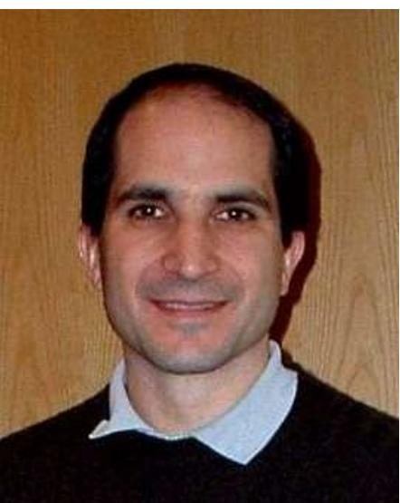

# Juan Maldacena

Juan Martín Maldacena (born 10 September 1968) is an Argentine theoretical physicist and the Carl P. Feinberg Professor in the School of Natural Sciences at the Institute for Advanced Study, Princeton. 3 He has made significant contributions to the foundations of string theory and quantum gravity. His most famous discovery is the AdS/CFT correspondence, a realization of the holographic principle in string theory.

# Biography

Instituto Balseiro at which Maldacena obtained his Physics licenciatura

Maldacena obtained his licenciatura (a six-year degree) in 1991 at the Instituto Balseiro, Bariloche, Argentina, under the supervision of Gerardo Aldazábal. He then obtained his Ph.D. in physics at Princeton University after completing a doctoral dissertation titled "Black holes in string theory" under the supervision of Curtis Callan in 1996, and went on to a post-doctoral position at Rutgers University. In 1997, he joined Harvard University as associate professor, being quickly promoted to Professor of Physics in 1999. Since 2001 he has been a professor at the Institute for Advanced Study in Princeton, New Jersey and in 2016 became the first Carl P. Feinberg Professor of Theoretical Physics in the institute's School of Natural Sciences.

#### Juan Maldacena

| Born              | 10 September 1968                                                         |  |  |
|-------------------|---------------------------------------------------------------------------|--|--|
|                   | Buenos Aires, Argentina                                                   |  |  |
| Nationality       | Argentine, American, Italian121                                           |  |  |
| Education         | Balseiro Institute (BS)                                                   |  |  |
|                   | Princeton University (PhD)                                                |  |  |
| Known for         | AdS/CFT correspondence ER = EPR ABJM superconformal field theory |  |  |
| Awards            | Alfred P. Sloan Foundation Fellowship                                  |  |  |
|                   | Sackler Prize                                                             |  |  |
|                   | MacArthur Fellowship                                                      |  |  |
|                   | Xanthopoulos                                                              |  |  |
|                   | Pius XI Medal                                                             |  |  |
|                   | Dirac Medal                                                               |  |  |
|                   | Pomeranchuk Prize                                                         |  |  |
|                   | Breakthrough Prize in                                                     |  |  |
|                   | Fundamental Physics                                                       |  |  |
|                   | Lorentz Medal                                                             |  |  |
|                   | Albert Einstein Medal                                                     |  |  |
|                   | St. Albert Award                                                          |  |  |
|                   | Galileo Galilei Medal                                                     |  |  |
| Scientific career |                                                                           |  |  |
| Fields            | Theoretical physics                                                       |  |  |

| Maldacena is a member of the Society of Catholic | Institutions | Institute for Advanced Study    |
|--------------------------------------------------|--------------|---------------------------------|
| Scientists. 41                                   | Thesis       | Black Holes in String Theory 11 |
|                                                  |              | (1996)                          |
|                                                  | Doctoral     | Curtis Callan                   |
|                                                  | advisor      |                                 |
| Contributions to physics                         |              |                                 |

Maldacena has made numerous discoveries in theoretical physics. Leonard Susskind called him "perhaps the greatest physicist of his generation ... certainly the greatest theoretical physicist of his generation".[5] His most famous discovery is the most reliable realization of the holographic principle - namely the AdS/CFT correspondence, a conjecture about the equivalence of string theory on Anti-de Sitter (AdS) space, and a conformal field theory defined on the boundary of the AdS space.[0] According to the conjecture, certain theories of quantum gravity are equivalent to other quantum mechanical theories (with no gravitational force) in one fewer spacetime dimensions.

In subsequent works, Maldacena elucidated several aspects of the AdS/CFT correspondence, describing how certain physical observables defined in one theory can be described in the equivalent theory. Shortly after his original work on the AdS/CFT correspondence, Maldacena showed how Wilson lines can be computed in a corresponding string theory by considering the area swept by an evolving fundamental string.[2] Wilson lines are non-local physical observables defined in gauge theory. In 2001, Maldacena proposed that an eternal black hole, an object defined in a gravitational theory, is equivalent to a certain entangled state involving two copies of the corresponding quantum mechanical theory.[ Ordinary black holes emit Hawking radiation and eventually evaporate. An eternal black hole is a type of black hole that survives forever because it eventually re-absorbs the radiation it emits.

In 2013, Maldacena co-authored an analysis of the 2012 black hole firewall paradox with Leonard Susskind, arguing that the paradox can be resolved if entangled particles are connected by minor wormholes."[9][10][11]

### Publications

3/5/25, 10:40 AM

■ Berenstein, David; Maldacena, Juan; Nastase, Horatiu (2002). "Strings in flat space and pp waves from N = 4 Super Yang Mills". AIP Conference Proceedings. 646. Waterloo, Ontario (Canada): 3-14. arXiv:hep-th/0202021 (https://arxiv.org/abs/hep-th/0202021). Bibcode:2002AIPC..646....3B (https://ui.adsabs.harvard.edu/abs/2002AIPC..646....3B). doi:10.1063/1.1524550 (https://doi.org/10.1063%2F1.1524550).

# Awards

Maldacena has received these awards:

- Alfred P. Sloan Foundation Fellowship, 1998
- Packard Fellowship in Science and Engineering, 1998
- MacArthur Fellowship, 1999[12]
- UNESCO Husein Prize for Young Scientists, 1999
- · Sackler Prize in Physics, 2000
- Xanthopoulos International Award for Research in Gravitational Physics, 20011131
- Pius XI Medal, 2002
- = Edward A. Bouchet Award 141 of the American Physical Society, 2004
- = Member of the American Academy of Arts and Sciences, elected 2007.155
- Dannie Heineman Prize, 2007[16]
- Dirac Medal of the ICTP, 2008
- Pomeranchuk Prize, 2012
- Breakthrough Prize in Fundamental Physics, 2012 [17]
- = Member of the National Academy of Sciences, elected 2013[18]
- Diamond Konex Award as the most important scientist in the last decade in Argentina, 2013
- Lorentz Medal, 2018[19]
- Albert Einstein Medal, 2018[20]
- St. Albert Award, 2018[21]
- = Galileo Galilei Medal, 2019
- = Les Houches School of Physics prize 2020[22]

### References

- 1. Maldacena, Juan M. (June 1996), "Black Holes in String Theory (PhD Thesis)". arXiv:hepth/9607235 (https://arxiv.org/abs/hep-th/9607235). Princeton University
- 2. "Curriculum Vitae: Juan Maldacena" (https://www.ias.edu/sites/default/files/sns/files/Maldacena CV2020.pdf) (PDF). 2020.
- 3. "Juan Maldacena" (https://www.ias.edu/scholars/maldacena). Institute for Advanced Study. 9 December 2019. Retrieved 13 May 2020.
- 4. "Juan Martín Maldacena" (https://catholicscientists.org/st-albert-award/juan-martin-maldacen al). The Society of Catholic Scientists. Retrieved 3 November 2024.
- 5. Susskind, Leonard (30 April 2014). Black Holes, the Conservation of Information, and the Holographic Principle (https://www.cornell.edu/video/leonard-susskind-2-black-holes-conservati on-of-information-holographic-principle) (Speech). Messenger Lectures on "The Birth of the Universe and the Origin of Laws of Physics". Cornell University. 68 minutes in.
- 6. Juan Martin Maldacena (1998). "The Large N Limit of Superconformal Field Theories and Supergravity". Adv. Theor. Math. Phys. 2 (2): 231–252. arXiv:hep-th/9711200 (https://arxiv.org/ abs/hep-th/9711200). Bibcode:1998AdTMP...2..231M (https://ui.adsabs.harvard.edu/abs/1998A dTMP...2..231M), doi:10.4310/atmp.1998.v2.n2.a1 (https://doi.org/10.4310%2Fatmp.1998.v2.n 2.a1).
- 7. Maldacena, Juan M. (1 June 1998). "Wilson loops in field theories". Physical Review Letters: 80 (22): 4859-4862. arXiv:hep-th/9803002 (https://arxiv.org/abs/hep-th/9803002), Bibcode:1998PhRvL..80.4859M (https://ui.adsabs.harvard.edu/abs/1998PhRvL..80.4859M). doi:10.1103/PhysRevLett.80.4859 (https://doi.org/10.1103%2FPhysRevLett.80.4859). ISSN 0031-9007 (https://search.worldcat.org/issn/0031-9007). S2CID 14386667 (https://api.se manticscholar.org/CorpusID:14386667).
- 8. Maldacena, Juan M. (12 April 2003). "Eternal Black Holes in AdS". Journal of High Energy Physics. 2003 (4): 021. arXiv:hep-th/0106112 (https://arxiv.org/abs/hep-th/0106112). doi:10.1088/1126-6708/2003/04/021 (https://doi.org/10.1088%2F1126-6708%2F2003%2F04% 2F021). ISSN 1029-8479 (https://search.worldcat.org/issn/1029-8479). S2CID 7767700 (http s://api.semanticscholar.org/CorpusID:7767700).
- 9. Overbye, Dennis (12 August 2013). "A Black Hole Mystery Wrapped in a Firewall Paradox" (htt ps://www.nytimes.com/2013/08/13/science/space/a-black-hole-mystery-wrapped-in-a-firewall-p aradox.html). New York Times. Retrieved 29 October 2013.
- 10. "The Firewall Paradox" (https://www.nytimes.com/interactive/2013/08/13/science/0813-sci-blac khole.html). New York Times. 12 August 2013. Retrieved 29 October 2013.
- 11. Cool horizons for entangled black holes
- 12. "Meet the 1999 MacArthur Fellows" (http://www.macfound.org/fellows/class/july-1999/). Retrieved 25 November 2013.
- 13. "Basilis Xanthopoulos International Award" (https://www.physics.uoc.gr/Xanthopoulos/). www.physics.uoc.gr
- 14. "2004 Edward A. Bouchet Award Recipient: Juan M. Maldacena" (http://www.aps.org/program s/honors/prizes/prizerecipient.cfm?first\_nm=Juan&last\_nm=Maldacena&year=2004). Retrieved 24 August 2011.
- 15. "Juan Martin Maldacena" (https://www.amacad.org/person/juan-martin-maldacena). American Academy of Arts & Sciences. Retrieved 13 May 2020.
- 16. "2007 Dannie Heineman Prize for Mathematical Physics Recipient: Juan Maldacena, Institute for Advance Study" (https://www.aps.org/programs/honors/prizes/prizerecipient.cfm?last\_nm= Maldacena&first\_nm=Juan&year=2007). American Physical Society. Retrieved 3 August 2018.
- 17. New annual US\$3 million Fundamental Physics Prize recognizes transformative advances in the field (https://breakthroughprize.org/News/15) Archived (https://web.archive.org/web/201208 03211628/https://breakthroughprize.org/Prize/1) 3 August 2012 at the Wayback Machine, FPP, accessed 1 August 2012
- 18. "Juan Maldacena" (http://www.nasonline.org/members/20022805.html). www.nasonline.org. Retrieved 13 May 2020.
- 19. "LORENTZ MEDAL AWARDED TO PHYSICIST JUAN MARTÍN MALDACENA" (https://web.ar chive.org/web/20210720163807/https://www.knaw.nl/en/news/lorentz-medal-awarded-tophysicist-juan-martin-maldacena). Royal Netherlands Academy of Arts and Sciences. 27 March 2018. Archived from the original (https://www.knaw.nl/en/news/lorentz-medal-awarded-tophysicist-juan-martin-maldacena) on 20 July 2021. Retrieved 3 August 2018.
- 20. "Juan Maldacena Receives 2018 Einstein Medal from the Albert Einstein Society IAS News | Institute for Advanced Study" (https://www.ias.edu/news/juan-maldacena-receives-2018-einstei n-medal-albert-einstein-society). 3 August 2018.
- 21. "Juan Martin Maldacena" (https://web.archive.org/web/20210118091002/https://www.catholicsc ientists.org/about/St.-Albert-Award/Maldacena-bio). Archived from the original (https://www.cat holicscientists.org/about/St.-Albert-Award/Maldacena-bio) on 18 January 2021. Retrieved 6 October 2018.
- 22. Peyla, Philippe. "2020 Prize: Juan Martin Maldacena" (https://www.houches-school-physics.co m/prize/2020-prize/2020-prize-juan-martin-maldacena-764797.kjsp?RH=1606314527588). Ecole des Houches, Retrieved 20 December 2023,

### External links

- Maldacena's web page at the Institute (http://www.sns.ias.edu/~malda)
- Maldacena Theme tree (http://xstructure.inr.ac.ru/x-bin/search e3.py?au=Maldacena J&start= 0&max results=100)
- Interview of Juan Maldacena by David Zierler on January 15, 2021, Niels Bohr Library & Archives, American Institute of Physics, College Park, MD USA (https://www.aip.org/history-pro grams/niels-bohr-library/oral-histories/47184)

Retrieved from "https://en.wikipedia.org/w/index.php?title=Juan\_Maldacena&oldid=1267298756"