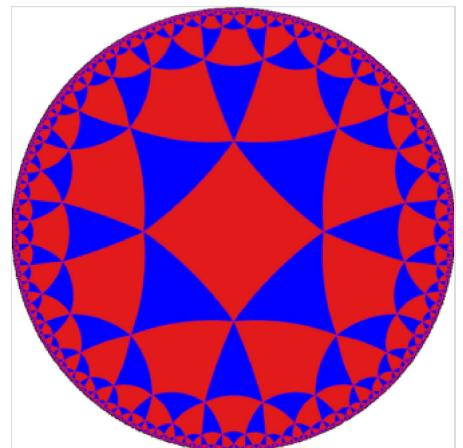
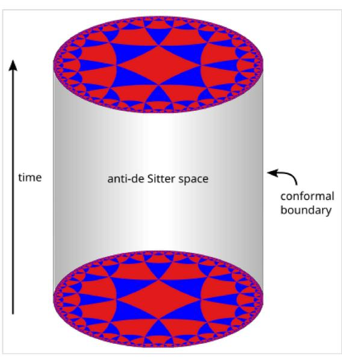
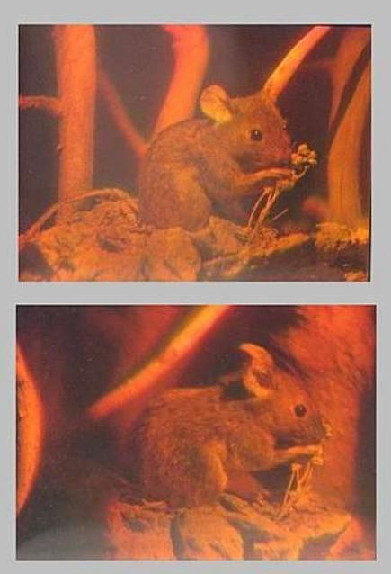
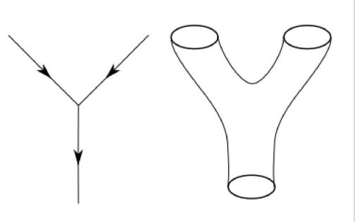
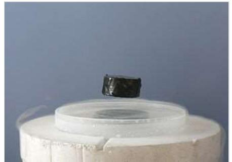
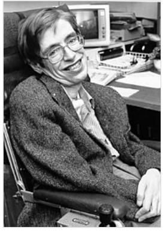
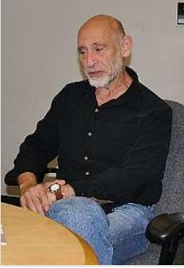

# AdS/CFT correspondence

In theoretical physics, the anti-de Sitter/conformal field theory correspondence (frequently abbreviated as AdS/CFT) is a conjectured relationship between two kinds of physical theories. On one side are anti-de Sitter spaces (AdS) that are used in theories of quantum gravity, formulated in terms of string theory or M-theory. On the other side of the correspondence are conformal field theories (CFT) that are quantum field theories, including theories similar to the Yang-Mills theories that describe elementary particles.

The duality represents a major advance in the understanding of string theory and quantum gravity.[1] This is because it provides a non-perturbative formulation of string theory with certain boundary conditions and because it is the most successful realization of the holographic principle, an idea in quantum gravity originally proposed by Gerard 't Hooft and promoted by Leonard Susskind.

It also provides a powerful toolkit for studying strongly coupled quantum field theories. 21 Much of the usefulness of the duality results from the fact that it is a strong-weak duality: when the fields of the quantum field theory are strongly interacting, the ones in the gravitational theory are weakly interacting and thus more mathematically tractable. This fact has been used to study many aspects of nuclear and condensed matter physics by translating problems in those subjects into more mathematically tractable problems in string theory.

The AdS/CFT correspondence was first proposed by Juan Maldacena in late 1997.13] Important aspects of the correspondence were soon elaborated on in two articles, one by Steven Gubser, Igor Klebanov and Alexander Polyakov, and another by Edward Witten. By 2015, Maldacena's article had over 10,000 citations, becoming the most highly cited article in the field of high energy physics. 41

One of the most prominent examples of the AdS/CFT correspondence has been the AdS5/CFT4 correspondence: a relation between N = 4 supersymmetric Yang-Mills theory in 3-1 dimensions and type IIB superstring theory on AdSx × S5.15]

# Background

### Quantum gravity and strings

Current understanding of gravity is based on Albert Einstein's general theory of relativity. 16 Formulated in 1915, general relativity explains gravity in terms of the geometry of space and time, or spacetime. It is formulated in the language of classical physics 22 that was developed by physicists such as Isaac Newton and James Clerk Maxwell. The other nongravitational forces are

#### AdS/CFT correspondence - Wikipedia

explained in the framework of quantum mechanics. Developed in the first half of the twentieth century by a number of different physicists, quantum mechanics provides a radically different way of describing physical phenomena based on probability.

Quantum gravity is the branch of physics that seeks to describe gravity using the principles of quantum mechanics. Currently, a popular approach to quantum gravity is string theory, 2 which models elementary particles not as zero-dimensional points but as one-dimensional objects called strings. In the AdS/CFT correspondence, one typically considers theories of quantum gravity derived from string theory or its modern extension, M-theory. 10

In everyday life, there are three familiar dimensions of space (up/down, left/right, and forward/backward), and there is one dimension of time. Thus, in the language of modern physics, one says that spacetime is four-dimensional.[1] One peculiar feature of string theory and M-theory is that these theories require extra dimensions of spacetime for their mathematical consistency: in string theory spacetime is ten-dimensional, while in M-theory it is eleven-dimensional.142 The quantum gravity theories appearing in the AdS/CFT correspondence are typically obtained from string and M-theory by a process known as compactification. This produces a theory in which spacetime has effectively a lower number of dimensions and the extra dimensions are "curled up" into circles.[13]

A standard analogy for compactification is to consider a multidimensional object such as a garden hose. If the hose is viewed from a sufficient distance, it appears to have only one dimension, its length, but as one approaches the hose, one discovers that it contains a second dimension, its circumference. Thus, an ant crawling inside it would move in two dimensions. 141

#### Quantum field theory

The application of quantum mechanics to physical objects such as the electromagnetic field, which are extended in space and time, is known as quantum field theory. 455 In particle physics, quantum field theories form the basis for our understanding of elementary particles, which are modeled as excitations in the fundamental fields. Quantum field theories are also used throughout condensed matter physics to model particle-like objects called quasiparticles.[16]

In the AdS/CFT correspondence, one considers, in addition to a theory of quantum gravity, a certain kind of quantum field theory called a conformal field theory. This is a particularly symmetric and mathematically well behaved type of quantum field theory.[2] Such theories are often studied in the context of string theory, where they are associated with the surface swept out by a string propagating through spacetime, and in statistical mechanics, where they model systems at a thermodynamic critical point.[18]

# Overview of the correspondence

#### Geometry of anti-de Sitter space

In the AdS/CFT correspondence, one considers string theory or an anti-de Sitter background. This means that the geometry of spacetime is described in terms of a certain vacuum solution of Einstein's equation called anti-de Sitter space.1191

In very elementary terms, anti-de Sitter space is a mathematical model of spacetime in which the notion of distance between points (the metric) is different from the notion of distance in ordinary Euclidean geometry. It is closely related to hyperbolic space, which can be viewed as a disk as illustrated on the right.[20] This image shows a tessellation of a disk by triangles and squares. One can define the distance between points of this disk in such a way that all the triangles and squares are the same size and the circular outer boundary is infinitely far from any point in the interior. 211

Now imagine a stack of hyperbolic disks where each disk represents the state of the universe at a given time. The resulting geometric object is three-dimensional anti-de Sitter space.[20] It looks like a solid cylinder in which any cross

A tessellation of the hyperbolic plane by triangles and squares.

section is a copy of the hyperbolic disk. Time runs along the vertical direction in this picture. The surface of this cylinder plays an important role in the AdS/CFT correspondence. As with the hyperbolic plane, anti-de Sitter space is curved in such a way that any point in the interior is actually infinitely far from this boundary surface. [22]

Three-dimensional anti-de Sitter space is like a stack of hyperbolic disks, each one representing the state of the universe at a given time. The resulting spacetime looks like a solid cylinder.

This construction describes a hypothetical universe with only two space and one time dimension, but it can be generalized to any number of dimensions. Indeed, hyperbolic space can have more than two dimensions and one can "stack up" copies of hyperbolic space to get higher-dimensional models of anti-de Sitter space. 201

### Idea of AdS/CFT

An important feature of anti-de Sitter space is its boundary (which looks like a cylinder in the case of three-dimensional anti-de Sitter space). One property of this boundary is that, locally around any point, it looks just like Minkowski space, the model of spacetime used in nongravitational physics. [23]

One can therefore consider an auxiliary theory in which "spacetime" is given by the boundary of anti-de Sitter space. This observation is the starting point for the AdS/CFT correspondence, which states that the

boundary of anti-de Sitter space can be regarded as the "spacetime" for a conformal field theory. The claim is that this conformal field theory is equivalent to the gravitational theory on the bulk anti-de Sitter space in the sense that there is a "dictionary" for translating calculations in one theory into calculations in the other. Every entity in one theory has a counterpart in the other theory. For example, a single particle in the gravitational theory might correspond to some collection of particles in the boundary theory. In addition, the predictions in the two theories are quantitatively identical so that if two particles have a 40 percent chance of colliding in the gravitational theory, then the corresponding collections in the boundary theory would also have a 40 percent chance of colliding. 241

Notice that the boundary of anti-de Sitter space has fewer dimensions than anti-de Sitter space itself. For instance, in the three-dimensional example illustrated above, the boundary is a two-dimensional surface. The AdS/CFT correspondence is often described as a "holographic duality" because this relationship between the two theories is similar to the relationship between a three-dimensional object and its image as a hologram. 251 Although a hologram is two-dimensional, it encodes information about all three dimensions of the object it represents. In the same way, theories that are related by the AdS/CFT correspondence are conjectured to be exactly equivalent, despite living in different numbers of dimensions. The conformal field theory is like a hologram that captures information about the higher-dimensional quantum gravity theory. 211

#### Examples of the correspondence

Following Maldacena's insight in 1997, theorists have discovered many different realizations of the AdS/CFT correspondence. These relate various conformal field theories to compactifications of string theory and M-theory in various numbers of dimensions. The theories involved are generally not viable models of the real world, but they have certain features,

A hologram is a two-dimensional image that stores information about all three dimensions of the object it represents. The two images here are photographs of a single hologram taken from different angles.

such as their particle content or high degree of symmetry, which make them useful for solving problems in quantum field theory and quantum gravity. 126

The most famous example of the AdS/CFT correspondence states that type IIB string theory on the product space AdSg × S5 is equivalent to N = 4 supersymmetric Yang-Mills theory on the fourdimensional boundary.127 In this example, the spacetime on which the gravitational theory lives is effectively five-dimensional (hence the notation AdS), and there are five additional compact dimensions (encoded by the S5 factor). In the real world, spacetime is four-dimensional, at least macroscopically, so this version of the correspondence does not provide a realistic model of gravity. Likewise, the dual theory is not a viable model of any real-world system as it assumes a large amount of supersymmetry. Nevertheless, as explained below, this boundary theory shares some features in common with quantum chromodynamics, the fundamental theory of the strong force. It describes particles similar to the gluons of quantum chromodynamics together with certain fermions. 12 As a result, it has found applications in nuclear physics, particularly in the study of the quark-gluon plasma.[28][29]

Another realization of the correspondence states that M-theory on AdS, × S4 is equivalent to the so-called (2,0)-theory in six dimensions.[3] In this example, the spacetime of the gravitational theory is effectively seven-dimensional. The existence of the (2,0)-theory that appears on one side of the duality is predicted by the classification of superconformal field theories. It is still poorly AdS/CFT correspondence - Wikipedia

understood because it is a quantum mechanical theory without a classical limit.[30] Despite the inherent difficulty in studying this theory, it is considered to be an interesting object for a variety of reasons, both physical and mathematical.1311

Yet another realization of the correspondence states that M-theory on AdS4 × S7 is equivalent to the ABJM superconformal field theory in three dimensions.[32] Here the gravitational theory has four noncompact dimensions, so this version of the correspondence provides a somewhat more realistic description of gravity. 331

# Applications to quantum gravity

### A non-perturbative formulation of string theory

In quantum field theory, one typically computes the probabilities of various physical events using the techniques of perturbation theory. Developed by Richard Feynman and others in the first half of the twentieth century, perturbative quantum field theory uses special diagrams called Feynman diagrams to organize computations. One imagines that these diagrams depict the paths of point-like particles and their interactions. 1341 Although this formalism is extremely useful for making predictions, these predictions are only possible when the strength of the interactions, the coupling constant, is small enough to reliably describe the theory as being close to a theory without interactions. 35

Interaction in the quantum world: world lines of point-like particles or a world sheet swept up by closed strings in string theory.

The starting point for string theory is the idea that the point-like particles of quantum field theory can also be modeled as one-dimensional objects called strings. The interaction of strings is most straightforwardly defined by generalizing the perturbation theory used in ordinary quantum field theory. At the level of Feynman diagrams, this means replacing the one-dimensional diagram representing the path of a point particle by a two-dimensional surface representing the motion of a string. Unlike in quantum field theory, string theory does not yet have a full non-perturbative definition, so many of the theoretical questions that physicists would like to answer remain out of reach\_[36]

The problem of developing a non-perturbative formulation of string theory was one of the original motivations for studying the AdS/CFT correspondence.1371 As explained above, the correspondence provides several examples of quantum field theories that are equivalent to string theory on anti-de Sitter space. One can alternatively view this correspondence as providing a definition of string theory in the special case where the gravitational field is asymptotically antide Sitter (that is, when the gravitational field resembles that of anti-de Sitter space at spatial infinity). Physically interesting quantities in string theory are defined in terms of quantities in the dual quantum field theory.[21]

#### Black hole information paradox

In 1975, Stephen Hawking published a calculation that suggested that black holes are not completely black but emit a dim radiation due to quantum effects near the event horizon.[30] At first, Hawking's result posed a problem for theorists because it suggested that black holes destroy information. More precisely, Hawking's calculation seemed to conflict with one of the basic postulates of quantum mechanics, which states that physical systems evolve in time according to the Schrödinger equation. This property is usually referred to as unitarity of time evolution. The apparent contradiction between Hawking's calculation and the unitarity postulate of quantum mechanics came to be known as the black hole information paradox. 39

The AdS/CFT correspondence resolves the black hole information paradox, at least to some extent, because it shows how a black hole can evolve in a manner consistent with quantum mechanics in some contexts. Indeed, one can consider black holes in the context of the AdS/CFT correspondence, and any such black hole corresponds to a configuration of particles on the boundary of anti-de Sitter space.40 These particles obey the usual rules of quantum mechanics and in particular evolve in a unitary fashion, so the black hole must also evolve in a unitary fashion, respecting the principles of quantum mechanics. 411 In 2005, Hawking announced that the paradox had been settled in favor of information conservation by the AdS/CFT correspondence, and he suggested a concrete mechanism by which black holes might preserve information.442

## Applications to quantum field theory

#### Nuclear physics

One physical system that has been studied using the AdS/CFT correspondence is the quark-gluon plasma, an exotic state of matter produced in particle accelerators. This state of matter arises for brief instants when heavy ions such as gold or lead nuclei are collided at high energies. Such collisions cause the quarks that make up atomic nuclei to deconfine at temperatures of approximately two trillion kelvins, conditions similar to those present at around 10-11 seconds after the Big Bang. 431

The physics of the quark-gluon plasma is governed by quantum chromodynamics, but this theory is mathematically intractable in problems involving the quark-gluon plasma.444 In an article appearing in 2005, Đàm Thanh Sơn and his collaborators showed that the AdS/CFT correspondence could be used to understand some aspects of the quark-gluon plasma by describing it in the language of string theory.[20][20] By applying the AdS/CFT correspondence, Son and his collaborators were able to describe the quark gluon plasma in terms of black holes in five-dimensional spacetime. The calculation showed that the ratio of two quantities associated with the quark-gluon plasma, the shear viscosity n and volume density of entropy s, should be approximately equal to a certain universal constant:

$$\frac{\eta}{s} \approx \frac{\hbar}{4\pi k}$$

where h denotes the reduced Planck constant and k is the Boltzmann constant.4451129 In addition, the authors conjectured that this universal constant provides a lower bound for η/s in a large class of systems. In an experiment conducted at the Relativistic Heavy Ion Collider at Brookhaven National Laboratory, the experimental result in one model was close to this universal constant but it was not the case in another model. 461

Another important property of the quark-gluon plasma is that very high energy quarks moving through the plasma are stopped or "quenched" after traveling only a few femtometres. This phenomenon is characterized by a number & called the jet quenching parameter, which relates the energy loss of such a quark to the squared distance traveled through the plasma. Calculations based on the AdS/CFT correspondence give the estimated value o ~ 4 GeV2/fm, and the experimental value of â lies in the range 5–15 GeV2/fm.[45]

#### Condensed matter physics

Over the decades, experimental condensed matter physicists have discovered a number of exotic states of matter, including superconductors and superfluids. These states are described using the formalism of quantum field theory, but some phenomena are difficult to explain using standard field theoretic techniques. Some condensed matter theorists including Subir Sachdev hope that the AdS/CFT correspondence will make it possible to describe these systems in the language of string theory and learn more about their behavior\_[28]

So far some success has been achieved in using string theory methods to describe the transition of a superfluid to an insulator. A superfluid is a system of electrically neutral atoms that flows without any friction. Such systems are often

A magnet levitating above a hightemperature superconductor. Today some physicists are working to understand high-temperature superconductivity using the AdS/CFT correspondence [47]

produced in the laboratory using liquid helium, but recently experimentalists have developed new ways of producing artificial superfluids by pouring trillions of cold atoms into a lattice of crisscrossing lasers. These atoms initially behave as a superfluid, but as experimentalists increase the intensity of the lasers, they become less mobile and then suddenly transition to an insulating state. During the transition, the atoms behave in an unusual way. For example, the atoms slow to a halt at a rate that depends on the temperature and on the Planck constant, the fundamental parameter of quantum mechanics, which does not enter into the description of the other phases. This behavior has recently been understood by considering a dual description where properties of the fluid are described in terms of a higher dimensional black hole.[48]

### Criticism

With many physicists turning towards string-based methods to solve problems in nuclear and condensed matter physics, some theorists working in these areas have expressed doubts about whether the AdS/CFT correspondence can provide the tools needed to realistically model realworld systems. In a talk at the Quark Matter conference in 2006,402 an American physicist, Larry McLerran pointed out that the N = 4 super Yang-Mills theory that appears in the AdS/CFT correspondence differs significantly from quantum chromodynamics, making it difficult to apply these methods to nuclear physics. According to McLerran,

N = 4 supersymmetric Yang-Mills is not QCD ... It has no mass scale and is conformally invariant. It has no confinement and no running coupling constant. It is supersymmetric. It has no chiral symmetry breaking or mass generation. It has six scalar and fermions in the adjoint representation ... It may be possible to correct some or all of the above problems, or, for various physical problems, some of the objections may not be relevant. As yet there is not consensus nor compelling arguments for the conjectured fixes or phenomena which would insure that the N = 4 supersymmetric Yang Mills results would reliably reflect QCD. 49]

In a letter to Physics Today, Nobel laureate Philip W. Anderson voiced similar concerns about applications of AdS/CFT to condensed matter physics, stating

As a very general problem with the AdS/CFT approach in condensed-matter theory, we can point to those telltale initials "CFT"-conformal field theory. Condensed-matter problems are, in general, neither relativistic nor conformal. Near a quantum critical point, both time and space may be scaling, but even there we still have a preferred coordinate system and, usually, a lattice. There is some evidence of other linear-T phases to the left of the strange metal about which they are welcome to speculate, but again in this case the condensed-matter problem is overdetermined by experimental facts.[50]

### History and development

#### String theory and nuclear physics

The discovery of the AdS/CFT correspondence in late 1997 was the culmination of a long history of efforts to relate string theory to nuclear physics.151 In fact, string theory was originally developed during the late 1960s and early 1970s as a theory of hadrons, the subatomic particles like the proton and neutron that are held together by the strong nuclear force. The idea was that each of these particles could be viewed as a different oscillation mode of a string. In the late 1960s, experimentalists had found that hadrons fall into families called Regge trajectories with squared energy proportional to angular momentum, and theorists showed that this relationship emerges naturally from the physics of a rotating relativistic string.[52]

On the other hand, attempts to model hadrons as strings faced serious problems. One problem was that string theory includes a massless spin-2 particle whereas no such particle appears in the physics of hadrons.[5] Such a particle would mediate a force with the properties of gravity. In 1974, Joël Scherk and John Schwarz suggested that string theory was therefore not a

Gerard 't Hooft obtained results related to the AdS/CFT correspondence in the 1970s by studying analogies between string theory and nuclear physics.

theory of nuclear physics as many theorists had thought but instead a theory of quantum gravity.[53] At the same time, it was realized that hadrons are actually made of quarks, and the string theory approach was abandoned in favor of quantum chromodynamics.451

AdS/CFT correspondence - Wikipedia

In quantum chromodynamics, quarks have a kind of charge that comes in three varieties called colors. In a paper from 1974, Gerard 't Hooft studied the relationship between string theory and nuclear physics from another point of view by considering theories similar to quantum chromodynamics, where the number of colors is some arbitrary number N, rather than three. In this article, 't Hooft considered a certain limit where N tends to infinity and argued that in this limit certain calculations in quantum field theory resemble calculations in string theory. 54

#### Black holes and holography

Stephen Hawking predicted in 1975 that black holes emit radiation due to quantum effects.

In 1975, Stephen Hawking published a calculation that suggested that black holes are not completely black but emit a dim radiation due to quantum effects near the event horizon.[30] This work extended previous results of Jacob Bekenstein who had suggested that black holes have a well-defined entropy.1551 At first, Hawking's result appeared to contradict one of the main postulates of quantum mechanics, namely the unitarity of time evolution. Intuitively, the unitarity postulate says that quantum mechanical systems do not destroy information as they evolve from one state to another. For this reason, the apparent contradiction came to be known as the black hole information paradox.[56]

Later, in 1993, Gerard 't Hooft wrote a speculative paper on quantum gravity in which he revisited Hawking's work on black hole thermodynamics, concluding that the total number of degrees of freedom in a region of spacetime surrounding a black

hole is proportional to the surface area of the horizon.1571 This idea was promoted by Leonard Susskind and is now known as the holographic principle.150 The holographic principle and its realization in string theory through the AdS/CFT correspondence have helped elucidate the mysteries of black holes suggested by Hawking's work and are believed to provide a resolution of the black hole information paradox.[4] In 2004, Hawking conceded that black holes do not violate quantum mechanics,559 and he suggested a concrete mechanism by which they might preserve information\_[42]

Leonard Susskind made early contributions to the idea of holography in quantum gravity.

### Maldacena's paper

On January 1, 1998, Juan Maldacena published a landmark paper that initiated the study of AdS/CFT.3] According to Alexander Markovich Polyakov, "[Maldacena's] work opened the flood gates."160] The conjecture immediately excited great interest in the string theory community. and was considered in a paper by Steven Gubser, Igor Klebanov and Polyakov,611 and another paper of Edward Witten.[6] These papers made Maldacena's conjecture more precise and showed that the conformal field theory appearing in the correspondence lives on the boundary of antide Sitter space. 60

One special case of Maldacena's proposal says that N = 4 super Yang-Mills theory, a gauge theory similar in some ways to quantum chromodynamics, is equivalent to string theory in fivedimensional anti-de Sitter space. 32 This result helped clarify the earlier work of 't Hooft on the relationship between string theory and quantum chromodynamics, taking string theory back to its roots as a theory of nuclear physics.[52] Maldacena's results also provided a concrete realization of the holographic principle with important implications for quantum gravity and black hole physics. 11 By the year 2015, Maldacena's paper had become the most highly cited paper in high energy physics with over 10,000 citations. 41 These subsequent articles have provided considerable evidence that the correspondence is correct, although so far it has not been rigorously proved.[41][63]

### Generalizations

#### Three-dimensional gravity

In order to better understand the quantum aspects of gravity in our fourdimensional universe, some physicists have considered a lower-dimensional mathematical model in which spacetime has only two spatial dimensions and one time dimension.1641 In this setting, the mathematics describing the gravitational field simplifies drastically, and one can study quantum gravity using familiar methods from quantum field theory, eliminating the need for string theory or other more radical approaches to quantum gravity in four dimensions. 165

Beginning with the work of J. David Brown and Marc Henneaux in 1986,666 physicists have noticed that quantum gravity in a three-dimensional spacetime is closely related to twodimensional conformal field theory. In 1995, Henneaux and his coworkers explored this relationship in more detail, suggesting that three-dimensional gravity in anti-de Sitter space is equivalent to the conformal field theory known as Liouville field theory. 1021 Another conjecture formulated by Edward Witten states that three-dimensional gravity in anti-de Sitter space is equivalent to a conformal field theory with monster group symmetry.16 These conjectures provide examples of the AdS/CFT correspondence that do not require the full apparatus of string or M-theory. 69]

### dS/CFT correspondence

Unlike our universe, which is now known to be expanding at an accelerating rate, anti-de Sitter space is neither expanding nor contracting. Instead it looks the same at all times.[20] In more technical language, one says that anti-de Sitter space corresponds to a universe with a negative cosmological constant, whereas the real universe has a small positive cosmological constant.179

Although the properties of gravity at short distances should be somewhat independent of the value of the cosmological constant, 22 it is desirable to have a version of the AdS/CFT correspondence for positive cosmological constant. In 2001, Andrew Strominger introduced a version of the duality called the dS/CFT correspondence.1721 This duality involves a model of spacetime called de Sitter space with a positive cosmological constant. Such a duality is interesting from the point of view of cosmology since many cosmologists believe that the very early universe was close to being de Sitter space.[20]

#### Kerr/CFT correspondence

Although the AdS/CFT correspondence is often useful for studying the properties of black holes, 32 most of the black holes considered in the context of AdS/CFT are physically unrealistic. Indeed, as explained above, most versions of the AdS/CFT correspondence involve higherdimensional models of spacetime with unphysical supersymmetry.

In 2009, Monica Guica, Thomas Hartman, Wei Song, and Andrew Strominger showed that the ideas of AdS/CFT could nevertheless be used to understand certain astrophysical black holes. More precisely, their results apply to black holes that are approximated by extremal Kerr black holes, which have the largest possible angular momentum compatible with a given mass.144 They showed that such black holes have an equivalent description in terms of conformal field theory. The Kerr/CFT correspondence was later extended to black holes with lower angular momentum.1751

#### Higher spin gauge theories

The AdS/CFT correspondence is closely related to another duality conjectured by Igor Klebanov and Alexander Markovich Polyakov in 2002.12 This duality states that certain "higher spin gauge theories" on anti-de Sitter space are equivalent to conformal field theories with O(N) symmetry. Here the theory in the bulk is a type of gauge theory describing particles of arbitrarily high spin. It is similar to string theory, where the excited modes of vibrating strings correspond to particles with higher spin, and it may help to better understand the string theoretic versions of AdS/CFT and possibly even prove the correspondence.272 In 2010, Simone Giombi and Xi Yin obtained further evidence for this duality by computing quantities called three-point functions.[78]

### See also

- Algebraic holography
- Ambient construction
- · Randall-Sundrum model

## Notes

- 1. de Haro et al. 2013, p. 2
- 2. Klebanov & Maldacena 2009
- 3. Maldacena 1998, The pre-print was submitted in 1997 and published on January 1, 1998.
- 4. "Top Cited Articles of All Time (2014 edition)" (https://web.archive.org/web/20150906143001/htt ps://inspirehep.net/info/hep/stats/topcites/2014/alltime.html), INSPIRE-HEP. Archived from the original (https://inspirehep.net/info/hep/stats/topcites/2014/alltime.html) on 6 September 2015. Retrieved 26 December 2015.
- 5. Ammon & Erdmenger 2015
- 6. A standard textbook on general relativity is Wald 1984.
- 7. Maldacena 2005, p. 58
- 8. Griffiths 2004
- 9. Maldacena 2005, p. 62.
- 10. See subsection § Examples of the correspondence. For examples that do not involve string theory or M-theory, see section § Generalizations.
- 11. Wald 1984, p. 4
- 12. Zwiebach 2009, p. 8
- 13. Zwiebach 2009, pp. 7-8
- 14. This analogy is used for example in Greene 2000, p. 186.
- 15. A standard text is Peskin & Schroeder 1995.
- 16. For an introduction to the applications of quantum field theory to condensed matter physics, see Zee 2010.
- 17. Conformal field theories are characterized by their invariance under conformal transformations.
- 18. For an introduction to conformal field theory emphasizing its applications to perturbative string theory, see Volume II of Deligne et al. 1999.
- 19. Klebanov & Maldacena 2009, p. 28.
- 20. Maldacena 2005, p. 60.
- 21. Maldacena 2005, p. 61
- 22. The mathematical relationship between the interior and boundary of anti-de Sitter space is related to the ambient construction of Charles Fefferman and Robin Graham. For details see Fefferman & Graham 1985, Fefferman & Graham 2011.
- 23. Zwiebach 2009, p. 552
- 24. Maldacena 2005, pp. 61-62
- 25. Maldacena 2005, p. 57
- 26. The known realizations of AdS/CFT typically involve unphysical numbers of spacetime dimensions and unphysical supersymmetries.
- 27. This example is the main subject of the three pioneering articles on AdS/CFT: Maldacena 1998; Gubser, Klebanov & Polyakov 1998; and Witten 1998.
- 28. Merali 2011, p. 303
- 29. Kovtun, Son & Starinets 2005
- 30. For a review of the (2,0)-theory, see Moore 2012.
- 31. See Moore 2012 and Alday, Gaiotto & Tachikawa 2010.
- 32. Aharony et al. 2008
- 33. Aharony et al. 2008, sec. 1
- 34. A standard textbook introducing the formalism of Feynman diagrams is Peskin & Schroeder 1995.
- 35. Zee 2010, p. 43
- 36. Zwiebach 2009, p. 12
- 37. Maldacena 1998, sec. 6
- 38. Hawking 1975
- 39. For an accessible introduction to the black hole information paradox, and the related scientific dispute between Hawking and Leonard Susskind, see Susskind 2008.
- 40. Zwiebach 2009, p. 554
- 41. Maldacena 2005, p. 63
- 42. Hawking 2005
- 43. Zwiebach 2009, p. 559
- 44. More precisely, one cannot apply the methods of perturbative quantum field theory.
- 45. Zwiebach 2009, p. 561
- 46. Luzum & Romatschke 2008, Part IV. C
- 47. Merali 2011
- 48. Sachdev 2013, p. 51
- 49. Mcl erran 2007
- 50. Anderson 2013
- 51. Zwiebach 2009, p. 525
- 52. Aharony et al. 2008, sec. 1.1
- 53. Scherk & Schwarz 1974
- 54 't Hooft 1974
- 55. Bekenstein 1973
- 56. Susskind 2008
- 't Hooft 1993 57.
- 58. Susskind 1995
- 59. Susskind 2008, p. 444
- 60. Polyakov 2008, p. 6
- 61. Gubser, Klebanov & Polyakov 1998
- 62. Witten 1998
- 63. Cowen 2013
- 64. For a review, see Carlip 2003.
- 65. According to the results of Witten 1988, three-dimensional quantum gravity can be understood by relating it to Chern-Simons theory.
- 66. Brown & Henneaux 1986
- 67. Coussaert, Henneaux & van Driel 1995
- 68. Witten 2007
- 69. Guica et al. 2009, p. 1
- 70. Perlmutter 2003
- 71. Biguard 2005. p. 33
- 72. Strominger 2001
- 73. See subsection § Black hole information paradox.
- 74. Guica et al. 2009
- 75. Castro, Maloney & Strominger 2010
- 76. Klebanov & Polyakov 2002
- 77. See the Introduction in Klebanov & Polyakov 2002.
- 78. Giombi & Yin 2010

# References

- Aharony, Ofer; Bergman, Oren; Jafferis, Daniel Louis; Maldacena, Juan (2008). "N = 6 superconformal Chern-Simons-matter theories, M2-branes and their gravity duals". Journal of High Energy Physics. 2008 (10): 091. arXiv:0806.1218 (https://arxiv.org/abs/0806.1218). Bibcode:2008JHEP... 10..091A (https://ui.adsabs.harvard.edu/abs/2008JHEP... 10..091A), doi:10.1088/1126-6708/2008/10/091 (https://doi.org/10.1088%2F1126-6708%2F2008%2F10% 2F091). S2CID 16987793 (https://api.semanticscholar.org/CorpusID:16987793).
- Aharony, Ofer; Gubser, Steven; Maldacena, Juan; Ooguri, Hirosi; Oz, Yaron (2000). "Large N Field Theories, String Theory and Gravity". Phys. Rep. 323 (3-4): 183-386. arXiv:hepth/9905111 (https://arxiv.org/abs/hep-th/9905111). Bibcode:2000PhR...323..183A (https://ui.ads abs.harvard.edu/abs/2000PhR...323..183A), doi:10.1016/S0370-1573(99)00083-6 (https://doi.o rg/10.1016%2FS0370-1573%2899%2900083-6). S2CID 119101855 (https://api.semanticschol ar.org/CorpusID:119101855).
- = Alday, Luis; Gaiotto, Davide; Tachikawa, Yuji (2010). "Liouville correlation functions from fourdimensional gauge theories". Letters in Mathematical Physics. 91 (2): 167-197. arXiv:0906.3219 (https://arxiv.org/abs/0906.3219). Bibcode:2010LMaPh..91..167A (https://ui.ad sabs.harvard.edu/abs/2010LMaPh..91..167A). doi:10.1007/s11005-010-0369-5 (https://doi.org/ 10.1007%2Fs11005-010-0369-5). S2CID 15459761 (https://api.semanticscholar.org/CorpusID: 15459761).
- Ammon, Martin; Erdmenger, Johanna (2015). Gauge/Gravity Duality: Foundations and Applications (https://www.cambridge.org/core/books/gaugegravity-duality/16CCA2E431B24AE F1B51B0F9C5BE755E) (1 ed.). Cambridge University Press. p. 180. ISBN 978-1-107-01034-5.
- Anderson, Philip (2013). "Strange connections to strange metals" (https://doi.org/10.1063%2FP T.3.1929). Physics Today. 66 (4): 9. Bibcode:2013PhT....66d...9A (https://ui.adsabs.harvard.ed u/abs/2013PhT....66d...9A). doi:10.1063/PT.3.1929 (https://doi.org/10.1063%2FPT.3.1929).
- Bekenstein, Jacob (1973). "Black holes and entropy". Physical Review D. 7 (8): 2333–2346. Bibcode:1973PhRvD...7.2333B (https://ui.adsabs.harvard.edu/abs/1973PhRvD...7.2333B), doi:10.1103/PhysRevD.7.2333 (https://doi.org/10.1103%2FPhysRevD.7.2333). S2CID 122636624 (https://api.semanticscholar.org/CorpusID:122636624).
- Biquard, Olivier (2005). AdS/CFT Correspondence: Einstein Metrics and Their Conformal Boundaries. European Mathematical Society. ISBN 978-3-03719-013-5.
- Brown, J. David; Henneaux, Marc (1986). "Central charges in the canonical realization of asymptotic symmetries: an example from three dimensional gravity" (http://projecteuclid.org/eu clid.cmp/1104114999). Communications in Mathematical Physics. 104 (2): 207-226. Bibcode:1986CMaPh.104..207B (https://ui.adsabs.harvard.edu/abs/1986CMaPh.104...207B). doi:10.1007/BF01211590 (https://doi.org/10.1007%2FBF01211590). S2CID 55421933 (https:// api.semanticscholar.org/CorpusID:55421933).
- Carlip, Steven (2003). Quantum Gravity in 2+1 Dimensions. Cambridge Monographs on Mathematical Physics. ISBN 978-0-521-54588-4.
- Castro, Alejandra; Maloney, Alexander; Strominger, Andrew (2010). "Hidden conformal symmetry of the Kerr black hole". Physical Review D. 82 (2): 024008. arXiv: 1004.0996 (https:// arxiv.org/abs/1004.0996). Bibcode:2010PhRvD..82b4008C (https://ui.adsabs.harvard.edu/abs/ 2010PhRvD..82b4008C). doi:10.1103/PhysRevD.82.024008 (https://doi.org/10.1103%2FPhys RevD.82.024008). S2CID 118600898 (https://api.semanticscholar.org/CorpusID:118600898).
- Coussaert, Oliver; Henneaux, Marc; van Driel, Peter (1995). "The asymptotic dynamics of three-dimensional Einstein gravity with a negative cosmological constant". Classical and Quantum Gravity. 12 (12): 2961–2966. arXiv:gr-qc/9506019 (https://arxiv.org/abs/gr-qc/950601 9). Bibcode:1995CQGra..12.2961C (https://ui.adsabs.harvard.edu/abs/1995CQGra..12.2961 C). doi:10.1088/0264-9381/12/12/012 (https://doi.org/10.1088%2F0264-9381%2F12%2F12%2 F012). S2CID 14161636 (https://api.semanticscholar.org/CorpusID:14161636).
- Cowen, Ron (2013). "Simulations back up theory that Universe is a hologram" (http://www.natu re.com/news/simulations-back-up-theory-that-universe-is-a-hologram-1.14328#/b2). Nature News & Comment. doi:10.1038/nature.2013.14328 (https://doi.org/10.1038%2Fnature.2013.14 328). S2CID 124928147 (https://api.semanticscholar.org/CorpusID:124928147). Retrieved 21 December 2013.
- de Haro, Sebastian; Dieks, Dennis; 't Hooft, Gerard; Verlinde, Erik (2013). "Forty Years of String Theory Reflecting on the Foundations" (https://doi.org/10.1007%2Fs10701-012-9691-3). Foundations of Physics. 43 (1): 1–7. Bibcode:2013FoPh...43....1D (https://ui.adsabs.harvard.ed u/abs/2013FoPh...43....1D). doi:10.1007/s10701-012-9691-3 (https://doi.org/10.1007%2Fs107 01-012-9691-3).
- Deligne, Pierre; Etingof, Pavel; Freed, Daniel; Jeffery, Lisa; Kazhdan, David; Morgan, John; Morrison, David; Witten, Edward, eds. (1999). Quantum Fields and Strings: A Course for Mathematicians. American Mathematical Society. ISBN 978-0-8218-2014-8.
- Fefferman, Charles; Graham, Robin (1985). "Conformal invariants". Astérisque: 95–116.
- Fefferman, Charles; Graham, Robin (2011). The Ambient Metric. Princeton University Press. ISBN 978-1-4008-4058-8.
- · Giombi, Simone; Yin, Xi (2010). "Higher spin gauge theory and holography: the three-point functions". Journal of High Energy Physics. 2010 (9): 1-80. arXiv:0912.3462 (https://arxiv.org/a bs/0912.3462). Bibcode:2010JHEP...09..115G (https://ui.adsabs.harvard.edu/abs/2010JHEP...0 9.. 115G). doi:10.1007/JHEP09(2010)115 (https://doi.org/10.1007%2FJHEP09%282010%2911 5). S2CID 119117545 (https://api.semanticscholar.org/CorpusID:119117545).
- Greene, Brian (2000). The Elegant Universe: Superstrings, Hidden Dimensions, and the Quest for the Ultimate Theory. Random House. ISBN 978-0-9650888-0-0.
- Griffiths, David (2004). Introduction to Quantum Mechanics. Pearson Prentice Hall. ISBN 978-0-13-111892-8.
- Gubser, Steven; Klebanov, Igor; Polyakov, Alexander (1998). "Gauge theory correlators from non-critical string theory". Physics Letters B. 428 (1-2): 105-114. arXiv:hep-th/9802109 (http s://arxiv.org/abs/hep-th/9802109). Bibcode:1998PhLB..428..105G (https://ui.adsabs.harvard.ed u/abs/1998PhLB..428..105G). doi:10.1016/S0370-2693(98)00377-3 (https://doi.org/10.1016%2 FS0370-2693%2898%2900377-3). S2CID 15693064 (https://api.semanticscholar.org/Corpusl D:15693064).
- = Guica, Monica; Hartman, Thomas; Sonq, Wei; Strominger, Andrew (2009). "The Kerr/CFT Correspondence". Physical Review D. 80 (12): 124008. arXiv:0809.4266 (https://arxiv.org/abs/ 0809.4266). Bibcode:2009PhRvD..8014008G (https://ui.adsabs.harvard.edu/abs/2009PhRvD..8 014008G). doi:10.1103/PhysRevD.80.124008 (https://doi.org/10.1103%2FPhysRevD.80.12400 8). S2CID 15010088 (https://api.semanticscholar.org/CorpusID:15010088).
- Hawking, Stephen (1975). "Particle creation by black holes" (http://projecteuclid.cm p/1103899181). Communications in Mathematical Physics. 43 (3): 199-220. Bibcode:1975CMaPh.43.199H (https://ui.adsabs.harvard.edu/abs/1975CMaPh..43..199H). doi:10.1007/BF02345020 (https://doi.org/10.1007%2FBF02345020). S2CID 55539246 (https:// api.semanticscholar.org/CorpusID:55539246).
- = Hawking, Stephen (2005). "Information loss in black holes". Physical Review D. 72 (8): 084013. arXiv:hep-th/0507171 (https://arxiv.org/abs/hep-th/0507171). Bibcode:2005PhRvD..72h4013H (https://ui.adsabs.harvard.edu/abs/2005PhRvD..72h4013H), doi:10.1103/PhysRevD.72.084013 (https://doi.org/10.1103%2FPhysRevD.72.084013). S2CID 118893360 (https://api.semanticscholar.org/CorpusID:118893360).
- Klebanov, Igor; Maldacena, Juan (2009). "Solving Quantum Field Theories via Curved Spacetimes" (https://doi.org/10.1063%2F1.3074260). Physics Today. 62 (1): 28-33. Bibcode:2009PhT....62a..28K (https://ui.adsabs.harvard.edu/abs/2009PhT....62a..28K), doi:10.1063/1.3074260 (https://doi.org/10.1063%2F1.3074260).
- Klebanov, Igor; Polyakov, Alexander (2002). "The AdS dual of the critical O(N) vector model". Physics Letters B. 550 (3-4): 213-219. arXiv:hep-th/0210114 (https://arxiv.org/abs/hep-th/0210 114). Bibcode:2002PhLB..550..213K (https://ui.adsabs.harvard.edu/abs/2002PhLB..550..213 K). doi:10.1016/S0370-2693(02)02980-5 (https://doi.org/10.1016%2FS0370-2693%2802%290 2980-5), S2CID 14628213 (https://api.semanticscholar.org/CorpusID:14628213).
- · Kovtun, P. K.; Son, Dam T.; Starinets, A. O. (2005). "Viscosity in strongly interacting quantum field theories from black hole physics". Physical Review Letters. 94 (11): 111601. arXiv:hepth/0405231 (https://arxiv.org/abs/hep-th/0405231). Bibcode:2005PhRvL...94k1601K (https://ui.a dsabs.harvard.edu/abs/2005PhRvL..94k1601K). doi:10.1103/PhysRevLett.94.111601 (https://d oi.org/10.1103%2FPhysRevLett.94.111601). PMID 15903845 (https://pubmed.ncbi.nlm.nih.gov/ 15903845). S2CD 119476733 (https://api.semanticscholar.org/CorpusID:119476733).
- Luzum, Matthew; Romatschke, Paul (2008). "Conformal relativistic viscous hydrodynamics: Applications to RHIC results at √ ☏ ▽ = 200 GeV". Physical Review C. 78 (3): 034915. arXiv:0804.4015 (https://arxiv.org/abs/0804.4015). Bibcode:2008PhRvC..78c4915L (https://ui.a dsabs.harvard.edu/abs/2008PhRvC..78c4915L). doi:10.1103/PhysRevC.78.034915 (https://doi. org/10.1103%2FPhysRevC.78.034915).
- Maldacena, Juan (1998). "The large N limit of superconformal field theories and supergravity". Advances in Theoretical and Mathematical Physics. 2 (4): 231-252. arXiv:hep-th/9711200 (http s://arxiv.org/abs/hep-th/9711200). Bibcode:1998AdTMP...2..231M (https://ui.adsabs.harvard.ed u/abs/1998AdTMP...2..231M). doi:10.4310/ATMP.1998.V2.N2.A1 (https://doi.org/10.4310%2FA TMP.1998.V2.N2.A1).
- Maldacena, Juan (2005). "The Illusion of Gravity" (https://web.archive.org/web/2013111006123 7/http://www.sns.ias.edu/~maldacena-3a.pdf) (PDF). Scientific American. 293 (5): 56-63. Bibcode:2005SciAm.293e.56M (https://ui.adsabs.harvard.edu/abs/2005SciAm.293e..5 6M). doi:10.1038/scientificamerican1105-56 (https://doi.org/10.1038%2Fscientificamerican1105 -56). PMID 16318027 (https://pubmed.ncbi.nlm.nih.gov/16318027). Archived from the original (http://www.sns.ias.edu/~malda/sciam-maldacena-3a.pdf) (PDF) on 2013-11-10.
- McLerran, Larry (2007). "Theory Summary : Quark Matter 2006". Journal of Physics G: Nuclear and Particle Physics. 34 (8): S583 – S592. arXiv:hep-ph/0702004 (https://arxiv.org/abs/hep-ph/ 0702004), Bibcode:2007JPhG...34S.583M (https://ui.adsabs.harvard.edu/abs/2007JPhG...34S. 583M). doi:10.1088/0954-3899/34/8/S50 (https://doi.org/10.1088%2F0954-3899%2F34%2F8% 2FS50). S2CID 16238211 (https://api.semanticscholar.org/CorpusID:16238211).
- Merali, Zeeya (2011). "Collaborative physics: string theory finds a bench mate" (https://doi.org/ 10.1038%2F478302a). Nature. 478 (7369): 302-304. Bibcode:2011Natur.478..302M (https://ui. adsabs.harvard.edu/abs/2011Natur.478..302M). doi:10.1038/478302a (https://doi.org/10.103 8%2F478302a). PMID 22012369 (https://pubmed.ncbi.nlm.nih.gov/22012369).
- Moore, Gregory (2012). "Lecture Notes for Felix Klein Lectures" (http://www.physics.rutgers.ed u/~gmoore/FelixKleinLectureNotes.pdf) (PDF). Retrieved 14 August 2013.
- Perlmutter, Saul (2003). "Supernovae, dark energy, and the accelerating universe". Physics Today. 56 (4): 53-62. Bibcode:2003PhT....56d..53P (https://ui.adsabs.harvard.edu/abs/2003Ph T....56d..53P). CiteSeerX 10.1.1.77.7990 (https://citeseerx.ist.psu.edu/viewdoc/summary?doi=1 0.1.1.77.7990). doi:10.1063/1.1580050 (https://doi.org/10.1063%2F1.1580050).
- Peskin, Michael; Schroeder, Daniel (1995). An Introduction to Quantum Field Theory. Westview Press. ISBN 978-0-201-50397-5.
- Polyakov, Alexander (2008). "From Quarks to Strings". arXiv:0812.0183 (https://arxiv.org/abs/0 812.0183) [hep-th (https://arxiv.org/archive/hep-th)].
- Rangamani, Mukund (2009). "Gravity and Hydrodynamics: Lectures on the fluid-gravity correspondence". Classical and Quantum Gravity. 26 (22): 4003. arXiv: 0905.4352 (https://arxi v.org/abs/0905.4352). Bibcode:2009CQGra..26v4003R (https://ui.adsabs.harvard.edu/abs/200 9CQGra..26v4003R). doi:10.1088/0264-9381/26/22/224003 (https://doi.org/10.1088%2F0264-9381%2F26%2F22%2F224003). S2CID 1517118 (https://api.semanticscholar.org/CorpusID:15 17118).
- = Sachdev, Subir (2013). "Strange and stringy". Scientific American. 308 (44): 44-51. Bibcode:2012SciAm.308a..44S (https://ui.adsabs.harvard.edu/abs/2012SciAm.308a..44S). doi:10.1038/scientificamerican0113-44 (https://doi.org/10.1038%2Fscientificamerican0113-44). PMID 23342451 (https://pubmed.ncbi.nlm.nih.gov/23342451).
- Scherk, Joel; Schwarz, John (1974). "Dual models for non-hadrons". Nuclear Physics B. 81 (1): 118-144. Bibcode:1974NuPhB.81..118S (https://ui.adsabs.harvard.edu/abs/1974NuPhB..81..1 18S). doi:10.1016/0550-3213(74)90010-8 (https://doi.org/10.1016%2F0550-3213%2874%2990 010-8).
- = Strominger, Andrew (2001). "The dS/CFT correspondence". Journal of High Energy Physics. 2001 (10): 034. arXiv:hep-th/0106113 (https://arxiv.org/abs/hep-th/0106113). Bibcode:2001JHEP...10..034S (https://ui.adsabs.harvard.edu/abs/2001JHEP...10..034S). doi:10.1088/1126-6708/2001/10/034 (https://doi.org/10.1088%2F1126-6708%2F2001%2F10% 2F034). S2CID 17490361 (https://api.semanticscholar.org/CorpusID:17490361).
- = Susskind, Leonard (1995). "The World as a Hologram". Journal of Mathematical Physics. 36 (11): 6377-6396. arXiv:hep-th/9409089 (https://arxiv.org/abs/hep-th/9409089). Bibcode:1995JMP....36.6377S (https://ui.adsabs.harvard.edu/abs/1995JMP....36.6377S). doi:10.1063/1.531249 (https://doi.org/10.1063%2F1.531249). S2CID 17316840 (https://api.se manticscholar.org/CorpusID:17316840).
- = Susskind, Leonard (2008). The Black Hole War: My Battle with Stephen Hawking to Make the World Safe for Quantum Mechanics. Little, Brown and Company. ISBN 978-0-316-01641-4.
- · 't Hooft, Gerard (1974). "A planar diagram theory for strong interactions" (https://cds.cern.ch/re cord/413720). Nuclear Physics B. 72 (3): 461-473. Bibcode:1974NuPhB..72..461T (https://ui.a dsabs.harvard.edu/abs/1974NuPhB.72.461T). doi:10.1016/0550-3213(74)90154-0 (https://do i.org/10.1016%2F0550-3213%2874%2990154-0).
- 't Hooft, Gerard (1993). "Dimensional Reduction in Quantum Gravity". arXiv:gr-qc/9310026 (htt ps://arxiv.org/abs/gr-qc/9310026).
- Wald, Robert (1984). General Relativity (https://archive.org/details/generalrelativit0000wald). University of Chicago Press. ISBN 978-0-226-87033-5.
- Witten, Edward (1988). "2+1 dimensional gravity as an exactly soluble system". Nuclear Physics B. 311 (1): 46-78. Bibcode:1988NuPhB.311...46W (https://ui.adsabs.harvard.edu/abs/ 1988NuPhB.311...46W). doi:10.1016/0550-3213(88)90143-5 (https://doi.org/10.1016%2F0550-3213%2888%2990143-5). hdl:10338.dmlcz/143077 (https://hdl.handle.net/10338.dmlcz%2F14 3077).
- = Witten, Edward (1998). "Anti-de Sitter space and holography". Advances in Theoretical and Mathematical Physics. 2 (2): 253-291. arXiv:hep-th/9802150 (https://arxiv.org/abs/hep-th/9802 150). Bibcode:1998AdTMP...2..253W (https://ui.adsabs.harvard.edu/abs/1998AdTMP...2..253 W). doi:10.4310/ATMP.1998.v2.n2.a2 (https://doi.org/10.4310%2FATMP.1998.v2.n2.a2). S2CID 10882387 (https://api.semanticscholar.org/CorpusID:10882387).
- Witten, Edward (2007). "Three-dimensional gravity revisited". arXiv:0706.3359 (https://arxiv.or g/abs/0706.3359) [hep-th (https://arxiv.org/archive/hep-th)].
- = Zee, Anthony (2010). Quantum Field Theory in a Nutshell (2nd ed.). Princeton University Press. ISBN 978-0-691-14034-6.
- = Zwiebach, Barton (2009). A First Course in String Theory. Cambridge University Press. ISBN 978-0-521-88032-9.

Retrieved from "https://en.wikipedia.org/w/index.php?title=AdS/CFT\_correspondence&oldid=1275879188"