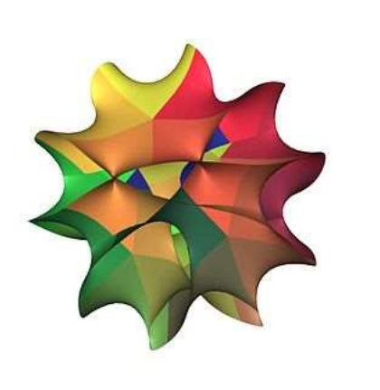

# Calabi-Yau manifold

In algebraic and differential geometry, a Calabi-Yau manifold, also known as a Calabi-Yau space, is a particular type of manifold which has certain properties, such as Ricci flatness, yielding applications in theoretical physics. Particularly in superstring theory, the extra dimensions of spacetime are sometimes conjectured to take the form of a 6dimensional Calabi-Yau manifold, which led to the idea of mirror symmetry. Their name was coined by Candelas et al. (1985), after Eugenio Calabi (1954, 1957), who first conjectured that such surfaces might exist, and Shing-Tung Yau (1978), who proved the Calabi conjecture.

Calabi-Yau manifolds are complex manifolds that are generalizations of K3 surfaces in any number of complex dimensions (i.e. any even number of real dimensions). They

A 2D slice of a 6D Calabi-Yau quintic manifold.

were originally defined as compact Kähler manifolds with a vanishing first Chern class and a Ricciflat metric, though many other similar but inequivalent definitions are sometimes used.

# Definitions

The motivational definition given by Shing-Tung Yau is of a compact Kähler manifold with a vanishing first Chern class, that is also Ricci flat.[1]

There are many other definitions of a Calabi-Yau manifold used by different authors, some inequivalent. This section summarizes some of the more common definitions and the relations between them.

A Calabi-Yau n-fold or Calabi-Yau manifold of (complex) dimension n is sometimes defined as a compact n-dimensional Kähler manifold M satisfying one of the following equivalent conditions:

- The canonical bundle of M is trivial.
- = M has a holomorphic n-form that vanishes nowhere.
- · The structure group of the tangent bundle of M can be reduced from U(m), the unitary group, to SU(n), the special unitary group.
- = M has a Kähler metric with global holonomy contained in SU(n).

These conditions imply that the first integral Chern class c1 (M) of M vanishes. Nevertheless, the converse is not true. The simples where this happens are hyperelliptic surfaces, finite quotients of a complex torus of complex dimension 2, which have vanishing first integral Chern class but non-trivial canonical bundle.

For a compact n-dimensional Kähler manifold M the following conditions are equivalent to each other, but are weaker than the conditions above, though they are sometimes used as the definition of a Calabi-Yau manifold:

- · M has vanishing first real Chern class.
- · M has a Kähler metric with vanishing Ricci curvature.
- = M has a Kähler metric with local holonomy contained in SU (m).
- · A positive power of the canonical bundle of M is trivial.
- · M has a finite cover that has trivial canonical bundle.
- IM has a finite cover that is a product of a torus and a simply connected manifold with trivial canonical bundle.

If a compact Kähler manifold is simply connected, then the weak definition above is equivalent to the stronger definition. Enriques surfaces give examples manifolds that have Ricci-flat metrics, but their canonical bundles are not trivial, so they are Calabi-Yau manifolds according to the second but not the first definition above. On the other hand, their double covers are Calabi-Yau manifolds for both definitions (in fact, K3 surfaces).

By far the hardest part of proving the equivalences between the various properties above is proving the existence of Ricci-flat metrics. This follows from Yau's proof of the Calabi conjecture, which implies that a compact Kähler manifold with a vanishing first real Chern class has a Kähler metric in the same class with vanishing Ricci curvature. (The class of a Kähler metric is the cohomology class of its associated 2-form.) Calabi showed such a metric is unique.

There are many other inequivalent definitions of Calabi-Yau manifolds that are sometimes used, which differ in the following ways (among others):

- The first Chern class may vanish as an integral class or as a real class.
- Most definitions assert that Calabi-Yau manifolds are compact, but some allow them to be non-compact. In the generalization to non-compact manifolds, the difference (Ω Λ Ω — ω 7/7/Ί) must vanish asymptotically. Here, w is the Kähler form associated with the Kähler metric, g
- · Some definitions put restrictions on the fundamental group of a Calabi-Yau manifold, such as demanding that it be finite or trivial. Any Calabi-Yau manifold has a finite cover that is the product of a torus and a simply-connected Calabi-Yau manifold.
- Some definitions require that the holonomy be exactly equal to SU(m) rather than a subgroup of it, which implies that the Hodge numbers 1,40 vanish for 0 < i < dim(M). Abelian surfaces have a Ricci flat metric with holonomy strictly smaller than SU(2) (in fact trivial) so are not Calabi-Yau manifolds according to such definitions.
- Most definitions assume that a Calabi-Yau manifold has a Riemannian metric, but some treat them as complex manifolds without a metric.
- · Most definitions assume the manifold is non-singular, but some allow mild singularities. While the Chern class fails to be well-defined for singular Calabi-Yau's, the canonical bundle and canonical class may still be defined if all the singularities are Gorenstein, and so may be used to extend the definition of a smooth Calabi-Yau manifold to a possibly singular Calabi-Yau variety.

### Examples

The fundamental fact is that any smooth algebraic variety embedded in a projective space is a Kähler manifold, because there is a natural Fubini-Study metric on a projective space which one can restrict to the algebraic variety. By definition, if ω is the Kähler metric on the algebraic variety X and the canonical bundle Kx is trivial, then X is Calabi-Yau. Moreover, there is unique Kähler metric ω on X such that [ως] = [ω] ∈ H2(X,R), a fact which was conjectured by Eugenio Calabi and proved by Shing-Tung Yau (see Calabi conjecture).

### Calabi-Yau algebraic curves

In one complex dimension, the only compact examples are tori, which form a one-parameter family. The Ricci-flat metric on a torus is actually a flat the holonomy is the trivial group SU(1). A one-dimensional Calabi-Yau manifold is a complex elliptic curve, and in particular, algebraic.

### CY algebraic surfaces

In two complex dimensions, the K3 surfaces furnish the only compact simply connected Calabi-Yau manifolds. These can be constructed as quartic surfaces in P8, such as the complex algebraic variety defined by the vanishing locus of

$$x\_0^4 + x\_1^4 + x\_2^4 + x\_3^4 = 0 \text{ for } [x\_0 : x\_1 : x\_2 : x\_3] \in \mathbb{P}^3$$

Other examples can be constructed as elliptic fibrations, 31 as quotients of abelian surfaces, 14 or as complete intersections.

Non simply-connected examples are given by abelian surfaces, which are real four tori Tª equipped with a complex manifold structure. Enriques surfaces and hyperelliptic surfaces have first Chern class that vanishes as an element of the real cohomology group, but not as an element of the integral cohomology group, so Yau's theorem about the existence of a Ricci-flat metric still applies to them but they are sometimes not considered to be Calabi-Yau manifolds. Abelian surfaces are sometimes excluded from the classification of being Calabi-Yau, as their holonomy (again the trivial group) is a proper subgroup of SU(2), instead of being isomorphic to SU(2). However, the Enriques surface subset do not conform entirely to the SU(2) subgroup in the String theory landscape.

### CY threefolds

In three complex dimensions, classification of the possible Calabi-Yau manifolds is an open problem, although Yau suspects that there is a finite number of families (albeit a much bigger number than his estimate from 20 years ago). In turn, it has also been conjectured by Miles Reid that the number of topological types of Calabi-Yau 3-folds is infinite, and that they can all be transformed continuously ( through certain mild singularizations such as conifolds) one into another-much as Riemann surfaces can.[5] One example of a three-dimensional Calabi-Yau manifold is a non-singular quintic threefold in CP4, which is the algebraic variety consisting of all of the zeros of a homogeneous quintic polynomial in the homogeneous coordinates of the CP4. Another example is a smooth model of the Barth-Nieto quintic. Some discrete quotients of the quintic by various Z, actions are also Calabi-Yau and have received a lot of attention in the literature. One of these is related to the original quintic by mirror symmetry.

For every positive integer n, the zero set, in the homogeneous coordinates of the complex projective space CP™+, of a non-singular homogeneous degree n + 2 polynomial in n + 2 variables is a compact Calabi-Yau n-fold. The case n = 1 describes an elliptic curve, while for n = 2 one obtains a K3 surface.

More generally, Calabi-Yau varieties/orbifolds can be found as weighted complete intersections in a weighted projective space. The main tool for finding such spaces is the adjunction formula.

All hyper-Kähler manifolds are Calabi-Yau manifolds.

### Constructed from algebraic curves

For an algebraic curve C a quasi-projective Calabi-Yau threefold can be constructed as the total space V = Tot(L1 O L2) where L1 ® L2 = Wc. For the canonical projection p : V -> C we can find the relative tangent bundle TV/C is p\* (L1 + L2) using the relative tangent sequence

$$\mathbf{0} \to T\_{\mathbf{V}/\mathcal{O}} \to T\_{\mathbf{V}} \to p^\* T\_{\mathcal{O}} \to \mathbf{0}$$

and observing the only tangent vectors in the fiber which are not in the pre-image of p\*Tr are canonically associated with the fibers of the vector bundle. Using this, we can use the relative cotangent sequence

$$\mathbf{0} \to p^\*\Omega\_{\mathcal{C}} \to \Omega\_V \to \Omega\_{V/\mathcal{C}} \to \mathbf{0}$$

together with the properties of wedge powers that

$$
\omega\_V = \bigwedge^\mathfrak{a} \Omega\_V \cong f^\*\omega\_{\mathcal{O}} \otimes \bigwedge^\mathfrak{a} \Omega\_{V/\mathcal{O}}.
$$

and Sty (c = Lt + L2 giving the triviality of wy .

### Constructed from algebraic surfaces

Using a similar argument as for curves, the total space Tot(دو) of the canonical sheaf سو for an algebraic surface S forms a Calabi-Yau threefold. A simple example is Tot(Cop(-3)) over projective space.

# Applications in superstring theory

Calabi-Yau manifolds are important in superstring theory. Essentially, Calabi-Yau manifolds are shapes that satisfy the requirement of space for the six "unseen" spatial dimensions of string theory, which may be smaller than our currently observable lengths as they have not yet been detected. A popular alternative known as large extra dimensions, which often occurs in braneworld models, is that the Calabi-Yau is large but we are confined to a small subset on which it intersects a D-brane. Further extensions into higher dimensions are currently being explored with additional ramifications for general relativity.

#### Calabi-Yau manifold - Wikipedia

In the most conventional superstring models, ten conjectural dimensions in string theory are supposed to come as four of which we are aware, carrying some kind of fibration with fiber dimension six. Compactification on Calabi-Yau n-folds are important because they leave some of the original supersymmetry unbroken. More precisely, in the absence of fluxes, compactification on a Calabi-Yau 3-fold (real dimension 6) leaves one quarter of the original supersymmetry unbroken if the holonomy is the full SU(3).

More generally, a flux-free compactification on an n-manifold with holonomy SU(n) leaves 2-" of the original supersymmetry unbroken, corresponding to 200" supercharges in a compactification of type IIA supergravity or 25-11 supercharges in a compactification of type I. When fluxes are included the supersymmetry condition instead implies that the compactification manifold be a generalized Calabi-Yau, a notion introduced by Hitchin (2003). These models are known as flux compactifications.

F-theory compactifications on various Calabi-Yau four-folds provide physicists with a method to find a large number of classical solutions in the so-called string theory landscape.

Connected with each hole in the Calabi-Yau space is a group of low-energy string vibrational patterns. Since string theory states that our familiar elementary particles correspond to low-energy string vibrations, the presence of multiple holes causes the string patterns to fall into multiple groups, or families. Although the following statement has been simplified, it conveys the logic of the argument: if the Calabi-Yau has three holes, then three families of vibrational patterns and thus three families of particles will be observed experimentally.

Logically, since strings vibrate through all the dimensions, the shape of the curled-up ones will affect their vibrations and thus the properties of the elementary particles observed. For example, Andrew Strominger and Edward Witten have shown that the masses of particles depend on the manner of the intersection of the various holes in a Calabi-Yau. In other words, the positions of the holes relative to one another and to the substance of the Calabi-Yau space was found by Strominger and Witten to affect the masses of particles in a certain way. This is true of all particle properties. Z

# Calabi-Yau algebra

A Calabi-Yau algebra was introduced by Victor Ginzburg to transport the geometry of a Calabi-Yau manifold to noncommutative algebraic geometry.[8][9]

# In popular culture

- The Calabi-Yau manifold was the subject of a paper coauthored by Sheldon Cooper in the episode 2 of the seventh season in Young Sheldon.
- Imagery based on Calabi-Yau manifolds was used in episode 5 of the TV series 3 Body Problem in order to illustrate the high-dimensional abilities of the San-Ti alien civilization.
- In Half-Life 2, Dr. Mossman describes teleporters as working via a 'String-based' technology using 'the Calabi-Yau model.'

### See also

- = Quintic threefold
- G2 manifold

### References

- 1. Yau & Nadis (2010).
- 2. Tian & Yau (1991).
- 3. Propp, Oron Y. (2019-05-22). "Constructing explicit K3 spectra". p. 4. arXiv:1810.08953 (https:// arxiv.org/abs/1810.08953) [math.AT (https://arxiv.org/archive/math.AT)].
- 4. Szymik, Markus (2020-02-12). "K3 spectra". Bulletin of the London Mathematical Society. 42: 137–148. arXiv:2002.04879 (https://arxiv.org/abs/2002.04879), doi:10.1112/blms/bdp106 (http s://doi.org/10.1112%2Fblms%2Fbdp106). S2CID 1070427 (https://api.semanticscholar.org/Cor pusID:1070427).
- 5. Reid, Miles (1987). "The Moduli space of 3-folds with K = 0 may nevertheless be irreducible". Mathematische Annalen. 278 (1–4): 329–334. doi:10.1007/bf01458074 (https://doi.org/10.100 7%2Fbf01458074). S2CID 120390363 (https://api.semanticscholar.org/CorpusID:120390363).
- 6. Szendroi, Balazs (2016-04-27). "Cohomological Donaldson-Thomas theory". arXiv:1503.07349 (https://arxiv.org/abs/1503.07349) [math.AG (https://arxiv.org/archive/math.AG)].
- 7. "The Shape of Curled-Up Dimensions" (https://web.archive.org/web/20060913014709/libr ary.thinkquest.org/27930/stringtheory5.htm). Archived from the original (http://library.thinkquest. org/27930/stringtheory5.htm) on September 13, 2006.
- 8. Ginzburg, Victor (2007). "Calabi-Yau algebras". arXiv:math/0612139 (https://arxiv.org/abs/mat h/0612139).
- 9. Schedler, Travis (2019). "Deformations of algebras in noncommutative geometry". arXiv:1212.0914 (https://arxiv.org/abs/1212.0914) [math.RA (https://arxiv.org/archive/math.R A)].
- Calabi, Eugenio (1954), "The space of Kähler metrics" (https://web.archive.org/web/201107171 44747/http://mathunion.org/ICM/ICM1954.2/), Proc. Internat. Congress Math. Amsterdam, vol. 2, pp. 206-207, archived from the original (http://mathunion.org/lCM/lCM1954.2/) on 2011-07-17
- Calabi, Eugenio (1957), "On Kähler manifolds with vanishing canonical class", in Fox, Ralph H .; Spencer, Donald C .; Tucker, Albert W. (eds.), Algebraic geometry and topology. A symposium in honor of S. Lefschetz (https://books.google.com/books?id=n ZQAAAAMAAJ), Princeton Mathematical Series, vol. 12, Princeton University Press, pp. 78-89, ISBN 9780691079073, MR 0085583 (https://mathscinet.ams.org/mathscinet-getitem?mr=0085 283)
- Candelas, Philip; Horowitz, Gary; Strominger, Andrew; Witten, Edward (1985), "Vacuum configurations for superstrings" (https://archive.today/20121220035310/http://www-lib.kek.jp/cg i-bin/img index?8504007), Nuclear Physics B, 258: 46-74, Bibcode:1985NuPhB.258...46C (htt ps://ui.adsabs.harvard.edu/abs/1985NuPhB.258...46C), doi:10.1016/0550-3213(85)90602-9 (ht tps://doi.org/10.1016%2F0550-3213%2885%2990602-9), archived from the original (http://ww w-lib.kek.jp/cgi-bin/img index?8504007) on December 20, 2012
- = Hitchin, Nigel (2003), "Generalized Calabi-Yau manifolds", The Quarterly Journal of Mathematics, 54 (3): 281-308, arXiv:math.DG/0209099 (https://arxiv.org/abs/math.DG/020909 9), CiteSeerX 10.1.1.237.8935 (https://citeseerx.ist.psu.edu/viewdoc/summary?doi=10.1.1.237. 8935), doi:10.1093/qmath/hag025 (https://doi.org/10.1093%2Fqmath%2Fhag025), MR 2013140 (https://mathscinet.ams.org/mathscinet-getitem?mr=2013140)
- Tian, Gang; Yau, Shing-Tung (1991), "Complete Kähler manifolds with zero Ricci curvature, II", Invent. Math., 106 (1): 27-60, Bibcode:1991InMat.106...27T (https://ui.adsabs.harvard.edu/ab

s/1991InMat.106...27T), doi:10.1007/BF01243902 (https://doi.org/10.1007%2FBF01243902), S2CID 122638262 (https://api.semanticscholar.org/CorpusID:122638262)

- Yau, Shing Tung (1978), "On the Ricci curvature of a compact Kähler manifold and the complex Monge-Ampère equation. I", Communications on Pure and Applied Mathematics, 31 (3): 339-411, doi:10.1002/cpa.3160310304 (https://doi.org/10.1002%2Fcpa.3160310304), MR 0480350 (https://mathscinet.ams.org/mathscinet-getitem?mr=0480350)
- Yau, Shing-Tung (2009a), "A survey of Calabi-Yau manifolds", Geometry, analysis, and algebraic geometry: forty years of the Journal of Differential Geometry, Surveys in Differential Geometry, vol. 13, Somerville, Massachusetts: Int. Press, pp. 277-318, doi:10.4310/SDG.2008.v13.n1.a9 (https://doi.org/10.4310%2FSDG.2008.v13.n1.a9), MR 2537089 (https://mathscinet.ams.org/mathscinet-getitem?mr=2537089)
- Yau, Shing-Tung; Nadis, Steve (2010), The Shape of Inner Space, Basic Books, ISBN 978-0-465-02023-2

# Further reading

- Besse, Arthur L. (1987), Einstein manifolds, Ergebnisse der Mathematik und ihrer Grenzgebiete (3), vol. 10, Berlin, New York: Springer-Verlag, ISBN 978-3-540-15279-8, OCLC 13793300 (https://search.worldcat.org/oclc/13793300)
- Bini; lacono (2016), Diffeomorphism Classes of Calabi-Yau Varieties (http://www.seminariomat ematico.unito.it/rendiconti/73-12/9.pdf) (PDF), arXiv:1612.04311 (https://arxiv.org/abs/1612.043 11), Bibcode:2016arXiv161204311B (https://ui.adsabs.harvard.edu/abs/2016arXiv161204311B)
- Chan, Yat-Ming (2004), Desinqularizations of Calabi-Yau 3-folds with a conical singularity, arXiv:math/0410260 (https://arxiv.org/abs/math/0410260), Bibcode:2004math.....10260C (http s://ui.adsabs.harvard.edu/abs/2004math......10260C)
- · Greene, Brian (1997), String theory on Calabi-Yau manifolds, Fields, strings and duality (Boulder, CO, 1996), River Edge, NJ: World Sci. Publ., pp. 543-726, arXiv:hep-th/9702155v1 (https://arxiv.org/abs/hep-th/9702155v1), Bibcode:1997hep.th....2155G (https://ui.adsabs.harva rd.edu/abs/1997hep.th....2155G), MR 1479700 (https://mathscinet.ams.org/mathscinet-getite m?mr=1479700)
- Gross, M.; Huybrechts, D.; Joyce, Dominic (2003), Calabi-Yau manifolds and related geometries, Universitext, Berlin, New York: Springer-Verlag, doi:10.1007/978-3-642-19004-9 (h ttps://doi.org/10.1007%2F978-3-642-19004-9), ISBN 978-3-540-44059-8, MR 1963559 (https:// mathscinet.ams.org/mathscinet-getitem?mr=1963559), OCLC 50695398 (https://search.worldc at.org/oclc/50695398)
- He, Yang-Hu (2021), The Calabi-Yau Landscape: From Geometry, to Physics, to Machine Learning, Switzerland: Springer International Publishing, ISBN 978-3-030-77562-9
- Hübsch, Tristan (1994), Calabi→Yau Manifolds: a Bestiary for Physicists (https://web.archive.or g/web/20100113083908/http://worldscibooks.com/physics/1410.html), Singapore, New York: World Scientific, ISBN 978-981-02-1927-7, OCLC 34989218 (https://search.worldcat.org/oc/3 4989218), archived from the original (http://www.worldscibooks.com/physics/1410.html) on 2010-01-13, retrieved 2009-02-04
- Joyce, Dominic (2000), Compact Manifolds with Special Holonomy, Oxford University Press, ISBN 978-0-19-850601-0, OCLC 43864470 (https://search.worldcat.org/oclc/43864470)
- Tian, Gang; Yau, Shing-Tung (1990), "Complete Kähler manifolds with zero Ricci curvature, I", J. Amer. Math. Soc., 3 (3): 579-609, doi:10.2307/1990928 (https://doi.org/10.2307%2F199092 8), JSTOR 1990928 (https://www.jstor.org/stable/1990928)
- = Yau, S. T. (2009b), "Calabi-Yau manifold", Scholarpedia, 4 (8): 6524, Bibcode:2009SchpJ...4.6524Y (https://ui.adsabs.harvard.edu/abs/2009SchpJ...4.6524Y), doi:10.4249/scholarpedia.6524 (https://doi.org/10.4249%2Fscholarpedia.6524) (similar to (Yau 2009a))

# External links

- Calabi-Yau Homepage (http://www.th.physik.uni-bonn.de/th/Supplements/cy.html) is an interactive reference which describes many examples and classes of Calabi-Yau manifolds and also the physical theories in which they appear.
- Spinning Calabi-Yau Space video. (http://members.wri.com/jeffb/visualization/stringtheory2.sht ml)
- Calabi-Yau Space (http://demonstrations.wolfram.com/CalabiYauSpace/) by Andrew J. Hanson with additional contributions by Jeff Bryant, Wolfram Demonstrations Project.
- Weisstein, Eric W. "Calabi-Yau Space" (https://mathworld.wolfram.com/Calabi-YauSpace.htm l). MathWorld.

### Beginner articles

- An overview of Calabi-Yau Elliptic fibrations (https://indico.cern.ch/event/927781/contributions/ 3926290/attachments/2101500/3533039/Anderson\_CY\_Review.pdf)
- Lectures on the Calabi-Yau Landscape
- = Fibrations in CICY Threefolds (complete intersection Calabi-Yau)

Retrieved from "https://en.wikipedia.org/w/index.php?title=Calabi=Yau\_manifold&oldid=1271105723"