Published for SISSA by Springer

Received: November 7, 2016 Accepted: December 22, 2016 Published: January 3, 2017

# Looking for a bulk point

Juan Maldacena,a David Simmons-Duffina and Alexander Zhiboedovb

aSchool of Natural Sciences, Institute for Advanced Study,

1 Einstein Drive, Princeton, NJ 08540, U.S.A.

bCenter for the Fundamental Laws of Nature, Harvard University,

17 Oxford Street, Cambridge, MA 02138, U.S.A.

E-mail: [malda@ias.edu](mailto:malda@ias.edu), [davidsd@gmail.com](mailto:davidsd@gmail.com), [alezhiboedov@gmail.com](mailto:alezhiboedov@gmail.com)

Abstract: We consider Lorentzian correlators of local operators. In perturbation theory, singularities occur when we can draw a position-space Landau diagram with null lines. In theories with gravity duals, we can also draw Landau diagrams in the bulk. We argue that certain singularities can arise only from bulk diagrams, not from boundary diagrams. As has been previously observed, these singularities are a clear diagnostic of bulk locality. We analyze some properties of these perturbative singularities and discuss their relation to the OPE and the dimensions of double-trace operators. In the exact nonperturbative theory, we expect no singularity at these locations. We prove this statement in 1+1 dimensions by CFT methods.

Keywords: AdS-CFT Correspondence, Conformal Field Theory, Classical Theories of Gravity, Scattering Amplitudes

ArXiv ePrint: [1509.03612](https://arxiv.org/abs/1509.03612)

# Contents

| 1 | Introduction                                                                                |        |  |  |
|---|---------------------------------------------------------------------------------------------|--------|--|--|
| 2 | Singularities of perturbative correlation functions 2.1 A four-point function example | 2 2 |  |  |
|   | 2.2 General conditions for singularities of correlators in local quantum field the       |        |  |  |
|   | ories                                                                                       | 4      |  |  |
|   | 2.3 From Minkowski space to the cylinder                                                 | 6      |  |  |
|   | 2.4 Applications to symbology                                                            | 6      |  |  |
| 3 | Bulk versus boundary singularities                                                          | 7      |  |  |
|   | 3.1 Bulk-point singularities from a local bulk                                           | 7      |  |  |
|   | 3.2 Landau diagrams in 1+1 dimensions                                                    | 10     |  |  |
|   | 3.3 Landau diagrams in 2+1 dimensions                                                    | 11     |  |  |
|   | 3.4 Landau diagrams in d ≥ 4                                                             | 12     |  |  |
| 4 | Singularities beyond perturbation theory                                                    | 12     |  |  |
|   | 4.1 Stringy corrections                                                                  | 12     |  |  |
|   | 4.2 Instanton corrections                                                                | 14     |  |  |
|   | 4.3 General argument for the position dependence of one-instanton corrections            | 16     |  |  |
|   | 4.4 Exact answer                                                                         | 16     |  |  |
|   | 4.5 Summary                                                                              | 17     |  |  |
| 5 | Singularities of the four-point function                                                    | 18     |  |  |
| 6 | Approaching singularities using the OPE                                                     | 21     |  |  |
|   | 6.1 A simple bound on the bulk-point singularity                                         | 22     |  |  |
|   | 6.2 Origin of the singularity from the dimensions of operators in the OPE                | 24     |  |  |
|   | 6.3 The Regge limit and the bound on chaos                                               | 27     |  |  |
| 7 | Singularities in 1+1-dimensional theories                                                   | 28     |  |  |
|   | 7.1 All Lorentzian singularities in d = 2                                                | 32     |  |  |
|   | 7.2 Other analytic continuations                                                         | 34     |  |  |
| 8 | Conclusions                                                                                 |        |  |  |
| A | Bounds on higher derivative interactions                                                    |        |  |  |
| B | Limits of conformal blocks and MFT OPE coefficients                                         |        |  |  |
| C | 3 R S A Landau diagram on ×                                                     | 40     |  |  |

| J H E |
|-------------|
| P           |
| 0           |
| 1           |
| (           |
| 2           |
| 0           |
| 1           |
| 7           |
| )           |
| 0           |
| 1           |
| 3           |

| D | Transformation to the pillow metric |                                               | 40 |  |
|---|-------------------------------------|-----------------------------------------------|----|--|
|   | D.1                                 | Rescaling of local operators at branch points | 41 |  |
|   | D.2                                 | The Weyl anomaly                              | 42 |  |
|   | D.3                                 | Putting everything together                   | 44 |  |
|   |                                     |                                               |    |  |

# 1 Introduction

In Euclidean signature, correlators of local operators are analytic for non-coincident points. However in Lorentzian signature, singularities can arise when "something happens." These Lorentzian singularities correspond, in weakly coupled theories, to Landau diagrams consisting of a set of null particles interacting at local vertices in an energy-momentum conserving fashion. We will derive these rules for a generic perturbative quantum field theory (see also [\[1](#page-45-1)[–6](#page-46-0)]).[1](#page-2-1)

In theories that have gravity duals, singularities can arise from Landau diagrams in the bulk. In some cases, these occur at positions where there is no Landau diagram on the boundary [\[9](#page-46-1)[–13](#page-46-2)]. Such singularities are a probe of bulk locality. We call them "bulk-point singularities." We will display examples in 1+1 and 2+1 dimensions.

The emergence of the bulk is intimately related to the development of these singularities as the boundary theory becomes strongly coupled. In this paper we analyze some properties of bulk-point singularities, but we do not give a satisfactory explanation for their emergence. There were several previous studies of these interesting singularities including [\[9](#page-46-1)[–13\]](#page-46-2). Some articles (see e.g. [\[10](#page-46-3), [11\]](#page-46-4)) assumed the singularity is present and showed how it could be used to extract the flat space scattering amplitude. We are simply adding a few comments to those previous papers.

We first review the origin of bulk-point singularities using the local bulk theory. We argue that finite α ′ effects remove the singularity [\[13\]](#page-46-2). We then comment that D-instanton effects are again singular at this location. Finally, we expect that at finite GN this singularity should not be present since, in some sense, there was no bulk point to start with in the boundary theory.

In 1+1 dimensions, using general CFT arguments, we show explicitly that the singularity is not present in the exact answer. The only singularities of the four-point function are the light-cone singularities.

This paper is organized as follows. In section 2, we derive the position-space Landau rules for correlators. These are analogous to the well-known momentum-space Landau rules [\[1](#page-45-1)[–3](#page-46-5)]. In section 3, we consider singularities arising from a local bulk. We argue that these singularities do not arise from boundary Landau diagrams in 1+1 and 2+1 dimensions. In section 4, we consider stringy and instanton corrections to the gravity formulas, and then we discuss some aspects of the exact answer. In section 5, we discuss

1For a discussion of analytic properties of correlation functions of local operators in a generic QFT see [\[7](#page-46-6)], the case of a CFT is considered in [\[8\]](#page-46-7).

the singularities of the four-point function in d > 2 and discuss how there can be both a bulk UV and IR contribution to the singularity. In section 6, we review the relation between the singularity and the OPE expansion, clarifying the applicability of the OPE for this analysis and also for the Regge limit. In section 7, for 1+1 dimensional CFTs, we prove that there are no bulk-point singularities in the exact answer. In appendix A, we prove a bound on the coefficients of the low energy expansion of a causal flat-space tree level four-point scattering amplitude. Other appendices give more details on the discussion in the main body.

### 2 Singularities of perturbative correlation functions

Let us consider a weak coupling expansion of a local quantum field theory. We study timeordered correlation functions of local operators. At each order in perturbation theory, these are functions of the spacetime positions of the operators. In this section, we describe their possible singularities. In other words, we have

$$
\langle O(x\_1) \cdots O(x\_n) \rangle = \sum\_k g^k F\_k(x\_1, \cdots, x\_n),
\tag{2.1}
$$

and we want to find the spacetime locations where Fk has singular behavior. Previous discussion of this topic includes [\[4](#page-46-8)[–6\]](#page-46-0).

There is a conceptually similar problem involving the singularities of perturbative scattering amplitudes, viewed as functions of the momenta. In that case, the singularities are at locations where one can draw a Landau diagram [\[1](#page-45-1)[–3\]](#page-46-5). For correlation functions, the situation is similar, and the singularities are at the momenta where one can draw a position-space Landau diagram with on-shell massless particles interacting at local vertices with momentum conserved at the vertices. In this section, we derive this rule. First we consider a simple example.

#### 2.1 A four-point function example

Consider a massless field φ in four dimensions with an interaction R d 4xλφ4 . The leading order correction to the four-point function is given by the integral

$$<\langle \phi(x\_1) \cdots \phi(x\_4) \rangle \propto \lambda I, \qquad \qquad I \equiv \int d^4 w \frac{1}{\prod\_{i=1}^4 [(w - x\_i)^2 + i\varepsilon]}, \tag{2.2}$$

$$I = -\frac{2\pi^2 iz\bar{z}}{x\_{12}^2 x\_{34}^2} \left[ \frac{2\text{Li}\_2(z) - 2\text{Li}\_2(\bar{z}) + \log(z\bar{z})\log\left(\frac{1-z}{1-\bar{z}}\right)}{z - \bar{z}} \right],\tag{2.3}$$

$$u = \frac{x\_{12}^2 x\_{34}^2}{x\_{13}^2 x\_{24}^2} = z \bar{z}, \qquad \qquad v = \frac{x\_{14}^2 x\_{23}^2}{x\_{13}^2 x\_{24}^2} = (1 - z)(1 - \bar{z}). \tag{2.4}$$

The last line defines the variables z and ¯z. In Euclidean space ¯z = z ∗ , and the only possible singularities arise when points coincide, at z = ¯z = 0, 1, ∞. In particular, there is no singularity when z = ¯z for generic z since the numerator in [\(2.3\)](#page-3-2) has a zero at that location. Now we can move to Lorentzian signature, where z and ¯z become independent real variables. We have a singularity when z = 0, with any ¯z. These are the light-cone

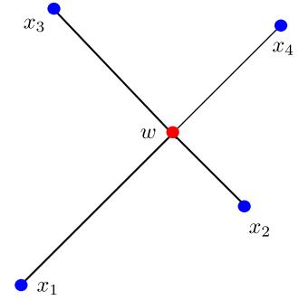

Figure 1. Landau diagram for the four-point function. There is a point w null separated from the insertion points of the operators. We can put physical massless particles along these null lines so that momentum is conserved at the vertex.

singularities, arising when two points are lightlike separated. We can continue past this singularity by using the appropriate iε prescription. Now some of the points are timelike separated and some are spacelike separated. In this regime, we might encounter new singularities. In our example, this occurs when z = ¯z. What has happened is that we have analytically continued [\(2.3\)](#page-3-2), going through branch points such that when we set z = ¯z the numerator no longer cancels the denominator.

Let us see this more explicitly. We choose

$$\begin{aligned} x\_1 &= (-t, 0, 1, 0), & x\_2 &= (-t, 0, -1, 0), & x\_3 &= (t, 1, 0, 0), & x\_4 &= (t, -1, 0, 0) \\ \frac{1}{z} &= \frac{1}{2} + \sqrt{t^2(1 - t^2)}, & \frac{1}{\bar{z}} &= \frac{1}{2} - \sqrt{t^2(1 - t^2)}. \end{aligned} \tag{2.5}$$

The iε prescription corresponds to setting t = −iε + et with real et in these formulas. As we change et from zero to one, we go from the Euclidean region to the Lorentzian region described above. In doing so, z goes around the branch point at z = 1, while ¯z goes around z¯ = ∞. Therefore, when we return to 1 z = 1 z¯ = 1/2, at t = 1, we pick up a contribution from going to the other branches in [\(2.3\)](#page-3-2), and now the numerator no longer vanishes when z = ¯z. Namely, the term in brackets in [\(2.3\)](#page-3-2) becomes (2π) 2 z−z¯ plus terms that are regular at z = ¯z.

It is actually not necessary to know the explicit answer to find the singularity. One can start with the original integral [\(2.2\)](#page-3-2). In Lorentzian signature, the iε prescription completely defines the integral by stating how we should pick the integration contour. A singularity can only arise if we cannot deform the contour to avoid zeros in the denominator of the integrand in [\(2.2\)](#page-3-2). That is, singularities arise when

$$(x\_a - w\_0)^2 = 0, \quad a = 1, \dots, 4,\tag{2.6}$$

and we cannot deform the w integral away from w0. If the w integral can be deformed by shifting w µ → w µ + ivµ so that

$$(x\_a^{\mu} - w\_0^{\mu})v^{\mu} > 0,\qquad \text{ for all } a,\tag{2.7}$$

then there is no singularity, despite [\(2.6\)](#page-4-0). This is expected to be the generic situation, since it is generically possible to solve the four equations [\(2.6\)](#page-4-0) for four variables. The singularity can be present only when we fail to find a v µ obeying [\(2.7\)](#page-4-1), which happens if and only if the following condition holds: there exist four numbers αa, such that

$$\sum\_{a=1}^{4} \alpha\_a (x\_a^{\mu} - w\_0^{\mu}) = 0, \qquad \qquad \alpha\_a \ge 0, \qquad \text{not all } \alpha\_a \text{ zero.} \tag{2.8}$$

It is clear that if [\(2.8\)](#page-5-1) holds then [\(2.7\)](#page-4-1) cannot hold, since we can simply multiply [\(2.8\)](#page-5-1) by v µ to find an inconsistency. It is also true that if it is not possible to solve [\(2.7\)](#page-4-1) then it is possible to solve [\(2.8\)](#page-5-1) (we present the argument in the next subsection).

The conclusion is that the singularity is present when both [\(2.6\)](#page-4-0) and [\(2.8\)](#page-5-1) hold. The first could hold for generic xa but the second can only hold for special cases, since, in particular, it requires that det (x µ a −w µ 0 ) = 0, which imposes one more condition beyond [\(2.6\)](#page-4-0). This can be interpreted as follows. We are demanding that there exists a point w0 such that we can send on-shell massless particles from the position of the operators, xa, with momenta k µ a = αa(x µ a −w µ 0 ) so that momentum is conserved at the point w0. The positivity of αi ensures that the energies are all positive. We call such a configuration a position-space Landau diagram. A Landau diagram is like a Feynman diagram, except that the lines are all null, and we can associate null momenta to all the lines so that they obey momentum conservation at the vertices.[2](#page-5-2)

After this introductory case, let us consider a general case.

# 2.2 General conditions for singularities of correlators in local quantum field theories

We consider a time-ordered Lorentzian correlation function in a perturbative field theory. The theory can be massive or massless. It can be in any dimension. We will analyze the location of possible singularities at a given order in perturbation theory. Some fourdimensional cases were considered previously in [\[4](#page-46-8)[–6\]](#page-46-0).

We consider a correlation function of local operators. At a fixed order in perturbation theory, we get an expression of the form

$$\langle O(x\_1)\cdots O(x\_n)\rangle = \sum\_k g^k \int \prod\_{a=1}^k d^d w\_a \langle L\_{\text{int}}(w\_1)\cdots L\_{\text{int}}(w\_k) O(x\_1)\cdots O(x\_n)\rangle,\tag{2.9}$$

where the interaction Lagrangian is a product of local fields. Therefore the integrand is given by a product of propagators. There can be derivatives acting on the propagators. We do not expect any singularity arising from infinity. This can be seen by deforming the integration contours into the Euclidean direction as soon as the integration variables are larger than the largest time appearing in the correlator. The propagators are functions of distances G(d 2 ij + iε), which are regular for positive values of the argument but have

2A momentum-space Landau diagram [\[1](#page-45-1)[–3\]](#page-46-5) is a momentum-space Feynman diagram, where we can assign positions to the vertices such that the difference in positions between two vertices joined by a line with momentum p µ is proportional to p µ with a positive coefficient. Here the momenta obey p 2 = −m2 , with possibly non-zero values of m2 .

a singularity when the argument is zero. This singularity can be a pole or a branch cut depending on the dimensionality and whether the field is massive or massless.

Let us lump all the integration variables into a big vector wM. We consider a region in the integration domain, centered on a wM 0 where any number of these distances is becoming zero

$$d\_{ij}^2(w\_0^M) = 0, \qquad \text{for} \quad i, j \in S,\tag{2.10}$$

where S is the set of distances that are zero. Now let us define

$$x\_{ij}^M = \left. \frac{\partial d\_{ij}^2}{\partial w^M} \right|(w\_0). \tag{2.11}$$

Next consider shifting the integration contour, which runs over real wM, to the imaginary region wM → wM + ivM. The distances change to d 2 ij + iε → d 2 ij + i(xM ij vM + ε). We can move away from the dangerous region if

$$\text{where exists a } \quad v^M \quad \text{such that} \quad \sum\_M x\_{ij}^M v^M > 0, \qquad \text{for} \quad i, j \in S. \tag{2.12}$$

If we can not do this, then we will have a pinch singularity, where the integration contour lies between two singularities that are approaching each other. In this case, the final correlator will generically be singular. (Of course, it is possible to have cancellations between different diagrams).

Now, let us denote the indices ij in S collectively by the letter J. Farkas' lemma states[3](#page-6-0) that either [\(2.12\)](#page-6-1) or the following is true:

$$\text{There exists } \alpha\_J \ge 0, \text{ not all } \alpha\_J \text{ zero}, \qquad \sum\_J \alpha\_J x\_J^M = \sum\_{ij \in S} \alpha\_{ij} x\_{ij}^M = 0. \tag{2.13}$$

In other words, when we can solve [\(2.13\)](#page-6-2), we have a singularity of the correlator. As in the previous subsection, the condition [\(2.13\)](#page-6-2) says that we can assign momenta to the null lines so that momentum is conserved.

We could make the formulas look more uniform by defining αij = 0 for all ij that are not in the set of distances, S. Then the conditions for a singularity are that we can solve

$$
\alpha\_{ij} d\_{ij}^2 = 0 \quad \text{(no sum)}, \qquad \sum\_{ij} \alpha\_{ij} x\_{ij}^M = 0, \qquad \alpha\_{ij} \ge 0 \quad \text{not all } \alpha\_{ij} \text{ zero.} \tag{2.14}
$$

Note that we have massless particles even in a massive theory because the singularity comes from the propagation of a very high energy particle. For such high energy particles, we can neglect the mass.

The conclusion is that the only possible singularities of perturbative Lorentzian correlators arise when we can draw a Landau diagram with on-shell massless particles that start from the external points and undergo collisions. We can assign a momentum along the direction of motion of each massless particle in such a way that momentum is conserved at the interaction points, but not at the external points.

3We thank N. Arkani-Hamed for pointing this out to us.

Landau's original equations are similar, but they are related to singularities of Feynman diagrams in momentum space [\[1\]](#page-45-1). In the case of momentum-space Feynman diagrams, the Landau diagrams also involve on-shell particles interacting at localized positions in an energy-momentum conserving fashion. But now they represent propagation for very long distances in spacetime, and their energy and momentum are finite. For this reason the masses do not drop out. The difference in position between two vertices connected by an on-shell line l with momentum p µ l is ∆x µ = αlp µ l . The condition that this defines a consistent set of positions is that P l αlp µ l = 0 for each loop. This is analogous to [\(2.13\)](#page-6-2).

If we consider a quantum field theory in curved space, the same reasoning tells us that we should consider massless geodesics in the curved spacetime with momentum locally conserved at each vertex, and redshifted appropriately when we go from one vertex to the next. We have not checked this explicitly.

#### 2.3 From Minkowski space to the cylinder

Notice that besides the momentum all other conformal charges are preserved at the interaction vertex. In order to see this, let us first introduce the angular momentum, dilatation, and special conformal charges for any classical massless particle as

$$J^{\mu\nu} = x^{\mu}p^{\nu} - x^{\nu}p^{\mu}, \qquad D = x^{\mu}p\_{\mu}, \qquad K^{\mu} = -2x^{\mu}x^{\nu}p\_{\nu} + x^{2}p^{\mu}. \tag{2.15}$$

Note that the fact that p 2 = 0 implies that we can evaluate x µ along any point on the trajectory. At a collision point, the fact that momentum is conserved implies that the charges in [\(2.15\)](#page-7-2) are conserved since the position x µ can be chosen as the interaction point for all of the particles coming to a given vertex.

Now let us consider a CFT and the same process on the cylinder, R × S d−1 . We can view the on-shell particles as living on the cylinder and impose that they preserve the natural charges on the cylinder, namely energy and angular momentum. These charges are a combination of the various conformal generators on the plane. Given that they are conserved on the plane, we will find that they are also conserved on the cylinder.

#### 2.4 Applications to symbology

In computations of perturbative correlators in scale-invariant theories, it has proven useful to introduce a "symbol" that captures some of the singularities of the integrals [\[14\]](#page-46-9). The symbol contains arguments that are functions of the kinematic invariants. The zeros of the functions appearing in the symbols should correspond to solutions of the Landau equations. This is due to the fact that such zeros represent branch point singularities of the answer as a function of the kinematic invariants. These branch points might appear only after analytically continuing the answer through some previous branch cuts. So, they are singularities of the analytically continued function. Since, a priori, we do not know whether such analytic continuation arises from going to Lorentzian signature or from a more formal operation,[4](#page-7-3) we can consider solutions of the Landau equations without insisting on the positivity (or reality) of the αij parameters (we still demand that they are not

4E.g., complexifying the coordinates or considering other orderings of the operators.

all zero). Similarly, we can also allow on-shell three-point vertices. On the other hand, solutions of the Landau equations could also appear as prefactors of the symbols or as zeros inside the symbol. In some computations, a guess has been made for the possible arguments of the symbol at a given order in perturbation theory (e.g. [\[15](#page-46-10)]). Here we are simply giving a guiding principle for what these arguments can be. Their zeros should correspond to solutions of the Landau equations. At a finite order in perturbation theory there is only a finite number of possible Landau graphs. These remarks suggest that it would be very interesting to find the explicit locations in kinematic space where Landau graphs are possible, but we will not attempt that here.

### 3 Bulk versus boundary singularities

We have seen that perturbative singularities of local QFTs correspond to Landau diagrams. This logic applies when either the boundary or the bulk is local and weakly coupled. In the next subsection, we give an example of a perturbative "bulk-point singularity" arising from a bulk Landau diagram. Subsequently, we show that this bulk-point singularity could never arise from perturbation theory on the boundary, at least in 1+1 and 2+1 dimensions. (This is not a contradiction because we do not expect the bulk to be local and perturbative simultaneously with the boundary.)

#### 3.1 Bulk-point singularities from a local bulk

Consider a d-dimensional CFT with an AdSd+1 dual. We view AdSd+1 as the universal cover of the hyperboloid in R 2,d given by

$$P^I P\_I = -(P^{-1})^2 - (P^0)^2 + \sum\_{I=1}^d (P^I)^2 = -1. \tag{3.1}$$

Consider a (d + 2)-point correlation function with generic boundary points given by null XI a ∈ R 2,d (a = 1, . . . , d + 2). The singularity we are interested in happens when x ≡ det XI a = 0. Notice that x = 0 defines a codimension-one subspace in the space of crossratios.

A null vector X representing a boundary point is defined modulo rescaling X ∼ λX, λ ∈ R +. Hence, x = det XI a itself is not a well-defined cross-ratio, but instead transforms with weight 1 under rescaling of each of the individual XI a 's. To define a cross-ratio, we can divide by appropriate factors to form a projective invariant, e.g.,

$$\hat{x} = \frac{x}{((-2X\_1 \cdot X\_2)(-2X\_2 \cdot X\_3)\cdots(-2X\_{d+2} \cdot X\_1))^{1/2}}.\tag{3.2}$$

Objects with nonzero weight appear throughout the discussion in this section, but physical results are always projective invariants. For d = 2, we have

$$\hat{x} = -\frac{z - \bar{z}}{4z(1 - z)} + O((z - \bar{z})^2) \tag{3.3}$$

so that x = 0 is the same as z − z¯ = 0, as described in section 2.1.

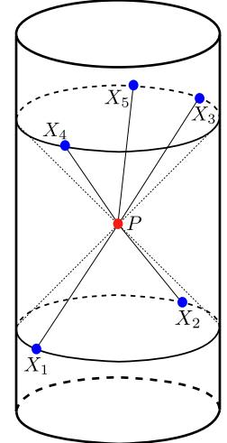

Figure 2. An example arrangement of boundary points that leads to a singularity. X1 and X2 are at time −π/2 on diametrically opposite sides of the Lorentzian cylinder. The remaining points X3, . . . , Xd+2 are at time π/2 and arranged at generic directions on S d . In this configuration, lightlike particles can propagate into the bulk from X1, X2, scatter at P, and propagate out to X3, . . . , Xd+2.

When x vanishes, XI a is a singular (d+ 2)×(d+ 2) matrix, so it has a zero-eigenvector P I . P represents a bulk point that is lightlike separated from the others, Xa · P = 0, such that we can draw null lines from the boundary points Xa to P. Using AdS isometries, we may assume P = (1, 0, . . . , 0). The Xa then take the form Xa = (0, na), where na are null d + 1-vectors. The na represent the direction of the null lines to the boundary, in local coordinates near P.

If det XI a = 0, then XI a also has a left zero-eigenvector ka such that P a kaXa = 0. Explicitly, we may choose

$$k\_a = (-1)^{a-1} \det'\_a(n\_b^{\mu}),\tag{3.4}$$

where det′ a (·) denotes a determinant with the a-th column removed. Thus we can assign momenta kana to each null line so that momentum conservation holds at P, see figure [2.](#page-9-0)

A singularity arises as a consequence of a local interaction in the bulk. Let us imagine that we have the d+ 2 fields interacting through a local interaction λ (d+2)!φ d+2. The leading perturbative correction to our correlation function is given by the Witten diagram[5](#page-9-1)

$$\begin{split} I &= \int\_{AdS\_{d+1}} dQ(-i\lambda) \prod\_{a=1}^{d+2} \frac{C\_{\Delta}^{1/2}}{(-2Q \cdot X\_a + i\varepsilon)^{\Delta}} \\ &= \left(\frac{C\_{\Delta}^{1/2} e^{-i\frac{\pi}{2}\Delta}}{2^{\Delta} \Gamma(\Delta)}\right)^{d+2} \int\_{AdS\_{d+1}} dQ \int\_0^\infty \left(\prod\_a \frac{d\omega\_a}{\omega\_a} \omega\_a^{\Delta}\right) (-i\lambda) e^{-iQ \cdot \sum\_a \omega\_a X\_a - \varepsilon \sum\_a \omega\_a}, \end{split} \tag{3.5}$$

5This iε prescription is appropriate when Q lies in the three Poincar´e patches nearest Xa [\[16\]](#page-46-11). Other patches do not contribute to the singularity we are interested in, so we will ignore them. We leave ε explicit because it will be important in the following discussions.

where

$$C\_{\Delta} \equiv \frac{\Gamma(\Delta)}{2\pi^{\frac{d}{2}}\Gamma(\Delta - \frac{d}{2} + 1)}.\tag{3.6}$$

Suppose that Xa = (σa, na), where the σa are small. Note that

$$x = \sum\_{a} k\_{a} \sigma\_{a},\tag{3.7}$$

where the ka are given by [\(3.4\)](#page-9-2).

Let us consider the integral [\(3.5\)](#page-9-3) near Q = P in the limit x → 0. I is singular if the integration contour cannot be deformed away from Q = P. We claim that this occurs if and only if all ka have the same sign. In this case we can reorder the Xa so that all the ka are positive. Indeed, suppose ka > 0 and consider deforming Q in the imaginary direction, Q → P − iδQ. To avoid singularities in the propagators, we must have δQ · Xa > 0 for all a. However, then 0 = P a kaXa · δQ > 0, a contradiction. This shows that positivity is sufficient to have a singularity. As we explained in section 2.3, it is also necessary. For the remainder of this section, we will assume that ka > 0. This gives an additional constraint on the Xa. (For example, they cannot all be in the past (or future) of P.)

The integral [\(3.5\)](#page-9-3) will be dominated near the point Q = P. In this region, we can approximate AdS by flat (d + 1)-dimensional Minkowski space, Q = (1, y), y ∈ R 1,d, so that the wavefunctions e −iQ·ωaXa become plane waves e iωaσa−iy·ωana with momenta ωana. The integral over y produces a momentum-conserving delta function,

$$I \approx (2\pi)^{d+1} \left(\frac{C\_{\Delta}^{1/2} e^{-i\frac{\pi}{2}\Delta}}{2^{\Delta} \Gamma(\Delta)}\right)^{d+2} \int\_{0}^{\infty} \left(\prod\_{a} \frac{d\omega\_{a}}{\omega\_{a}} \omega\_{a}^{\Delta}\right) \delta^{d+1} \left(\sum\_{a} \omega\_{a} n\_{a}\right) (-i\lambda) e^{i\sum\_{a} \omega\_{a} (\sigma\_{a} + i\varepsilon)}.\tag{3.8}$$

This approximation is valid up to subleading terms in the limit x → 0. The δ-function constraint is solved by ωa = ωka with an arbitrary overall energy ω,

$$I \approx (2\pi)^{d+1} \left( \frac{C\_{\Delta}^{1/2} e^{-i \frac{\pi}{2} \Delta}}{2^{\Delta} \Gamma(\Delta)} \right)^{d+2} \left( \prod\_{a} k\_a^{\Delta - 1} \right) \int\_0^\infty d\omega \,\omega^{(d+2)(\Delta - 1)} (-i\lambda) e^{i\omega \{x + i\varepsilon\}},\tag{3.9}$$

Finally, integrating over ω gives rise to a singularity at x = 0,[6](#page-10-0)

$$I \propto \frac{\prod\_{a} k\_a^{\Delta - 1}}{(-ix)^{(d+2)(\Delta - 1) + 1}}.\tag{3.10}$$

For a general interaction given by a local amplitude A(pa), the constant −iλ gets replaced by the amplitude evaluated at momenta ωpa, where pa = kana (no sum),

$$I \approx (2\pi)^{d+1} \left( \prod\_a \frac{C\_{\Delta\_a}^{1/2} e^{-i\frac{\pi}{2}\Delta\_a} k\_a^{\Delta\_a - 1}}{2^{\Delta\_a} \Gamma(\Delta\_a)} \right) \int\_0^\infty d\omega \,\omega^{\sum\_a (\Delta\_a - 1)} \mathcal{A}(\omega p\_a) e^{i\omega \{x + i\varepsilon\}}.\tag{3.11}$$

6This singularity has projective weight −∆ in each of the Xa, matching [\(3.5\)](#page-9-3). To express it in terms of projectively invariant cross-ratios, we can multiply by appropriate powers of Xa · Xb.

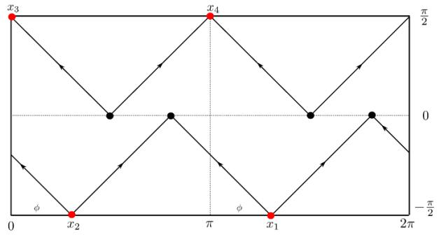

Figure 3. Lorentzian cylinder drawn in the plane. The vertical lines at 0 and 2π are identified. Red dots correspond to operator insertions. Black dots stands for the points of first interactions of on-shell particles emitted/absorbed by external operators. Clearly, it is not possible to draw a Landau graph for φ 6= 0, π.

When x is small, the behavior of I is controlled by the fixed angle scattering amplitude at high energies ∼ 1/xˆ. (Recall that ˆx, defined in [\(3.2\)](#page-8-2), is a projectively invariant version of x.) For local interactions, A is polynomial in ω, giving a singularity at x = 0.

We expect this computation to be reliable for ˆx ≫ 1/M∗, where M∗ is the scale that suppresses higher-dimensional interactions in the bulk. When the bulk is a string theory, this is ˆx ≫ ℓs, and in M-theory this is ˆx ≫ ℓP l, where ℓs and ℓP l are, respectively, the string and Planck lengths in units of RAdS. We discuss what happens near these scales in section 4.

#### 3.2 Landau diagrams in 1+1 dimensions

The bulk-point singularity described above cannot arise at any order in boundary perturbation theory in 1+1 dimensions. To see why, consider a weakly coupled 2d sigma model. The Landau diagrams are very simple in this case. The lines are lightlike and momentum conservation at the interactions implies that the left- and right-moving momenta are conserved. Therefore it is as if we did not have any interactions. In other words, the Landau diagrams with and without interactions look the same, and the only singularities are light-cone singularities.

In particular, this implies that there is no singularity at x ∝ z − z¯ = 0, for generic values of z.

By performing conformal transformations, the points x3, x4 can be set at τ = π 2 , and ϕ = 0, π and the points x1, x2 at τ and ϕ = φ+π, φ, see figure [3.](#page-11-1) Then x = 0 corresponds to τ = − π 2 with any value of φ. These points can be joined by a bulk Landau graph but not by any boundary Landau graph.

A popular starting point for the sigma model that is dual to AdS3 × S 3 × M4, with M4 = K3 or T 4 , is the symmetric product Mk 4 /Sk, where Sk is the permutation group of k elements. One then deforms this theory by a twist operator mixing two of the factors at a time. It is interesting to wonder whether this type of perturbation theory can produce

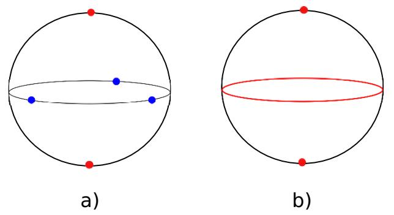

Figure 4. We consider the five-point correlation function on the Lorentzian 3d cylinder. The configuration is chosen such that all external points lie on the geodesics emanating from a point in AdS4. In a) the position of five points on the spatial S 2 is shown. Red points correspond to operators inserted at τ = − π 2 . Blue points correspond to operators inserted at τ = π 2 . In b) the moment of first interaction at τ = 0 is shown. Excitations created at τ = − π 2 could potentially interact at τ = 0 along the sphere equator.

the bulk-point singularities at finite order in perturbation theory. At finite order in perturbation theory a connected correlator corresponds to a computation in a theory with an order one value of k (that grows with the order of perturbation theory). In a theory with a small value of k, we will prove in section 7 that the correlators do not have any singularity except for the ordinary light-cone ones. Since we are expanding around a regular point in the conformal manifold (the space of coupling constants of the theory), we expect that each term in the expansion should also be analytic at z = ¯z.

#### 3.3 Landau diagrams in 2+1 dimensions

We now argue that the bulk-point singularity x = 0 cannot arise in perturbation theory in a three-dimensional CFT. In this case d + 2 = 5, and we are dealing with the five-point function. We label the points in terms of (τ, θ, φ), where τ is time and θ and φ are standard coordinates on S 2 . We choose two points to be at (− π 2 , 0, φ), (− π 2 , π, φ) in the past; these points evolve into the three points (π 2 , π 2 , φ1), (π 2 , π 2 , φ2), (π 2 , π 2 , φ3) in the future, see figure [4.](#page-12-1)

Let us do the same thing as before: starting from initial points, we follow the light-cone to the first possible interaction and then run time backwards from the final points to the last interaction.

Starting from points 1 and 2 (located at the north and south pole respectively), we evolve in time from τ = − π 2 to τ = 0 — the moment when the light cones first meet at the equator of the sphere. We conclude that the earliest interactions can occur at τ = 0 and should occur at the equator.

Now we can run time backwards. Starting from the final points we conclude that at the moment τ = π 2 −, all particles that are away from the equator must move towards it, since the final points are at the equator.

After the initial light-cones meet at the equator, at a time τ = 0, there are two options: either the particles remain up to τ = π/2 on the equator, or they leave the equator. In the second case, they must eventually return to the equator. Let us consider the case where there are particles going towards the north pole. These particles cannot reach very high latitudes since they have to get back to the equator at time π/2. Let us consider the highest latitude collision. If there are several collisions at this latitude, consider the one having incoming particles going north. It will have no incoming particles moving south. But it has no outgoing particles going north, therefore momentum along the lines of longitude would not be conserved. This contradiction means that particles remain on the equator from τ = 0 until τ = π/2. Since the equator has only one spatial dimension, we now have Landau diagrams in 1+1 dimensions. As we have remarked above, these Landau diagrams are the same as the ones we would have in the free theory. So we can draw a pair of null lines emanating from an arbitrary point on the equator, one left-moving and one right-moving. These lines must end on two separate operators. But this is impossible if the positions of the operators are generic, namely when |φi − φj | is not a multiple of π.

# 3.4 Landau diagrams in d ≥ 4

In 3+1 dimensions, we have not been able to find a set of points with x = 0 where we can prove nonexistence of a boundary Landau diagram. For some symmetric configurations of points, we can actually find Landau diagrams on the boundary (see appendix C), but this does not mean that they exist for generic configurations. It would be interesting to understand further when they do or do not exist. The conditions that determine the existence of Landau diagrams seem reminiscent of the positivity conditions studied in the context of the amplituhedron [\[17\]](#page-46-12), and it would be interesting to see if there is any relation.

### 4 Singularities beyond perturbation theory

In this section, we study the effect of various types of corrections. First we discuss the effect of string worldsheet corrections for bulk-point singularities. At finite α ′ these corrections should make bulk-point singularities disappear [\[13\]](#page-46-2). We then discuss the effect of Dinstantons. We claim that the D-instanton correction contains a singularity. It turns out that at weak boundary coupling, we can also get similar singularities from field theory instantons. We will provide a rationale for the agreement between these two computations. Finally, we argue that with a finite gravitational coupling constant GN , we expect no bulkpoint singularities.

While so far we have focused primarily on d + 2-point functions in d-dimensions, it is also interesting to consider four-point functions in d-dimensions. We end with a discussion of their expected singularities.

#### 4.1 Stringy corrections

Here we consider bulk-point singularities in d+2-point functions, arising from an interaction localized at a point in the bulk. We consider a theory in the large N expansion, and we examine the correlators at fixed order in this expansion. Each term is a function of the 't Hooft coupling parameter λ. We recover the discussion in section 3.1 in the λ → ∞ regime where the bulk string theory can be approximated by a local field theory. Here, we discuss what happens when λ is finite but large. This corresponds to a bulk theory with a finite and small string length in units of the AdS radius, ℓs ≪ 1. In the small x limit, we expect a correction to the formulas in section 3.1, which arises as follows. We know that the flat space, fixed angle, string scattering amplitude at large energy goes as

$$\mathcal{A}\_{\text{flat}}(\omega p\_a) \propto e^{-\omega^2 h},\tag{4.1}$$

where h is a positive function of the angles [\[18](#page-46-13)[–20](#page-46-14)]. We saw that in the local regime, described in section 3.1, the energy scales as ω ∼ 1/x. We have a range of energies where we can approximate the amplitude by the high energy flat space amplitude. In this regime, the correlator has the form

$$I \propto \int\_{o(1)}^{\infty} d\omega \,\omega^c e^{-\ell\_s^2 \omega^2} e^{i\omega x - \varepsilon \omega}. \tag{4.2}$$

The integral is now convergent at large ω for all x. To understand what happened with the singularity it is useful to consider the explicit toy model

$$I(\ell\_s, x) = \int\_0^\infty d\omega \, e^{-\ell\_s^2 \omega^2} \, e^{ix\omega} \,. \tag{4.3}$$

For ℓs = 0, we get I(0, x) = i/x. When ℓs is non-zero, I(ℓs, x) is an analytic function of x (an error function). For large x with Im(x) > 0, we have that I ∼ i/x, agreeing with the result when ℓs = 0. However, as x becomes comparable to ℓs, we find deviations from this behavior. Interestingly, when the imaginary part of x is very negative, say x = −iy with large positive y, then the function grows like exp(y 2/(4ℓ 2 s )). In this region, even though |x| is large, the value of the function is completely different from i/x, which is the analytic continuation of the ℓs = 0 answer to the region where the original integral was not convergent. Notice that the explicitly convergent region of the integral is in the direction of the iε prescription, which corresponds to performing a bit of Euclidean evolution that damps the contribution of high energy states. If we go in the opposite direction, we enhance high energy contributions, and it is not surprising that we get a very different answer. One might have naively expected that the pole at x = 0 would move in the complex plane when ℓs becomes finite. The complete disappearance of the singularity is related to the fact that the function is not analytic in ℓs at ℓs = 0.[7](#page-14-0)

Of course, if we expand the amplitude in powers of ℓ 2 s , then each individual term seems to have a singularity at x = 0. In fact, higher orders in the expansion give higher order singularities. However, the full function is perfectly regular at x = 0.

The conclusion is then that finite α ′ effects remove the x = 0 singularity from the string tree-level correlator. This had been previously observed in [\[13\]](#page-46-2).

When the energy of the collision is very large, we expect corrections to the flat space scattering formula coming from the curvature of AdS. High energy scattering amplitudes in AdS were considered in [\[21](#page-46-15)], where it was found that the amplitude behaves as exp(−(log ω) 2hˆ) for large energies, where hˆ is a positive function of the angles. This also leads to a convergent amplitude at large ω.

7We thank A. Zamolodchikov for discussion on this point.

Note that once we have this strong suppression at large ω, it is no longer true that ω ∼ 1/x. In fact, if we evaluate [\(4.2\)](#page-14-1) by saddle-point approximation, we see that even for x = 0, we have a finite value for ω. In the gravity regime, we can picture the x → 0 limit as a kind of microscope, or collider, that lets us explore the local bulk degrees of freedom. However, this microscope is blurred at the bulk string scale where it ceases to explore higher energies.

It would be interesting to evaluate the correlation function of heavy operators using classical strings, as in [\[22\]](#page-47-0), to further check that the result is completely regular at x = 0.

These arguments suggest that there will be no singularity at x = 0 at any order in string perturbation theory.

As a final point, notice that the emergence of a local theory in the bulk is something that can be explored using the planar approximation of the gauge theory. As we go from small to large 't Hooft coupling λ, we should get an enhancement of the connected correlator when x ∼ 0. This could be done explicitly if integrability techniques are developed to compute planar correlation functions. For recent progress in this direction see [\[23](#page-47-1), [24\]](#page-47-2).

#### 4.2 Instanton corrections

Here we consider the spacetime dependence of instanton or D-instanton corrections to correlation functions. Such corrections are exponentially small, due to the action of the instanton. However, there are cases where instantons or D-instantons lead to a dependence on one parameter that is invisible in perturbation theory (e.g., the theta angle in fourdimensional gauge theories). In these cases, we can consider the derivative of the correlator with respect to this parameter, whose leading contribution comes from the one-instanton correction, and we can explore its dependence on the positions in a clear way.[8](#page-15-1) Below, we will show that such corrections typically display a singularity at the same location as the bulk-point singularities.

D-instantons. As argued in [\[25](#page-47-3), [26\]](#page-47-4), D-instanton corrections to scattering amplitudes are not exponentially suppressed at high momenta.[9](#page-15-2) So if we consider the one-instanton correction to the correlator, we expect singular behavior at x = 0. This is in line with the idea that D-instantons explore points in the bulk.

Singularities from field theory instantons. Now we consider singularities due to instantons in the boundary quantum field theory. It turns out that instanton corrections often give rise to singularities that are similar to bulk-point singularities. Let us explain the mechanism in a simple case. Consider a theory in 1+1 dimensions. Imagine a non-linear sigma model that contains a non-contractible S 2 in its target space. This has instantons that correspond to wrapping the S 2 , which can be described as follows. Consider first the

8Of course, a singularity in the prefactor of the one-instanton correction does not mean that the function after we sum over all instantons is singular at this location.

9 In the flat space case, the instanton correction never dominates over the tree amplitude e −ℓ 2 s p 2 or the e −ℓsp that we get after resumming over genera [\[27\]](#page-47-5). The black hole formation threshold at ℓsp ∼ 1/g happens first as we increase the energy.

Euclidean field theory and parametrize space by the coordinates z and ¯z. We parametrize the target space sphere using the complex coordinate w, with

$$w = \tan\theta / 2e^{i\phi}, \qquad d\theta^2 + \sin^2\theta d\phi^2 = 4\frac{|dw|^2}{(1+|w|^2)^2}.\tag{4.4}$$

The instanton is given by

$$w = \frac{az+b}{cz+d}, \qquad \qquad m \equiv \begin{pmatrix} a \ b \\ c \ d \end{pmatrix}, \qquad \text{det } m = 1,\tag{4.5}$$

where the matrix m is related to parameters of the instanton. The moduli space is given by SL(2, C)/SU(2), which can be viewed as H3 since the metric is SL(2, C)-invariant. We now consider operators that change the radius of the sphere,

$$O(z,\bar{z}) = \frac{\partial\_{\alpha}w\partial\_{\alpha}\bar{w}}{(1+|w|^2)^2}.\tag{4.6}$$

Evaluated on the holomorphic instanton [\(4.5\)](#page-16-0), this operator has the expectation value

$$\langle O(z,\bar{z})\rangle = \frac{1}{\left( (\bar{z},1)m^\dagger m \begin{pmatrix} z \\ 1 \end{pmatrix} \right)^2}.\tag{4.7}$$

We see that the answer depends on the hermitian matrix P = m†m, with det P = 1, which parametrizes SL(2, C)/SU(2). Writing

$$P = \begin{pmatrix} Y\_{-1} + Y\_2 \ Y\_0^E + iY\_1 \\ Y\_0^E - iY\_1 \ Y\_{-1} - Y\_2 \end{pmatrix}, \qquad \det P = 1 = Y\_{-1}^2 - (Y\_0^E)^2 - Y\_1^2 - Y\_2^2,\tag{4.8}$$

we recognize the YI as embedding coordinates for H3. Furthermore the expression for the operator in [\(4.7\)](#page-16-1) is simply given by hOi = (X ·Y ) −2 , with X the embedding coordinate for the boundary point. We see then that the instanton contribution to the four-point function can be computed as

$$
\langle O\_1 O\_2 O\_3 O\_4 \rangle \propto e^{-I} \int\_{H^3} d^3 Y \frac{1}{\prod\_{i=1}^4 (Y \cdot X\_i)^2}. \tag{4.9}
$$

This has precisely the same form as that of a local bulk interaction. Here, I is the action of the instanton. In particular, after continuing [\(4.9\)](#page-16-2) to Lorentzian signature, we will find precisely the same bulk-point singularity that gravity produces (except for the small factor e −I ).

We should remark that the full computation in the sigma model is more involved, since we need to include the fermions and the fluctuations in the extra dimensions in target space that make it a full conformal sigma model. If we only had the S 2 and nothing else, then the theory would not be conformal. Similarly, the operators might contain some dependence on those dimensions, which would complicate some of the details while retaining the same x = 0 singularity, at least at leading order in perturbation theory.

Notice that the presence of a singularity here does not contradict the argument that, in perturbation theory, we only get singularities on the light cone in 1+1 dimensions. Here we are talking about a non-perturbative effect.

In 3+1 dimensions, one obtains a similar result [\[28](#page-47-6)[–30](#page-47-7)]. The moduli space of Yang-Mills instantons can be viewed as H5, where the radial direction is the instanton size. Furthermore, the correction they produce for a correlation function can be found by evaluating the operator in the instanton background, as above. This leads again to functions that are identical to the ones produced by local bulk interactions.[10](#page-17-2)

# 4.3 General argument for the position dependence of one-instanton corrections

Here, we explain the position dependence of the one-instanton correction to correlation functions. We imagine an instanton whose only moduli are those given by the breaking of the symmetries: conformal symmetries as well as supersymmetries. The main point is that the one-instanton correlation function at leading order in the 1/N-expansion factorizes as

$$
\langle O(x\_1) \cdots O(x\_n) \rangle \propto e^{-I} \int DY \langle O(x\_1) \rangle\_{\text{inst}, Y} \cdots \langle O(x\_n) \rangle\_{\text{inst}, Y}, \tag{4.10}
$$

where hO(xi)iinst,Y is the expectation value of an operator in the presence of the instanton with fixed values of the zero modes. This one-point function is completely fixed by conformal invariance: it is given by the corresponding bulk-to-boundary propagator. We saw this explicitly in the example above when we only had the conformal moduli. We did not check it explicitly, but we expect that the same symmetry arguments extend to the fermionic moduli, when these arise from broken supersymmetries. This then fixes the one-point functions and consequently the spacetime dependence of the correlation function. The important point to notice is that in this argument we did not use the value of the 't Hooft coupling, so it applies both for strong and weak coupling. In fact, the spacetime dependence of the instanton correction was observed to be the same at both weak and strong coupling [\[28](#page-47-6)[–30\]](#page-47-7). This argument does not put any constraint on the λ dependence of the constant prefactor.

# 4.4 Exact answer

If we now consider a theory with a finite Planck scale, then we expect that the fixed angle scattering is suppressed exponentially, since the amplitude would be given by a classical gravity solution whose action is proportional to GN ω d−1 , leading to the corresponding exponential suppression exp(−GN ω d−1 ). This is also sometimes explained by saying that high energy scattering will typically make a black hole that evaporates into a large number of particles, so that producing just two particles in the final state would be highly unlikely [\[31,](#page-47-8) [32\]](#page-47-9). Of course, we could consider a theory where the string scale and the Planck scale coincide, where these strong gravity effects are the first to remove the singularity. This suppression leads us to expect that the answer should be analytic at x = 0. We can also say that the production of black holes implies that we cannot explore arbitrarily short

10For example, see equation (34) in [\[28\]](#page-47-6).

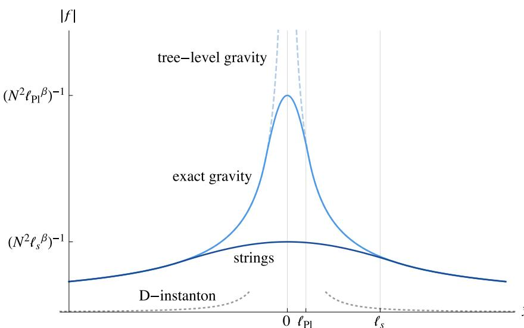

Figure 5. An illustration of the (d + 2)-point function near ˆx = 0 for different bulk theories. The top curve (dashed light-blue) shows a ˆx −β divergence from a tree-level Witten diagram. The bottom curve (dark blue) shows this divergence cut off at ℓs, when the bulk is a string theory. The middle curve (medium blue) shows the case ℓs → ℓP l, where the divergence is cut off by further corrections in the exact gravity theory. The dotted gray curve shows the effect of D-instantons, which (though formally singular at ˆx = 0) are suppressed and can only be trusted down to a scale between ℓP l and ℓs.

distances, therefore removing the x = 0 singularity. Of course, the boundary theory had no bulk points to start with.

In fact, we will later prove that in a 1+1 dimensional CFT, there is indeed no singularity at x = 0.

# 4.5 Summary

These considerations suggest the following picture for the (d+2)-point function near x = 0, illustrated in figure [5.](#page-18-1) In this discussion, it is useful to refer to the projectively invariant cross-ratio ˆx [\(3.2\)](#page-8-2). For a bulk amplitude growing like A ∝ s k , a tree-level Witten diagram gives a singularity f ∼ (N2xˆ β ) −1 , where β = (d + 2)∆ − d − 1 + 2k. In the case of an ordinary local gravity theory, we expect that k = 1. If the bulk is a string theory, the singularity is cut off at the scale ˆx ∼ ℓs, resulting in a bump in the correlator of height (N2 ℓ β s ) −1 . When the bulk is not described by weakly-coupled string theory (for instance in M-theory, or in the limit ℓs → ℓP l), our tree-level computation breaks down near ˆx ∼ ℓP l, and we expect gravitational corrections to smooth out the singularity, resulting in a bump of height (N2 ℓ β P l) −1 ∼ N 2β d−1 −2 . [11](#page-18-2) Note that in this latter case, even though the bump comes from a 1/N2 correction, it actually grows with N when (d+ 2)∆−2d+ 2k > 0. This is because the breakdown of bulk perturbation theory occurs when the effective energy

11Here, we assume cT ∝ N 2 , as for an adjoint theory. In a vector-like theory, the N-dependence will be different.

scale ω ∼ xˆ −1 becomes of order ℓ −1 P l , and the breakdown does not depend on whether the correlator itself is small or large.

### 5 Singularities of the four-point function

Previous papers on this subject have focused on the four-point function [\[9](#page-46-1)[–13\]](#page-46-2). In d ≥ 3 dimensions, the CFT four-point function can have a singularity at z = ¯z already in perturbation theory (see [\(2.3\)](#page-3-2) ) because we can draw a Landau diagram on the boundary. In addition, we can also draw Landau diagrams in the bulk. In this section, we discuss in more detail the four-point function, emphasizing the various possible contributions to the singularity at z = ¯z.

Let us start with some kinematics. We have four points XM a in embedding coordinates. We form the 4 × 4 matrix Xa · Xb. Generically its determinant is non-zero. We want to focus on situations where its determinant, det (Xa · Xb) ∝ (z − z¯) 2 , vanishes. It turns out that there are distinct configurations with zero determinant that cannot be distinguished by the cross-ratios of the four points [\[10](#page-46-3)]. They can be distinguished by the type of manifold generated by the four vectors XM a . This manifold can be either a four-dimensional null manifold or a three-dimensional manifold. As an example, the first case arises when the four points can be located in the interior of the Poincar´e patch, such as the points in [\(6.9\)](#page-25-1) with t = 1. An example of the second configuration is the points XM = (X−1 , X0 , X1 · · · , Xd ) given by[12](#page-19-1)

$$X\_{1,2}^M = (0, -1, \mp \cos \phi, \mp \sin \phi, \vec{0}), \qquad X\_{3,4}^M = (0, 1, \pm 1, 0, \vec{0}). \tag{5.1}$$

Both types of configurations have z = ¯z or zero determinant. But they cannot be transformed into each other by a finite conformal transformation. This type of situation is common in Lorentzian signature. For example, consider the two-point function, which is a function of the proper distance x 2 . We can have a singularity at x 2 = 0 when points are either null-separated or coincident. By analogy with this situation, we will call the first type of configuration the "null z = ¯z singularity" and the second the "full z = ¯z singularity." Since the four-point function depends only on the cross-ratios, we will have the same approach to the singularity in both cases, even though the configurations look rather different. Of course, if we had a higher point function, where only four of the points are approaching the z = ¯z configuration, then these two cases can behave very differently, and can be distinguished by looking at other cross-ratios.

In the case of the null z = ¯z configuration, we cannot find a bulk point P that is null separated from all other boundary points. The only point that is null separated from the four points lies also on the boundary.

A richer situation arises for the full z = ¯z configuration. In this case, we can find a point P that is null separated from all the boundary points, Xa · P = 0. Furthermore, it is also possible to draw bulk Landau diagrams with a vertex at P. [13](#page-19-2) In fact, we get

12We use X M i = (cos τi, sin τi, cos φi, sin φi,~0).

13This is clear because we can find a point P in the AdS3 subspace given by 0 = X 3 = X 4 = · · · = X d , as in section 3.1.

a full family of such points that span an Hd−2 subspace of AdSd+1. For example, in the configuration in [\(5.1\)](#page-19-3), this subspace is given by −(X−1 ) 2 + (X3 ) 2 + · · ·(Xd ) 2 = −1. We can understand the symmetries of the configuration as follows. A generic set of four points is only invariant under an SO(d − 2) subgroup of the conformal group. However, the Lorentzian full z = ¯z configuration is invariant under a SO(1, d − 2) subgroup.[14](#page-20-0) This subgroup acts on the bulk hyperboloid. This bulk hyperboloid intersects the boundary at an S d−3 , so that even on the boundary we can have more than one Landau diagram.[15](#page-20-1)

When we perform the bulk computation, we can have contributions to the z −z¯ singularity that come from two sources. We can have a bulk UV contribution that comes from high energy particles colliding at a particular point P in the hyperboloid. In addition, we can have a bulk IR contribution that comes from integrating the interaction point P over the hyperboloid. Let us discuss first the bulk IR contribution. When we go away from z = ¯z, we find that this integral over hyperbolic space gets cut off at a distance e ρ ∝ 1/|z − z¯|, which results in a singularity of the form

$$
\langle \mathcal{O}(x\_1)\mathcal{O}(x\_2)\mathcal{O}(x\_3)\mathcal{O}(x\_4) \rangle \propto \frac{1}{(z-\bar{z})^{d-3}}\tag{5.2}
$$

(for d = 3 we get a logarithm). This singularity does not involve short distances in the bulk. From the boundary point of view, it involves short distances near the S d−3 of possible interaction points for boundary Landau diagrams.

Let us now discuss the contribution from the bulk UV singularity. For that purpose, it is convenient to choose the following AdSd+1 coordinates:

$$Q\_{AdS\_{d+1}}^M = \cosh\rho \,\tilde{Q}\_{AdS\_3}^M + \sinh\rho \,\vec{n}\_{S^{d-3}},\tag{5.3}$$

where QeM AdS3 are embedding coordinates of AdS3 and ~n is a unit vector on S d−3 . Then the bulk diagram corresponding to a contact λ 4!φ 4 interaction has the form

$$I = \text{Vol}\_{S^{d-3}} \int\_0^\infty d\rho \sinh^{d-3} \rho (\cosh \rho)^3 \int\_{AdS\_3} d\tilde{Q} \frac{-i\lambda}{\prod\_{a=1}^4 (-2\tilde{Q} \cdot X\_a \cosh \rho + i\varepsilon)^\Delta}. \tag{5.4}$$

The last term has the same form as the AdS3 problem, except that the Xa have been rescaled. Therefore, we can repeat the derivation in section 3.1 to go from [\(3.5\)](#page-9-3) to [\(3.9\)](#page-10-1).

14In Euclidean space, configurations with z = ¯z are invariant under SO(d − 1).

15For d = 3 we have two points.

The only difference is that we replace x by x cosh ρ,

$$\begin{split} I &\approx (2\pi)^3 \left( \frac{C\_\Delta^{1/2} e^{-i\frac{\pi}{2}\Delta} \Delta}{2^\Delta \Gamma(\Delta)} \right)^4 \left( \prod\_a k\_a^{\Delta - 1} \right) \operatorname{Vol}\_{S^{d-3}} \\ &\times \int\_0^\infty d\rho \sinh^{d-3} \rho \int\_0^\infty d\omega \,\omega^{4(\Delta - 1)} (-i\lambda) e^{i\omega x \cosh \rho} \\ &\approx 2(2\pi)^{\frac{d+3}{2}} \left( \frac{C\_\Delta^{1/2} e^{-i\frac{\pi}{2}\Delta}}{2^\Delta \Gamma(\Delta)} \right)^4 \left( \prod\_a k\_a^{\Delta - 1} \right) \\ &\times \int\_0^\infty d\omega \,\omega^{4(\Delta - 1)} (-i\lambda) (-i\omega x)^{\frac{3-d}{2}} K\_{\frac{d-3}{2}} (-i\omega x) \\ &\propto \frac{\prod\_a k\_a^{\Delta - 1}}{(-ix)^{4\Delta - 3}}, \end{split} \tag{5.5}$$

where the (cosh ρ) 3 term in [\(5.4\)](#page-20-2) was cancelled by three-dimensional energy momentum conservation in AdS3. In the second line, we have done the integral over ρ in order to get the Bessel function.

The integral [\(5.5\)](#page-21-0) contains both the UV and IR contributions. To separate them, it is useful to replace the contact interaction by a string amplitude. We can model this by writing an expression analogous to [\(3.11\)](#page-10-2) where we replace λ by A(ωpa). Here, ω sets the overall energy scale of the process. If the amplitude vanishes rapidly for large ω, then the UV contribution cancels and we get the result predicted by the general discussion around [\(5.2\)](#page-20-3). Namely, if the amplitude is suppressed beyond ω0, then we get e iw0x cosh ρ , which cuts off the ρ integral at a constant value of xeρ , producing the desired result [\(5.2\)](#page-20-3). This discussion is similar to the one in [\[33\]](#page-47-10) for deep inelastic processes. The high energy regions in the bulk are highly suppressed and the contribution arises from the regions where a redshift factor effectively lowers the energy to proper energies below the string scale.

For similar reasons, in the exact gravity theory we do not expect a bulk UV contribution. But we do expect the bulk IR contribution. In fact, we can argue that we expect a contribution of the form [\(5.2\)](#page-20-3) for general theories, even those that do not have a gravity dual. This should be intuitively clear from the discussion of symmetries above. Namely, the singularity arises from the action of the non-compact symmetry group SO(1, d−2). In fact, the 1/(z−z¯) d−3 singularity is present for each individual conformal block. Here it is clear that it can only arise from the non-compact nature of this symmetry group. The fact that conformal blocks have this singularity is reviewed in appendix B and can be seen by looking at the equation (2.21) in [\[34\]](#page-47-11) (see also [\[35](#page-47-12)]). It is also clear from the explicit expressions in d = 4, 6.

Note that a free field theory does not have any singularity at z = ¯z. The singularities from each individual conformal block cancel out.

It is tempting to conjecture that any non-free theory will have a singularity at z − z¯ of the form [\(5.2\)](#page-20-3). As a simple example, consider the large N critical O(N) model, which in a sense is close to a free theory. In that case, the 1/N correction to the four-point function of the spin fields (O(N) vectors) has a singularity of the form Γ( d−3 2 )x 3−d , as expected.[16](#page-21-1) It is important for this conjecture that we consider the four-point function of

16This is obtained from the function D¯ d 2 −1,1, d 2 −1,1 , see [\[36](#page-47-13)].

the smallest dimension (or twist) operator in the theory. For example, in a product of two independent field theories, where each individual one is interacting within itself, we can consider products of operators in each of the two theories, and we can have a higher order singularity. Similarly, in a large N theory, we can have higher order singularities if we have double-trace external operators.[17](#page-22-1)

An apparent counterexample arises when we consider the four-point function of scalar half-BPS operators Tr[φ 2 ] in N = 4 SYM. At one loop, we get λ (z−z¯) coming from a φ 4 type interaction, and at two loops we get λ 2 (z−z¯) 2 from two copies of that diagram [\[37\]](#page-47-14). This double pole arises because we have two separate vertices. In other words, we get a singularity similar to what we would get in two separate field theories. We expect that at higher loops, there should be log(z − z¯) corrections that ultimately remove this higher power. In fact, at three loops there is such a contribution [\[38](#page-47-15)]. It is also interesting to try to give a hand-waving bulk understanding of this higher order singularity. Since it should correspond to a string theory with very small string tension, we do not expect a bulk UV singularity. However, a very low string tension can give rise to a very big intermediate string that stretches between two very distant bulk points, so that we end up integrating over two separate points on the hyperboloid. But we expect that at higher orders we will get contributions that suppress the separate points as e −λ(log(z−z¯))2 .

## 6 Approaching singularities using the OPE

In this section, we apply the OPE to understand the behavior of Lorentzian correlators. We are primarily interested in the bulk-point singularity and the Regge limit. One must analytically continue away from the Euclidean sheet to reach these configurations. Nevertheless, we would like to emphasize that they can be approached in such a way that the OPE remains valid.

The general idea is easy to formulate. Consider operators O(τL, φ) on the Lorentzian cylinder parameterized by a time τL and an angle φ on a great circle of S d−1 . We arrange them in the following four-point function:

$$f(u,v) = \frac{\langle \mathcal{O}(-\pi,\phi+\pi)\mathcal{O}(-\pi,\phi)\mathcal{O}(0,0)\mathcal{O}(0,\pi)\rangle\_{R\times S^{d-1}}}{\langle \mathcal{O}(0,0)\mathcal{O}(0,\pi)\rangle^2},\tag{6.1}$$

with generic φ. [18](#page-22-2),[19](#page-22-3) To approach this configuration, we evolve the operators at time τL = −π by −ǫ in Euclidean time, corresponding to −π → −π + iǫ. Next, we consider the OPE in the s-channel O(−π + iǫ, φ)O(−π + iǫ, φ + π). This OPE converges for ǫ > 0. The region of interest lies at the boundary ǫ → 0.

$$
\langle \mathrm{T} \left\{ \mathcal{O}(x\_1) \mathcal{O}(x\_2) \mathcal{O}(x\_3) \mathcal{O}(x\_4) \right\} \rangle = \langle \mathcal{O}(x\_1) \mathcal{O}(x\_2) \mathcal{O}(x\_3) \mathcal{O}(x\_4) \rangle,
$$

which makes time ordering implicit.

17We thank Douglas Stanford for discussion on this point.

18Throughout the paper we write the correlator

19We have shifted all operators by −π/2 in τL relative to previous sections. This is for convenience when discussing analytic continuation below.

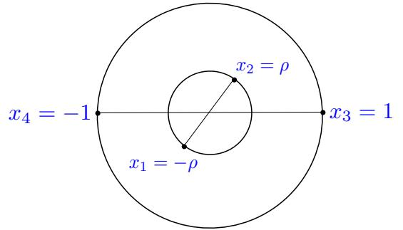

Figure 6. Any four points in R d can be brought into the above configuration using conformal transformations. The four points lie in a two-plane, and ρ = reiφ is a complex coordinate on that plane. The quantities r and φ are alternative parameterizations of the two nontrivial conformal cross-ratios. Radial quantization around the origin gives an expansion for the four-point function in r = |ρ|. (figure from [\[34\]](#page-47-11).)

The s-channel OPE takes the following form:

$$f(u,v) = \sum\_{\Delta,\ell} e^{-i\pi\Delta} c\_{\Delta,\ell}^2 g\_{\Delta,\ell}(\epsilon,\phi),\tag{6.2}$$

which should be compared with the Euclidean correlator

$$f\_E(u,v) = \sum\_{\Delta,\ell} c\_{\Delta,\ell}^2 g\_{\Delta,\ell}(\epsilon,\phi),\tag{6.3}$$

which corresponds to hO(−ǫ, φ + π)O(−ǫ, φ)O(0, 0)O(0, π)iE. The difference between the two is in the phase factor e −iπ∆ in [\(6.2\)](#page-23-1). As we explain below, this can lead to different effects. First, it is easy to see that it can lead to the emergence of singularities in large N theories. In this case the emergence of a singularity is related to infinitely many operators having dimensions such that they sum up "in phase." Second, it can lead to damping of the correlator when the phases are "random." This is the chaos phenomenon.

#### 6.1 A simple bound on the bulk-point singularity

To understand more clearly the relationship between the Lorentzian and Euclidean correlator, let us start on the Euclidean cylinder,

$$f\_E(u,v) = \frac{\langle \mathcal{O}(\tau\_E, \phi + \pi)\mathcal{O}(\tau\_E, \phi)\mathcal{O}(0,0)\mathcal{O}(0,\pi)\rangle\_E}{\langle \mathcal{O}(0,0)\mathcal{O}(0,\pi)\rangle^2},\tag{6.4}$$

with τE < 0. In radial quantization, this corresponds to the configuration shown in figure [6,](#page-23-2) where ρ = e τE+iφ is the radial coordinate introduced in [\[34,](#page-47-11) [39\]](#page-47-16). The standard cross-ratios z, z¯ are related to τE and φ by

$$\rho = re^{i\phi} = e^{\tau\_E + i\phi} = \frac{z}{(1 + \sqrt{1 - z})^2},$$

$$\bar{\rho} = re^{-i\phi} = e^{\tau\_E - i\phi} = \frac{\bar{z}}{(1 + \sqrt{1 - \bar{z}})^2}. \tag{6.5}$$

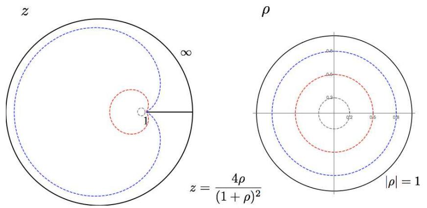

Figure 7. The map from z-plane to the ρ-space is shown. The whole z-plane minus the [1,∞) cut is mapped to the |ρ| < 1 region. The [1,∞) cut in the z-plane is mapped to the |ρ| = 1 locus.

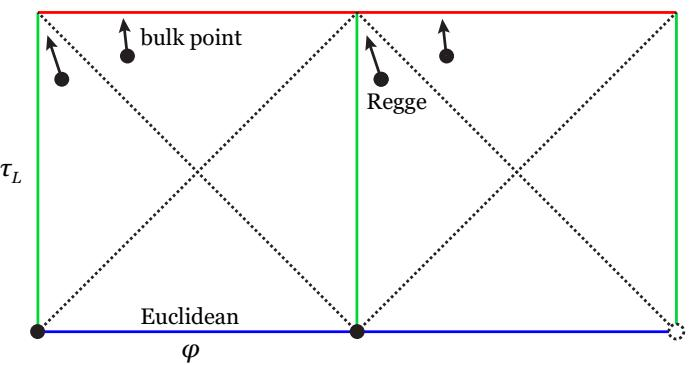

Figure 8. There are several different regions of the Lorentzian cylinder where z = ¯z, but they are easy to distinguish using the variables τL and φ. Firstly, when τL = 0 with φ arbitrary (blue), the correlator is in a Euclidean regime: all operators lie on the unit circle in figure [6.](#page-23-2) When φ = 0, π with τL arbitrary (green), we have z = ¯z. (Moving along the green line, taking τL → π, we approach the Regge limit, discussed below.) Finally if τL = π with φ arbitrary (red), the correlator is in the bulkpoint region. Although all of these loci have z = ¯z, they require different analytic continuations from the Euclidean regime, and hence can have different physics. For example, if we start at the blue line and increase τL, then each operator crosses one light cone (dashed line) to get to the green line, while each operator crosses two light cones to reach the red line. One can move around the light cones and connect these different regimes by moving in Euclidean time (making ǫ finite) as we do below.

In Euclidean space, ¯ρ and ¯z are the complex conjugates of ρ and z, respectively. The OPE around r = 0 converges for |r| < 1, which translates to the whole cut plane in the z variables, see figure [7.](#page-24-0)

The Lorentzian correlator corresponds to analytically continuing τE → iτL. Note that ρ = e iτL+iφ and ¯ρ = e iτL−iφ are no longer complex-conjugates after this continuation. As we approach the Lorentzian region, we maintain convergence of the OPE by taking τE = iτL − ǫ where ǫ is small and positive. The Lorentzian version of the correlator [\(6.4\)](#page-23-3) can then be written

$$f(e^{i\tau\_L - \epsilon}, \phi) = \langle \psi | e^{(i\tau\_L - \epsilon)D + i\phi R} | \psi \rangle = \langle \psi | e^{-\epsilon D/2} e^{i\tau\_L D + i\phi R} e^{-\epsilon D/2} | \psi \rangle,\tag{6.6}$$

where D is the Hamiltonian on the cylinder, R is the generator of rotations in the φ direction and |ψi ≡ O(0, π)O(0, 0)|0i/hO(0, π)O(0, 0)i. Since D and R are Hermitian, the Cauchy-Schwarz inequality implies

$$|f(e^{i\tau\_L - \epsilon}, \phi)| \le \langle \psi | e^{-\epsilon D/2} e^{-\epsilon D/2} | \psi \rangle = f(e^{-\epsilon}, 0). \tag{6.7}$$

This implies that for ǫ > 0 we have a strictly convergent OPE expansion. Of course we could still have a divergence as ǫ → 0. We can derive a simple bound on the rate of divergence. The configuration τE = −ǫ, φ = 0 is now Euclidean, and we can use the crossed-channel OPE to compute the four-point function,

$$f(e^{-\epsilon},0) \sim \frac{1}{(1-e^{-\epsilon})^{4\Delta}} \sim \frac{1}{\epsilon^{4\Delta}} \qquad (\epsilon \ll 1). \tag{6.8}$$

Combining [\(6.7\)](#page-25-2) and [\(6.8\)](#page-25-3), we see that the correlator is bounded by ǫ −4∆ when approached from the Euclidean direction τE = iτL − ǫ.

More generally, we may be interested in a d + 2 function of the form

$$f(e^{\tau\_E}, \{\vec{n}\_\alpha\}) = \left\langle \mathcal{O}(\tau\_E, \vec{n}\_n)\mathcal{O}(\tau\_E, \vec{n}\_s) \left[\prod\_{i=1}^d \mathcal{O}(0, \vec{n}\_i)\right] \right\rangle\_{R \times S^{d-1}},\tag{6.9}$$

where ~ni are points on the S d−2 sphere at the equator of S d−1 and ~nn,s are on the north and south pole of the S d−1 . This configuration is characterized by several cross-ratios. However, we can keep all the points on the sphere fixed and change only τE. The OPE in the north+south channel is convergent as long as τE < 0. Furthermore, all points at τE = iτL − ǫ are at the boundary of this OPE convergence region. This includes the locus τL = −π, where the special cross-ratio x vanishes.

We can derive a bound similar to [\(6.8\)](#page-25-3) for this correlator.[20](#page-25-4) In particular, it applies as we approach the singular locus x = 0 from the Im(x) > 0 direction. However, this bound is not very constraining for bulk-point singularities that arise as coefficients in the 1/N2 expansion. As discussed in section 4.5, the singularity is smoothed out when ˆx ∼ ℓP l. At this location, it does not violate the Cauchy-Schwarz inequality.

# 6.2 Origin of the singularity from the dimensions of operators in the OPE

The OPE in Euclidean [\(6.3\)](#page-23-4) and Lorentzian [\(6.2\)](#page-23-1) signature look very similar. It is instructive to understand why the Lorentzian one can develop a bulk-point singularity in the gravity regime, while the Euclidean one remains finite (for generic values of the angle). This question was addressed in [\[11](#page-46-4)], and it will be useful to briefly review it.

20The right-hand side of the bound is ǫ −(d+2)∆.

Contact interactions in AdS generate an anomalous dimension for double-trace operators On,l ≡ O∂ 2n∂µ1 . . . ∂µlO and also a shift in their three-point coefficients,

$$\Delta\_{n,\ell} \equiv \dim \mathcal{O}\_{n,\ell} = 2\Delta + 2n + \ell + \gamma\_{n,\ell}^{(1)} + \dots$$

$$p\_{n,\ell} \equiv f\_{\mathcal{COO}\_{n,\ell}}^2 = p\_{n,\ell}^{(0)} + p\_{n,\ell}^{(1)} + \dots,\tag{6.10}$$

where p (0) n,ℓ are the values in Mean Field Theory (see appendix B) and γ (1) n,ℓ and p (1) n,ℓ are of order 1/N2 .

The four-point function has a conformal block expansion

$$f(r, \phi) = 1 + \sum\_{n=0}^{\infty} \sum\_{\ell=0,2,\dots} p\_{n,\ell} g\_{\Delta\_{n,\ell}\ell}(r, \phi) + \text{other operators},\tag{6.11}$$

where "other operators" are single- and multi-trace operators that contribute at first and higher order in the 1/N2 expansion. Under evolution by −π in Lorentzian time, each block acquires an overall phase g∆,ℓ(e −iπr, φ) = e −iπ∆g∆,ℓ(r, φ) (for even ℓ). Thus, the correlator becomes

$$f(e^{-i\pi-\epsilon},\phi) = 1 + \sum\_{n=0}^{\infty} \sum\_{\ell=0,2,\dots} p\_{n,\ell} e^{-i\pi \Delta\_{n,\ell}} g\_{\Delta\_{n,\ell}\ell}(e^{-\epsilon},\phi) + \text{other operators.} \tag{6.12}$$

Let us denote the leading correction in the 1/N2 expansion by δ (1)f. We have

$$\begin{split} \delta^{(1)}f(e^{-i\pi-\epsilon},\phi) &= e^{-2\pi i\Delta}\delta^{(1)}f(e^{-\epsilon},\phi) \\ &+ e^{-2i\pi\Delta} \sum\_{n=0}^{\infty} \sum\_{\ell=0,2,\dots} \left(-i\pi\gamma\_{n,\ell}^{(1)}\right) p\_{n,\ell}^{(0)}g\_{2\Delta+2n+\ell,\ell}(e^{-\epsilon},\phi) \\ &+ \text{single-trace.} \end{split} \tag{6.13}$$

In the first line, we have packaged together contributions δ (1)f(e −ǫ , φ) that are present in Euclidean space. The second line contains extra double-trace terms that arise in Lorentzian signature from the expansion of e −iπγ(1) n,ℓ . The third line contains single-trace terms that we will ignore for now.

The Euclidean terms cannot contribute to a singularity as ǫ → 0 for generic φ because no such singularity exists for Euclidean correlators (which have only OPE singularities). Thus, a singularity as ǫ → 0 must come from the second set of terms in [\(6.13\)](#page-26-0), proportional to the anomalous dimensions γ (1) n,ℓ . Because double-trace dimensions are nearly equal to 2∆ plus an even integer, these contributions sum up "in phase," allowing us to pull out the overall factor of e −2πi∆.

As an example, let us reproduce the singularity in φ 4 theory from a sum over blocks. When ǫ is small, the sum in [\(6.13\)](#page-26-0) is dominated by terms with nǫ of order 1. The scalar blocks in this limit (see appendix B) are given by

$$\log g\_{2\Delta+2n,0}(e^{-\epsilon},\phi) \approx \frac{2^{\frac{2-d}{2}}\sqrt{n}}{\sqrt{\pi}|\sin\phi|}\epsilon^{\frac{3-d}{2}}K\_{\frac{d-3}{2}}(2n\epsilon), \qquad n \gg 1, \quad n\epsilon = O(1). \tag{6.14}$$

To compare to the variables in section 3.1, let us choose boundary points Xi = (cos τi ,sin τi , cos φi ,sin φi) with τ1,2 = −π + iǫ and τ3,4 = 0 and the φi as before. (For convenience, we are gauge-fixing the rescaling of the Xi). In the limit ǫ → 0, we have[21](#page-27-0)

$$\begin{aligned} x &\approx 4i\epsilon |\sin\phi|, \qquad \qquad (\epsilon \ll 1),\\ k\_a &\approx 2|\sin\phi|, \qquad \qquad (\epsilon \ll 1, \ a = 1, 2, 3, 4) \end{aligned} \tag{6.15}$$

A λ 4!φ 4 contact interaction in AdS generates anomalous dimensions only for scalar double-trace operators at leading order in 1/N2 . For large n, these are given by [\[11](#page-46-4), [40\]](#page-47-17)

$$
\gamma\_{n,0}^{(1)} \approx \frac{\lambda n^{d-3}}{2^{2+d} \pi^{d/2} \Gamma(d/2)}, \qquad n \gg 1. \tag{6.16}
$$

Finally, the large-n limit of the Mean Field Theory OPE coefficients is [\[41](#page-48-0)]

$$p\_{n,0}^{(0)} \approx \frac{2^{2 + \frac{3d}{2}} n^{4\Delta - \frac{3d}{2}} \pi \Gamma(d/2)}{\Gamma(\Delta)^2 \Gamma(1 - \frac{d}{2} + \Delta)^2}, \qquad n \gg 1. \tag{6.17}$$

Plugging [\(6.14\)](#page-26-1), [\(6.16\)](#page-27-1), and [\(6.17\)](#page-27-2) into [\(6.13\)](#page-26-0) and approximating P∞ n=0 → R ∞ 0 dn, we obtain precisely the Witten diagram integral [\(5.5\)](#page-21-0) with n = 2ω|sin φ|. This gives the familiar singularity

$$\frac{\prod\_{a} k\_a^{\Delta - 1}}{(-ix)^{4\Delta - 3}} \propto \frac{1}{|\sin \phi|} \frac{1}{\epsilon^{4\Delta - 3}},\tag{6.18}$$

with the correct coefficient. For a four-point bulk interaction with m derivatives we get γ (1) n,ℓ ∝ n d−3+m instead of [\(6.16\)](#page-27-1), resulting in a singularity ǫ −(4∆−3+m) .

Note that at finite N, we must exponentiate γn,ℓ again. With a sufficiently chaotic spectrum, we expect that all phases average out in [\(6.12\)](#page-26-2). Thus, at finite N, we do not expect an extra enhancement to the singularity in the four-point function beyond the one present for the individual conformal blocks. For a similar reason, we do not expect that the single trace terms in [\(6.13\)](#page-26-0) will contribute to the singularity since such terms have the dimensions already in the exponent, even to leading order in the 1/N expansion.

Exponentiation gives another way to understand the regime of validity of the Witten diagram computation in a bulk gravity theory. The sum over blocks [\(6.13\)](#page-26-0) is reliable as long as γn,ℓ ≪ 1 so that we can expand e −iπγn,ℓ ∼ 1 − iπγn,ℓ + . . . . The fixed-angle amplitude in gravity grows as A ∝ s, leading to an anomalous dimension γ (1) n,ℓ ∼ GN n d−1 . This gives the condition n ≪ G 1−d N or ǫ ≫ ℓP l, in agreement with the discussion in sections 3 and 4.

The relation between a bulk Witten diagram as an integral over ω and the conformal block expansion is easy to understand. Conformal blocks are eigenfunctions of the quadratic Casimir C of the conformal group, acting on the two initial (or final) operators. In the bulk, C becomes the squared total momentum plus the Casimir of the Lorentz group. At high energies, this is just C = (ωk1n1 + ωk2n2) 2 = 16ω 2 |sin φ| 2 . The Casimir for an operator of dimension ∆n,0 is 4n 2 for n ≫ 1. Thus, inserting δ(n − 2ω|sin φ|) into [\(5.5\)](#page-21-0) gives the contribution of a single conformal block.[22](#page-27-3)

21In deriving this relation, we must take care to reorder the operators so that the ka in [\(3.4\)](#page-9-2) are positive. The correct ordering depends on the sign of sin φ, leading to the absolute value.

22For more general interactions, we can also project onto a specific angular momentum block by picking out individual partial waves in the scattering process.

### 6.3 The Regge limit and the bound on chaos

When ǫ → 0, φ → π with |π −φ|/ǫ < 1 held fixed (or equivalently z, z¯ → 1 with 1−z 1−z¯ fixed), the physical picture changes. This is the so-called Regge limit, which in the bulk is controlled by high energy, fixed impact parameter scattering [\[16,](#page-46-11) [42](#page-48-1)[–45\]](#page-48-2). Recently, this kinematical regime was analyzed in the context of chaos in [\[46](#page-48-3), [47\]](#page-48-4). As illustrated in figure [8,](#page-24-1) the physics of the Regge limit is different from that of the bulk-point singularity, even though we have z → z¯ in both cases. Here we simply want to compare and contrast the two regimes.

Following the notation of [\[47](#page-48-4)], we consider a time-ordered flat-space correlation function

$$F(t) \equiv \langle \mathcal{T} \{ V(x\_1) V(x\_2) W(x\_3) W(x\_4) \} \rangle,\tag{6.19}$$

where we restrict xi ∈ R 1,1 ⊂ R 1,d−1 as follows

$$x\_1^{\pm} = \pm 1, \quad x\_2^{\pm} = \mp 1, \quad x\_3^{\pm} = \pm e^{\sigma \pm t'}, \quad x\_4^{\pm} = \mp e^{\sigma \pm t'}, \tag{6.20}$$

where t = t ′ + iπ/2. The advantage of the variable t is that F(t) is real for real t [\[47\]](#page-48-4). We are interested in the values of F(t) in the strip |Im(t)| < π/2. The above correlator is at the upper boundary Im(t) = π/2 − ε. The Regge limit corresponds to t ′ → ∞. In this limit, the V (x1)V (x2) OPE is no longer valid. However, note that after a boost, V (x1) and W(x4) can be placed at time −π/2 on the Lorentzian cylinder, while V (x2) and W(x3) are approaching time +π/2 on the Lorentzian cylinder. This is equivalent to the configuration [\(6.1\)](#page-22-4) with φ → π. Hence, we can safely approach this limit using the V (x1)W(x4) OPE. Doing the OPE in this channel we get the variables

$$
\rho \sim e^{-2\pi i} \left( 1 + 4ie^{\frac{-\sigma - t'}{2}} \right), \qquad \qquad \bar{\rho} \sim 1 + 4ie^{\frac{\sigma - t'}{2}}, \tag{6.21}
$$

for large t ′ . The e −2πi phase factor indicates the path of analytic continuation to get to the Regge regime. Note that we have |ρ|, |ρ¯| < 1 for all − 3π 2 < Im(t) < π 2 , and in particular for real t. Swapping t ↔ t¯ corresponds to exchanging points 3 and 4. Thus, the line Im(t) = − π 2 , where ρ, ρ¯ are both real and less than 1, corresponds to the performing the V (x1)W(x3) OPE in the Lorentzian correlator [\(6.19\)](#page-28-1) with real t ′ , which is also convergent.

One point that these observations make clear is the following. There is no singularity when σ → 0 (so that z → z¯) in the Regge regime. This is because there exists an OPE channel where |ρ|, |ρ¯| < 1 when σ = 0 (with t finite). From figure [8,](#page-24-1) it is not surprising that z = ¯z in the Regge regime has different physics from z = ¯z in the bulk-point regime.

We now consider the correlator

$$\frac{F(t)}{F\_d} = 1 - \frac{1}{N^2} \left( A e^{(j-1)t} + \dots \right) + O\left(\frac{1}{N^4}\right), \qquad t \gg 1. \tag{6.22}$$

where the ". . . " represents subleading terms at large t. The chaos bound [\[47\]](#page-48-4) states that

$$j \le 2,\qquad\text{and}\qquad A \ge 0.\tag{6.23}$$

The quantity j is called the Regge intercept, see, e.g., [\[48\]](#page-48-5). In theories with gravity duals we have j = 2, with the Regge limit controlled by graviton exchange. In weakly coupled gauge theories, j is slightly bigger than one. In the exact theory, the correlator should go to zero for large t.

By looking at the OPE, we can perform an analysis similar to the one done in section 6.2 and relate the growth of the correlator to the dimensions of double-trace operators obtained from a gravity computation in the bulk. For example, a contact interaction with amplitude iA = λsk + O(s k−1 ) with k ≥ 2 gives

$$
\delta^{(1)}\frac{F(t)}{F\_d} = \lambda e^{(k-1)t} f(\sigma), \qquad t \gg 1,\tag{6.24}
$$

where δ (1) denotes the leading correction in the large N expansion, and f(σ) is a positive function of σ. Assuming this contact term dominates at high energies, [\(6.23\)](#page-28-2) implies k ≤ 2. For the case k = 2, corresponding to an interaction λ(∂φ) 4 , we also find λ < 0. This constraint was obtained in [\[49](#page-48-6)] for field theories in flat space, and more recently in [\[50\]](#page-48-7) for AdS.

In terms of anomalous dimensions of double-trace operators, the condition j ≤ 2 is equivalent to the statement that γ (1) n,ℓ can grow no faster than n d+1, when a finite number of spins contribute:

$$\lim\_{n \to \infty, \ \ell \le \ell\_{\text{max}}} \gamma\_{n,\ell}^{\{1\}} \le O(n^{d+1}).\tag{6.25}$$

(And furthermore, the coefficient of n d+1 must be negative.) This uses the large ∆ limit of the blocks at fixed ℓ. One can repeat the analogous exercise for corrections that correspond to exchange of particles in the bulk. The relevant limit of the blocks was considered in [\[16](#page-46-11), [42](#page-48-1)[–45\]](#page-48-2). The result is the following bound:

$$\lim\_{n \to \infty, \ \frac{\ell}{n} \text{ fixed}} \gamma\_{n,\ell}^{\{1\}} \le O(n^2). \tag{6.26}$$

This bound is equivalent to the statement that the scattering phase δ(s, b) does not grow faster than s [\[51\]](#page-48-8).

### 7 Singularities in 1+1-dimensional theories

In this section we continue to pursue the strategy of bounding Lorentzian correlators by Euclidean correlators, now making use of the special structure present in two dimensions. We first describe a quantization of the theory that makes manifest certain positivity properties of Virasoro conformal blocks. Working in this quantization, we prove the absence of bulk-point singularities in the four-point function nonperturbatively.

Before presenting the general proof, let us first remark on a simpler case. In rational CFTs it is easy to see that we will not get a singularity. The reason is that the correlator is a sum of a finite number of products of holomorphic times antiholomorphic functions. Such a product can never give rise to a singularity at z = ¯z, which is a non-holomorphic condition. Now let us consider the general case.

In two dimensions, it is standard to define

$$\mathcal{F}(z,\bar{z}) = \langle \mathcal{O}(0)\mathcal{O}(z,\bar{z})\mathcal{O}(1)\mathcal{O}(\infty)\rangle = \lim\_{x\_4 \to \infty} x\_4^{2\Delta} \langle \mathcal{O}(0)\mathcal{O}(z,\bar{z})\mathcal{O}(1)\mathcal{O}(x\_4)\rangle,$$

$$f(z,\bar{z}) = z^{\Delta}\bar{z}^{\Delta}\mathcal{F}(z,\bar{z}),\tag{7.1}$$

where F(z, z¯) can be expanded as a sum of Virasoro conformal blocks,

$$\mathcal{F}(z,\bar{z}) = \sum\_{h,\bar{h}} f\_{\mathcal{COO}\_{h,\bar{h}}}^2 \mathcal{V}\_h(z) \mathcal{V}\_{\bar{h}}(\bar{z}). \tag{7.2}$$

The Vh(z) are complicated, but fortunately we will not need their detailed structure to obtain bounds on the Lorentzian cylinder. We can take a simpler route by quantizing the theory in the right way.

Our quantization will yield an expansion for the four-point function in the elliptic nome q, defined as

$$\begin{aligned} q &= e^{i\pi\tau} = \frac{z}{16} + \dots, \\ \tau &= i \frac{K(1-z)}{K(z)}, \\ K(z) &= \frac{1}{2} \int\_0^1 \frac{dt}{\sqrt{t(1-t)(1-zt)}}, \\ z &= \frac{\theta\_2(q)^4}{\theta\_3(q)^4}, \end{aligned} \tag{7.3}$$

where K is an elliptic integral of the first kind. The Virasoro block Vh(z) has a natural expression in terms of q, obtained by Zamolodchikov in [\[52](#page-48-9)],

$$\mathcal{V}\_h(z) = (16q)^{h - \frac{c-1}{24}} (z(1-z))^{\frac{c-1}{24} - \Delta} \theta\_3(q)^{\frac{c-1}{2} - 8\Delta} H(h, q), \tag{7.4}$$

where H(h, q) can be determined recursively [\[52](#page-48-9)[–54\]](#page-48-10). In Zamolodchikov's analysis, the prefactors above come from a semiclassical Liouville theory computation of the large-h limit of Vh. We will give an alternative understanding of these factors using an appropriate quantization of the CFT.

First, let us describe the geometry underlying the q-variable. The quantity τ is the modulus of a torus given by a double-cover of the Riemann sphere branched at 0, z, 1, and ∞. This torus is described by the equation

$$y^2 = x(z-x)(1-x),\tag{7.5}$$

where x is a coordinate on the base P 1 .

What does a torus have to do with a four-point function on the Riemann sphere? The answer is that the Riemann sphere can be thought of as the quotient of the torus by Z2 covering transformations y 7→ −y. That is, P 1 ∼= T 2/Z2. Via this quotient, the sphere inherits a metric that is flat except for four conical defects at the fixed-points of Z2. We will refer to the sphere with this metric as the "pillow."

Let us describe the quotient T 2/Z2 more explicitly, since it will be useful in the discussion that follows. On the left-hand side of figure [9,](#page-31-0) we show the torus in the uniform coordinate u, where it is a rectangle with opposite sides identified. In the u-coordinate, the Z2 acts as u 7→ −u. A cycle around 0 and z in the x-plane maps to the A-cycle of the torus (the horizontal direction), while a cycle encircling z and 1 maps to the B-cycle

Figure 9. The quotient T 2/Z2 gives the pillow, which has the topology of a sphere and a metric that is flat except at four conical defects. On the left, we show the positions of the Z2 fixed points, which become conical defects on the pillow. (The u-coordinate is defined below.) The shaded region is a fundamental domain of Z2. On the right, we show the result of the quotient and indicate the former A and B cycles of the torus, which become contractible S 1 's on the pillow separating pairs of conical defects.

(the vertical direction). Now, let us cut the torus into two sheets along a pair of A-cycles. Taking one of the sheets (the bottom half of the torus in figure [9\)](#page-31-0), we recover the sphere by re-gluing the cuts together. The former A-cycle is now contractible — it corresponds to an S 1 that separates pairs of conical defects.

Let us now return to our CFT four-point function F(z, z¯). The operators O lived at the fixed-points 0, z, 1, ∞ of this Z2 quotient, so on the pillow we have one operator at each conical defect. The key idea to obtain a q-expansion is to quantize the CFT in the pillow geometry, with the former A-cycle of the torus as a spatial slice. Let us normalize the A-cycle to have length 2π, so the states associated with this spatial slice have the usual left- and right-moving Hamiltonians L0− c 24 ,L¯ 0− c 24 of the CFT on a cylinder. These states evolve for half the length of the B-cycle because the pillow comes from half of the torus. Consequently, the correlator will be an expansion in e iπτ(L0− c 24 )−iπτ¯(L¯0− c 24 ) = q L0− c 24 q¯ L¯0− c 24 .

Let's explore this idea in more detail. The uniformizing coordinate on the torus u is defined by

$$du = \frac{1}{\theta\_3(q)^2} \frac{dx}{y},\tag{7.6}$$

where y satisfies [\(7.5\)](#page-30-0) and the prefactor θ3(q) −2 = 2π/(4K(z)) comes from normalizing the A-cycle to have length 2π. The Z2 acts as u → −u. In the u-coordinate, the operators sit at the fixed points u1 = 0, u2 = π, u3 = π(τ + 1), and u4 = πτ . We would like to compute the four-point correlator hOOOOi by first performing a Weyl transformation to the uniform metric,

$$
\int dx \, d\bar{x} \to e^{2\omega} dx \, d\bar{x} = du \, d\bar{u}.\tag{7.7}
$$

Under this transformation, the correlator gets contributions both from the Weyl anomaly and from local rescaling near the operator insertions at 0, z, 1, ∞. Both of these factors are infinite and must be regularized appropriately (see appendix C for details), giving

$$\begin{aligned} \mathcal{F}(z,\bar{z}) &= \Lambda(z)\Lambda(\bar{z})g(q,\bar{q}),\\ \Lambda(z) &\equiv \theta\_3(q)^{\frac{c}{2}-8\Delta}(z(1-z))^{\frac{c}{24}-\Delta},\\ g(q,\bar{q}) &\equiv \langle \mathcal{O}(u=0)\mathcal{O}(u=\pi)\mathcal{O}(u=\pi(\tau+1))\mathcal{O}(u=\pi\tau)\rangle\_{\text{pillow}},\end{aligned} \tag{7.8}$$

where g(q, q¯) is an appropriately regularized four-point function in the pillow geometry with operators at the conical defects.[23](#page-32-0) Note that the rescaling factor Λ(z) gives precisely the c- and ∆-dependent prefactors in Zamolodchikov's expression [\(7.4\)](#page-30-1).

As discussed above, by quantizing the theory with the A-cycle as the spatial slice, we can write g(q, q¯) as a sum over states on the circle,

$$g(q,\bar{q}) = \langle \psi'' | q^{L\_0 - \frac{c}{24}} \bar{q}^{\bar{L}\_0 - \frac{c}{24}} | \psi'' \rangle,$$

$$|\psi''\rangle \equiv |\mathcal{O}(u=0)\mathcal{O}(u=\pi)\rangle\_{\text{pillow}},\tag{7.9}$$

where |ψ ′′i is defined by cutting the path integral along an A-cycle just above the defects at u = 0, π. [24](#page-32-1)

Equivalently, we can write

$$g(q, \bar{q}) = \sum\_{h, \bar{h}} f\_{\mathcal{COCO}\_{h,\bar{h}}}^2 \widetilde{\mathcal{V}}\_h(q) \widetilde{\mathcal{V}}\_{\bar{h}}(\bar{q}), \tag{7.10}$$

where the modified blocks Veh(q) are given by

$$\widetilde{\mathcal{V}}\_h(q) = \Lambda(z)^{-1} \mathcal{V}\_h(z) = (16q)^{h - \frac{c}{24}} \prod\_{k=1}^{\infty} (1 - q^{2k})^{-\frac{1}{2}} H(h, q). \tag{7.11}$$

By interpreting Ve(q) as a sum over states on the pillow, it follows that Veh(q) has an expansion with nonnegative coefficients whenever c, h, ∆ have values appropriate for a unitary theory:

$$\tilde{\mathcal{V}}\_h(q) = \sum\_{n=0}^{\infty} a\_n q^{h+n-\frac{c}{24}}, \quad a\_n \ge 0. \tag{7.12}$$

This fact is non-obvious from the recursive definition of H(h, q) [\[52\]](#page-48-9).

Considering our four-point function in the pillow geometry makes crossing symmetry look extremely similar to modular invariance of the torus partition function — it is simply the statement that the partition function is unchanged under a 90◦ rotation of the (Euclidean) spacetime manifold. Instead of quantizing the theory with the A-cycle as a spatial slice, we could instead choose the B-cycle, which would lead to an expansion in the image of q under a modular S-transformation. More precisely, crossing symmetry of the four-point function

$$\mathcal{F}(z,\bar{z}) = \mathcal{F}(1-z, 1-\bar{z})\tag{7.13}$$

23This definition of g(q, q¯) is schematic because of the need for regularization. We define g(q, q¯) precisely in appendix C.

24The state |ψ ′′i is non-normalizable, but it can be made normalizable by a small amount of evolution in Euclidean time. The same is true of a boundary state or any state created by a local operator.

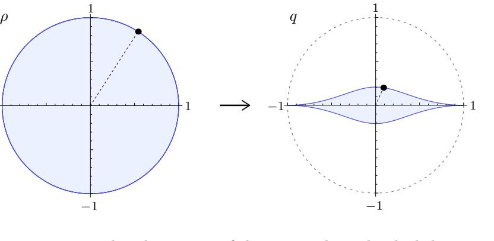

1

Figure 10. The map ρ 7→ q takes the interior of the unit circle to the shaded region on the right. In particular, the boundary of the unit ρ-circle maps inside the unit q-circle, except for ρ = ±1, which map to q = ±1.

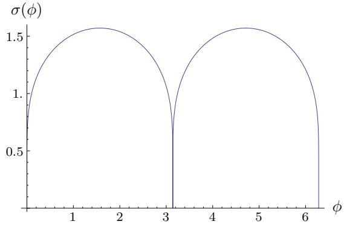

Figure 11. The value of σ(φ) = − log |q| for angles φ ∈ [0, 2π]. It is positive everywhere apart from φ ∈ πZ.

implies that g(q, q¯) is a (non-holomorphic) modular form,[25](#page-33-1)

$$g(q,\bar{q}) = \left(\sqrt{\tau\bar{\tau}}\right)^{\frac{c}{2} - 8\Delta} g(\tilde{q}, \bar{\tilde{q}}),$$

$$\tilde{q} = e^{i\pi\tilde{\tau}} = e^{-i\pi/\tau}.\tag{7.14}$$

# 7.1 All Lorentzian singularities in d = 2

−1

On the Lorentzian cylinder, ρ, ρ¯ take values on the unit circle. In q, q¯-coordinates, the unit ρ-circle gets mapped to the shape shown in figure [10](#page-33-2) — inside the unit q-circle (aside from q = ρ = ±1). The correlator g(q, q¯) is finite here, since it is given by a series in q, q¯ with positive coefficients, and this series converges for real q ∈ [0, 1). It follows that the four-point function is completely finite on the Lorentzian cylinder (aside from when ρ, ρ¯ = ±1), and in particular there is no bulk-point singularity.

25Formulated in terms of g(q, q¯), the four-point function bootstrap [\[55](#page-48-11)[–59](#page-48-12)] is almost identical to the modular bootstrap [\[60](#page-49-0), [61](#page-49-1)]. The key differences are that we must allow for non-integral coefficients in the q, q¯ expansion and that the vacuum character gets replaced by the conformal block for the identity operator.

Let us see this more explicitly. On the Lorentzian cylinder, our four-point function becomes

$$g(q, \bar{q}) = g(e^{-\sigma(\tau\_L + \phi) + i\theta(\tau\_L + \phi)}, e^{-\sigma(\tau\_L - \phi) + i\theta(\tau\_L - \phi)}),\tag{7.15}$$

where

$$\log q\left(z = \csc^2(\phi/2)\right) \equiv -\sigma(\phi) + i\theta(\phi). \tag{7.16}$$

We plot the function σ(φ) in figure [11.](#page-33-3) Importantly for us, it is positive everywhere aside from φ = 0, π.

We can now repeat the argument of the previous section, this time using q-quantization. Starting from [\(7.9\)](#page-32-2), the Cauchy-Schwarz inequality implies

$$|g(q,\bar{q})| \le \langle \psi'' | |q|^{L\_0 - \frac{c}{24}} |\bar{q}|^{\bar{L}\_0 - \frac{c}{24}} |\psi''\rangle = g(e^{-\sigma(\tau\_L + \phi)}, e^{-\sigma(\tau\_L - \phi)}) \le g(e^{-\sigma\_{\rm min}}, e^{-\sigma\_{\rm min}}),$$

$$\sigma\_{\rm min} = \min[\sigma(\tau\_L + \phi), \sigma(\tau\_L - \phi)].\tag{7.17}$$

Thus, we have bounded the Lorentzian correlator by the Euclidean one evaluated at q = q¯ = e −σmin. Note that

$$
\sigma(n\pi \pm \phi) = \sigma(\phi), \qquad n \in \mathbb{Z} \tag{7.18}
$$

so that the fundamental domain for σ is [0, π 2 ]. The Euclidean correlation function is only singular when σmin = 0. In this way we just proved that the only singularities of the Lorentzian four-point correlation function are light-cone singularities, which occur at

$$|\tau\_L| = |\pi n \pm \phi|.\tag{7.19}$$

The bulk-point configuration, which corresponds to τL = π and generic φ, is nonsingular. More precisely,

$$|g(q,\bar{q})|\_{\text{bulk}-\text{point}} \le g(e^{-\sigma(\phi)}, e^{-\sigma(\phi)}).\tag{7.20}$$

The latter is clearly finite for φ 6= 0, π, since it is strictly increasing as σ(φ) → 0, and approaches the (finite) value dictated by crossing symmetry when σ(φ) is sufficiently small but nonzero. Re-expressing [\(7.20\)](#page-34-0) in terms of the four-point function f(z, z¯), we have

$$\begin{split} |f\_{\text{bulk}-\text{point}}(\phi)| &\leq \left| \frac{z\_L^{\Delta} \Lambda(z\_L)}{z\_E^{\Delta} \Lambda(z\_E)} \right|^2 f(z\_E, z\_E), \\ &z\_L = \csc^2 \left( \frac{\phi}{2} \right), \\ &z\_E = \frac{\theta\_2 (e^{-\sigma(\phi)})^4}{\theta\_3 (e^{-\sigma(\phi)})^4}. \end{split} \tag{7.21}$$

As an example, when φ = π 2 , [\(7.21\)](#page-34-1) reads

$$\left| \left| f\_{\text{bulk}-\text{point}}(\pi/2) \right| \le 2^{c/8 - 4\Delta} f\left( 12\sqrt{2} - 16, 12\sqrt{2} - 16 \right). \tag{7.22}$$

Note that 12√ 2 − 16 ≈ 0.97, so we expect the correlator on the right-hand side to be wellapproximated by the unit operator in the other channel. In particular, the c-dependence of the bound [\(7.22\)](#page-34-2) comes primarily from the prefactor 2c/8 . The fact that the bound grows faster than any power of c is consistent, for any ∆, with the expectation that a gravity correlator grows like f gravity bulk−point(φ) ∼ c 4∆−2 as c → ∞ (figure [5\)](#page-18-1).[26](#page-35-1)

#### 7.2 Other analytic continuations

Moving in the time direction on the Lorentzian cylinder corresponds to repeatedly circling the origin ρ, ρ¯ = 0. It is also interesting to consider analytic continuations around the other singular points ρ = ±1 (equivalently z = 1, ∞). In Lorentzian signature, such continuations can be interpreted in terms of two operators crossing each others' light cones, and are needed to calculate non-time-ordered correlators in various quantizations of the theory. We will see that arbitrary analytic continuations of this type correspond to moving around inside the q, q¯ unit discs, so that the OPE expansion [\(7.9\)](#page-32-2) remains convergent.

This fact is easiest to understand in terms of the modulus τ . First note that analytic continuation around z = 0 corresponds to the PSL(2, Z) transformation T 2 : τ 7→ τ + 2. Since crossing symmetry z ↔ 1−z is a modular S-transformation, continuation around z = 1 corresponds to ST2S : τ 7→ τ 1−2τ . We do not need to separately consider the cycle around z = ∞, since it is linearly dependent with cycles around z = 0, 1. Together, T 2 and ST2S generate the principal congruence subgroup Γ(2) ¯ ⊂ PSL(2, Z), which clearly preserves the upper half-plane and hence the unit q-disc. Succinctly, τ provides a uniformization of the universal cover of the three-punctured sphere.

We can now map out all possible analytic continuations of our four-point function as follows. In the z-plane, let us draw cuts between each pair of branch points, {∞, 0}, {0, 1}, {1, ∞}, colored red, gray, and blue, respectively. Only two cuts are necessary for keeping track of the branch structure, but we include all three so as not to break the symmetry between 0, 1, ∞. Encircling a branch point thus corresponds to crossing two cuts of different colors. In the q-plane, the cut from 1 to ∞ maps to the boundary of the shaded region in figure [10](#page-33-2) (this locus corresponds to the Lorentzian cylinder configuration discussed in section 6), while the cuts between {z = ∞, z = 0} and {z = 0, z = 1} map to segments on the real line between {q = −1, q = 0} and {q = 0, q = 1} respectively. Now acting with Γ(2) on ¯ τ , we can produce the images of these cuts under continuation around the different branch points. The result is depicted in figure [12.](#page-36-1)

Every region accessible by analytic continuation has spikes that touch the boundary of the unit q-disk. These spikes correspond to light-cone singularities as z → 0, 1, ∞ on some sheet of the branched-cover of the three-punctured sphere. (These are left-moving light-cone singularities, since we are only discussing the holomorphic variable z. By additionally analytically continuing in ¯z, we can also explore right-moving light cones as well as combinations of both right- and left-moving light cones.) In fact, a dense set of points on the unit q-circle correspond to some light-cone singularity after analytic continuation. They are arranged in a fractal pattern at rational angles. Because of this fractal of singu-

26It may be possible to prove a stronger bound by using the full structure of Virasoro blocks, together with crossing symmetry, instead of just the q-expansion.

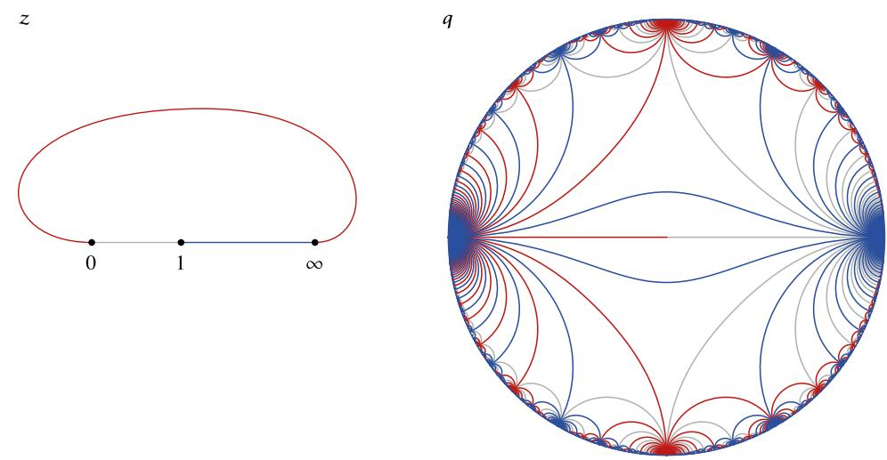

Figure 12. The map z → q takes the universal cover of the sphere with punctures at z = 0, 1,∞ to the interior of the unit q-disc. On the left, we show paths between the punctures in different colors. We imagine drawing these paths on every sheet of the universal cover. On the right, we show the images of these paths in the unit q-disc. Analytic continuation around punctures on the left corresponds to moving around inside the unit q-disc on the right. A dense set of points on the boundary of the q-disc corresponds to approaching a puncture on some sheet of the universal cover.

larities at |q| = 1, we expect it should not be possible to analytically continue the four-point function outside the unit q-circle.[27](#page-36-2)

It is remarkable that, using q-quantization, a single OPE expansion is sufficient to cover every possible analytic continuation of the four-point function g(q, q¯). By contrast, in higher dimensions where only the ρ-variable is available (without assuming additional symmetries), the OPE has only a finite radius of convergence.[28](#page-36-3)

# 8 Conclusions

In this paper we have analyzed some Lorentzian singularities of correlators. We showed that singularities of weakly coupled local quantum field theories are at the location of Landau diagrams. These Landau diagrams are a purely geometric construction that is theory independent. At each order in perturbation theory, there is a finite number of possible diagrams. It would be interesting to derive general formulas for the location of these singularities, since this could have useful applications for symbology. Of course, these remarks also hold for the usual momentum-space Landau diagram locations.

27A simple example of a function that cannot be analytically continued outside the unit q-circle is P n≥0 q n! , which is super-exponentially convergent for |q| < 1, but divergent on the unit circle at every rational angle.

28This radius of convergence can be extended by using additional information about the spectrum and OPE coefficients to partially (or completely) resum the expansion, as we did with Virasoro symmetry in this section.

We considered particular (d+ 2)-point correlation functions and argued that they have singularities (perturbatively in the 1/N expansion) at a codimension-one hypersurface in the space of cross-ratios given by det XI a = 0. This singularity arises from a particular point in the bulk. Indeed, it is a signature of a local bulk theory, acting as a microscope for that bulk point. In principle, one can imagine defining bulk correlators of n points by taking n(d + 2) points and grouping them in n groups of d + 2 so that we approach the bulk-point singularity in each group, associated to n different bulk points. In this limit, the correlator will be related to the insertion of n operators in the bulk after we factor out pieces from each singularity. This is only a sketch since we would also have to subtract contributions from graviton exchanges between the various bulk null lines.

We showed that in 1+1 or 2+1 dimensions, these bulk-point singularities cannot be reproduced by weakly-coupled theories. It would be nice to see whether this is true in 3+1 dimensions. We suspect that it should be true for generic configurations with zero determinant, but the method we used in lower dimensions was no longer applicable, since there are special configurations that do lead to such a singularity (see appendix C).

After reviewing and slightly extending the discussion of [\[13](#page-46-2)], we argued that finite α ′ effects should remove the singularity from planar correlators. It is interesting that the emergence of bulk-point singularities is something that could be seen directly by looking at planar correlators, since these might be computed using integrability in the not so distant future!

We noted that instanton effects, curiously, both at weak and strong coupling, give rise to a bulk-point singularity. This is due to a couple of simple facts: the moduli space being AdS and the correlators factorizing in the presence of an instanton. In principle, this instanton discussion is irrelevant for the emergence of the singularity in bulk perturbation theory. However, it is tempting to imagine that there could be an underlying mechanism that uses a similar idea. As a vague idea, one would suggest "fractional instantons" whose action would be divided by N and thus important at strong coupling. Such configurations were discussed in, e.g., [\[62](#page-49-2)]. More physically, one would like to argue that the sphere diagram in planar gauge theory has some zero modes corresponding to conformal transformations and nothing else. When we attach the external lines, we get a picture similar to the instanton discussion. It would be nice to make these ideas concrete. Note that in the twistor string theory, the spacetime interactions also arise from D-instanton contributions [\[63\]](#page-49-3).

The picture for parton evolution at strong coupling is that it is very rapid, with momentum becoming rapidly spread over very many low energy partons, which fill the whole spatial region within the light cone of the operator insertion [\[64\]](#page-49-4), see also [\[65](#page-49-5)]. The bulkpoint singularity arises when all these partons interact coherently, each carrying an infinitesimal amount of momentum. In this case we are not obeying the Landau rules, which hold only in perturbation theory, where parton evolution only leads to splitting into a finite number of partons.

We have noted that at finite GN , we do not expect bulk-point singularities. In 1+1 dimensions, we proved this using the full power of the conformal group. In that case, the only true singularities are light-cone singularities.

It would also be nice to relate the emergence of bulk-point singularities to the spectrum of the theory. In other words, one expects [\[11](#page-46-4)] that as the dimension of the lightest single trace higher spin (S > 2) operator, ∆∗, becomes large, then the theory should become local. The authors of [\[11](#page-46-4)] showed that the only solutions to crossing symmetry in this situation correspond to local-like interactions, in the sense that they can be described by bulk interactions of the form λnφ 2∂ 2nφ 2 , with various contractions of derivatives. However, we expect more to be true. We expect that the coefficient of such interactions should be suppressed for n > 1 as |λn| ≤ λ∗/∆2n ∗ . We have been unable to prove this conjecture.[29](#page-38-1) We propose a corresponding conjecture in flat-space physics. Namely we consider a treelevel amplitude (containing only poles) that respects causality so that it grows less rapidly than s 2 for large s. When we perform a low energy expansion of the amplitude, we will get terms that are polynomial in the Mandelstam variables, s, t, u. Then we expect that higher derivative corrections to the amplitude should be suppressed by the inverse mass of new particles. In other words, a term whose amplitude goes as A ∼ s 2+n in the large s (fixed t) region should be suppressed by 1/M2n ∗ , where M∗ is the mass of the lightest higher spin particle. We prove a weak version of this flat space conjecture in appendix A, using a slight variation of the method in [\[49\]](#page-48-6). It would be nice to prove a stronger version of the flat space conjecture. Mellin space looks like the best tool to study these issues, since the Mellin amplitudes have analytic properties similar to string tree-level amplitudes [\[12](#page-46-16), [66](#page-49-6), [67](#page-49-7)]. The bulk-point singularity arises from a Mellin amplitude that is polynomial in s and t. A true local theory governed by Einstein gravity would have higher order polynomials suppressed by inverse powers of 1/∆∗. It seems that a proof of these statements (or a corrected version of them) should be feasible.

# Acknowledgments

We thank N. Arkani-Hamed, B. Burrington, T. Hartman, D. Kosower, J. Penedones, M. Spradlin, D. Stanford, G. Turiaci, P. Vieira, I. Zadeh and A. Zamolodchikov for discussions. J.M. and D.S.D. are supported in part by U.S. Department of Energy grant DE-SC0009988. D.S.D. is also supported by a William D. Loughlin Membership at the Institute for Advanced Study. A.Z. is supported in part by U.S. Department of Energy grant DE-SC0007870.

### A Bounds on higher derivative interactions

Let us assume we have an amplitude A(s, t) that is meromorphic and with Regge behavior at infinity,

$$|A(s,t)| \le |s|^2, \qquad s \quad \text{large}, \qquad t \le 0 \tag{A.1}$$

for large s (in any direction of the complex plane) and fixed t ≤ 0 (negative t is spacelike t). The rationale for imposing this condition is that we want the amplitude to respect causality in both the u and s channels. Let us also assume that the first massive state appears at Ms.

29For an argument for the graviton three-point function see [\[51](#page-48-8)].

We can now apply an argument similar to the one in [\[49](#page-48-6)]. First let us do exactly what they do. Namely, we consider Ae(s, t) = A(s, t)−poles, where the poles are the low energy poles of particles with spin less than two. The subtracted amplitude Ae(s, t) continues to obey the high energy behavior [\(A.1\)](#page-38-2). Because we subtracted the poles (including the one at t = 0), Ae has a power series expansion around s, t = 0. Let us first set t = 0 in Ae.

We now consider the integral

$$c\_{2n} = \oint \frac{ds}{2\pi i} \frac{\tilde{A}(s, t=0)}{s^{2n+1}} = \frac{2}{\pi} \int\_{\text{cuts}, s>0} ds \frac{s \sigma(s)}{s^{2n+1}}.\tag{A.2}$$

We can neglect the contribution at infinity as long as n > 1. For a meromorphic function, the sum over cuts is simply a sum over delta functions iπδ(s − M2 k ). In other words, σ(s) contains such δ functions. Now we therefore end up with an expression of the rough form

$$c\_{2n} = \frac{2}{\pi} \int\_{M\_{\text{min}}^2}^{\infty} \frac{ds}{s} \frac{\sigma(s)}{s^{2n-1}},\tag{A.3}$$

where the integral is really a sum over δ functions. It would be nice to assume that the right-hand side was finite for n = 1. But this does not follow from our assumptions. In fact, it could be divergent. On the other hand it would be consistent with our assumptions to say that the integral on the right-hand side is convergent for n = 1 + ǫ. This implies

$$c\_{2n} \le \frac{c\_{2+2\epsilon}}{(M\_{\min}^2)^{2n-2-2\epsilon}},\tag{A.4}$$

where c2+2ǫ is defined to be the right hand side of [\(A.3\)](#page-39-0) for n = 1 + ǫ. For the case of a theory where the integral for n = 1 is finite, as was considered in [\[49\]](#page-48-6), one can set ǫ = 0 in [\(A.4\)](#page-39-1). We can also saturate the bound by classically integrating out a massive scalar field of mass Mmin.

All this discussion was for t = 0. We can now consider non-zero t. In this case, we obtain a similar expression with

$$c\_m(t) = \oint \frac{ds}{2\pi i} \frac{\tilde{A}(s,t)}{s^{m+1}} = \sum\_k \frac{1}{(M\_k^2)^{m+1}} A\_{12,M} A\_{M,34} + (-1)^m \sum\_k \frac{1}{(M\_k^2)^{m+1}} A\_{14,M} A\_{M,32},\tag{A.5}$$

where the first sum contains the poles in the s channel and the second contains the poles in the u channel. We also have a sum over spins implicit in these expressions:

$$\sum\_{\text{spins}} A\_{12,M} A\_{M,34} = \hat{C}\_l^{\frac{d-3}{2}} (\cos \theta) R\_k,\tag{A.6}$$

where Cˆν l (cos θ) = Γ(2ν)l! Γ(ℓ+2ν) C ν l (cos θ) is a normalized Gegenbauer polynomial. (In four dimensions, it is a Legendre polynomial.) Here, Rk is the same as the left-hand side when t = 0, which is the residue that appeared in [\(A.2\)](#page-39-2). Now, an important point is that for real θ, |Cˆν l (cos θ)| ≤ 1 and for θ = 0 (or t = 0), it is equal to one. This is because

$$
\hat{C}\_{l}^{\frac{d-3}{2}}(\cos \theta) = (\hat{k}\_1)^l . (\hat{k}\_3)^l, \qquad \sin^2 \frac{\theta}{2} = \frac{-t}{s}, \tag{A.7}
$$

where ˆk1 and ˆk3 are unit vectors in the direction of the center of mass frame along the momenta of the particles 1 and 3. (ˆk1) l is a symmetrized, traceless, and unit-normalized combination of l powers of ˆk1. This is maximal when ˆk3 is in the direction of ˆk1. To ensure θ is real, we may demand −M2 min ≤ t ≤ 0, since then s, t take values possible in a physical scattering process for each pole. Therefore, in the above expressions, we can bound A12,M AM,34 by their value at t = 0, allowing us to apply our previous argument.

Thus we find that

$$|c\_m(t)| \le \frac{c\_{2+2\epsilon}}{(M\_{\min}^2)^{m-2-2\epsilon}}, \qquad -M\_{\min}^2 \le t \le 0, \qquad m > 2. \tag{A.8}$$

It seems clear that with extra assumptions we might be able to do better. Another possible assumption is to demand that for t < 0, the power for large s is strictly less than two in [\(A.1\)](#page-38-2). It might be possible also that we can limit more strongly the corrections to the gravitational effective action rather than generic corrections to scalar fields. Assuming N = 8 supersymmetry, we can do better, but not as well as we expected.

### B Limits of conformal blocks and MFT OPE coefficients

Conformal blocks in d-dimensions are eigenfunctions of the Casimir operator for the conformal group SO(d, 2) [\[35](#page-47-12)]. Solving this equation in the large ∆ limit gives [\[68](#page-49-8)]

$$g\_{\Delta,\ell}(r,\phi) = \frac{\ell!}{(d-2)\_{\ell}} \frac{r^{\Delta} C\_{\ell}^{d/2-1}(\cos\phi)}{(1-r^2)^{d/2-1}\sqrt{(1+r^2)^2 - 4r^2\cos^2\phi}} \qquad (\Delta \gg 1), \tag{B.1}$$

where ρ = reiφ is defined in [\(6.5\)](#page-23-5) and C d/2−1 ℓ (cos φ) is a Gegenbauer polynomial. The above expression is valid in the limit ∆ ≫ 1 with r fixed. Here, we have normalized the block so that the leading term of g∆,ℓ(r, φ = 0) at small r is r ∆.

We also need the mixed limit ∆ → ∞, r = e −ǫ → 1 with the product t ≡ ∆ǫ fixed. Let us define g∆,ℓ(e −t/∆, φ) ≡ f∆,ℓ(t, φ). Taking the leading terms in the Casimir equation for f∆,ℓ in the large ∆ limit, we find

$$\left(t\frac{\partial^2}{\partial t^2} + (d-2)\frac{\partial}{\partial t} - t\right)f\_{\Delta,\ell}(t,\phi) = 0. \tag{B.2}$$

This has solution

$$f\_{\Delta,\ell}(t,\phi) = t^{\frac{3-d}{2}} K\_{\frac{d-3}{2}}(t) j\_{\Delta,\ell}(\phi),\tag{B.3}$$

where Kd−3 2 (t) is a Bessel function of the first kind. The function j∆,ℓ(φ) can be fixed by demanding that the limit t → ∞ of f∆,ℓ(t, φ) correctly reproduces the r → 1 limit of [\(B.1\)](#page-40-1). This gives

$$g\_{\Delta,\ell}(e^{-\epsilon},\phi) = \frac{2^{\frac{1-d}{2}}\ell!}{\sqrt{\pi}(d-2)\_{\ell}}\frac{C\_{\ell}^{d/2-1}(\cos\phi)}{|\sin\phi|}\sqrt{\Delta}\,\epsilon^{\frac{3-d}{2}}K\_{\frac{d-3}{2}}(\Delta\epsilon) \qquad (\Delta\gg1,\Delta\epsilon\text{ fixed}). \tag{B.4}$$

Several different normalizations of the conformal blocks are present in the literature. In our normalization, the Mean Field Theory OPE coefficients for double-trace operators On,ℓ ≡ O∂ 2n∂ µ1 · · · ∂ µℓO are given by [\[41\]](#page-48-0)

$$\begin{split} \bar{p}\_{n,\ell} &\equiv f\_{\mathcal{O}\mathcal{O}\mathcal{O}\_{n,\ell}}^{2}|\_{MFT} \\ &= \frac{4^{2\Delta+2n+\ell}(1+(-1)^{\ell})(2h-2)\_{\ell}(\Delta)\_{\ell+n}^{2}(\Delta+1-h)\_{n}^{2}}{\ell!n!(h-1)\_{\ell}(h+\ell)\_{n}(2\Delta+1-2h+n)\_{n}(2\Delta-h+\ell+n)\_{n}(2\Delta-1+\ell+2n)\_{\ell}}, \end{split} \tag{B.5}$$

where h = d/2.

#### C A Landau diagram on R × S 3

Here we present an example of a set of points in four dimensions, on R × S 3 , such that we can draw a Landau diagram on R × S 3 . At τ = π/2 (the final time) we have two points on the north and south pole of S 3 . Then at τ = −π/2 (the initial time) we consider four points that are on the equatorial S 2 inside S 3 . Two of the points are on opposite sides of a circle at θ0 and two are on opposite sides of the circle at π − θ0. More explicitly, we have the following points on S 2 :

$$\mathbf{t}\text{top}\_{\pm} = (\pm\sin\theta\_0, 0, \cos\theta\_0), \qquad \text{bottom}\_{\pm} = (\pm\sin\theta\_0\cos\phi, \pm\sin\theta\_0\sin\phi, -\cos\theta\_0). \tag{C.1}$$

We can now have two lines that start from top two points and meet at the north pole of S 2 at time θ0. They send lines along the great circle that contains the bottom two points. These lines travel for a time π/2−θ0. After this time, they meet a line coming from one of the bottom points that is coming along the same great circle and will collide with it. This will happen after a total time of π/2. So at this time, they produce the lines going to the north and south poles of the S 3 . The existence of this diagram suggests that there is a qualitatively new entry for the symbol of the three-loop contribution to the six-point function.

This is a special configuration, but it shows that the strategy we used to prove that there are no boundary Landau diagrams in d = 2, 3 does not work here. It would be nice to find out whether a completely generic configuration of six points with det X = 0 can or cannot have a Landau diagram purely on the boundary.

# D Transformation to the pillow metric

Consider a four-point function on the plane with coordinate x,

$$
\langle \mathcal{O}\_1(x=0)\mathcal{O}\_2(x=z)\mathcal{O}\_3(x=1)\mathcal{O}\_4(x=\infty)\rangle,\tag{D.1}
$$

where the operators Oi have conformal weights δi , ¯δi . The pillow metric is given by du du¯, where u satisfies

$$\begin{aligned} du &= \frac{1}{\theta\_3(q)^2} \frac{dx}{y}, \\ y^2 &= x(z-x)(1-x). \end{aligned} \tag{D.2}$$

Under the Weyl transformation

$$dx \, d\bar{x} \to e^{2\omega} dx \, d\bar{x} = \left| \frac{du}{dx} \right|^2 dx \, d\bar{x},\tag{D.3}$$

the correlator [\(D.1\)](#page-41-2) gets contributions from local rescaling near each operator insertion and also the Weyl anomaly. Because of the singular nature of the map x 7→ u near the operator insertions, both of these contributions must be evaluated with some care. We will address each one in turn. However, let us first make some preliminary remarks about the uniformizing coordinate u.

We choose branch cuts for y to run along (0, z) and (1, ∞). With these cuts, the plane maps to half of the torus u ∈ [0, 2π] + τ [0, π], with the operators mapping as follows:

$$\begin{aligned} \mathcal{O}\_1(x=0) &\to \mathcal{O}\_1(u=0), \\ \mathcal{O}\_2(x=z) &\to \mathcal{O}\_2(u=\pi), \\ \mathcal{O}\_3(x=1) &\to \mathcal{O}\_3(u=\pi+\pi\tau), \\ \mathcal{O}\_4(x=\infty) &\to \mathcal{O}\_4(u=\pi\tau). \end{aligned} \tag{D.4}$$

(We have not yet kept track of the rescaling of the operators due to the change of local coordinate.)

The segment u ∈ (0, π) on the pillow corresponds to moving along the top of the branch cut between x = 0 and x = z. Meanwhile, the segment u ∈ (π, 2π) corresponds to moving back below the same branch cut on the x-plane. Since the theory on the sphere has no actual cut, these paths on the pillow should be identified

$$u = t \quad \sim \quad u = 2\pi - t, \quad t \in (0, \pi). \tag{D.5}$$

Similarly for the other cut,

$$u = \pi \tau + t \quad \sim \quad u = \pi \tau + 2\pi - t, \quad t \in (0, \pi). \tag{D.6}$$

Notice that locally near each operator insertion, the map x 7→ u looks like a square-root and a rescaling, with the branch cut re-identified to create a conical defect. In the following subsections, we will examine more closely the behavior of operators and partition functions under these sorts of maps. For simplicity, we will sometimes assume the operators Oi are purely holomorphic (¯δi = 0), restoring non-holomorphic dependence at the end.

# D.1 Rescaling of local operators at branch points

Consider the behavior of O(x = 0) under a square-root map

$$x \quad \mapsto \quad \xi = 2a\sqrt{x}.\tag{D.7}$$

We take the branch cut along the positive real x-axis, so the positive and negative real ξ-axes should be identified to create a conical defect. Since our map is singular at x = 0, we should define O(ξ = 0) in terms of a limit of operators at nonsingular points. We have

$$\begin{split} \mathcal{O}(x=0) &= \lim\_{\epsilon \to 0} \mathcal{O}(x=\epsilon) \\ &= \lim\_{\epsilon \to 0} \left( \frac{a}{\sqrt{\epsilon}} \right)^{\delta} \mathcal{O}(\xi = 2a\sqrt{\epsilon}) \\ &= a^{2\delta} \left[ \lim\_{\sigma \to 0} \left( \frac{2}{\sigma} \right)^{\delta} \mathcal{O}(\xi = \sigma) \right], \end{split} \tag{D.8}$$

where we have redefined 2a √ ǫ ≡ σ.

This suggests that the quantity in brackets,

$$\mathcal{O}^{(\*)}(\xi=0) \equiv \lim\_{\sigma \to 0} \left(\frac{2}{\sigma}\right)^{\delta} \mathcal{O}(\xi=\sigma),\tag{D.9}$$

is the correct definition of a regularized operator at a conical defect in the ξ coordinate. Our calculation above now reads

$$\mathcal{O}(x=0) = a^{2\delta} \mathcal{O}^{(\*)}(\xi=0). \tag{D.10}$$

By writing the map x 7→ u locally in the form [\(D.7\)](#page-42-1) near each operator insertion, we can now use [\(D.10\)](#page-43-1) to relate operators at branch points in the x-plane to regularized operators at conical defects on the pillow,

$$\begin{aligned} \mathcal{O}\_1(x=0) &= \theta\_3(q)^{-4\delta\_1} z^{-\delta\_1} \mathcal{O}\_1^{(\*)}(u=0), \\ \mathcal{O}\_2(x=z) &= \theta\_3(q)^{-4\delta\_2} (z(1-z))^{-\delta\_2} \mathcal{O}\_2^{(\*)}(u=\pi), \\ \mathcal{O}\_3(x=1) &= \theta\_3(q)^{-4\delta\_3} (1-z)^{-\delta\_3} \mathcal{O}\_3^{(\*)}(u=\pi+\pi\tau), \\ \mathcal{O}\_4(x=\infty) &= \theta\_3(q)^{-4\delta\_4} \mathcal{O}\_4^{(\*)}(u=\pi\tau). \end{aligned} \tag{D.11}$$

(As usual, the operator at infinity O4(x = ∞) is defined by O4(w = 0), where w = 1/x is a local coordinate near ∞.)

#### D.2 The Weyl anomaly

The Weyl anomaly for a rescaling δ → e 2ω δ is given by

$$\mathcal{A} \equiv \log \mathcal{Z}[\ulcorner \ulcorner^{\in} \delta \ulcorner] - \log \mathcal{Z}[\delta \ulcorner] = \frac{\ulcorner}{\in \triangle \pi} \int \ulcorner^{\in} \sigma \,\delta \ulcorner^{\sqcup} \partial\_{\cdot} \omega \partial\_{\!\! \backslash} \omega,\tag{D.12}$$

where x = σ 1 + iσ2 , ¯x = σ 1 − iσ2 , and d 2σ = dσ1dσ2 .

As a warmup, let us compute A for the square-root mapping [\(D.7\)](#page-42-1). The coordinate ξ defines a metric

$$d\xi d\bar{\xi} = e^{2\omega} dx d\bar{x}, \quad \omega = \frac{1}{2} \log \frac{|a|^2}{|x|}. \tag{D.13}$$

Plugging ω into [\(D.12\)](#page-43-2), we find a logarithmic divergence at x = 0. This phenomenon is familiar from the plane-to-cylinder map (where ω differs from [\(D.13\)](#page-43-3) by a factor of 2). There, the anomaly contributes to a divergence in the partition function on the infinite cylinder. This divergence has a simple physical interpretation: it comes from the Casimir energy of the theory on the circle, integrated along the infinite length of the cylinder. A simple way to regulate this infinity is to instead consider a Weyl transformation to the finite-length cylinder. Equivalently, we can modify ω inside small circles around x = 0 and x = ∞ so that it is everywhere nonsingular, see, e.g., [\[69,](#page-49-9) [70](#page-49-10)].

We can adopt the same procedure here. Let us modify ω to be

$$
\omega = \begin{cases}
\frac{1}{2} \log \frac{|a|^2}{|x|} & \text{if } |\xi| > \epsilon, \\
\frac{1}{2} \log \frac{|a|^2}{|\epsilon/2a|^2} & \text{if } |\xi| \le \epsilon.
\end{cases} \tag{D.14}
$$

The anomaly contribution close to x = 0 is now

$$\mathcal{A} \sim \frac{c}{24\pi} \frac{2\pi}{4} \int\_{\left(\frac{c}{2a}\right)^2} \frac{dr}{r} = -\frac{c}{24} \log \epsilon + \text{finite}.\tag{D.15}$$

The infinite piece − c 24 log ǫ can be subtracted off to define a regularized partition function in the dξd¯ξ metric.

Let us now return to the pillow Weyl transformation,

$$\begin{split} \omega &= -\log|\theta\_3(q)|^2 - \frac{1}{2}\log|y|^2 \\ &= -\log|\theta\_3(q)|^2 - \frac{1}{2}\log|x(z-x)(1-x)|. \end{split} \tag{D.16}$$

As before, we regulate A by modifying the pillow metric inside small circles of radius ǫ around the points u = 0, π, πτ, π + πτ . It is important that we modify the metric in the same way near each of the conical defects. Suppose instead we were to choose circles of different radii ǫi around the points ui . Then the regularized pillow would no longer be invariant under reflection in the Im(u) direction when Re(τ ) = 0. Consequently, the pillow four-point function may no longer be reflection-positive. For this reason, we should choose each circle to have the same radius ǫ in the u-coordinate. These circles then map to different size circles in the x-coordinate with radii

$$\begin{aligned} r\_1 &= \left(\frac{\theta\_3(q)^2 \sqrt{z}}{2}\right)^2 \epsilon^2, \\ r\_2 &= \left(\frac{\theta\_3(q)^2 \sqrt{z(1-z)}}{2}\right)^2 \epsilon^2, \\ r\_3 &= \left(\frac{\theta\_3(q)^2 \sqrt{1-z}}{2}\right)^2 \epsilon^2, \\ r\_4 &= \left(\frac{\theta\_3(q)^2}{2}\right)^{-2} \epsilon^{-2}. \end{aligned} \tag{D.17}$$

The divergent part of the anomaly near x = 0, z, 1 is again given by [\(D.15\)](#page-44-0). A similar computation near the point at infinity gives the divergent piece −9 c 24 log ǫ. Thus, we can define the regularized anomaly contribution

$$\mathcal{A}^\* = \lim\_{\epsilon \to 0} \left( \log Z[e^{2\omega}\delta] - \log Z[\delta] + \frac{c}{2}\log \epsilon \right). \tag{D.18}$$

We are finally ready to compute A∗ for the transformation to the pillow metric. We have

$$\begin{split} \mathcal{A} &= \frac{c}{24\pi} \frac{1}{4} \int\_{R} d^2 \sigma \,\partial^a \log |y|^2 \,\partial\_a \log |y|^2 \\ &= \frac{c}{24\pi} \frac{1}{4} \oint\_{\partial R} \log |y|^2 \partial\_a \log |y|^2 dn^a, \end{split} \tag{D.19}$$

where we have used the divergence theorem together with the fact that log |y| 2 is harmonic. Locally near the points 1, 2, and 3, log |y| 2 has the form log |x − xi | + bi(x), where bi(x) is slowly varying. Hence,

$$\int\_{C\_i} \log|y|^2 \partial\_a \log|y|^2 dn^a \approx \log|x\_i + r\_i|^2 \int\_{C\_i} \frac{1}{r\_i} (-r\_i d\theta\_i) = -2\pi \log|x\_i + r\_i|^2,\tag{D.20}$$

where we have discarded terms that vanish as ri → 0. The circle at infinity contributes similarly, with an additional factor of −3. Hence, the anomaly is

$$\begin{split} \mathcal{A} &= \frac{c}{24\pi} \frac{1}{4} \left( -2\pi \right) \left( \sum\_{i=1}^{3} \log |y(x\_i + r\_i)|^2 - 3 \log |y(r\_4)|^2 \right) \\ &= -\frac{c}{48} \left( 24 \log \epsilon + 48 \log |\theta\_3(q)| + 4 \log |z(1 - z)| - 24 \log 2 \right). \end{split} \tag{D.21}$$

The regularized anomaly is

$$\mathcal{A}^\* = -c \log |\theta\_3(q)| - \frac{c}{12} \log |z(1-z)|,\tag{D.22}$$

where we have absorbed constant pieces into a redefinition of ǫ.

#### D.3 Putting everything together

Combining the results of the previous subsections, and writing only the holomorphic half of the transformation law for brevity, we have

$$\begin{split} \langle \mathcal{O}\_1(x=0)\mathcal{O}\_2(x=z) \quad \mathcal{O}\_3(x=1)\mathcal{O}\_4(x=\infty) \rangle\_{R^2} \\ = \theta\_3(q)^{\frac{c}{2} - 4(\delta\_1 + \delta\_2 + \delta\_3 + \delta\_4)} z^{\frac{c}{24} - \delta\_1 - \delta\_2} (1-z)^{\frac{c}{24} - \delta\_2 - \delta\_3} \\ \times \langle \mathcal{O}\_1^{(\*)}(u=0)\mathcal{O}\_2^{(\*)}(u=\pi)\mathcal{O}\_3^{(\*)}(u=\pi + \pi\tau)\mathcal{O}\_4^{(\*)}(u=\pi\tau) \rangle\_{\text{pillar}}^{(\*)}. \end{split} \tag{D.23}$$

Here, the regularized correlator on the pillow is defined by combining the divergent part of the Weyl anomaly with the (divergent) partition function in the pillow metric to get a finite quantity,

$$\langle \ldots \rangle\_{\text{pillow}}^{\left(\*\right)} \equiv e^{\frac{c}{2} \log \epsilon} \langle \ldots \rangle\_{\text{pillow}}.\tag{D.24}$$

We refer to the regularized four-point function in the main text as g(q, q¯). Note that our regularization procedure does not spoil reflection positivity in the case that O3 = O † 2 , O4 = O † 1 and Re(τ ) = 0 since we simply rescale the reflection-positive pillow correlator by a positive constant.

Open Access. This article is distributed under the terms of the Creative Commons Attribution License [\(CC-BY 4.0\)](http://creativecommons.org/licenses/by/4.0/), which permits any use, distribution and reproduction in any medium, provided the original author(s) and source are credited.

### References

- [1] L.D. Landau, On analytic properties of vertex parts in quantum field theory, [Nucl. Phys.](http://dx.doi.org/10.1016/0029-5582(59)90154-3) 13 (1959) 181 [IN[SPIRE](http://inspirehep.net/search?p=find+J+%22Nucl.Phys.,13,181%22)].
- [2] S. Coleman and R.E. Norton, Singularities in the physical region, [Nuovo Cim.](http://dx.doi.org/10.1007/BF02750472) 38 (1965) 438 [IN[SPIRE](http://inspirehep.net/search?p=find+J+%22NuovoCim.,38,438%22)].
- [3] R.E. Cutkosky, Singularities and discontinuities of Feynman amplitudes, [J. Math. Phys.](http://dx.doi.org/10.1063/1.1703676) 1 (1960) 429 [IN[SPIRE](http://inspirehep.net/search?p=find+J+%22J.Math.Phys.,1,429%22)].
- [4] G. Date, Factorization theorems in perturbative quantum field theory, Ph.D. thesis, report no. UMI-83-07385, SUNY, Stony Brook U.S.A. (1982) [IN[SPIRE](http://inspirehep.net/search?p=find+R+UMI-83-07385)].
- [5] O. Erdo˘gan, Coordinate-space singularities of massless gauge theories, Phys. Rev. D 89 [\(2014\) 085016](http://dx.doi.org/10.1103/PhysRevD.89.085016) [Erratum ibid. D 90 (2014) 089902] [[arXiv:1312.0058](https://arxiv.org/abs/1312.0058)] [IN[SPIRE](http://inspirehep.net/search?p=find+EPRINT+arXiv:1312.0058)].
- [6] O. Erdo˘gan and G. Sterman, Ultraviolet divergences and factorization for coordinate-space amplitudes, Phys. Rev. D 91 [\(2015\) 065033](http://dx.doi.org/10.1103/PhysRevD.91.065033) [[arXiv:1411.4588](https://arxiv.org/abs/1411.4588)] [IN[SPIRE](http://inspirehep.net/search?p=find+EPRINT+arXiv:1411.4588)].
- [7] R.F. Streater and A.S. Wightman, PCT, spin and statistics, and all that, Princeton Univ. Pr., Princeton U.S.A. (2000).
- [8] M. L¨uscher and G. Mack, Global conformal invariance in quantum field theory, [Commun. Math. Phys.](http://dx.doi.org/10.1007/BF01608988) 41 (1975) 203 [IN[SPIRE](http://inspirehep.net/search?p=find+J+%22Comm.Math.Phys.,41,203%22)].
- [9] J. Polchinski, L. Susskind and N. Toumbas, Negative energy, superluminosity and holography, Phys. Rev. D 60 [\(1999\) 084006](http://dx.doi.org/10.1103/PhysRevD.60.084006) [[hep-th/9903228](https://arxiv.org/abs/hep-th/9903228)] [IN[SPIRE](http://inspirehep.net/search?p=find+J+%22Phys.Rev.,D60,084006%22)].
- [10] M. Gary, S.B. Giddings and J. Penedones, Local bulk S-matrix elements and CFT singularities, Phys. Rev. D 80 [\(2009\) 085005](http://dx.doi.org/10.1103/PhysRevD.80.085005) [[arXiv:0903.4437](https://arxiv.org/abs/0903.4437)] [IN[SPIRE](http://inspirehep.net/search?p=find+EPRINT+arXiv:0903.4437)].
- [11] I. Heemskerk, J. Penedones, J. Polchinski and J. Sully, Holography from conformal field theory, JHEP 10 [\(2009\) 079](http://dx.doi.org/10.1088/1126-6708/2009/10/079) [[arXiv:0907.0151](https://arxiv.org/abs/0907.0151)] [IN[SPIRE](http://inspirehep.net/search?p=find+EPRINT+arXiv:0907.0151)].
- [12] J. Penedones, Writing CFT correlation functions as AdS scattering amplitudes, JHEP 03 [\(2011\) 025](http://dx.doi.org/10.1007/JHEP03(2011)025) [[arXiv:1011.1485](https://arxiv.org/abs/1011.1485)] [IN[SPIRE](http://inspirehep.net/search?p=find+EPRINT+arXiv:1011.1485)].
- [13] T. Okuda and J. Penedones, String scattering in flat space and a scaling limit of Yang-Mills correlators, Phys. Rev. D 83 [\(2011\) 086001](http://dx.doi.org/10.1103/PhysRevD.83.086001) [[arXiv:1002.2641](https://arxiv.org/abs/1002.2641)] [IN[SPIRE](http://inspirehep.net/search?p=find+EPRINT+arXiv:1002.2641)].
- [14] A.B. Goncharov, M. Spradlin, C. Vergu and A. Volovich, Classical polylogarithms for amplitudes and Wilson loops, [Phys. Rev. Lett.](http://dx.doi.org/10.1103/PhysRevLett.105.151605) 105 (2010) 151605 [[arXiv:1006.5703](https://arxiv.org/abs/1006.5703)] [IN[SPIRE](http://inspirehep.net/search?p=find+EPRINT+arXiv:1006.5703)].
- [15] L.J. Dixon, J.M. Drummond and J.M. Henn, Bootstrapping the three-loop hexagon, JHEP 11 [\(2011\) 023](http://dx.doi.org/10.1007/JHEP11(2011)023) [[arXiv:1108.4461](https://arxiv.org/abs/1108.4461)] [IN[SPIRE](http://inspirehep.net/search?p=find+EPRINT+arXiv:1108.4461)].
- [16] L. Cornalba, M.S. Costa, J. Penedones and R. Schiappa, Eikonal approximation in AdS/CFT: from shock waves to four-point functions, JHEP 08 [\(2007\) 019](http://dx.doi.org/10.1088/1126-6708/2007/08/019) [[hep-th/0611122](https://arxiv.org/abs/hep-th/0611122)] [IN[SPIRE](http://inspirehep.net/search?p=find+J+%22JHEP,0708,019%22)].
- [17] N. Arkani-Hamed and J. Trnka, The amplituhedron, JHEP 10 [\(2014\) 030](http://dx.doi.org/10.1007/JHEP10(2014)030) [[arXiv:1312.2007](https://arxiv.org/abs/1312.2007)] [IN[SPIRE](http://inspirehep.net/search?p=find+EPRINT+arXiv:1312.2007)].
- [18] G. Veneziano, Construction of a crossing-symmetric, Regge behaved amplitude for linearly rising trajectories, [Nuovo Cim.](http://dx.doi.org/10.1007/BF02824451) A 57 (1968) 190 [IN[SPIRE](http://inspirehep.net/search?p=find+J+%22NuovoCim.,A57,190%22)].
- [19] V. Alessandrini, D. Amati and B. Morel, The asymptotic behaviour of the dual pomeron amplitude, [Nuovo Cim.](http://dx.doi.org/10.1007/BF02728811) A 7 (1972) 797 [IN[SPIRE](http://inspirehep.net/search?p=find+J+%22NuovoCim.,A7,797%22)].
- [20] D.J. Gross and P.F. Mende, The high-energy behavior of string scattering amplitudes, [Phys. Lett.](http://dx.doi.org/10.1016/0370-2693(87)90355-8) B 197 (1987) 129 [IN[SPIRE](http://inspirehep.net/search?p=find+J+%22Phys.Lett.,B197,129%22)].
- [21] L.F. Alday and J.M. Maldacena, Gluon scattering amplitudes at strong coupling, JHEP 06 [\(2007\) 064](http://dx.doi.org/10.1088/1126-6708/2007/06/064) [[arXiv:0705.0303](https://arxiv.org/abs/0705.0303)] [IN[SPIRE](http://inspirehep.net/search?p=find+EPRINT+arXiv:0705.0303)].
- [22] T. Bargheer, J.A. Minahan and R. Pereira, Computing three-point functions for short operators, JHEP 03 [\(2014\) 096](http://dx.doi.org/10.1007/JHEP03(2014)096) [[arXiv:1311.7461](https://arxiv.org/abs/1311.7461)] [IN[SPIRE](http://inspirehep.net/search?p=find+EPRINT+arXiv:1311.7461)].
- [23] B. Basso, S. Komatsu and P. Vieira, Structure constants and integrable bootstrap in planar N = 4 SYM theory, [arXiv:1505.06745](https://arxiv.org/abs/1505.06745) [IN[SPIRE](http://inspirehep.net/search?p=find+EPRINT+arXiv:1505.06745)].
- [24] Z. Bajnok and R.A. Janik, String field theory vertex from integrability, JHEP 04 [\(2015\) 042](http://dx.doi.org/10.1007/JHEP04(2015)042) [[arXiv:1501.04533](https://arxiv.org/abs/1501.04533)] [IN[SPIRE](http://inspirehep.net/search?p=find+EPRINT+arXiv:1501.04533)].
- [25] M.B. Green, A gas of D-instantons, [Phys. Lett.](http://dx.doi.org/10.1016/0370-2693(95)00584-8) B 354 (1995) 271 [[hep-th/9504108](https://arxiv.org/abs/hep-th/9504108)] [IN[SPIRE](http://inspirehep.net/search?p=find+J+%22Phys.Lett.,B354,271%22)].
- [26] M.B. Green and M. Gutperle, Effects of D-instantons, [Nucl. Phys.](http://dx.doi.org/10.1016/S0550-3213(97)00269-1) B 498 (1997) 195 [[hep-th/9701093](https://arxiv.org/abs/hep-th/9701093)] [IN[SPIRE](http://inspirehep.net/search?p=find+J+%22Nucl.Phys.,B498,195%22)].
- [27] P.F. Mende and H. Ooguri, Borel summation of string theory for Planck scale scattering, [Nucl. Phys.](http://dx.doi.org/10.1016/0550-3213(90)90202-O) B 339 (1990) 641 [IN[SPIRE](http://inspirehep.net/search?p=find+J+%22Nucl.Phys.,B339,641%22)].
- [28] M. Bianchi, M.B. Green, S. Kovacs and G. Rossi, Instantons in supersymmetric Yang-Mills and D-instantons in IIB superstring theory, JHEP 08 [\(1998\) 013](http://dx.doi.org/10.1088/1126-6708/1998/08/013) [[hep-th/9807033](https://arxiv.org/abs/hep-th/9807033)] [IN[SPIRE](http://inspirehep.net/search?p=find+J+%22JHEP,9808,013%22)].
- [29] N. Dorey, T.J. Hollowood, V.V. Khoze, M.P. Mattis and S. Vandoren, Multi-instanton calculus and the AdS/CFT correspondence in N = 4 superconformal field theory, [Nucl. Phys.](http://dx.doi.org/10.1016/S0550-3213(99)00193-5) B 552 (1999) 88 [[hep-th/9901128](https://arxiv.org/abs/hep-th/9901128)] [IN[SPIRE](http://inspirehep.net/search?p=find+J+%22Nucl.Phys.,B552,88%22)].
- [30] M. Bianchi, A. Brandhuber, G. Travaglini and C. Wen, Simplifying instanton corrections to N = 4 SYM correlators, JHEP 04 [\(2014\) 101](http://dx.doi.org/10.1007/JHEP04(2014)101) [[arXiv:1312.3916](https://arxiv.org/abs/1312.3916)] [IN[SPIRE](http://inspirehep.net/search?p=find+EPRINT+arXiv:1312.3916)].
- [31] N. Arkani-Hamed, S. Dubovsky, A. Nicolis, E. Trincherini and G. Villadoro, A measure of de Sitter entropy and eternal inflation, JHEP 05 [\(2007\) 055](http://dx.doi.org/10.1088/1126-6708/2007/05/055) [[arXiv:0704.1814](https://arxiv.org/abs/0704.1814)] [IN[SPIRE](http://inspirehep.net/search?p=find+EPRINT+arXiv:0704.1814)].
- [32] S.B. Giddings and R.A. Porto, The gravitational S-matrix, Phys. Rev. D 81 [\(2010\) 025002](http://dx.doi.org/10.1103/PhysRevD.81.025002) [[arXiv:0908.0004](https://arxiv.org/abs/0908.0004)] [IN[SPIRE](http://inspirehep.net/search?p=find+EPRINT+arXiv:0908.0004)].
- [33] J. Polchinski and M.J. Strassler, Hard scattering and gauge/string duality, [Phys. Rev. Lett.](http://dx.doi.org/10.1103/PhysRevLett.88.031601) 88 (2002) 031601 [[hep-th/0109174](https://arxiv.org/abs/hep-th/0109174)] [IN[SPIRE](http://inspirehep.net/search?p=find+J+%22Phys.Rev.Lett.,88,031601%22)].
- [34] M. Hogervorst and S. Rychkov, Radial coordinates for conformal blocks, Phys. Rev. D 87 [\(2013\) 106004](http://dx.doi.org/10.1103/PhysRevD.87.106004) [[arXiv:1303.1111](https://arxiv.org/abs/1303.1111)] [IN[SPIRE](http://inspirehep.net/search?p=find+EPRINT+arXiv:1303.1111)].
- [35] F.A. Dolan and H. Osborn, Conformal partial waves and the operator product expansion, [Nucl. Phys.](http://dx.doi.org/10.1016/j.nuclphysb.2003.11.016) B 678 (2004) 491 [[hep-th/0309180](https://arxiv.org/abs/hep-th/0309180)] [IN[SPIRE](http://inspirehep.net/search?p=find+J+%22Nucl.Phys.,B678,491%22)].
- [36] L.F. Alday and A. Zhiboedov, Conformal bootstrap with slightly broken higher spin symmetry, JHEP 06 [\(2016\) 091](http://dx.doi.org/10.1007/JHEP06(2016)091) [[arXiv:1506.04659](https://arxiv.org/abs/1506.04659)] [IN[SPIRE](http://inspirehep.net/search?p=find+EPRINT+arXiv:1506.04659)].
- [37] B. Eden, C. Schubert and E. Sokatchev, Three loop four point correlator in N = 4 SYM, [Phys. Lett.](http://dx.doi.org/10.1016/S0370-2693(00)00515-3) B 482 (2000) 309 [[hep-th/0003096](https://arxiv.org/abs/hep-th/0003096)] [IN[SPIRE](http://inspirehep.net/search?p=find+J+%22Phys.Lett.,B482,309%22)].
- [38] J. Drummond, C. Duhr, B. Eden, P. Heslop, J. Pennington and V.A. Smirnov, Leading singularities and off-shell conformal integrals, JHEP 08 [\(2013\) 133](http://dx.doi.org/10.1007/JHEP08(2013)133) [[arXiv:1303.6909](https://arxiv.org/abs/1303.6909)] [IN[SPIRE](http://inspirehep.net/search?p=find+EPRINT+arXiv:1303.6909)].
- [39] D. Pappadopulo, S. Rychkov, J. Espin and R. Rattazzi, OPE convergence in conformal field theory, Phys. Rev. D 86 [\(2012\) 105043](http://dx.doi.org/10.1103/PhysRevD.86.105043) [[arXiv:1208.6449](https://arxiv.org/abs/1208.6449)] [IN[SPIRE](http://inspirehep.net/search?p=find+EPRINT+arXiv:1208.6449)].
- [40] A.L. Fitzpatrick, E. Katz, D. Poland and D. Simmons-Duffin, Effective conformal theory and the flat-space limit of AdS, JHEP 07 [\(2011\) 023](http://dx.doi.org/10.1007/JHEP07(2011)023) [[arXiv:1007.2412](https://arxiv.org/abs/1007.2412)] [IN[SPIRE](http://inspirehep.net/search?p=find+EPRINT+arXiv:1007.2412)].
- [41] A.L. Fitzpatrick and J. Kaplan, Unitarity and the holographic S-matrix, JHEP 10 [\(2012\) 032](http://dx.doi.org/10.1007/JHEP10(2012)032) [[arXiv:1112.4845](https://arxiv.org/abs/1112.4845)] [IN[SPIRE](http://inspirehep.net/search?p=find+EPRINT+arXiv:1112.4845)].
- [42] L. Cornalba, M.S. Costa, J. Penedones and R. Schiappa, Eikonal approximation in AdS/CFT: conformal partial waves and finite N four-point functions, [Nucl. Phys.](http://dx.doi.org/10.1016/j.nuclphysb.2007.01.007) B 767 (2007) 327 [[hep-th/0611123](https://arxiv.org/abs/hep-th/0611123)] [IN[SPIRE](http://inspirehep.net/search?p=find+J+%22Nucl.Phys.,B767,327%22)].
- [43] L. Cornalba, M.S. Costa and J. Penedones, Eikonal approximation in AdS/CFT: resumming the gravitational loop expansion, JHEP 09 [\(2007\) 037](http://dx.doi.org/10.1088/1126-6708/2007/09/037) [[arXiv:0707.0120](https://arxiv.org/abs/0707.0120)] [IN[SPIRE](http://inspirehep.net/search?p=find+EPRINT+arXiv:0707.0120)].
- [44] L. Cornalba, Eikonal methods in AdS/CFT: Regge theory and multi-reggeon exchange, [arXiv:0710.5480](https://arxiv.org/abs/0710.5480) [IN[SPIRE](http://inspirehep.net/search?p=find+EPRINT+arXiv:0710.5480)].
- [45] L. Cornalba, M.S. Costa and J. Penedones, Eikonal methods in AdS/CFT: BFKL pomeron at weak coupling, JHEP 06 [\(2008\) 048](http://dx.doi.org/10.1088/1126-6708/2008/06/048) [[arXiv:0801.3002](https://arxiv.org/abs/0801.3002)] [IN[SPIRE](http://inspirehep.net/search?p=find+EPRINT+arXiv:0801.3002)].
- [46] S.H. Shenker and D. Stanford, Stringy effects in scrambling, JHEP 05 [\(2015\) 132](http://dx.doi.org/10.1007/JHEP05(2015)132) [[arXiv:1412.6087](https://arxiv.org/abs/1412.6087)] [IN[SPIRE](http://inspirehep.net/search?p=find+EPRINT+arXiv:1412.6087)].
- [47] J. Maldacena, S.H. Shenker and D. Stanford, A bound on chaos, JHEP 08 [\(2016\) 106](http://dx.doi.org/10.1007/JHEP08(2016)106) [[arXiv:1503.01409](https://arxiv.org/abs/1503.01409)] [IN[SPIRE](http://inspirehep.net/search?p=find+EPRINT+arXiv:1503.01409)].
- [48] M.S. Costa, V. Goncalves and J. Penedones, Conformal Regge theory, JHEP 12 [\(2012\) 091](http://dx.doi.org/10.1007/JHEP12(2012)091) [[arXiv:1209.4355](https://arxiv.org/abs/1209.4355)] [IN[SPIRE](http://inspirehep.net/search?p=find+EPRINT+arXiv:1209.4355)].
- [49] A. Adams, N. Arkani-Hamed, S. Dubovsky, A. Nicolis and R. Rattazzi, Causality, analyticity and an IR obstruction to UV completion, JHEP 10 [\(2006\) 014](http://dx.doi.org/10.1088/1126-6708/2006/10/014) [[hep-th/0602178](https://arxiv.org/abs/hep-th/0602178)] [IN[SPIRE](http://inspirehep.net/search?p=find+J+%22JHEP,0610,014%22)].
- [50] T. Hartman, S. Jain and S. Kundu, Causality constraints in conformal field theory, JHEP 05 [\(2016\) 099](http://dx.doi.org/10.1007/JHEP05(2016)099) [[arXiv:1509.00014](https://arxiv.org/abs/1509.00014)] [IN[SPIRE](http://inspirehep.net/search?p=find+EPRINT+arXiv:1509.00014)].
- [51] X.O. Camanho, J.D. Edelstein, J. Maldacena and A. Zhiboedov, Causality constraints on corrections to the graviton three-point coupling, JHEP 02 [\(2016\) 020](http://dx.doi.org/10.1007/JHEP02(2016)020) [[arXiv:1407.5597](https://arxiv.org/abs/1407.5597)] [IN[SPIRE](http://inspirehep.net/search?p=find+EPRINT+arXiv:1407.5597)].
- [52] Al.B. Zamolodchikov, Conformal symmetry in two-dimensional space: recursion representation of conformal block, [Theor. Math. Phys.](http://dx.doi.org/10.1007/BF01022967) 73 (1987) 1088 [Teor. Math. Fiz. 73 (1987) 103].
- [53] Al.B. Zamolodchikov, Conformal symmetry in two-dimensions: an explicit recurrence formula for the conformal partial wave amplitude, [Commun. Math. Phys.](http://dx.doi.org/10.1007/BF01214585) 96 (1984) 419 [IN[SPIRE](http://inspirehep.net/search?p=find+J+%22Comm.Math.Phys.,96,419%22)].
- [54] C.-M. Chang, Y.-H. Lin, S.-H. Shao, Y. Wang and X. Yin, Little string amplitudes (and the unreasonable effectiveness of 6D SYM), JHEP 12 [\(2014\) 176](http://dx.doi.org/10.1007/JHEP12(2014)176) [[arXiv:1407.7511](https://arxiv.org/abs/1407.7511)] [IN[SPIRE](http://inspirehep.net/search?p=find+EPRINT+arXiv:1407.7511)].
- [55] A.M. Polyakov, Nonhamiltonian approach to conformal quantum field theory, Zh. Eksp. Teor. Fiz. 66 (1974) 23 [IN[SPIRE](http://inspirehep.net/search?p=find+J+%22Zh.Eksp.Teor.Fiz.,66,23%22)].
- [56] S. Ferrara, A.F. Grillo and R. Gatto, Tensor representations of conformal algebra and conformally covariant operator product expansion, [Annals Phys.](http://dx.doi.org/10.1016/0003-4916(73)90446-6) 76 (1973) 161 [IN[SPIRE](http://inspirehep.net/search?p=find+J+%22AnnalsPhys.,76,161%22)].
- [57] G. Mack, Duality in quantum field theory, [Nucl. Phys.](http://dx.doi.org/10.1016/0550-3213(77)90238-3) B 118 (1977) 445 [IN[SPIRE](http://inspirehep.net/search?p=find+J+%22Nucl.Phys.,B118,445%22)].
- [58] A.A. Belavin, A.M. Polyakov and A.B. Zamolodchikov, Infinite conformal symmetry in two-dimensional quantum field theory, [Nucl. Phys.](http://dx.doi.org/10.1016/0550-3213(84)90052-X) B 241 (1984) 333 [IN[SPIRE](http://inspirehep.net/search?p=find+J+%22Nucl.Phys.,B241,333%22)].
- [59] R. Rattazzi, V.S. Rychkov, E. Tonni and A. Vichi, Bounding scalar operator dimensions in 4D CFT, JHEP 12 [\(2008\) 031](http://dx.doi.org/10.1088/1126-6708/2008/12/031) [[arXiv:0807.0004](https://arxiv.org/abs/0807.0004)] [IN[SPIRE](http://inspirehep.net/search?p=find+EPRINT+arXiv:0807.0004)].
- [60] G.W. Moore and N. Seiberg, Polynomial equations for rational conformal field theories, [Phys. Lett.](http://dx.doi.org/10.1016/0370-2693(88)91796-0) B 212 (1988) 451 [IN[SPIRE](http://inspirehep.net/search?p=find+J+%22Phys.Lett.,B212,451%22)].
- [61] S. Hellerman, A universal inequality for CFT and quantum gravity, JHEP 08 [\(2011\) 130](http://dx.doi.org/10.1007/JHEP08(2011)130) [[arXiv:0902.2790](https://arxiv.org/abs/0902.2790)] [IN[SPIRE](http://inspirehep.net/search?p=find+EPRINT+arXiv:0902.2790)].
- [62] E. Poppitz, T. Sch¨afer and M. Unsal, ¨ Universal mechanism of (semi-classical) deconfinement and theta-dependence for all simple groups, JHEP 03 [\(2013\) 087](http://dx.doi.org/10.1007/JHEP03(2013)087) [[arXiv:1212.1238](https://arxiv.org/abs/1212.1238)] [IN[SPIRE](http://inspirehep.net/search?p=find+EPRINT+arXiv:1212.1238)].
- [63] E. Witten, Perturbative gauge theory as a string theory in twistor space, [Commun. Math. Phys.](http://dx.doi.org/10.1007/s00220-004-1187-3) 252 (2004) 189 [[hep-th/0312171](https://arxiv.org/abs/hep-th/0312171)] [IN[SPIRE](http://inspirehep.net/search?p=find+J+%22Comm.Math.Phys.,252,189%22)].
- [64] Y. Hatta, E. Iancu, A.H. Mueller and D.N. Triantafyllopoulos, Jet evolution from weak to strong coupling, JHEP 12 [\(2012\) 114](http://dx.doi.org/10.1007/JHEP12(2012)114) [[arXiv:1210.1534](https://arxiv.org/abs/1210.1534)] [IN[SPIRE](http://inspirehep.net/search?p=find+EPRINT+arXiv:1210.1534)].
- [65] D.A. Roberts, D. Stanford and L. Susskind, Localized shocks, JHEP 03 [\(2015\) 051](http://dx.doi.org/10.1007/JHEP03(2015)051) [[arXiv:1409.8180](https://arxiv.org/abs/1409.8180)] [IN[SPIRE](http://inspirehep.net/search?p=find+EPRINT+arXiv:1409.8180)].
- [66] G. Mack, D-independent representation of conformal field theories in D-dimensions via transformation to auxiliary dual resonance models. Scalar amplitudes, [arXiv:0907.2407](https://arxiv.org/abs/0907.2407) [IN[SPIRE](http://inspirehep.net/search?p=find+EPRINT+arXiv:0907.2407)].
- [67] A.L. Fitzpatrick, J. Kaplan, J. Penedones, S. Raju and B.C. van Rees, A natural language for AdS/CFT correlators, JHEP 11 [\(2011\) 095](http://dx.doi.org/10.1007/JHEP11(2011)095) [[arXiv:1107.1499](https://arxiv.org/abs/1107.1499)] [IN[SPIRE](http://inspirehep.net/search?p=find+EPRINT+arXiv:1107.1499)].
- [68] F. Kos, D. Poland and D. Simmons-Duffin, Bootstrapping the O(N) vector models, JHEP 06 [\(2014\) 091](http://dx.doi.org/10.1007/JHEP06(2014)091) [[arXiv:1307.6856](https://arxiv.org/abs/1307.6856)] [IN[SPIRE](http://inspirehep.net/search?p=find+EPRINT+arXiv:1307.6856)].
- [69] H. Sonoda, Sewing conformal field theories, [Nucl. Phys.](http://dx.doi.org/10.1016/0550-3213(88)90066-1) B 311 (1988) 401 [IN[SPIRE](http://inspirehep.net/search?p=find+J+%22Nucl.Phys.,B311,401%22)].
- [70] H. Sonoda, Sewing conformal field theories. 2, [Nucl. Phys.](http://dx.doi.org/10.1016/0550-3213(88)90067-3) B 311 (1988) 417 [IN[SPIRE](http://inspirehep.net/search?p=find+J+%22Nucl.Phys.,B311,417%22)].