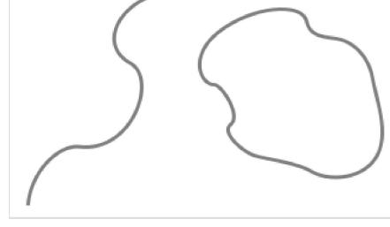
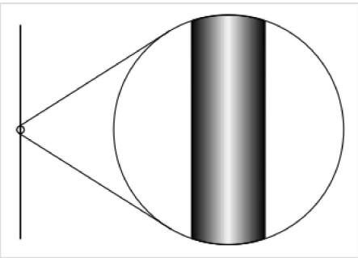
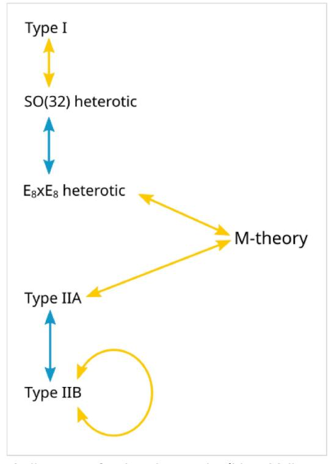
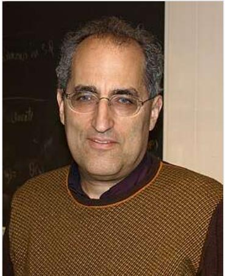
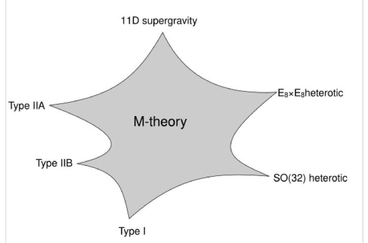
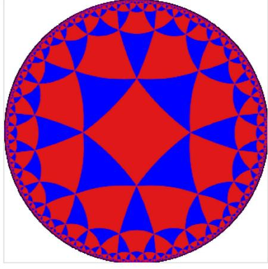
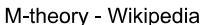
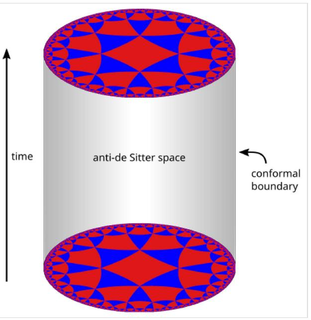
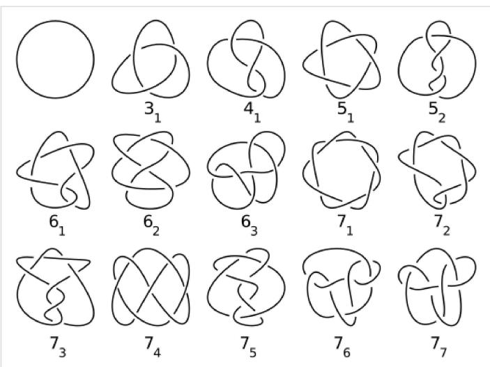
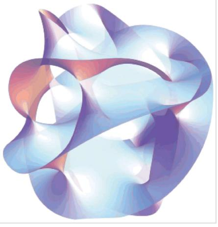

# M-theory

M-theory is a theory in physics that unifies all consistent versions of superstring theory. Edward Witten first conjectured the existence of such a theory at a string theory conference at the University of Southern California in 1995. Witten's announcement initiated a flurry of research activity known as the second superstring revolution. Prior to Witten's announcement, string theorists had identified five versions of superstring theory. Although these theories initially appeared to be very different, work by many physicists showed that the theories were related in intricate and nontrivial ways. Physicists found that apparently distinct theories could be unified by mathematical transformations called S-duality and T-duality. Witten's conjecture was based in part on the existence of these dualities and in part on the relationship of the string theories to a field theory called eleven-dimensional supergravity.

Although a complete formulation of M-theory is not known, such a formulation should describe two- and five-dimensional objects called branes and should be approximated by elevendimensional supergravity at low energies. Modern attempts to formulate M-theory are typically based on matrix theory or the AdS/CFT correspondence. According to Witten, M should stand for "magic", "mystery" or "membrane" according to taste, and the true meaning of the title should be decided when a more fundamental formulation of the theory is known.

Investigations of the mathematical structure of M-theory have spawned important theoretical results in physics and mathematics. More speculatively, M-theory may provide a framework for developing a unified theory of all of the fundamental forces of nature. Attempts to connect Mtheory to experiment typically focus on compactifying its extra dimensions to construct candidate models of the four-dimensional world, although so far none have been verified to give rise to physics as observed in high-energy physics experiments.

## Background

### Quantum gravity and strings

One of the deepest problems in modern physics is the problem of quantum gravity. The current understanding of gravity is based on Albert Einstein's general theory of relativity, which is formulated within the framework of classical physics. However, nongravitational forces are described within the framework of quantum mechanics, a radically different formalism for describing physical phenomena based on probability.14 A quantum theory of gravity is needed in order to reconcile general relativity with the principles of quantum mechanics, bl but difficulties arise when one attempts to apply the usual prescriptions of quantum theory to the force of gravity. In

The fundamental objects of string theory are open and closed strings.

String theory is a theoretical framework that attempts to reconcile gravity and quantum mechanics. In string theory, the point-like particle physics are replaced by onedimensional objects called strings. String theory describes how strings propagate through space and interact with each other. In a given version of string theory, there is only one kind of string, which may look like a small loop or segment of ordinary string, and it can vibrate in different ways. On distance scales larger than the string will look just like an ordinary particle, with its mass, charge, and other properties determined by the vibrational state of the string. In this way, all of the different elementary particles may be viewed as vibrating strings. One of the vibrational states of a string gives rise to the graviton, a quantum mechanical particle that carries gravitational force [d]

There are several versions of string theory: type IIA, type IIB, and two flavors of heterotic string theory (SO(32) and ExxEx). The different theories allow different types of strings, and the particles that arise at low energies exhibit different symmetries. For example, the type I theory includes both open strings (which are segments with endpoints) and closed strings (which form closed loops), while types IIA and IIB include only closed strings.12 Each of these five string theories arises as a special limiting case of M-theory, like its string theory predecessors, is an example of a quantum theory of gravity. It describes a force just like the familiar gravitational force subject to the rules of quantum mechanics.[3]

### Number of dimensions

An example of compactification: At large distances, a two-dimensional surface with one circular dimension looks one-dimensional.

In everyday life, there are three familiar dimensions of space: height, width and depth. Einstein's general theory of relativity treats time as a dimension on par with the three spatial dimensions; in general relativity, space and time are not modeled as separate entities but are instead unified to a fourdimensional spacetime, three spatial dimensions and one time dimension. In this framework, the phenomenon of gravity is viewed as a consequence of the geometry of spacetime. 14

In spite of the fact that the universe is well described by fourdimensional spacetime, there are several reasons why physicists consider theories in other dimensions. In some cases, by modeling spacetime in a different number of

dimensions, a theory becomes more mathematically tractable, and one can perform calculations and gain general insights more easily. 1 There are also situations where theories in two or three spacetime dimensions are useful for describing phenomena in condensed matter physics.45 Finally, there exist scenarios in which there could actually be more than four dimensions of spacetime which have nonetheless managed to escape detection.[6]

One notable feature of string theory and M-theory is that these theories require extra dimensions of spacetime for their mathematical consistency. In string theory, spacetime is ten-dimensional (nine spatial dimensions, and one time dimension), while in M-theory it is eleven-dimensional (ten spatial dimensions, and one time dimension). In order to describe real physical phenomena using these theories, one must therefore imagine scenarios in which these extra dimensions would not be observed in experiments.17]

Compactification is one way of modifying the number of dimensions in a physical theory.41 In compactification, some of the extra dimensions are assumed to "close up" on themselves to form circles.10 In the limit where these curled-up dimensions become very small, one obtains a theory in which spacetime has effectively a lower number of dimensions. A standard analogy for this is to consider a multidimensional object such as a garden hose. If the hose is viewed from a sufficient distance, it appears to have only one dimension, its length. However, as one approaches the hose, one discovers that it contains a second dimension, its circumference. Thus, an ant crawling on the surface of the hose would move in two dimensions.[8]

#### Dualities

Theories that arise as different limits of M-theory turn out to be related in highly nontrivial ways. One of the relationships that can exist between these different physical theories is called S-duality. This is a relationship which says that a collection of strongly interacting particles in one theory can, in some cases, be viewed as a collection of weakly interacting particles in a completely different theory. Roughly speaking, a collection of particles is said to be strongly interacting if they combine and decay often and weakly interacting if they do so infrequently. Type I string theory turns out to be equivalent by S-duality to the SO(32) heterotic string theory. Similarly, type IIB string theory is related to itself in a nontrivial way by S-duality. 1101

Another relationship between different string theories is T-duality. Here one considers strings propagating around a circular extra dimension. T-duality states that a string propagating around a circle of radius R is equivalent to a string propagating around a circle of radius 1/R in the sense that all observable quantities in one description are identified with quantities in the dual description. For example, a string has momentum as it propagates around a circle, and it can also wind around the circle one or

A diagram of string theory dualities. Yellow arrows indicate S-duality. Blue arrows indicate T-duality. These dualities may be combined to obtain equivalences of any of the five theories with M-theory [의

more times. The number of times the string winds around a circle is called the winding number. If a string has momentum p and winding number n in one description, it will have momentum » and winding number z in the dual description. For example, type IIA string theory is equivalent to type IIB string theory via T-duality, and the two versions of heterotic string theory are also related by Tduality.[10]

In general, the term duality refers to a situation where two seemingly different physical systems turn out to be equivalent in a nontrivial way. If two theories are related by a duality, it means that one theory can be transformed in some way so that it ends up looking just like the other theory. The two theories are then said to be dual to one another under the transformation. Put differently, the two theories are mathematically different descriptions of the same phenomena.[1]

### Supersymmetry

Another important theoretical idea that plays a role in M-theory is supersymmetry. This is a mathematical relation that exists in certain physical theories between a class of particles called bosons and a class of particles called fermions. Roughly speaking, fermions are the constituents of matter, while bosons mediate interactions between particles. In theories with supersymmetry, each boson has a counterpart which is a fermion, and vice versa. When supersymmetry is imposed as a local symmetry, one automatically obtains a quantum mechanical theory that includes gravity. Such a theory is called a supergravity theory.112

A theory of strings that incorporates the idea of supersymmetry is called a superstring theory. There are several different versions of superstring theory which are all subsumed within the Mtheory framework. At low energies, superstring theories are approximated by one of the three supergravities in ten dimensions, known as type I, type IIA, and type IIB supergravity. Similarly, M-theory is approximated at low energies by supergravity in eleven dimensions.13

### Branes

In string theory and related theories such as supergravity theories, a brane is a physical object that generalizes the notion of a point particle to higher dimensions. For example, a point particle can be viewed as a brane of dimension zero, while a string can be viewed as a brane of dimension one. It is also possible to consider higher-dimensional branes. In dimension p, these are called p-branes. Branes are dynamical objects which can propagate through spacetime according to the rules of quantum mechanics. They can have mass and other attributes such as charge. A p-brane sweeps out a (p + 1)-dimensional volume in spacetime called its worldvolume. Physicists often study fields analogous to the electromagnetic field which live on the worldvolume of a brane. The word brane comes from the word "membrane" which refers to a two-dimensional brane. [13]

In string theory, the fundamental objects that give rise to elementary particles are the onedimensional strings. Although the physical phenomena described by M-theory are still poorly understood, physicists know that the theory describes two- and five-dimensional branes. Much of the current research in M-theory attempts to better understand the properties of these branes.14

### History and development

### Kaluza-Klein theory

In the early 20th century, physicists and mathematicians including Albert Einstein and Hermann Minkowski pioneered the use of four-dimensional geometry for describing the physical world.144 These efforts culminated in the formulation of Einstein's general theory of relativity, which relates gravity to the geometry of four-dimensional spacetime. 145

The success of general relativity led to efforts to apply higher dimensional geometry to explain other forces. In 1919, work by Theodor Kaluza showed that by passing to five-dimensional spacetime, one can unify gravity and electromagnetism into a single force.1451 This idea was improved by physicist Oskar Klein, who suggested that the additional dimension proposed by Kaluza could take the form of a circle with radius around 10-30 cm.[16]

The Kaluza–Klein theory and subsequent attempts by Einstein to develop unified field theory were never completely successful. In part this was because Kaluza–Klein theory predicted a particle (the radion), that has never been shown to exist, and in part because it was unable to correctly predict the ratio of an electron's mass to its charge. In addition, these theories were being developed just as other physicists were beginning to discover quantum mechanics, which would ultimately prove successful in describing known forces such as electromagnetism, as well as new nuclear forces that were being discovered throughout the middle part of the century. Thus it would take almost fifty years for the idea of new dimensions to be taken seriously again.[17]

#### Early work on supergravity

In the 1980s, Edward Witten contributed to the understanding of supergravity theories. In 1995, he introduced M-theory, sparking the second superstring revolution.

New concepts and mathematical tools provided fresh insights into general relativity, giving rise to a period in the 1960s-1970s now known as the golden age of general relativity.[18] In the mid-1970s, physicists began studying higher-dimensional theories combining general relativity with supersymmetry, the so-called supergravity theories |19]

General relativity does not place any limits on the possible dimensions of spacetime. Although the theory is typically formulated in four dimensions, one can write down the same equations for the gravitational field in any number of dimensions. Supergravity is more restrictive because it places an upper limit on the number of dimensions. 12 In 1978, work by Werner Nahm showed that the maximum spacetime dimension in which one can formulate a consistent supersymmetric theory is eleven. 120 In the same year, Eugène Cremmer, Bernard Julia, and Joël Scherk of the École Normale Supérieure showed that supergravity not only permits up to eleven dimensions but is in fact most elegant in this maximal number of dimensions. [21][22]

Initially, many physicists hoped that by compactifying eleven-dimensional supergravity, it might be possible to construct realistic models of our four-dimensional world. The hope was that such models would provide a unified description of the four fundamental forces of nature: electromagnetism, the strong and weak nuclear forces, and gravity. Interest in eleven-dimensional supergravity soon waned as various flaws in this scheme were discovered. One of the problems was that the laws of physics appear to distinguish between clockwise and counterclockwise, a phenomenon known as chirality. Edward Witten and others observed this chirality property cannot be readily derived by compactifying from eleven dimensions.[22]

In the first superstring revolution in 1984, many physicists turned to string theory as a unified theory of particle physics and quantum gravity. Unlike supergravity theory, string theory was able to accommodate the chirality of the standard model, and it provided a theory of gravity consistent with quantum effects. 22 Another feature of string theory that many physicists were drawn to in the 1980s and 1990s was its high degree of uniqueness. In ordinary particle theories, one can consider any collection of elementary particles whose classical behavior is described by an arbitrary Lagrangian. In string theory, the possibilities are much more constrained: by the 1990s, physicists had argued that there were only five consistent supersymmetric versions of the theory. 22/

### Relationships between string theories

Although there were only a handful of consistent superstring theories, it remained a mystery why there was not just one consistent formulation. 222 However, as physicists began to examine string theory more closely, they realized that these theories are related in intricate and nontrivial ways. 231

In the late 1970s, Claus Montonen and David Olive had conjectured a special property of certain physical theories.124 A sharpened version of their concerns a theory called N = 4 supersymmetric Yang-Mills theory, which describes theoretical particles formally similar to the quarks and gluons that make up atomic nuclei. The strength with the particles of this theory interact is measured by a number called the coupling constant. The result of Montonen and Olive, now known as Montonen-Olive duality, states that N = 4 supersymmetric Yang-Mills theory with coupling constant g is equivalent to the same theory with coupling constant 1/g. In other words, a system of strongly interacting particles (large coupling constant) has an equivalent description as a system of weakly interacting particles (small coupling constant) and vice versal 351 by spinmoment.

In the 1990s, several theorists generalized Montonen-Olive duality to the S-duality relationship, which connects different string theories. Ashoke Sen studied S-duality in the context of heterotic strings in four dimensions.[26][27] Chris Hull and Paul Townsend showed that type IIB string theory with a large coupling constant is equivalent via S-duality to the same theory with small coupling constant.120 Theorists also found that different string theories may be related by Tduality. This duality implies that strings propagating on completely different spacetime geometries may be physically equivalent.1291

### Membranes and fivebranes

String theory extends ordinary particle physics by replacing zero-dimensional point particles by one-dimensional objects called strings. In the late 1980s, it was natural for theorists to attempt to formulate other extensions in which particles are replaced by two-dimensional supermembranes or by higher-dimensional objects called branes. Such objects had been considered as early as 1962 by Paul Dirac, 130 and they were reconsidered by a small but enthusiastic group of physicists in the 1980s. 22]

Supersymmetry severely restricts the possible number of a brane. In 1987, Eric Bergshoeff, Ergin Sezgin, and Paul Townsend showed that eleven-dimensional supergravity includes two-dimensional branes. 31 Intuitively, these objects look like sheets or membranes propagating through the eleven-dimensional spacetime. Shortly after this discovery, Michael Duff, Paul Howe, Takeo Inami, and Kellogg Stelle considered a particular compactification of elevendimensional supergravity with one of the dimensions curled up into a circle.[2] In this setting, one can imagine the membrane wrapping around the circular dimension. If the radius of the circle is sufficiently small, then this membrane looks just like a string in ten-dimensional spacetime. In fact, Duff and his collaborators showed that this construction reproduces exactly the strings appearing in type IIA superstring theory.[25]

In 1990, Andrew Strominger published a similar result which suggested that strongly interacting strings in ten dimensions might have an equivalent description in terms of weakly interacting fivedimensional branes.133 Initially, physicists were unable to prove this relationship for two important reasons. On the one hand, the Montonen-Olive duality was still unproven, and so

Strominger's conjecture was even more tenuous. On the other hand, there were many technical issues related to the quantum properties of five-dimensional branes. 44 The first of these problems was solved in 1993 when Ashoke Sen established that certain physical theories require the existence of objects with both electric and magnetic charge which were predicted by the work of Montonen and Olive.[35]

In spite of this progress, the relationship between strings and five-dimensional branes remained conjectural because theorists were unable to quantize the branes. Starting in 1991, a team of researchers including Michael Duff, Ramzi Khuri, Jianxin Lu, and Ruben Minasian considered a special compactification of string theory in which four of the ten dimensions curl up. If one considers a five-dimensional brane wrapped around these extra dimensions, then the brane looks just like a one-dimensional string. In this way, the conjectured relationship between strings and branes was reduced to a relationship between strings and the latter could be tested using already established theoretical techniques. 129

### Second superstring revolution

Speaking at Strings '95 at the University of Southern California in 1995, Edward Witten of the Institute for Advanced Study made the surprising suggestion that all five superstring theories were in fact just different limiting cases of a single theory in eleven spacetime dimensions. Witten's announcement drew together all of the previous results on S- and T-duality and the appearance of two- and five-dimensional branes in string theory. 36 In the months following Witten's announcement, hundreds of new papers appeared on the Internet confirming that the new theory involved membranes in an important way.137 Today this flurry of work is known as the second superstring revolution. 138]

One of the important developments following Witten's announcement was

A schematic illustration of the relationship between Mtheory, the five superstring theories, and elevendimensional supergravity. The shaded region represents a family of different physical scenarios that are possible in M-theory. In certain limiting cases corresponding to the cusps, it is natural to describe the physics using one of the six theories labeled there.

Witten's work in 1996 with string theorist Petr Hořava.[39][40] Witten and Hořava studied Mtheory on a special spacetime geometry with two ten-dimensional boundary components. Their work shed light on the mathematical structure of M-theory and suggested possible ways of connecting M-theory to real world physics.1411

### Origin of the term

Initially, some physicists suggested that the new theory was a fundamental theory of membranes, but Witten was skeptical of the role of membranes in the theory. In a paper from 1996, Horava and Witten wrote

As it has been proposed that the eleven-dimensional theory is a supermembrane theory but there are some reasons to doubt that interpretation, we will non-committally call it the M-theory, leaving to the future the relation of M to membranes. 1391

In the absence of an understanding of the true meaning and structure of M-theory, Witten has suggested that the M should stand for "magic", "mystery", or "membrane" according to taste, and the true meaning of the title should be decided when a more fundamental formulation of the theory is known. 11 Years later, he would state, "I thought my colleagues would understand that it really stood for membrane. Unfortunately, it got people confused. "142

## Matrix theory

### BFSS matrix model

In mathematics, a matrix is a rectangular array of numbers or other data. In physics, a matrix model is a particular kind of physical theory whose mathematical formulation involves the notion of a matrix in an important way. A matrix model describes the behavior of a set of matrices within the framework of quantum mechanics.[43][44]

One important example of a matrix model is the BFSS matrix model proposed by Tom Banks, Willy Fischler, Stephen Shenker, and Leonard Susskind in 1997. This theory describes the behavior of a set of nine large matrices. In their original paper, these authors showed, among other things, that the low energy limit of this matrix model is described by eleven-dimensional supergravity. These calculations led them to propose that the BFSS matrix model is exactly equivalent to M-theory. The BFSS matrix model can therefore be used as a prototype for a correct formulation of M-theory and a tool for investigating the properties of M-theory in a relatively simple setting. 43.

### Noncommutative geometry

In geometry, it is often useful to introduce coordinates. For example, in order to study the geometry of the Euclidean plane, one defines the coordinates x and y as the distances between any point in the plane and a pair of axes. In ordinary geometry, the coordinates of a point are numbers, so they can be multiplied, and the product of two coordinates does not depend on the order of multiplication. That is, xv = vx. This property of multiplication is known as the commutative law, and this relationship between geometry and the commutative algebra of coordinates is the starting point for much of modern geometry. 451

Noncommutative geometry is a branch of mathematics that attempts to generalize this situation. Rather than working with ordinary numbers, one considers some similar objects, such as matrices, whose multiplication does not satisfy the commutative law (that is, objects for which xy is not necessarily equal to vx). One imagines that these noncommuting objects are coordinates on some more general notion of "space" and proves theorems about these generalized spaces by exploiting the analogy with ordinary geometry. 46]

In a paper from 1998, Alain Connes, Michael R. Douglas, and Albert Schwarz showed that some aspects of matrix models and M-theory are described by a noncommutative quantum field theory, a special kind of physical theory in which the coordinates on spacetime do not satisfy the commutativity property.[44] This established a link between matrix models and M-theory on the one hand, and noncommutative geometry on the other hand. It quickly led to the discovery of other important links between noncommutative geometry and various physical theories. 1471[48]

## AdS/CFT correspondence

### Overview

A tessellation of the hyperbolic plane by triangles and squares

The application of quantum mechanics to physical objects such as the electromagnetic field, which are extended in space and time, is known as quantum field theory. In particle physics, quantum field theories form the basis for our understanding of elementary particles, which are modeled as excitations in the fundamental fields. Quantum field theories are also used throughout condensed matter physics to model particle-like objects called quasiparticles. In

One approach to formulating M-theory and studying its properties is provided by the anti-de Sitter/conformal field theory (AdS/CFT) correspondence. Proposed by Juan Maldacena in late 1997, the AdS/CFT correspondence is a theoretical result which implies that M-theory is in some cases equivalent to a quantum field theory. 491 In addition to

providing insights into the mathematical structure of string and M-theory, the AdS/CFT correspondence has shed light on many aspects of quantum field theory in regimes where traditional calculational techniques are ineffective.[50]

In the AdS/CFT correspondence, the geometry of spacetime is described in terms of a certain vacuum solution of Einstein's equation called anti-de Sitter space.[5] In very elementary terms, anti-de Sitter space is a mathematical model of spacetime in which the notion of distance between points (the metric) is different from the notion of distance in ordinary Euclidean geometry. It is closely related to hyperbolic space, which can be viewed as a disk as illustrated on the left.[5] This image shows a tessellation of a disk by triangles and squares. One can define the distance between points of this disk in such a way that all the triangles and squares are the same size and the circular outer boundary is infinitely far from any point in the interior.53

Now imagine a stack of hyperbolic disks where each disk represents the state of the universe at a given time. The resulting geometric object is three-dimensional anti-de Sitter space.[5] It looks like a solid cylinder in which any cross section is a copy of the hyperbolic disk. Time runs along the vertical direction in this picture. The surface of this cylinder plays an important role in the AdS/CFT correspondence. As with the hyperbolic plane, anti-de Sitter space is curved in such a way that any point in the interior is actually infinitely far from this boundary surface. 531

This construction describes a hypothetical universe with only two space dimensions and one time dimension, but it can be generalized to any number of dimensions. Indeed, hyperbolic space can have more than two dimensions and one can "stack up" copies of hyperbolic space to get higherdimensional models of anti-de Sitter space.152

#### 3/5/25, 10:47 AM

An important feature of anti-de Sitter space is its boundary (which looks like a cylinder in the case of three-dimensional anti-de Sitter space). One property of this boundary is that, within a small region on the surface around any given point, it looks just like Minkowski space, the model of spacetime used in nongravitational physics.1541 One can therefore consider an auxiliary theory in which "spacetime" is given by the boundary of anti-de Sitter space. This observation is the starting point for AdS/CFT correspondence, which states that the boundary of anti-de Sitter space can be regarded as the "spacetime" for a quantum field theory. The claim is that this quantum field theory is equivalent to the gravitational theory on the bulk anti-de Sitter space in the sense that there is a "dictionary" for translating entities and calculations in one theory into their counterparts in the other theory. For example, a single particle in the gravitational theory might correspond to some collection of particles in the boundary theory. In addition, the predictions in the two

Three-dimensional anti-de Sitter space is like a stack of hyperbolic disks, each one representing the state of the universe at a given time. One can study theories of quantum gravity such as M-theory in the resulting spacetime.

theories are quantitatively identical so that if two particles have a 40 percent chance of colliding in the gravitational theory, then the corresponding collections in the boundary theory would also have a 40 percent chance of colliding.1551

#### 6D (2,0) superconformal field theory

The six-dimensional (2,0)-theory has been used to understand results from the mathematical theory of knots.

One particular realization of the AdS/CFT correspondence states that M-theory on the product space AdS7×S4 is equivalent to the so-called (2,0)-theory on on the sixdimensional boundary. 49 Here "(2,0)" refers to to the particular type of supersymmetry that appears in the theory. In this example, the spacetime of the gravitational theory is effectively sevendimensional (hence the notation AdS7), and there are four additional "compact" dimensions (encoded by the St factor). In the real world, spacetime is fourdimensional, at least macroscopically, so this version of the correspondence does not provide a realistic model of gravity. Likewise,

the dual theory is not a viable model of any real-world system since it describes a world with six spacetime dimensions. kl

Nevertheless, the (2,0)-theory has proven to be important for studying the general properties of quantum field theories. Indeed, this theory subsumes many mathematically interesting effective quantum field theories and points to new dualities relating these theories. For example, Luis Alday, Davide Gaiotto, and Yuji Tachikawa showed that by compactifying this theory on a surface, one obtains a four-dimensional quantum field theory, and there is a duality known as the AGT correspondence which relates the physics of this theory to certain physical concepts associated with the surface itself.[5] More recently, theorists have extended these ideas to study the theories obtained by compactifying down to three dimensions.[57]

In addition to its applications in quantum field theory, the (2,0)-theory has spawned important results in pure mathematics. For example, the existence of the (2,0)-theory was used by Witten to give a "physical" explanation for a conjectural relationship in mathematics called the geometric Langlands correspondence.55 In subsequent work, Witten showed that the (2,0)-theory could be used to understand a concept in mathematics called Khovanov homology.559 Developed by Mikhail Khovanov around 2000, Khovanov homology provides a tool in knot theory, the branch of mathematics that studies and classifies the different shapes of knots. Another application of the (2,0)-theory in mathematics is the work of Davide Gaiotto, Greg Moore, and Andrew Neitzke, which used physical ideas to derive new results in hyperkähler geometry.

### ABJM superconformal field theory

Another realization of the AdS/CFT correspondence states that M-theory on AdS/xS7 is equivalent to a quantum field theory called the ABJM theory in three dimensions. In this version of the correspondence, seven of the dimensions of M-theory are curled up, leaving four non-compact dimensions. Since the spacetime of our universe is four-dimensional, this version of the correspondence provides a somewhat more realistic description of gravity.[62]

The ABJM theory appearing in this version of the correspondence is also interesting for a variety of reasons. Introduced by Aharony, Bergman, Jafferis, and Maldacena, it is closely related to another quantum field theory called Chern-Simons theory. The latter theory was popularized by Witten in the late 1980s because of its applications to knot theory. 631 In addition, the ABJM theory serves as a semi-realistic simplified model for solving problems that arise in condensed matter physics.[62]

## Phenomenology

### Overview

In addition to being an idea of considerable theoretical interest, M-theory provides a framework for constructing models of real world physics that combine general relativity with the standard model of particle physics. Phenomenology is the branch of theoretical physics in which physicists construct realistic models of nature from more abstract theoretical ideas. String phenomenology is the part of string theory that attempts to construct realistic models of particle physics based on string and M-theory.[64]

Typically, such models are based on the idea of compactification. 11 Starting with the ten- or elevendimensional spacetime of string or M-theory, physicists postulate a shape for the extra dimensions. By choosing this shape appropriately, they can construct models roughly similar to the standard

model of particle physics, together with additional undiscovered particles,665] usually supersymmetric partners to analogues of known particles. One popular way of deriving realistic physics from string theory is to start with the heterotic theory in ten dimensions and assume that the six extra dimensions of spacetime are shaped like a six-dimensional Calabi-Yau manifold. This is a special kind of geometric object named after mathematicians Eugenio Calabi and Shing-Tung Yau.[66] Calabi-Yau manifolds offer many ways of extracting realistic physics from string theory. Other similar methods can be used to construct models with physics resembling to some extent that of our four-dimensional world based on Mtheory. 67

A cross section of a Calabi-Yau manifold

Partly because of theoretical and mathematical difficulties and

partly because of the extremely high energies (beyond what is technologically possible for the foreseable future) needed to test these theories experimentally, there is so far no experimental evidence that would unambiguously point to any of these models being a correct fundamental description of nature. This has led some in the community to criticize these approaches to unification and question the value of continued research on these problems. 681

### Compactification on G2 manifolds

In one approach to M-theory phenomenology, theorists assume that the seven extra dimensions of M-theory are shaped like a G2 manifold. This is a special kind of seven-dimensional shape constructed by mathematician Dominic Joyce of the University of Oxford.[69] These G2 manifolds are still poorly understood mathematically, and this fact has made it difficult for physicists to fully develop this approach to phenomenology.l70]

For example, physicists and mathematicians often assume that space has a mathematical property called smoothness, but this property cannot be assumed in the case of a G2 manifold if one wishes to recover the physics of our four-dimensional world. Another problem is that G- manifolds are not complex manifolds, so theorists are unable to use tools from the branch of mathematics known as complex analysis. Finally, there are many open questions about the existence, uniqueness, and other mathematical properties of G2 manifolds, and mathematicians lack a systematic way of searching for these manifolds.[70]

### Heterotic M-theory

Because of the difficulties with G2 manifolds, most attempts to construct realistic theories of physics based on M-theory have taken a more indirect approach to compactifying elevendimensional spacetime. One approach, pioneered by Witten, Hořava, Burt Ovrut, and others, is known as heterotic M-theory. In this approach, one imagines that one of the eleven dimensions of M-theory is shaped like a circle. If this circle is very small, then the spacetime becomes effectively ten-dimensional. One then assumes that six of the ten dimensions form a Calabi-Yau manifold. If this Calabi-Yau manifold is also taken to be small, one is left with a theory in four-dimensions. 729

Heterotic M-theory has been used to construct models of brane cosmology in which the observable universe is thought to exist on a brane in a higher dimensional ambient space. It has also spawned alternative theories of the early universe that do not rely on the theory of cosmic inflation.179

## References

### Notes

- a. For a standard introduction to quantum mechanics, see Griffiths 2004.
- b. The necessity of a quantum mechanical description of gravity follows from the fact that one cannot consistently couple a classical system to a quantum one. See Wald 1984, p. 382.
- c. From a technical point of view, the problem is that the theory one gets in this way is not renormalizable and therefore cannot be used to make meaningful physical predictions. See Zee 2010, p. 72 for a discussion of this issue.
- d. For an accessible introduction to string theory, see Greene 2000.
- e. For example, in the context of the AdS/CFT correspondence, theorists often formulate and study theories of gravity in unphysical numbers of spacetime dimensions.
- f. Dimensional reduction is another way of modifying the number of dimensions.
- g. This analogy is used for example in Greene 2000, p. 186.
- h. For example, see the subsections on the 6D (2,0) superconformal field theory and ABJM superconformal field theory.
- i. A standard text is Peskin and Schroeder 1995,
- i. For an introduction to the applications of quantum field theory to condensed matter physics, see Zee 2010.
- k. For a review of the (2,0)-theory, see Moore 2012.
- I. Brane world scenarios provide an alternative way of recovering real world physics from string theory. See Randall and Sundrum 1999.

### Citations

- 1. Duff 1996, sec. 1
- 2. Zwiebach 2009, p. 324
- 3. Becker, Becker, and Schwarz 2007, p. 12
- 4. Wald 1984, p. 4
- 5. Zee 2010, Parts V and VI
- 6. Zwiebach 2009, p. 9
- 7. Zwiebach 2009, p. 8
- 8. Yau and Nadis 2010, Ch. 6
- 9. Becker, Becker, and Schwarz 2007, pp. 339-347
- 10. Becker, Becker, and Schwarz 2007
- 11. Zwiebach 2009, p. 376
- 12. Duff 1998, p. 64
- 13. Moore 2005
- 14. Yau and Nadis 2010, p. 9
- 15. Yau and Nadis 2010, p. 10
- 16. Yau and Nadis 2010, p. 12
- 17. Yau and Nadis 2010, p. 13
- 18. Wald 1984, p. 3
- 19. van Nieuwenhuizen 1981
- 20. Nahm 1978
- 21. Cremmer, Julia, and Scherk 1978
- 22. Duff 1998, p. 65
- 23. Duff 1998
- 24. Montonen and Olive 1977
- 25. Duff 1998, p. 66
- 26. Sen 1994a
- 27. Sen 1994b
- 28. Hull and Townsend 1995
- 29. Duff 1998, p. 67
- 30. Dirac 1962
- 31. Bergshoeff, Sezgin, and Townsend 1987
- 32. Duff et al. 1987
- 33. Strominger 1990
- 34. Duff 1998, pp. 66-67
- 35. Sen 1993
- 36. Witten 1995
- 37. Duff 1998, pp. 67-68
- 38. Becker, Becker, and Schwarz 2007, p. 296
- 39. Hořava and Witten 1996a
- 40. Hořava and Witten 1996b
- 41. Duff 1998, p. 68
- 42. Gefter, Amanda (2014). Trespassing on Einstein's Lawn: A Father, a Daughter, the Meaning of Nothing and the Beginning of Everything. Random House. ISBN 978-0-345-531438. at 345
- 43. Banks et al. 1997
- 44. Connes, Douglas, and Schwarz 1998
- 45. Connes 1994, p. 1
- 46. Connes 1994
- 47. Nekrasov and Schwarz 1998
- 48. Seiberg and Witten 1999
- 49. Maldacena 1998
- 50. Klebanov and Maldacena 2009
- 51. Klebanov and Maldacena 2009, p. 28
- 52. Maldacena 2005, p. 60
- 53. Maldacena 2005, p. 61
- 54. Zwiebach 2009, p. 552
- 55. Maldacena 2005, pp. 61-62
- 56. Alday, Gaiotto, and Tachikawa 2010
- 57. Dimofte, Gaiotto, and Gukov 2010
- 58. Witten 2009
- 59. Witten 2012
- 60. Khovanov 2000
- 61. Gaiotto, Moore, and Neitzke 2013
- 62. Aharony et al. 2008
- 63. Witten 1989
- 64. Dine 2000
- 65. Candelas et al. 1985
- 66. Yau and Nadis 2010, p. ix
- 67. Yau and Nadis 2010, pp. 147-150
- 68. Woit 2006
- 69. Yau and Nadis 2010, p. 149
- 70. Yau and Nadis 2010, p. 150

### Bibliography

- Aharony, Ofer; Bergman, Oren; Jafferis, Daniel Louis; Maldacena, Juan (2008). "Λ=6 superconformal Chern-Simons-matter theories, M2-branes and their gravity duals". Journal of High Enerqy Physics. 2008 (10): 091. arXiv:0806.1218 (https://arxiv.org/abs/0806.1218). Bibcode:2008JHEP...10..091A (https://ui.adsabs.harvard.edu/abs/2008JHEP... 10..091A). doi:10.1088/1126-6708/2008/10/091 (https://doi.org/10.1088%2F1126-6708%2F2008%2F10% 2F091). S2CID 16987793 (https://api.semanticscholar.org/CorpusID:16987793).
- · Alday, Luis; Gaiotto, Davide: Tachikawa, Yuii (2010). "Liouville correlation functions from fourdimensional gauge theories". Letters in Mathematical Physics. 91 (2): 167-197. arXiv:0906.3219 (https://arxiv.org/abs/0906.3219). Bibcode:2010LMaPh..91..167A (https://ui.ad sabs.harvard.edu/abs/2010LMaPh..91..167A). doi:10.1007/s11005-010-0369-5 (https://doi.org/ 10.1007%2Fs11005-010-0369-5). S2CID 15459761 (https://api.semanticscholar.org/CorpusID: 15459761).
- = Banks, Tom: Fischler, Willy: Schenker, Stephen: Susskind, Leonard (1997), "M theory as a matrix model: A conjecture". Physical Review D. 55 (8): 5112-5128. arXiv:hep-th/9610043 (http s://arxiv.org/abs/hep-th/9610043), Bibcode:1997PhRvD..55.5112B (https://ui.adsabs.harvard.e du/abs/1997PhRvD..55.5112B). doi:10.1103/physrevd.55.5112 (https://doi.org/10.1103%2Fphy srevd.55.5112). S2CID 13073785 (https://api.semanticscholar.org/CorpusID:13073785).
- Becker, Katrin; Becker, Melanie; Schwarz, John (2007). String theory and M-theory: A modern introduction. Cambridge University Press. ISBN 978-0-521-86069-7.
- · Bergshoeff, Eric; Sezgin; Ergin; Townsend, Paul (1987). "Supermembranes and elevendimensional supergravity" (https://pure.rug.nl/ws/files/14453122/1987PhysLettBBergshoeff4.pd f) (PDF). Physics Letters B. 189 (1): 75-78. Bibcode:1987PhLB..189...75B (https://ui.adsabs.h arvard.edu/abs/1987PhLB..189...75B). doi:10.1016/0370-2693(87)91272-X (https://doi.org/10.1 016%2F0370-2693%2887%2991272-X). S2CID 123289423 (https://api.semanticscholar.org/C orpus ID:123289423).
- Candelas, Philip; Horowitz, Gary; Strominger, Andrew; Witten, Edward (1985). "Vacuum configurations for superstrings". Nuclear Physics B. 258: 46-74. Bibcode:1985NuPhB.258...46C (https://ui.adsabs.harvard.edu/abs/1985NuPhB.258...46C), doi:10.1016/0550-3213(85)90602-9 (https://doi.org/10.1016%2F0550-3213%2885%2990602-9).
- · Connes, Alain (1994). Noncommutative Geometry (https://archive.org/details/noncommutativeg e000conn). Academic Press. ISBN 978-0-12-185860-5.
- = Connes, Alain; Douglas, Michael; Schwarz, Albert (1998). "Noncommutative geometry and matrix theory". Journal of High Energy Physics. 19981 (2): 003. arXiv:hep-th/9711162 (https://a rxiv.org/abs/hep-th/9711162). Bibcode:1998JHEP...02..003C (https://ui.adsabs.harvard.edu/ab s/1998JHEP...02..003C). doi:10.1088/1126-6708/1998/02/003 (https://doi.org/10.1088%2F1126 -6708%2F1998%2F02%2F003). S2CID 7562354 (https://api.semanticscholar.org/CorpusID:75 62354).
- Cremmer, Eugene; Julia, Bernard; Scherk, Joël (1978). "Supergravity theory in eleven dimensions". Physics Letters B. 76 (4): 409-412. Bibcode:1978PhLB...76..409C (https://ui.ads abs.harvard.edu/abs/1978PhLB...76..409C). doi:10.1016/0370-2693(78)90894-8 (https://doi.or g/10.1016%2F0370-2693%2878%2990894-8).

- · Dimofte, Tudor; Gaiotto, Davide; Gukov, Sergei (2010). "Gauge theories labelled by threemanifolds" (https://web.archive.org/web/20200918121625/https://authors.library.caltech.edu/43 760/). Communications in Mathematical Physics. 325 (2): 367—419. arXiv:1108.4389 (https://ar xiv.org/abs/1108.4389). Bibcode:2014CMaPh.325..367D (https://ui.adsabs.harvard.edu/abs/20 14CMaPh.325..367D). doi:10.1007/s00220-013-1863-2 (https://doi.org/10.1007%2Fs00220-01 3-1863-2). S2CID 10882599 (https://api.semanticscholar.org/CorpusID:10882599). Archived from the original (http://authors.library.caltech.edu/43760/) on 2020-09-18. Retrieved 2017-07-04.
- Dine, Michael (2000). "TASI Lectures on M Theory Phenomenology". Strings, Branes and Gravity: 545—612. arXiv:hep-th/0003175 (https://arxiv.org/abs/hep-th/0003175). doi:10.1142/9789812799630 0006 (https://doi.org/10.1142%2F9789812799630 0006). ISBN 978-981-02-4774-4. S2CID 17851652 (https://api.semanticscholar.org/CorpusID:178516 52).
- Dirac, Paul (1962). "An extensible model of the electron". Proceedings of the Royal Society of London. A. Mathematical and Physical Sciences. 268 (1332): 57-67. Bibcode:1962RSPSA.268...57D (https://ui.adsabs.harvard.edu/abs/1962RSPSA.268...57D). doi:10.1098/rspa.1962.0124 (https://doi.org/10.1098%2Frspa.1962.0124). S2CID 122728729 (https://api.semanticscholar.org/CorpusID:122728729).
- Duff, Michael (1996). "M-theory (the theory formerly known as strings)". International Journal of Modern Physics A. 11 (32): 6523–41. arXiv:hep-th/9608117 (https://arxiv.org/abs/hep-th/96081 17). Bibcode:1996IJMPA.. 11.5623D (https://ui.adsabs.harvard.edu/abs/1996IJMPA.. 11.5623D). doi:10.1142/S0217751X96002583 (https://doi.org/10.1142%2FS0217751X96002583). S2CID 17432791 (https://api.semanticscholar.org/CorpusID:17432791).
- = Duff, Michael (1998). "The theory formerly known as strings". Scientific American. 278 (2): 64— 9. Bibcode:1998SciAm.278b..64D (https://ui.adsabs.harvard.edu/abs/1998SciAm.278b..64D). do: 10.1038/scientificamerican0298-64 (https://doi.org/10.1038%2Fscientificamerican0298-64).
- Duff, Michael; Howe, Paul; Inami, Takeo; Stelle, Kellogg (1987). "Superstrings in D=10 from supermembranes in D=11" (https://cds.cern.ch/record/175621). Nuclear Physics B. 191 (1): 70-74. Bibcode:1987PhLB..191...70D (https://ui.adsabs.harvard.edu/abs/1987PhLB..191...70 D). doi:10.1016/0370-2693(87)91323-2 (https://doi.org/10.1016%2F0370-2693%2887%299132 3-2).
- = Gaiotto, Davide; Moore, Gregory; Neitzke, Andrew (2013). "Wall-crossing, Hitchin systems, and the WKB approximation" (https://doi.org/10.1016%2Fj.aim.2012.09.027). Advances in Mathematics. 234: 239-403. arXiv:0907.3987 (https://arxiv.org/abs/0907.3987). doi:10.1016/j.aim.2012.09.027 (https://doi.org/10.1016%2Fj.aim.2012.09.027).
- · Greene, Brian (2000). The Elegant Universe: Superstrings, Hidden Dimensions, and the Quest for the Ultimate Theory. Random House. ISBN 978-0-9650888-0-0.
- = Griffiths, David (2004), Introduction to Quantum Mechanics. Pearson Prentice Hall. ISBN 978-0-13-111892-8.
- Hořava, Petr; Witten, Edward (1996a). "Heterotic and Type I string dynamics from eleven dimensions". Nuclear Physics B. 460 (3): 506–524. arXiv:hep-th/9510209 (https://arxiv.org/abs/ hep-th/9510209), Bibcode:1996NuPhB.460..506H (https://ui.adsabs.harvard.edu/abs/1996NuP hB.460..506H). doi:10.1016/0550-3213(95)00621-4 (https://doi.org/10.1016%2F0550-3213%2 895%2900621-4). S2CID 17028835 (https://api.semanticscholar.org/CorpusID:17028835).
- Hořava, Petr; Witten, Edward (1996b). "Eleven dimensional supergravity on a manifold with boundary". Nuclear Physics B. 475 (1): 94-114. arXiv:hep-th/9603142 (https://ar.iv.org/abs/hep -th/9603142). Bibcode:1996NuPhB.475...94H (https://ui.adsabs.harvard.edu/abs/1996NuPhB.4 75...94H), doi:10.1016/0550-3213(96)00308-2 (https://doi.org/10.1016%2F0550-3213%2896% 2900308-2). S2CID 16122181 (https://api.semanticscholar.org/CorpusID:16122181).
- Hull, Chris; Townsend, Paul (1995). "Unity of superstring dualities". Nuclear Physics B. 4381 (1): 109-137. arXiv:hep-th/9410167 (https://arxiv.org/abs/hep-th/9410167), Bibcode:1995NuPhB.438..109H (https://ui.adsabs.harvard.edu/abs/1995NuPhB.438..109H). doi:10.1016/0550-3213(94)00559-W (https://doi.org/10.1016%2F0550-3213%2894%2900559-W). S2CID 13889163 (https://api.semanticscholar.org/CorpusID:13889163).
- Khovanov, Mikhail (2000). "A categorification of the Jones polynomial". Duke Mathematical Journal. 1011 (3): 359-426. arXiv:math/9908171 (https://arxiv.org/abs/math/9908171). doi:10.1215/S0012-7094-00-10131-7 (https://doi.org/10.1215%2FS0012-7094-00-10131-7). S2CID 119585149 (https://api.semanticscholar.org/CorpusID:119585149).
- Klebanov, Igor; Maldacena, Juan (2009). "Solving Quantum Field Theories via Curved Spacetimes" (https://web.archive.org/web/20100610021741/http://www.sns.ias.edu/~malda/Pu blished.pdf) (PDF). Physics Today. 62 (1): 28. Bibcode:2009PhT....62a..28K (https://ui.adsabs. harvard.edu/abs/2009PhT....62a..28K). doi:10.1063/1.3074260 (https://doi.org/10.1063%2F1.3 074260). Archived from the original on 2010-06-10.
- Maldacena, Juan (1998). "The Large N limit of superconformal field theories and supergravity". Advances in Theoretical and Mathematical Physics. 2 (2): 231-252. arXiv:hep-th/9711200 (http s://arxiv.org/abs/hep-th/9711200). Bibcode:1998AdTMP...2..231M (https://ui.adsabs.harvard.ed u/abs/1998AdTMP...2..231M). doi:10.4310/ATMP.1998.V2.N2.A1 (https://doi.org/10.4310%2FA TMP.1998.V2.N2.A1).
- Maldacena, Juan (2005). "The Illusion of Gravity" (https://web.archive.org/web/2013111006123 7/http://www.sns.ias.edu/~maldacena-3a.pdf) (PDF). Scientific American. 293 (5): 56-63. Bibcode:2005SciAm.293e.56M (https://ui.adsabs.harvard.edu/abs/2005SciAm.293e..5 6M). doi:10.1038/scientificamerican1105-56 (https://doi.org/10.1038%2Fscientificamerican1105 -56). PMID 16318027 (https://pubmed.ncbi.nlm.nih.gov/16318027). Archived from the original on 2013-11-10.
- Montonen, Claus; Olive, David (1977). "Magnetic monopoles as gauge particles?" (https://cds.c ern.ch/record/422232). Physics Letters B. 72 (1): 117-120. Bibcode:1977PhLB...72..117M (http s://ui.adsabs.harvard.edu/abs/1977PhLB...72..117M). doi:10.1016/0370-2693(77)90076-4 (http s://doi.org/10.1016%2F0370-2693%2877%2990076-4).
- Moore, Gregory (2005). "What is ... a Brane?" (https://www.ams.org/notices/200502/what-is.pd f) (PDF). Notices of the AMS. 52: 214. Retrieved 6 August 2016.
- Moore, Gregory (2012). "Lecture Notes for Felix Klein Lectures" (http://www.physics.rutgers.ed u/~gmoore/FelixKleinLectureNotes.pdf) (PDF). Retrieved 14 August 2013.
- Nahm, Walter (1978). "Supersymmetries and their representations" (https://cds.cern.ch/record/ 132743). Nuclear Physics B. 135 (1): 149-166. Bibcode:1978NuPhB.135..149N (https://ui.adsa bs.harvard.edu/abs/1978NuPhB.135..149N). doi:10.1016/0550-3213(78)90218-3 (https://doi.or g/10.1016%2F0550-3213%2878%2990218-3).
- Nekrasov, Nikita; Schwarz, Albert (1998). "Instantons on noncommutative R4 and (2,0) superconformal six dimensional theory". Communications in Mathematical Physics. 198 (3): 689-703. arXiv:hep-th/9802068 (https://arxiv.org/abs/hep-th/9802068). Bibcode:1998CMaPh.198..689N (https://ui.adsabs.harvard.edu/abs/1998CMaPh.198..689N), doi:10.1007/s002200050490 (https://doi.org/10.1007%2Fs002200050490). S2CID 14125789 (https://api.semanticscholar.org/CorpusID:14125789).
- Peskin, Michael; Schroeder, Daniel (1995). An Introduction to Quantum Field Theory (https://ar chive.org/details/introductiontoqu0000pesk). Westview Press. ISBN 978-0-201-50397-5.
- · Randall, Lisa; Sundrum, Raman (1999). "An alternative to compactification". Physical Review Letters. 83 (23): 4690-4693. arXiv:hep-th/9906064 (https://arxiv.org/abs/hep-th/9906064). Bibcode:1999PhRvL..83.4690R (https://ui.adsabs.harvard.edu/abs/1999PhRvL..83.4690R), doi:10.1103/PhysRevLett.83.4690 (https://doi.org/10.1103%2FPhysRevLett.83.4690). S2CID 18530420 (https://api.semanticscholar.org/CorpusID:18530420).
- Seiberg, Nathan; Witten, Edward (1999). "String Theory and Noncommutative Geometry". Journal of High Energy Physics. 1999 (9): 032. arXiv:hep-th/9908142 (https://arxiv.org/abs/hepth/9908142). Bibcode:1999JHEP...09..032S (https://ui.adsabs.harvard.edu/abs/1999JHEP...0 9..032S). doi:10.1088/1126-6708/1999/09/032 (https://doi.org/10.1088%2F1126-6708%2F199 9%2F09%2F032). S2CID 668885 (https://api.semanticscholar.org/CorpusID:66885).
- = Sen, Ashoke (1993). "Electric-magnetic duality in string theory". Nuclear Physics B. 404 (1): 109-126. arXiv:hep-th/9207053 (https://arxiv.org/abs/hep-th/9207053). Bibcode:1993NuPhB.404..109S (https://ui.adsabs.harvard.edu/abs/1993NuPhB.404..109S). doi:10.1016/0550-3213(93)90475-5 (https://doi.org/10.1016%2F0550-3213%2893%2990475-5). S2CID 18887335 (https://api.semanticscholar.org/CorpusID:18887335).
- Sen, Ashoke (1994a). "Strong-weak coupling duality in four-dimensional string theory". International Journal of Modern Physics A. 9 (21): 3707-3750. arXiv:hep-th/9402002 (https://ar xiv.org/abs/hep-th/9402002). Bibcode:1994IJMPA...9.3707S (https://ui.adsabs.harvard.edu/ab s/1994IJMPA...9.3707S). doi:10.1142/S0217751X94001497 (https://doi.org/10.1142%2FS0217 751X94001497). S2CID 16706816 (https://api.semanticscholar.org/CorpusID:16706816).
- = Sen, Ashoke (1994b). "Dyon-monopole bound states, self-dual harmonic forms on the multimonopole moduli space, and SZ(2,Z) invariance in string theory". Physics Letters B. 329 (2): 217-221. arXiv:hep-th/9402032 (https://arxiv.org/abs/hep-th/9402032). Bibcode:1994PhLB..329..217S (https://ui.adsabs.harvard.edu/abs/1994PhLB..329..217S). doi:10.1016/0370-2693(94)90763-3 (https://doi.org/10.1016%2F0370-2693%2894%2990763-3). S2CID 17534677 (https://api.semanticscholar.org/CorpusID:17534677).
- = Strominger, Andrew (1990). "Heterotic solitons". Nuclear Physics B. 343 (1): 167-184. Bibcode:1990NuPhB.343..167S (https://ui.adsabs.harvard.edu/abs/1990NuPhB.343..167S). doi:10.1016/0550-3213(90)90599-9 (https://doi.org/10.1016%2F0550-3213%2890%2990599-9).
- van Nieuwenhuizen, Peter (1981). "Supergravity". Physics Reports. 68 (4): 189-398. Bibcode:1981PhR....68..189V (https://ui.adsabs.harvard.edu/abs/1981PhR....68..189V). doi:10.1016/0370-1573(81)90157-5 (https://doi.org/10.1016%2F0370-1573%2881%2990157-5).
- Wald, Robert (1984). General Relativity (https://archive.org/details/generalrelativit0000wald). University of Chicago Press. ISBN 978-0-226-87033-5.
- · Witten, Edward (1989). "Quantum Field Theory and the Jones Polynomial". Communications in Mathematical Physics. 121 (3): 351-399. Bibcode:1989CMaPh.121..351W (https://ui.adsabs.h arvard.edu/abs/1989CMaPh.121..351W). doi:10.1007/BF01217730 (https://doi.org/10.1007%2 FBF01217730). MR 0990772 (https://mathscinet.ams.org/mathscinet-getitem?mr=0990772). S2CID 14951363 (https://api.semanticscholar.org/CorpusID:14951363).
- = Witten, Edward (1995). "String theory dynamics in various dimensions". Nuclear Physics B. 443 (1): 85-126. arXiv:hep-th/9503124 (https://arxiv.org/abs/hep-th/9503124). Bibcode:1995NuPhB.443...85W (https://ui.adsabs.harvard.edu/abs/1995NuPhB.443...85W). doi:10.1016/0550-3213(95)00158-O (https://doi.org/10.1016%2F0550-3213%2895%2900158-O). S2CID 16790997 (https://api.semanticscholar.org/CorpusID:16790997).
- Witten, Edward (2009). "Geometric Langlands from six dimensions". arXiv:0905.2720 (https://a rxiv.org/abs/0905.2720) [hep-th (https://arxiv.org/archive/hep-th)].
- Witten, Edward (2012). "Fivebranes and knots". Quantum Topology. 3 (1): 1–137. arXiv:1101.3216 (https://arxiv.org/abs/1101.3216). doi:10.4171/QT/26 (https://doi.org/10.4171% 2FQT%2F26). S2CID 119248828 (https://api.semanticscholar.org/CorpusID:119248828).
- = Woit, Peter (2006). Not Even Wrong: The Failure of String Theory and the Search for Unity in Physical Law (https://archive.org/details/notevenwrongfail00woit/page/105). Basic Books. p. 105 (https://archive.org/details/notevenwrongfail00woit/page/105). ISBN 0-465-09275-6.
- Yau, Shing-Tung; Nadis, Steve (2010). The Shape of Inner Space: String Theory and the Geometry of the Universe's Hidden Dimensions. Basic Books. ISBN 978-0-465-02023-2.
- = Zee, Anthony (2010). Quantum Field Theory in a Nutshell (https://archive.org/details/ishn 9780 691140346) (2nd ed.). Princeton University Press. ISBN 978-0-691-14034-6.
- = Zwiebach, Barton (2009). A First Course in String Theory. Cambridge University Press. ISBN 978-0-521-88032-9.

## Popularization

- BBC Horizon: "Parallel Universes" (https://www.bbc.co.uk/science/horizon/2001/paralleluni.sht ml) - 2002 feature documentary by BBC Horizon, episode "Parallel Universes" focuses on the history and emergence of M-theory, and scientists involved
- [1] (https://www.pbs.org/wgbh/nova/physics/elegant-universe.html) PBS.org-NOVA: The Elegant Universe] - 2003 Emmy Award-winning, three-hour miniseries by Nova with Brian Greene, adapted from his The Elegant Universe book (original PBS broadcast dates: October 28, 8-10 p.m. and November 4, 8-9 p.m., 2003)

## See also

- F-theory .
- Multiverse

## External links

- = Superstringtheory.com (http://superstringtheory.com/) The "Official String Theory Web Site", created by Patricia Schwarz. References on string theory and M-theory for the layperson and expert.
- Not Even Wrong (http://www.math.columbia.edu/~woit/wordpress/) Peter Woit's blog on physics in general, and string theory in particular.
- M-Theory Edward Witten (1995) (https://www.math.stonybrook.edu/Video.php?f= 35-Witten) - Witten's 1995 lecture introducing M-Theory.

Retrieved from "https://en.wikipedia.org/w/index.php?title=M-theory&oldid=1272438184"