# WIKIPEDIA VIKIPEDIA

# Quantum electrodynamics

In particle physics, quantum electrodynamics (QED) is the relativistic quantum field theory of electrodynamics.[1][2][3] In essence, it describes how light and matter interact and is the first theory where full agreem quantum mechanics and special relativity is achieved.12 QED mathematically describes all phenomena involving electrically charged particles interacting by means of exchange of photons and represents the quantum counterpart of classical electromagnetism giving a complete account of matter and light interaction. 12131

In technical terms, QED can be described as a very accurate way to calculate the probability of the position and movement of particles, even those massless such as photons, and the quantity depending on position (field) of those particles, and described light and matter beyond the wave-particle duality proposed by Albert Einstein in 1905. Richard Feynman called it "the jewel of physics" for its extremely accurate predictions of quantities like the anomalous magnetic moment of the electron and the Lamb shift of the energy levels of hydrogen.[2] . It is the most precise and stringently tested theory in physics.[4][5]

# History

The first formulation of a quantum theory describing radiation and matter interaction is attributed to British scientist Paul Dirac, who during the 1920s computed the coefficient of spontaneous emission of an atom.1.1 He is credited with coining the term "quantum electrodynamics".[7]

Dirac described the quantization of the electromagnetic field as an ensemble of harmonic oscillators with the introduction of the concept of creation and annihilation operators of particles. In the following years, with contributions from Wolfgang Pauli, Eugene Wigner, Pascual Jordan, Werner Heisenberg and Enrico Fermi, 10 physicists came to believe that, in principle, it was possible to perform any computation for any physical process involving photons and charged particles. However, further studies by Felix Bloch with Arnold Nordsieck, 12 and Victor Weisskopf, 120 in 1937 and 1939, revealed that such computations were reliable only at a first order of perturbation theory, a problem already pointed out by Robert Oppenheimer. 111 At higher orders in the series infinities emerged, making such computations

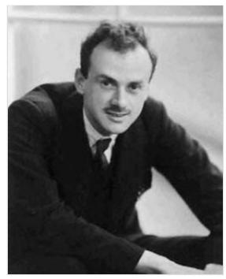

Paul Dirac

meaningless and casting doubt on the theory's internal consistency. This suggested that special relativity and quantum mechanics were fundamentally incompatible.

Difficulties increased through the end of the 1940s. Improvements in microwave technology made it possible to take more precise measurements of the levels of a hydrogen atom,[2] later known as the Lamb shift and magnetic moment of the electron.[13] These experiments exposed discrepancies that the theory was unable to explain.

A first indication of a possible solution was given by Bethe in 1947.[14][5] He made the first nonrelativistic computation of the shift of the lines of the hydrogen atom as measured by Lamb and Retherford. 141 Despite limitations of the computation, agreement was excellent. The idea was simply to attach infinities to corrections of mass and charge that were actually fixed to a finite value by experiments. In this way, the infinities get absorbed in those constants and yield a finite result with good experiment. This procedure was named renormalization.

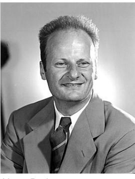

Hans Bethe

Based on Bethe's intuition and fundamental papers on the subject by Shin'ichiro Tomonaga,1165 Julian Schwinger,[27][18] Richard Feynman[1][19][20] and Freeman Dyson,[21][22] it was finally

possible to produce fully covariant formulations that were finite at any order in a perturbation series of quantum electrodynamics. Tomonaga, Schwinger, and Feynman were jointly awarded the 1965 Nobel Prize in Physics for their work in this area.[23] Their contributions, and Dyson's, were about covariant formulations of quantum electrodynamics that allow computations of observables at any order of perturbation theory. Feynman's mathematical technique, based on his diagrams, initially seemed unlike the field-theoretic, operator-based approach of Schwinger and Tomonaga, but Dyson later showed that the two approaches were equivalent.121 Renormalization, the need to attach a physical meaning at certain divergences appearing integrals, became one of the fundamental aspects

of quantum field theory and is seen as a criterion for a theory's general acceptability. Even though renormalization works well in practice, Feynman was never entirely comfortable with its mathematical validity, referring to renormalization as a "shell game" and "hocus pocus".[2]:128

Neither Feynman nor Dirac were happy with that way to approach the observations made in theoretical physics, above all in quantum mechanics.[24]

QED is the model and template for all subsequent quantum field theories. One such subsequent theory is quantum chromodynamics, which began in the early 1960s and attained its present form in the 1970s, developed by H. David Politzer, Sidney Coleman, David Gross and Frank Wilczek. Building on Schwinger's pioneering work, Gerald Guralnik, Dick Hagen, and Tom Kibble, 25126 Peter Higgs, Jeffrey Goldstone, and

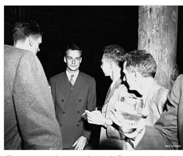

Feynman (center) and Oppenheimer (right) at Los Alamos.

others, Sheldon Glashow, Steven Weinberg and Abdus Salam independently showed how the weak nuclear force and quantum electrodynamics could be merged into a single electroweak force.

# Feynman's view of quantum electrodynamics

#### Introduction

Near the end of his life, Richard Feynman gave a series of lectures on QED intended for the lay public. These lectures were transcribed and published as Feynman (1985), QED: The Strange Theory of Light and Matter, 12 a classic nonmathematical exposition of QED from the point of view articulated below.

The key components of Feynman's presentation of QED are three basic actions.[2]:85

A photon goes from one place and time to another place and time. An electron goes from one place and time to another place and time. An electron emits or absorbs a photon at a certain place and time.

These actions are represented in the form of visual shorthand by the three basic elements of diagrams: a wavy line for the photon, a straight line for the electron and a junction of two straight lines and a wavy one for a vertex representing emission or absorption of a photon by an electron. These can all be seen in the adjacent diagram.

As well as the visual shorthand for the actions, Feynman introduces another kind of shorthand for the numerical quantities called probability amplitudes. The probability is the square of the absolute value of total probability amplitude, probability = |f(amplitude)|4. If a photon moves from one place and time A to another place and time B, the associated quantity is written in Feynman's shorthand as P(A to B), and it depends on only the momentum and polarization of the photon. The similar quantity for an electron moving from C to D is written E(C to D). It depends on the momentum and polarization of the electron, in addition to a constant Feynman calls n, sometimes called the "bare" mass of the electron: it is related to, but not the same as, the measured electron mass. Finally, the

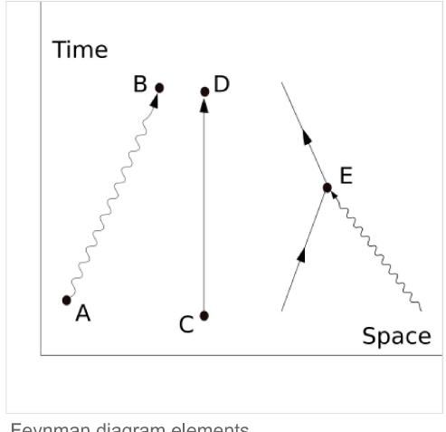

Feynman diagram elements

quantity that tells us about the probability amplitude for an electron to emit or absorb a photon Feynman calls i, and is sometimes called the "bare" charge of the electron: it is a constant, and is related to, but not the same as, the measured electron charge e.[2]:91

QED is based on the assumption that complex interactions of many electrons and photons can be represented by fitting together a suitable collection of the above three building blocks and then using the probability amplitudes to calculate the probability of any such complex interaction. It turns out that the basic idea of QED can be communicated while assuming that the square of the total of the probability amplitudes mentioned above (PA to B), E(C to D) and j) acts just like our everyday probability (a simplification made in Feynman's book). Later on, this will be corrected to include specifically quantum-style mathematics, following Feynman.

The basic rules of probability amplitudes that will be used are:[2]:93

a. If an event can occur via a number of indistinguishable alternative processes (a.k.a. "virtual" processes), then its probability amplitude is the sum of the probability amplitudes of the alternatives.

3/5/25, 10:36 AM

#### Quantum electrodynamics - Wikipedia

b. If a virtual process involves a number of independent or concomitant sub-processes, then the probability amplitude of the total (compound) process is the product of the probability amplitudes of the sub-processes.

The indistinguishability criterion in (a) is very important: it means that there is no observable feature present in the given system that in any way "reveals" which alternative is taken. In such a case, one cannot observe which alternative actually takes place without changing the experimental setup in some way (e.g. by introducing a new apparatus into the system). Whenever one is able to observe which alternative takes place, one always finds that the probability of the event is the sum of the probabilities of the alternatives. Indeed, if this were not the very term "alternatives" to describe these processes would be inappropriate. What (a) says is that once the physical means for observing which alternative occurred is removed, one cannot still say that the event is occurring through "exactly one of the sense of adding probabilities; one must add the amplitudes instead.12]:82

Similarly, the independence criterion in (b) is very important: it only applies to processes which are not "entangled".

#### Basic constructions

Suppose we start with one electron at a certain place and time being given the arbitrary label A) and a photon at another place and time (given the label B). A typical question from a physical standpoint is: "What is the probability of finding an electron at C (another place and a later time) and a photon at D (yet another place and time)?". The simplest process to achieve this end is for the electron to move from A to C (an elementary action) and for the photon to move from B to D (another elementary action). From a knowledge of the probability amplitudes of each of these subprocesses – E(A to C) and P(B to D) – we would expect to calculate the probability amplitude of both happening together by multiplying them, using rule b) above. This gives a simple estimated overall probability amplitude, which is squared to give an estimated probability.

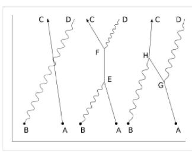

Compton scattering

But there are other ways in which the result could come about. The electron might move to a place and time E, where it absorbs the photon; then move on before emitting another photon at F; then move on to C, where it is detected, while the new photon moves on to D. The probability of this complex process can again be calculated by knowing the probability amplitudes of each of the individual actions: three electron actions, two photon actions and two vertexes - one emission and one absorption. We would expect to find the total probability amplitude by multiplying the probability amplitudes of each of the actions, for any chosen positions of E and F. We then, using rule a) above, have to add up all these probability amplitudes for all the alternatives for E and F. (This is not elementary in practice and involves integration.) But there is another possibility, which is that the electron

first moves to G, where it emits a photon, which goes on to D, while the electron moves on to H, where it absorbs the first photon, before moving on to C. Again, we can calculate the probability amplitude of these possibilities (for all points G and H). We then have a better estimation for the total probability amplitude by adding the probability amplitudes of these two possibilities to our original simple estimate. Incidentally, the name given to this process of a photon interacting with an electron in this way is Compton scattering.

There is an infinite number of other internediate "virtual" processes in which more and more photons are absorbed and/or emitted. For each of these processes, a Feynman diagram could be drawn describing it. This implies a computation for the resulting probability amplitudes, but provided it is the case that the diagram, the less it contributes to the result, it is only a matter of time and effort to find as accurate an answer as one wants to the original question. This is the basic approach of QED. To calculate the probability of any interactive process between electrons and photons, it is a matter of first noting, with Feynman diagrams, all the process can be constructed from the three basic elements. Each diagram involving definite rules to find the associated probability amplitude.

That basic scaffolding remains when one moves to a quantum description, but some conceptual changes are needed. One is that whereas we might expect in our everyday life that there would be some constraints on the points to which a particle can move, that is not true in full quantum electrodynamics. There is a nonzero probability amplitude of an electron at A, or a photon at B, moving as a basic action to any other place and time in the universe. That includes places that could only be reached at speeds greater than that of light and also earlier times. (An electron moving backwards in time can be viewed as a positron moving forward in time.)[2]:89,98-99

#### Probability amplitudes

Quantum mechanics introduces an important change in the way probabilities are still represented by the usual real numbers we use for probabilities in our everyday world, but probabilities are computed as the square modulus of probability amplitudes, which are complex numbers.

Feynman avoids exposing the reader to the mathematics of complex numbers by using a simple but accurate representation of them as arrows on a piece of paper or screen. (These must not be confused with the arrows of Feynman diagrams, which are simplified representations in two dimensions of a relationship between points in three dimensions of space and one of time.) The amplitude arrows are fundamental to the description of the world given by quantum theory. They are related to our everyday ideas of probability by the simple rule that the probability of an event is the square of the length of the corresponding amplitude arrow. So, for a given process, if two probability amplitudes, v and w, are involved, the probability of the process will be given either by

$$P = |\mathbf{v} + \mathbf{v}|^2$$

or

$$P = |\mathbf{v} \cdot \mathbf{v}|^2.$$

The rules as regards adding or multiplying, however, are the same as above. But where you would expect to add or multiply probabilities, instead you add or multiply probability amplitudes that now are complex numbers.

Addition and multiplication are common operations in the theory of complex numbers and are given in the figures. The sum is found as follows. Let the start of the second arrow be at the end of the first. The sum is then a third arrow that goes directly from the beginning of the first to the end of the second. The product of two arrows is an arrow whose length is the product of the two lengths. The direction of the

product is found by adding the angles that each of the two have been turned through relative to a reference direction: that gives the angle that the product is turned relative to the reference direction.

That change, from probability amplitudes, complicates the mathematics without changing the basic approach. But that change is still not quite enough because it fails to take into account the fact that both photons and electrons can be polarized, which is to say that their orientations in space and time have to be taken into account. Therefore, P(A to B) consists of 16 complex numbers, or probability amplitude arrows.[2]:120-121 There are also some minor changes to do with the quantity j, which may have to be rotated by a multiple of 90° for some polarizations, which is only of interest for the detailed bookkeeping.

Associated with the fact that the electron can be polarized is another small necessary detail, which is connected with the fact that an electron is a fermion and obeys Fermi-Dirac statistics. The basic rule is that if we have the probability amplitude for a given complex process involving more than one electron, then when we include (as we always must) the complementary Feynman diagram in which we exchange two electron events, the resulting amplitude is the reverse - the negative - of the first. The simplest case would be two electrons starting at A and B ending at C and D. The amplitude would be calculated as the "difference", E(A to D) × E(B to C) - E(A to C) × E(B to D), where we would expect, from our everyday idea of probabilities, that it would be a sum.[2]:112-113

# 50 OP t GGGGGGGGGGGGG

Feynman replaces complex numbers with spinning arrows, which start at emission and end at detection of a particle. The sum of all resulting arrows gives a final arrow whose length squared equals the probability of the event. In this diagram, light emitted by the source S can reach the detector at P by bouncing off the mirror (in blue) at various points. Each one of the paths has an arrow associated with it (whose direction changes uniformly with the time taken for the light to traverse the path). To correctly calculate the total probability for light to reach P starting at \$, one needs to sum the arrows for all such paths. The graph below depicts the total time spent to traverse each of the paths above.

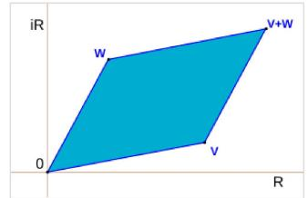

Addition of probability amplitudes as complex numbers

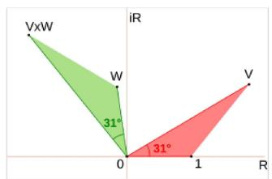

Multiplication of probability amplitudes as complex numbers

#### Propagators

Finally, one has to compute P(A to B) and E(C to D) corresponding to the probability amplitudes for the photon and the electron respectively. These are essentially the solution, which describe the behavior of the electron's probability amplitude and the Maxwell's equations, which describes the photon's probability amplitude. These are called Feynman propagators. The translation commonly used in the standard literature is as follows:

$$P(A \text{ to } B) \to D\_F(x\_B - x\_A), \quad E(C \text{ to } D) \to S\_F(x\_D - x\_C),$$

where a shorthand symbol such as a stands for the four real numbers that give the time and position in three dimensions of the point labeled A.

#### Mass renormalization

A problem arose historically which held up progress for twenty years: although we start with the assumption of three basic "simple" actions, the rules of the game say that if we want to calculate the probability amplitude for an electron to get from A to B, we must take into account all the possible ways: all possible Feynman diagrams with those endpoints. Thus there will be a way in which the electron travels to C, emits a photon there and then absorbs it again at D before moving on to B. Or it could do this kind of thing twice, or more. In short, we have a fractal-like situation in which if we look closely at a line, it breaks up into a collection of "simple" lines, each of which, if looked at closely, are in turn composed of "simple" lines, and so on ad infinitum. This is a challenging situation to handle. If adding that detail only altered things slightly, then it would not have been too bad, but disaster struck when it was found that the simple correction mentioned above led to infinite probability amplitudes. In time this problem was "fixed" by the technique of

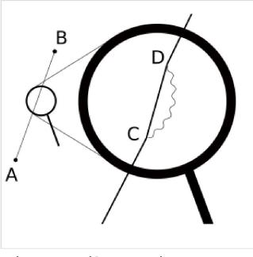

Electron self-energy loop

renormalization. However, Feynman himself remained unhappy about it, calling it a "dippy process", 21-20 and Dirac also criticized this procedure as "in mathematics one does not get rid of infinities when it does not please you". 144

#### Conclusions

Within the above framework physicists were then able to a high degree of accuracy some of the properties of electrons, such as the anomalous magnetic dipole moment. However, as Feynman points out, it fails to explain why particles such as the electron have the masses they do. "There is no theory that adequately explains these numbers. We use the numbers in all our theories, but we don't understand them - what they come from. I believe that from a fundamental point of view, this is a very interesting and serious problem."[2]:152

#### Mathematical formulation

#### QED action

Mathematically, QED is an abelian gauge theory with the symmetry group U(1), defined on Minkowski space (flat spacetime). The gauge field, which mediates the interaction between the charged spin-1/2 fields, is the electromagnetic field. The QED Lagrangian for a spin-1/2 field interacting with the electromagnetic field in natural units gives rise to the action[27]:78

$$\text{QED Action} \left[ \begin{aligned} \text{QED Action} \\ \left[ \begin{aligned} -\frac{1}{4} F^{\mu \nu} F\_{\mu \nu} + \vec{\psi} \left( i \gamma^{\mu} D\_{\mu} - m \right) \psi \right] \end{aligned} \right] \end{aligned}$$

where

- 74 are Dirac matrices.
- · y a bispinor field of spin-1/2 particles (e.g. electron-positron field).
- √ = ½ ½ , called "psi-bar", is sometimes referred to as the Dirac adjoint.
- · Du = Ou + ieAn + ieBu is the gauge covariant derivative.
	- e is the coupling constant, equal to the electric charge of the bispinor field.
	- · An is the covariant four-potential of the electromagnetic field generated by the electron itself. It is also known as a gauge field or a U(1) connection.
	- · Bw is the external field imposed by external source.
- m is the mass of the electron or positron.
- · Fin = 0 LA = 0 , A , A , A , A , A , A , A , A , A , A , A , A , A , A , A , , , , , , , , , , , , , , , , , , , , , , , , , , , , , , , , , , , , , , , , , , , , , , , , ,

Expanding the covariant derivative reveals a second useful form of the Lagrangian (external field By set to zero for simplicity)

$$\mathcal{L} = -\frac{1}{4} F\_{\mu\nu} F^{\mu\nu} + \vec{\psi} (i\gamma^{\mu}\partial\_{\mu} - m)\psi - e\dot{\jmath}^{\mu} A\_{\mu}$$

where jit is the conserved U(1) current arising from Noether's theorem. It is written

rup = vy

## Equations of motion

Expanding the covariant derivative in the Lagrangian gives

$$\begin{aligned} \mathcal{L} &= -\frac{1}{4} F\_{\mu\nu} F^{\mu\nu} + i \overline{\psi} \gamma^{\mu} \partial\_{\mu} \psi - e \overline{\psi} \gamma^{\mu} A\_{\mu} \psi - m \overline{\psi} \psi \\ &= -\frac{1}{4} F\_{\mu\nu} F^{\mu\nu} + i \overline{\psi} \gamma^{\mu} \partial\_{\mu} \psi - m \overline{\psi} \psi - e j^{\mu} A\_{\mu} .\end{aligned}$$

For simplicity, By has been set to zero. Alternatively, we can absorb Ba into a new gauge field An = Ap + Bu and relabel the new field as Au .

From this Lagrangian, the equations of motion for the y and A fields can be obtained.

#### Equation of motion for w

These arise most straightforwardly by considering the Euler-Lagrange equation for \$. Since the Lagrangian contains no 0 0 . w terms, we immediately get

$$\frac{\mathfrak{so}}{\mathfrak{so}} = \mathfrak{0}$$

so the equation of motion can be written (ind ou - m) = ext Au .

#### Equation of motion for Au

= Using the Euler-Lagrange equation for the Ay field,

$$
\partial\_{\nu} \left( \frac{\partial \mathcal{L}}{\partial(\partial\_{\nu} A\_{\mu})} \right) - \frac{\partial \mathcal{L}}{\partial A\_{\mu}} = 0,
$$

the derivatives this time are

$$\begin{aligned} \partial\_{\nu} \left( \frac{\partial \mathcal{L}}{\partial(\partial\_{\nu} A\_{\mu})} \right) &= \partial\_{\nu} \left( \partial^{\mu} A^{\nu} - \partial^{\nu} A^{\mu} \right), \\ \frac{\partial \mathcal{L}}{\partial A\_{\mu}} &= -e \bar{\psi} \gamma^{\mu} \psi. \end{aligned}$$

Substituting back into (3) leads to

$$
\partial\_{\mu}F^{\mu\nu} = \epsilon \vec{\psi} \gamma^{\nu} \psi
$$

which can be written in terms of the U(1) current jt4 as

$$
\overline{\partial\_{\mu}F^{\mu\nu} = ef^{\nu}\cdot\!}
$$

Now, if we impose the Lorenz gauge condition

$$
\mathfrak{d}\_{\mu}A^{\mu} = \mathbf{0},
$$

the equations reduce to

$$
\Box \mathcal{A}^\mu = e \mathcal{j}^\mu,
$$

which is a wave equation for the four-potential, the QED version of the classical Maxwell equations in the Lorenz gauge. (The square represents the wave operator, □ = ôn d4.)

#### Interaction picture

This theory can be straightforwardly quantized by treating bosonic and fermionic sectors as free. This permits us to build a set of asymptotic states that can be used to start computation of the probability amplitudes for different processes. In order to do so, we have to compute an evolution operator, which for a given initial state (f) in such a way

(3)

$$M\_{\mathcal{H}} = \langle f|U|\mathfrak{d}\rangle\_{\mathfrak{d}}.$$

This technique is also known as the S-matrix. The evolution operator is the interaction picture, where time evolution is given by the interaction Hamiltonian, which is the integral over space of the Lagrangian density given above:[27]:123

$$V = e \int d^4x \,\vec{\psi} \gamma^\mu \psi A\_\mu \dots$$

and so, one has[27]:86

$$U = T \exp\left[-\frac{i}{\hbar} \int\_{t\_0}^{t} dt' \,\nabla(t')\right],$$

where T is the time-ordering operator. This evolution operator only has meaning as a series, and what we get here is a perturbation series with the fine-structure constant as the development parameter. This series is called the Dyson series.

#### Feynman diagrams

Despite the conceptual clarity of this Feynman approach to QED, almost no early textbooks follow him in their presentation. When performing calculations, it is much easier to work with the Fourier transforms of the propagators. Experimental tests of quantum electrodynamics are typically scattering experiments. In scattering theory, particles' momenta rather than their positions are considered, and it is convenient to think of particles as being created or annihilated when they interact. Feynman diagrams then look the same, but the hirferent interpretations. The electron line represents an electron with a given energy and momentum, with a similar interpretation of the photon line. A vertex diagram represents the annihilation of one electron and the creation of another together with the absorption of a photon, each having specified energies and momenta.

Using Wick's theorem on the terms of the Dyson series, all the terms of the S-matrix for quantum electrodynamics can be computed through the technique of Feynman diagrams. In this case, rules for drawing are the following!22/:801-802

$$\begin{array}{ccccccccc} \alpha & \longrightarrow & \alpha & \left(\frac{i}{p-m+i\varepsilon}\right)\_{\beta\alpha} \\\\ \mu & \sim \varepsilon \cdot \gamma \cdot \varepsilon & \rightarrow & \frac{-i\eta\_{\mu\nu}}{p^2+i\varepsilon} \\\\ \nu & \sim \varepsilon \cdot \gamma \cdot \varepsilon & \rightarrow & -ie\gamma\_{\beta\alpha}^{\nu}(2\pi)^4\delta^{(4)}(p\_1+p\_2+p\_3). \end{array}$$

Quantum electrodynamics - Wikipedia

| Incoming fermion: α        |      | → | Ua (p, s)    |
|----------------------------|------|---|--------------|
| Incoming antifermion: a -- |      | → | Va(p, s)     |
| Outgoing fermion:          | - Q  | → | Ta(p, s)     |
| Outgoing antifermion:      | -- a | → | Va (P, S)    |
| Incoming photon: # mon     |      | → | Ep(k, X)     |
| Outgoing photon:           | - fl |   | -> En(k. X)* |

To these rules we must add a further one for closed loops that implies an integration on momenta J d\*p/(2r)\*, since these internal ("virtual") particles are not constrained to any specific energy-momentum, even that usually required by special relativity (see Propagator for details). The signature of the metric nuv is diag(+ - - - ).

From them, computations of probability amplitudes are straightforwardly given. An example is Compton scattering, with an electron and a photon undergoing elastic scattering. Feynman diagrams are in this case[2]1158-159

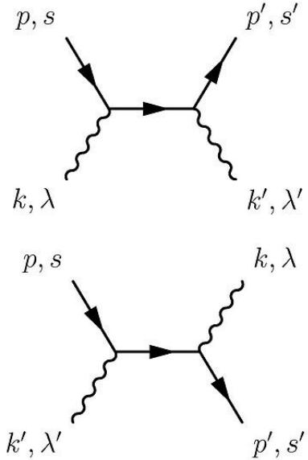

and so we are able to get the corresponding amplitude at the first order of a perturbation series for the S-matrix:

from which we can compute the cross section for this scattering.

#### Nonperturbative phenomena

The predictive success of quantum electrodynamics largely rests on the use of perturbation theory, expressed in Feynman diagrams. However, quantum electrodynamics also leads to prediction theory. In the presence of very strong electric fields, it predicts that electrons and positrons will be spontaneously produced, so causing the decay of the field. This process, called the Schwinger effect,120 cannot be understood in terms of any finite number of Feynman diagrams and hence is described as nonperturbative. Mathematically, it can be derived by a semiclassical approximation to the path integral of quantum electrodynamics.

# Renormalizability

Higher-order terms can be straightforwardly computed for the evolution operator, but these terms display diagrams containing the following simpler ones[27]:ch 10

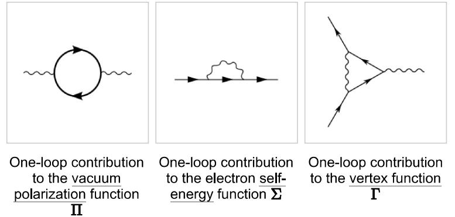

that, being closed loops, imply the presence of diverging integrals having no mathematical meaning. To overcome this difficulty, a technique called renormalization has been devised, producing finite results in very close agreement with experiments. A criterion for the theory being meaningful after renormalization is that the number of diverging diagrams is finite. In this case, the theory is said to be "renormalizable". The reason for this is that to get observables renormalized, one needs a finite number of constants to maintain the predictive value of the theory untouched. This is exactly the case of quantum electrodynamics displaying just three diverging diagrams. This procedure gives observables in very close agreement with experiment as seen e.g. for electron gyromagnetic ratio.

Renormalizability has become an essential criterion for a quantum field theory to be considered as a viable one. All the theories describing fundamental interactions, except gravitation, whose quantum counterpart is only conjectural and presently under very active research, are renormalizable theories.

## Nonconvergence of series

An argument by Freeman Dyson shows that the radius of convergence of the perturbation series in QED is zero.[22] The basic argument goes as follows: if the coupling constant were negative, this would be equivalent to the Coulomb force constant being negative. This would "reverse" the electromagnetic interaction so that like charges would attract and unlike charges would repel. This would render the vacuum unstable against decay into a cluster of electrons on one side of the universe and a cluster of positrons on the other side of the universe. Because the theory is "sick" for any negative value of the coupling constant, the series does not converge but is at best an asymptotic series.

From a modern perspective, we say that QED is not well defined as a quantum field theory to arbitrarily high energy.100 The coupling constant runs to infinity at finite energy, signalling a Landau pole. The problem is essentially that QED appears to suffer from quantum triviality issues. This is one of the motivations for embedding QED within a Grand Unified Theory.

# Electrodynamics in curved spacetime

This theory can be extended, at least as a classical field theory, to curved spacetime. This arises similarly to the flat spacetime case, from coupling a free electromagnetic theory and including an interaction which promotes the partial derivative in the fermion theory to a gauge-covariant derivative.

# See also

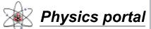

· Abraham-Lorentz force

▪ Anomalous magnetic moment

3/5/25, 10:36 AM

- Bhabha scattering ■
- Cavity quantum electrodynamics
- Circuit quantum electrodynamics ■
- Compton scattering .
- Euler-Heisenberg Lagrangian .
- Gupta-Bleuler formalism ■
- Lamb shift
- Landau pole
- Moeller scattering ■
- Non-relativistic quantum electrodynamics
- Photon polarization
- · Positronium

# References

Quantum electrodynamics - Wikipedia

- Precision tests of QED
- = QED vacuum
- = QED: The Strange Theory of Light and Matter
- = Quantization of the electromagnetic field
- · Scalar electrodynamics
- · Schrödinger equation
- Schwinger model ■
- Schwinger-Dyson equation
- Vacuum polarization
- = Vertex function
- Wheeler-Feynman absorber theory
- 1. R. F. Feynman (1949). "Space-Time Approach to Quantum Electrodynamics" (https://doi.org/10.1103%2FPhysRev.76.7 69). Physical Review. 76 (6): 769-89. Bibcode:1949PhRv...76..769F (https://ui.adsabs.harvard.edu/abs/1949PhRv...76.. 769F). doi:10.1103/PhysRev.76.769 (https://doi.org/10.1103%2FPhysRev.76.769).
- 2. Feynman, Richard (1985). QED: The Strange Theory of Light and Matter. Princeton University Press. ISBN 978-0-691-12575-6.
- 3. Feynman, R. P. (1950). "Mathematical Formulation of the Quantum Theory of Electromagnetic Interaction" (https://web.a rchive.org/web/20200914231627/https://authors.library.caltech.edu/3528/). Physical Review. 80 (3): 440-457. Bibcode:1950PhRv..80..440F (https://ui.adsabs.harvard.edu/abs/1950PhRv...80..440F), doi:10.1103/PhysRev.80.440 (h ttps://doi.org/10.1103%2FPhysRev.80.440). Archived from the original (https://authors.library.callech.edu/3528/) on 2020-09-14, Retrieved 2019-09-23.
- 4. Venkataraman, Ganeshan (1994). Quantum Revolution II QED: The Jewel of Physics. Universities Press. ISBN 978-8173710032.
- 5. "Testing the limits of the standard model of particle physics with a heavy, highly charged ion" (https://www.nature.com/art icles/d41586-023-02620-7). Nature. 2023-10-05. doi:10.1038/d41586-023-02620-7 (https://doi.org/10.1038%2Fd41586-023-02620-7). PMID 37794145 (https://pubmed.ncbi.nlm.nih.gov/37794145). S2CID 263670732 (https://api.semanticsch olar.org/CorpusID:263670732). Retrieved 2023-10-23.
- 6. P. A. M. Dirac (1927). "The Quantum Theory of the Emission of Radiation" (https://doi.org/10.1098%2Frs pa. 1927.0039). Proceedings of the Royal Society of London A. 114 (767): 243-65. Bibcode:1927RSPSA.114..243D (http s://ui.adsabs.harvard.edulabs/1927RSPSA.114.243D). doi:10.1098/rspa.1927.0039 (https://doi.org/10.1098%2Frspa.19 27.0039).
- 7. Kuhlmann, Meinard (Aug 10, 2020) [Jun 22, 2006]. "Quantum Field Theory of QFT" (https://plato.stanford. edulentries/quantum-field-theory.html). Stanford Encyclopedia of Philosophy. Archived (https://archive.today/2 0240616034116/https://plato.stanford.edu/entries/quantum-field-theory/qft-history.html) from the original on 16 Jun 2024. Retrieved 2023-10-22.
- 8. E. Fermi (1932). "Quantum Theory of Radiation". Reviews of Modern Physics. 4 (1): 87–132. Bibcode:1932RvMP...4...87F (https://ui.adsabs.harvard.edu/abs/1932RvMP...4...87F). doi:10.1103/RevModPhys.4.87 (h ttps://doi.org/10.1103%2FRevModPhys.4.87).
- 9. Bloch, F .; Nordsieck, A. (1937). "Note on the Radiation Field of the Electron". Physical Review. 52 (2): 54–59. Bibcode:1937PhRv...52...54B (https://ui.adsabs.harvard.edu/abs/1937PhRv...52...54B). doi:10.1103/PhysRev.52.54 (http s://doi.org/10.1103%2FPhysRev.52.54).
- 10. V. F. Weisskopf (1939). "On the Self-Energy and the Electron". Physical Review. 56 (1): 72-85. Bibcode:1939PhRv...56...72W (https://ui.adsabs.harvard.edu/abs/1939PhRv...56...72W). doi:10.1103PhysRev.56.72 (https://doi.org/10.1103%2FPhysRev.56.72).
- 11. R. Openheimer (1930). "Note on the Theraction of Field and Matter". Physical Review. 35 (5): 461–77. Bibcode:1930PhRv...35.4610 (https://ui.adsabs.harvard.edu/abs/1930PhRv...35.4610). doi:10.1103/PhysRev.35.461 (https://doi.org/10.1103%2FPhysRev.35.461).
- 12. Lamb, Willis; Retherford, Robert (1947). "Fine Structure of the Hydrogen Atom by a Microwave Method" (https://doi.org/1 0.1103%2FPhysRev.72.241). Physical Review. 72 (3): 241–43. Bibcode:1947PhRv...72..241L (https://ui.adsabs.harvard. edu/abs/1947PhRv...72..241L). doi:10.1103/PhysRev.72.241 (https://doi.org/10.1103%2FPhysRev.72.241).
- 13. Foley, H.M.; Kusch, P. (1948). "On the Intrinsic Moment of the Electron". Physical Review. 73 (3): 412. Bibcode:1948PhRv...73.412F (https://ui.adsabs.harvard.edu/abs/1948PhRv...73..412F). doi:10.1103/PhysRev.73.412 (h ttps://doi.org/10.1103%2FPhysRev.73.412).
- 14. H. Bethe (1947). "The Electromagnetic Shift of Energy Levels". Physical Review. 72 (4): 339-41. Bibcode:1947PhRv...72..339B (https://ui.adsabs.harvard.edu/abs/1947PhRv...72..339B). doi:10.1103/PhysRev.72.339 (h ttps://doi.org/10.1103%2FPhysRev.72.339). S2CID 120434909 (https://api.semanticscholar.org/CorpusD:120434909).
- 15. Schweber, Silvan (1994). "Chapter 5" (https://archive.org/details/qedmenwhomadeitd0000schw/page/230). QED and the Men Who Did it: Dyson, Feynman, Schwinger, and Tomonaga. Princeton University Press. p. 230 (https://archive.org/det ails/qedmenwhomadeitd0000schw/page/230). ISBN 978-0-691-03327-3.
- 16. S. Tomonaga (1946). "On a Relativistically Invariant Formulation of the Quantum Theory of Wave Fields.org/ 10.1143%2FPTP.1.27). Progress of Theoretical Physics. 1 (2): 27-42. Bibcode:1946PThPh...1...27T (https://ui.adsabs.h arvard.edu/abs/1946PThPh...1...27T). doi:10.1143/PTP.1.27 (https://doi.org/10.1143%2FPTP.1.27).
- 17. J. Schwinger (1948). "On Quantum-Electrodynamics and the Magnetic Moment of the Electron" (https://doi.org/10.110 3%2FPhysRev.73.416). Physical Review. 73 (4): 416-17. Bibcode:1948PhRv...73.416S (https://ui.adsabs.harvard.edu/a bs/1948PhRv...73.416S). doi:10.1103/PhysRev.73.416 (https://doi.org/10.1103%2FPhysRev.73.416).
- 18. J. Schwinger (1948). "Quantum Electrodynamics. I. A Covariant Formulation". Physical Review. 74 (10): 1439-61. Bibcode:1948PhRv...74.1439S (https://ui.adsabs.harvard.edu/abs/1948PhRv...74.1439S). doi:10.1103PhysRev.74.1439 (https://doi.org/10.1103%2FPhysRev.74.1439),
- 19. R. P. Feynman (1949). "The Theory of Positrons" (https://web.archive.org/web/20220809030941/https://authors.library.c altech.edu/3520/). Physical Review. 76 (6): 749-59. Bibcode:1949PhRv...76..749F (https://ui.adsabs.harvard.edu/abs/19 49PhRv...76.749F). doi:10.1103/PhysRev.76.749 (https://doi.org/10.1103%2FPhysRev.76.749). S2ClD 120117564 (http s://api.semanticscholar.org/CorpusD:120117564). Archived from the original (https://authors.library.caltech.edu/3520) on 2022-08-09. Retrieved 2021-11-19.
- 20. R. P. Feynman (1950). "Mathematical Formulation of the Quantum Theory of Electromagnetic Interaction" (https://uthor s.library.caltech.edu/3528/1/FEYpr50.pdf) (PDF). Physical Review. 80 (3): 440-57. Bibcode:1950PhRv...80..440F (http s://ui.adsabs.harvard.edulabs/1950PhRv...80..440F). doi:10.1103/PhysRev.80.440 (https://doi.org/10.1103%2FPhysRev. 80.440).
- 21. F. Dyson (1949). "The Radiation Theories of Tomonaga, Schwinger, and Feynman" (https://doi.org/10.1103%2FPhysRev. 75.486). Physical Review. 75 (3): 486-502. Bibcode:1949PhRv...75.486D (https://ui.adsabs.harvard.edu/abs/1949PhR v...75..486D). doi:10.1103/PhysRev.75.486 (https://doi.org/10.1103%2FPhysRev.75.486).
- 22. F. Dyson (1949). "The S Matrix in Quantum Electrodynamics". Physical Review. 75 (11): 1736–55. Bibcode:1949PhRv...75.1736D (https://ui.adsabs.harvard.edu/abs/1949PhRv...75.1736D). doi:10.1103/PhysRev.75.1736 (https://doi.org/10.1103%2FPhysRev.75.1736).
- 23. "The Nobel Prize in Physics 1965" (http://nobelprize.org/nobel\_prizes/physics/laureates/1965/index.html). Nobel Foundation. Retrieved 2008-10-09.
- 24. The story of the position Paul Dirac (1975) (https://www.youtube.com/watch?v=Ci86Aps7CMo), retrieved 2023-07-19
- 25. Guralnik, G. S.; Hagen, C. R.; Kibble, T. W. B. (1964), "Global Conservation Laws and Massless Particles" (https://doi.or g/10.1103%2FPhysRevLett.13.585). Physical Review Letters. 13 (20): 585-87. Bibcode:1964PhRvL..13.585G (https://u i.adsabs.harvard.edulabs/1964PhRvL.13.585G). doi:10.1103PhysRevLett.13.585 (https://doi.org/10.1103%2FPhysRev Lett 13.585).
- 26. Guralnik, G. S. (2009). "The History of the Guralnik, Hagen and Kibble development of the Theory of Spontaneous Symmetry Breaking and Gauge Particles". International Journal of Modern Physics A. 24 (14): 2601–27. arXiv:1907.3466 (https://arxiv.org/abs/0907.3466). Bibcode:2009JJMPA..24.2601G (https://ui.adsabs.harvard.edu/abs/20 09JJMPA..24.2601G). doi:10.1142/S0217751X09045431 (https://doi.org/10.1142%2FS0217751X09045431). S2CID 16298371 (https://api.semanticscholar.org/CorpusID:16298371).
- 27. Peskin, Michael; Schroeder, Daniel (1995). An introduction to quantum field theory (https://archive.org/details/introductio ntoqu0000pesk) (Reprint ed.). Westview Press. ISBN 978-0201503975.
- 28. Schwinger, Julian (1951-06-01). "On Gauge Invariance and Vacuum Polarization". Physical Review. 82 (5). American Physical Society (APS): 664-679. Bibcode:1951PhRv...82..664S (https://ui.adsabs.harvard.edu/abs/1951PhRv...82..664 S). doi:10.1103/physrev.82.664 (https://doi.org/10.1103%2Fphysrev.82.664). ISSN 0031-899X (https://search.worldcat.or g/issn/0031-899X).
- 29. Kinoshita, Toichiro (June 5, 1997). "Quantum Electrodynamics has Zero Radius of Convergence Summarized from Toichiro Kinoshita" (http://www.lassp.cornell.edu/sethna/Cracks/QED.html). Retrieved May 6, 2017.
- 30. Espriu and Tarrach (Apr 30, 1996). "Ambiguities in QED: Renormalons versus Triviality". Physics Letters B. 383 (4): 482-486. arXiv:hep-ph/9604431 (https://arxiv.org/abs/hep-ph/9604431). Bibcode:1996PhLB..383..482E (https://ui.adsab s.harvard.edu/abs/1996PhLB..383..482E). doi:10.1016/0370-2693(96)00779-4 (https://doi.org/10.1016%2F0370-2693% 2896%2900779-4). S2CID 119095192 (https://api.semanticscholar.org/CorpusID:119095192).

# Further reading

#### Books

- Berestetskii, V. B.; Lifshitz, E. M.; Pitaevskii, L. P. (1982). Course of Theoretical Physics, Volume 4: Quantum Electrodynamics (2 ed.). Elsevier. ISBN 978-0-7506-3371-0.
- I De Broglie, L. (1925). Recherches sur la theorie des quanta [Research on quantum theory]. France. Wiley-Interscience.
- · Feynman, R. P. (1998). Quantum Electrodynamics (New ed.). Westview Press. ISBN 978-0-201-36075-2.
- Greiner, W.; Bromley, D. A.; Müller, B. (2000). Gauge Theory of Weak Interactions. Springer. ISBN 978-3-540-67672-0.
- Jauch, J. M.; Rohrlich, F. (1980). The Theory of Photons and Electrons (https://archive.org/details/theoryofphotonse0000 jauc). Springer-Verlag. ISBN 978-0-387-07295-1.
- Kane, G. L. (1993). Modern Elementary Particle Physics. Westview Press. ISBN 978-0-201-62460-1.
- · Miller, A. I. (1995). Early Quantum Electrodynamics: A Sourcebook. Cambridge University Press. ISBN 978-0-521-56891-3.
- Milonni, P. W. (1994). The Quantum Vacuum: An Introduction to Quantum Electrodynamics (https://books.google.com/bo I oks?id=uPHJCgAAQBAJ). Boston: Academic Press. ISBN 0124980805. LCCN 93029780 (https://lccn.loc.gov/9302978
- 0). OCLC 422797902 (https://search.worldcat.org/oclc/422797902).
- Schweber, S. S. (1994). QED and the Men Who Made It (https://archive.org/details/qedmenwhomadeitd0000schw). Princeton University Press. ISBN 978-0-691-03327-3.
- · Schwinger, J. (1958). Selected Papers on Quantum Electrodynamics. Dover Publications. ISBN 978-0-486-60444-2.
- · Tannoudii-Cohen, C.; Dupont-Roc, Jacques; Grynberg, Gilbert (1997). Photons and Atoms: Introduction to Quantum Electrodynamics. Wiley-Interscience. ISBN 978-0-471-18433-1.

#### Journals

▪ Dudley, J.M.; Kwan, A.M. (1996). "Richard Feynman's popular lectures on quantum electrodynamics: The 1979 Robb Lectures at Auckland University". American Journal of Physics. 64 (6): 694-98. Bibcode:1996AmJPh.64.694D (https://u i.adsabs.harvard.edu/abs/1996AmJPh..64..694D). doi:10.1119/1.18234 (https://doi.org/10.1119%2F1.18234).

# External links

- Feynman's Nobel Prize lecture describing the evolution of QED and his role in it (http://nobelprize.org/physics/laureates/ 1965/feynman-lecture.html)
- Feynman's New Zealand lectures on QED for non-physicists (http://www.vega.org.uk/video/subseries/8)
- The Strange Theory of Light | Animation of Feynman pictures light by QED (http://qed.wikina.org/) Animations demonstrating QED

Retrieved from "https://en.wikipedia.org/w/index.php?title=Quantum\_electrodynamics&oldid=1266559551"