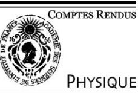

C. R. Physique 4 (2003) 371–385

Extra dimensions in physics and astrophysics/Dimensions supplémentaires en physique et astrophysique

# Strings on pp-waves and massive two-dimensional field theories

Juan Maldacena a*,*∗ , Liat Maoz b*,*c

a *Institute for Advanced Study, Princeton, NJ 08540, USA* b *Jefferson Physical Laboratory, Harvard University, Cambridge, MA 02138, USA* c *Jadwin Hall, Princeton University, Princeton, NJ 08544, USA*

Presented by Guy Laval

# **Abstract**

We find a general class of pp-wave solutions of type IIB string theory such that the light cone gauge worldsheet Lagrangian is that of an interacting massive field theory. When the light cone Lagrangian has *(*2*,* 2*)* supersymmetry we can find backgrounds that lead to arbitrary superpotentials on the worldsheet. We consider situations with both flat and curved transverse spaces. We describe in some detail the background giving rise to the *N* = 2 sine Gordon theory on the worldsheet. Massive mirror symmetry relates it to the deformed *CP*1 model (or sausage model) which seems to elude a purely supergravity target space interpretation. *To cite this article: J. Maldacena, L. Maoz, C. R. Physique 4 (2003).*

2003 Académie des sciences. Published by Éditions scientifiques et médicales Elsevier SAS. All rights reserved.

# **Résumé**

**Cordes sur ondes pp et les théories de champs massives à deux dimensions.** On trouve une classe générale de solutions ondes pp de la théorie de cordes de type IIB telles que le Lagrangien de la feuille d'univers dans la jauge du cone de lumıère soit celui d'une théorie d'intéraction de champs massifs. Quand ce Lagrangien a une supersymétrie *(*2*,* 2*)* on peut trouver des cas où le superpotentiel sur la feuille d'univers est quelconque. Nous décrivons en détail les cas donnat lieu à une théorie Sine Gordon *N* = 2 sur la feuille d'univers. La symétrie miroir massive le relie au modèle *CP*1 déformé (ou modèle saucisse) qui semble éluder une interprétation de l'espace cible sous forme de supergravité pure. *Pour citer cet article : J. Maldacena, L. Maoz, C. R. Physique 4 (2003).*

2003 Académie des sciences. Published by Éditions scientifiques et médicales Elsevier SAS. All rights reserved.

# **1. Introduction**

Ramond-Ramond backgrounds are a very important piece of string theory and they play a prominent role in the string theory/gauge theory correspondence. Backgrounds of the plane wave type are particularly interesting since they are the only known exactly solvable backgrounds [1]. These backgrounds are very useful for studying the relation between large *N* gauge theory and string theory [2]. The existence of a covariantly constant null Killing vector greatly simplifies the quantization of a string in light cone gauge. In this paper we study backgrounds of the pp-wave type which lead to *interacting* theories in light cone gauge. For this purpose we consider type IIB string theory with a five-form field strength which has the form

\* Corresponding author.

*E-mail address:* malda@ias.edu (J. Maldacena).

1631-0705/03/\$ – see front matter 2003 Académie des sciences. Published by Éditions scientifiques et médicales Elsevier SAS. All rights reserved.

*F*5 = d*x*+ ∧ *ϕ*4. If *ϕ*4 is a constant form in the transverse space it leads to masses for the Green–Schwarz light cone fermions. By taking non-constant four forms *ϕ*4 we find that the light cone action becomes an interacting theory with a rather general potential. The mass scale in the light cone theory is set by *p*−. Boosts in the *x*+*, x*− directions corresponds to an RG flow transformation on the worldsheet. Low values of |*p*−| correspond to the UV of the worldsheet theory while large values of |*p*−| explore the IR of the worldsheet theory. We study solutions that preserve some supersymmetries. We find that we can have an *N* = *(*2*,* 2*)* theory on the worldsheet with an arbitrary superpotential. Similarly we can get *N* = *(*1*,* 1*)* theories as long as the real superpotential is a harmonic function. We discuss solutions where the transverse space is curved or flat. One interesting result is that we can find backgrounds that lead to integrable models on the worldsheet in light cone gauge. Using results for integrable models we can compute some non-trivial features of the string spectrum. We can consider for example Toda theories. We discuss explicitly the case where we get the *N* = 2 sine Gordon model on the worldsheet. Soliton solutions of the massive theory correspond to strings that interpolate between different 'potential wells' in the target space. Now that we have massive interacting theories on the worldsheet we see that various dualities of these theories are worldsheet dualities which lead to interesting dualities in the target space. The *N* = 2 sine Gordon theory is dual to the supersymmetric *CP*1 theory [3–7], via a mirror symmetry transformation. The size of the *CP*1 depends on the energy scale of the worldsheet theory. The size of the worldsheet circle is proportional to *p*−. Thus, we find that strings with very small *p*− feel they are on a big space while strings with large *p*− feel they are on a smaller space.

In Section 2 we discuss the gravity backgrounds that lead to supersymmetric interacting theories on the worldsheet. In Section 3 we describe the actions we get on the worldsheet from the gravity backgrounds discussed in Section 2. In Section 4 we discuss in more detail some particular backgrounds. First we discuss the background leading to the *N* = 2 sine Gordon model on the worldsheet and the associated duality to the *CP*1 model. We then discuss what happens if we have an *AN* singularity transverse to a pp-wave and we resolve it.

## **2. Supersymmetric supergravity solutions of pp wave type**

We consider type IIB supergravity solutions with a nonzero 5-form field strength. They have a covariantly constant null Killing vector, *∂/∂x*−, which also leaves *F*5 invariant and it is such that it gives zero when contracted with *F*5.

More explicitly, the form of the solutions we consider is

$$\begin{aligned} \mathbf{d}s^2 &= -2\,\mathrm{d}\mathbf{x}^+\,\mathrm{d}\mathbf{x}^- + H(\mathbf{x}^i)\mathrm{(d}\mathbf{x}^+)^2 + \mathrm{d}\mathbf{s}\_8^2, \\ F\_5 &= \mathrm{d}\mathbf{x}^+ \wedge \varphi\_4(\mathbf{x}^i), \end{aligned} \tag{1}$$

where *xi* are the 8 transverse coordinates, *F*5 is the self-dual RR field strength. We limit ourselves to solutions which are also independent of *x*+. We consider constant dilaton and set all other fields to zero. The transverse metric can be curved. Note that the background is such that we can scale down *H* and *ϕ* by performing a boost in the *x*± directions.1 This property under boost transformations implies that we can assign an 'order' to each field according to how they change under boosts. The four-form *ϕ* is of first order while *H* is of second order. This means that the transverse space with zero RR five-form should be a solution of the equations of motion by itself, since it is of zeroth order.

In order to clarify a bit the discussion we will first consider the simpler case when the transverse space is flat and then the slightly more complicated case of a curved transverse space.

## *2.1. Flat transverse space*

The equations of motion of type IIB supergravity imply that (1) obeys

$$
\nabla^2 H = -\Im 2|\varphi|^2, \qquad \ast\_{10} F \mathfrak{s} = F \mathfrak{s}, \tag{2}
$$

where |*ϕ*| 2 = 1 4! *ϕµνρδϕµνρδ* , and ∇2 is the Laplacian in the transverse 8-dimensional space. In our conventions,2 the selfduality of *F*5 implies that *ϕ* is anti-self-dual in the 8-dimensional space, so that ∗*ϕ* = −*ϕ* and d*ϕ* = 0.3

In addition we will now require the solution to preserve some supersymmetries. Supersymmetries in type IIB supergravity are generated by a chiral spinor *ε* with 16 complex components. We find it convenient to separate it into two components according to their SO*(*8*)* chiralities

$$\varepsilon = -\frac{1}{2}\Gamma\_{+}\Gamma\_{-}\varepsilon - \frac{1}{2}\Gamma\_{-}\Gamma\_{+}\varepsilon \equiv \varepsilon\_{+} + \varepsilon \dots \tag{3}$$

1 Thus, the background is not boost invariant in the *x*± directions.

2 Our conventions and notations are summarized in Appendix A.

3 A ∗ with no subindex will always refer to the 8-dimensional space.

*ε*+ has positive SO*(*1*,* 1*)* and SO*(*8*)* chiralities, and is annihilated by *Γ*+. We will find, roughly speaking (i.e., to lowest order in *ϕ*4), that *ε*+ is related to the supersymmetries that are preserved by a configuration with nonzero *p*− and are linearly realized on the light cone action. These anti-commute to the lightcone Hamiltonian, plus possibly some rotations. On the other hand the supersymmetries generated by *ε*− are non-linearly realized on the worldsheet and imply that some particular fermions are free on the worldsheet. For reasons that will become clear later we are especially interested in supersymmetries that are linearly realized on the worldsheet so we are interested in spinors such that only *ε*+ is nonzero to first order.

Setting to zero the supersymmetry variations we obtain the following equation

$$0 = D\_M \varepsilon = \left(\nabla\_M + \frac{\mathrm{i}}{2} \mathfrak{f}^{\dagger} \Gamma\_M \right) \varepsilon,\tag{4}$$

which leads to

$$\begin{aligned} \partial\_- \varepsilon\_+ &= \partial\_\mu \varepsilon\_+ = \partial\_+ \varepsilon\_+ = 0, \\ \partial\_- \varepsilon\_- &= 0, \qquad \partial\_\mu \varepsilon\_- = \frac{\mathrm{i}}{2} \Gamma\_- \phi \Gamma\_\mu \varepsilon\_+, \qquad (\mathrm{i}\partial\_+ - \phi)\varepsilon\_- = \frac{\mathrm{i}}{4} \Gamma\_- \beta \mathrm{H} \varepsilon\_+, \end{aligned} \tag{5}$$

where *ϕ/* ≡ 1 4! *Γ µνρδϕµνρδ* . These equations imply that *ε*+ must be a constant spinor and they determine the first and higher order parts of *ε*− in terms of *ε*+. These solutions with nonzero zeroth order *ε*+ determine the linearly realized supersymmetries of the light cone action. In addition to these we might have solutions of (5) with *ε*+ = 0. We obviously have 16 solutions of this type if *ϕ* is a constant form, but when *ϕ* is not constant we will generically have no solutions of this type (below we will make a precise statement). Note that only solutions of this second type can be *x*+ dependent. Note also that if *ε* = *ε*+ + *ε*− is a solution, then so is *ε*ˆ = *ε*∗ + − *ε*∗ −*(*−*x*+*)*.

When we attempt to solve the equation for *ε*− in terms of *ε*+ we find some integrability conditions. First, integrability of the *∂µε*− equations places a constraint on the allowed 4-forms. Then the *(*i*∂*+ −*ϕ)ε /* − equation gives further consistency conditions on *ε*− and determines *H* in terms of *ϕ*4. In Appendix B we show these computations in detail. Below we will just state the form of the most general solutions with *(*2*,* 2*)* and *(*1*,* 1*)* supersymmetry. We did not explore the subset of *(*2*,* 2*)* solutions which actually have more *ε*+-type supersymmetries.

It is convenient to choose complex coordinates for the transverse space, *z*1*,...,z*4. The anti-self-dual 4-forms *ϕµνρδ* written in complex coordinates can be split into 2 kinds – those having two holomorphic and two anti holomorphic indices – the *(*2*,* 2*)* forms (of which there are 15) and those having one holomorphic and three antiholomorphic indices and their complex conjugates – the *(*1*,* 3*)* and *(*3*,* 1*)* forms (of which there are 10 + 10). We denote the *(*1*,* 3*)* forms by the shorter notation

$$
\varphi\_{mn} \equiv \frac{1}{3!} \varphi\_{m\overline{i\,j\,k}} \varepsilon^{\overline{j\,lkn}} g\_{m\overline{n}}.\tag{6}
$$

Anti-self duality of *ϕ* implies that *ϕmn* is symmetric.

It can be shown that one can write the anti-selfdual *(*2*,* 2*)* forms in terms of *ϕij*¯ defined as

2*ϕlm*¯ = *gss*¯ *ϕlms*¯ *s*¯*,* (7)

where the reality and self duality condition imply that *ϕlm*¯ is a Hermitian and traceless matrix (which could, in principle, be a function of the coordinates). We also define the lowest weight spinor state |0 which is annihilated by *Γ*+ and *Γ i* where *i* runs over the four holomorphic indices. We begin by describing the solutions with an *ε*+ which at zeroth order is proportional to |0 and its complex conjugate. We later describe solutions with *ε*+ = 0.

## *2.1.1. Case 1. (*2*,* 2*) supersymmetry or more*

The solution is parameterized by a holomorphic function *W*. In this case the *ϕlm*¯ are constants and given in terms of a traceless Hermitian 4 × 4 matrix. *W* and *ϕlm*¯ should also obey

$$\partial\_{\mathbf{h}} \left[ \boldsymbol{\varphi}\_{j}^{k} \boldsymbol{z}^{j} \, \partial\_{\mathbf{k}} \mathbf{W} \right] = 0,\tag{8}$$

where we raised the index of *ϕjk*¯ using the flat transverse space metric. The metric and the 4-form are given by

$$\begin{aligned} \mathbf{d}u^2 &= -2\,\mathrm{d}\mathbf{r}^+\,\mathrm{d}\mathbf{r}^- - 32\Big(|\partial\_{\overline{h}}\mathbf{W}|^2 + |\varphi\_{\overline{j}\overline{k}}\mathbf{r}^{\langle\cdot\rangle}|^2\Big) \mathrm{d}\mathbf{r}^+)^2 + \mathrm{d}\mathbf{z}^{\overline{l}}\,\mathrm{d}\overline{\mathbf{z}}^{\overline{l}},\\ \varphi\_{\overline{m}\mathbf{n}} &= \partial\_{\overline{m}}\partial\_{\overline{n}}\mathbf{W}, \qquad \varphi\_{\overline{m}\overline{n}} = \partial\_{\overline{m}}\partial\_{\overline{n}}\overline{W}, \qquad \varphi\_{\overline{l}\overline{m}} = \text{constants}. \end{aligned} \tag{9}$$

The expressions for the Killing spinors can be found in Appendix B.

One can, of course, look at the simpler cases where either *W* = 0 or *ϕlm*¯ = 0. It is interesting to note that if *ϕlm*¯ is nonzero the superalgebra has a central charge term proportional to the U*(*1*)* symmetry generated by the holomorphic Killing vector *zl ϕlm*¯ *∂/∂zm* and its complex conjugate.

## *2.1.2. Case 2. (*1*,* 1*) supersymmetry*

These solutions are parameterized by a real harmonic function *U*. However this time there are only 2 Killing spinors. The solution is

$$\begin{aligned} \mathbf{d}s^2 &= -2\,\mathrm{d}\mathbf{x}^+\,\mathrm{d}\mathbf{x}^- - 32\Big(|\partial\_{\overline{\mathbf{n}}}U|^2\Big)\Big(\mathrm{d}\mathbf{x}^+\Big)^2 + \mathrm{d}\boldsymbol{\varepsilon}^l\,\mathrm{d}\overline{\boldsymbol{\varepsilon}}^l\\ \varphi\_{\mathrm{\theta\tilde{m}}} &= \partial\_{\overline{\mathbf{m}}}\partial\_{\overline{\mathbf{n}}}U, \qquad \varphi\_{\overline{\mathbf{m}}\tilde{n}} = \partial\_{\overline{\mathbf{m}}}\partial\_{\overline{\mathbf{n}}}U, \qquad \varphi\_{\mathrm{I}\tilde{m}} = \partial\_{\overline{\mathbf{n}}}\partial\_{\overline{\mathbf{n}}}U. \end{aligned} \tag{10}$$

The expressions for the Killing spinors can be found in Appendix B.

## *2.2. The homogenous solution for ε*−

The homogenous equations for *ε*hom − are

$$
\partial\_{-}s\_{-}^{\text{hom}} = \partial\_{f}\varepsilon\_{-}^{\text{hom}} = \overline{\partial\_{f}}\varepsilon\_{-}^{\text{hom}} = (i\partial\_{+} - \varphi)\varepsilon\_{-}^{\text{hom}} = 0\tag{1l}
$$

and are solved by

$$\mathbf{e}\_{-}^{\text{hom}}(\mathbf{x}^{+}) = \mathbf{e}^{-\text{id}\cdot\mathbf{x}^{+}}\eta\_{0},\tag{12}$$

where *η*0 is a constant spinor. (11) implies that *ϕ/* and *η*0 should be such that after multiplying *(/ϕ)nη*0 (for *n* = 1*,* 2*,...*) we still have spinors that are constant in the transverse space and independent of *x*+. So we get the spinors *η*0*, /ϕη*0*,... , (/ϕ)n*−1*η*0 which are linearly independent and *n* 16. These solutions of (11) are associated to free fermions on the string worldsheet in light cone gauge. In fact the last equality in (11) is the equation of motion for a zero momentum mode on the string worldsheet. If we diagonalize the matrix *ϕ/* in the subspace of solutions we see clearly that each pair of solutions gives rise to a free fermion on the worldsheet.4 The fermion is free but it can be massless or massive depending on the eigenvalue of the matrix *ϕ/* on it. The sixteen supersymmetries of *ε*− type that arise in the usual quadratic plane waves discussed in [8] arise because all fermions are free. In a general interacting case all fermions will be interacting and there will be no supersymmetries of this type. If, in addition, we have worldsheet supersymmetry in lightcone gauge, as in the cases we are analyzing, each free fermion has a free boson partner and these two together decouple from the rest of the worldsheet theory. So the structure is clear, we have as many free bosons and fermions as there are *ε*− supersymmetries. In the *N* = *(*2*,* 2*)* case these supersymmetries come in groups of four, one per complex field that appears at most quadratically in the superpotential.

## *2.3. Curved transverse space*

When the transverse space is curved, the ansatz (1) is a solution of IIB supergravity iff it satisfies the equations of motion

$$\begin{aligned} \nabla^2 H &= -32|\varphi|^2, \qquad \*\_{8}\varphi = -\varphi, \qquad \text{d}\varphi = 0, \\\ R\_{\mu\nu} &= 0, \end{aligned} \tag{13}$$

where ∇2 is the Laplacian in the transverse curved space, and *Rµν* is the Ricci tensor of the transverse space.5

The supersymmetry equations for the curved case are

$$\begin{aligned} \partial\_- \varepsilon\_+ &= \nabla\_\mu \varepsilon\_+ = \partial\_+ \varepsilon\_+ = 0, \\ \partial\_- \varepsilon\_- &= 0, \qquad \nabla\_\mu \varepsilon\_- = \frac{\mathrm{i}}{2} \Gamma\_\mathrm{h} \phi \Gamma\_\mu \varepsilon\_+, \qquad (\mathrm{i}\partial\_+ - \phi)\varepsilon\_- = \frac{\mathrm{i}}{4} \Gamma\_\mathrm{h} \theta \,\mathrm{f}\varepsilon\_+. \end{aligned} \tag{14}$$

These are exactly the same equations as in the flat case (5), with the transverse derivatives replaced by covariant derivatives. We will now state what the general solutions are and we refer the interested reader to Appendix B for the derivation. The first point to note is that to zeroth order the supersymmetry equations for the transverse manifold imply that the transverse space is a special holonomy space. If we demand *(*2*,* 2*)* supersymmetries on the worldsheet it can only be a Calabi–Yau space (*G*2 and Spin*(*7*)* could also be studied but we do not do that here). For this reason it is still convenient to choose complex coordinates and we denote by |0 the covariantly constant spinor on the Calabi–Yau manifold that is annihilated by *Γ*+ and *Γ µ* where *µ* runs over the four holomorphic indices. We will also use the short notation (6) for the *(*1*,* 3*)* forms. We first focus on the supersymmetries that are linearly realized on the worldsheet in lightcone gauge and later we explain what happens with the homogeneous solutions for *ε*−.

4 The solutions come in pairs. If the eigenvalue of the matrix *ϕ/* is nonzero this follows by considering the complex conjugate equation. If the eigenvalue is zero then we can multiply the solution by any complex number so that we have two real solutions.

5 We use *(*+*,*−*)* and greek letters to denote curved indices, and *(v, u)* and roman letters to denote flat indices. All notations and conventions we use for curved space are summarized in Appendix A.

## *2.3.1. Case 1. (*2*,* 2*) supersymmetry or more*

In this Case the solution is parameterized by a holomorphic function *W*, and a real Killing potential *U* from which we can define the Killing vectors *Vµ* = i*∂µU*, *Vµ*¯ = −i*∂µ*¯ *U*. The Killing vector should be holomorphic (i.e., *V µ* is holomorphic and *V µ*¯ is antiholomorphic). The following conditions should also hold

$$
\nabla\_{\mu}V^{\mu} = 0,\tag{15}
$$

$$
\partial\_{\mathbb{V}} \left[ V^{\mathbb{F}} \nabla\_{\mathbb{F}} W \right] = 0. \tag{16}
$$

The supergravity solution is

$$\begin{aligned} \mathbf{ds}^2 &= -2\,\mathrm{d}\mathbf{r}^-\,\mathrm{d}\mathbf{r}^+ - 32\Big(\mathrm{d}W|^2 + |V|^2\Big)\Big(\mathrm{d}\mathbf{r}^+\Big)^2 + 2\varrho\_{\mu\bar{\nu}}\,\mathrm{d}\mathbf{z}^\mu\,\mathrm{d}\bar{\mathbf{z}}^{\bar{\nu}},\\ \varphi\_{\mu\nu} &= \nabla\_{\mu}\nabla\_{\nu}W, \qquad \varphi\_{\bar{\mu}\bar{\nu}} = \nabla\_{\bar{\mu}}\nabla\_{\bar{\nu}}\overline{W},\\ \varphi\_{\bar{\mu}\nu} &= \nabla\_{\bar{\mu}}\nabla\_{\nu}U,\end{aligned} \tag{17}$$

where |d*W*| 2 ≡ *gµν*¯ ∇*µW*∇*νW*, and |*V* | 2 ≡ *gµν*¯*V µV ν*¯ . The expressions for the Killing spinors can be found in Appendix C. Here too, one can look at the simpler cases where either *W* = 0 or *V µ* = 0. Note that if the transverse space is compact there

is no non-constant holomorphic function. In order to have interesting solutions we need the transverse space to be non-compact.

## *2.3.2. Case 2. (*1*,* 1*) supersymmetry*

The *(*1*,* 1*)* supersymmetry solutions are parameterized by a real harmonic function *U*. The metric, 4-form and the 2 Killing spinors are given by

$$\begin{split}d\mathbf{s}^2 &= -2\,\mathrm{d}\mathbf{r}^-\,\mathrm{d}\mathbf{r}^+ - 32\Big(\left|\nabla U\right|\right)^2 (\mathrm{d}\mathbf{r}^+)^2 + g\_{\mu\bar{\nu}}\varepsilon^\mu\overline{z^\nu},\\ \varphi\_{\mu\nu} &= \nabla\_{\mu}\nabla\_{\nu}U, \qquad \varphi\_{\bar{\mu}\bar{\nu}} = \nabla\_{\bar{\mu}}\nabla\_{\bar{\nu}}U, \qquad \varphi\_{\mu\bar{\nu}} = \nabla\_{\mu}\nabla\_{\bar{\nu}}U.\end{split} \tag{18}$$

Note that the *(*2*,* 2*)* part of the 4-form (whose components are *ϕλσµ*¯ *ν*¯ ) is therefore

$$\varphi = (\nabla\_{\mu} \nabla\_{\overline{\nu}} U \, \mathrm{d}\xi^{\mu} \, \mathrm{d}\overline{\xi^{\nu}}) \wedge J,\tag{19}$$

where *J* is the Kähler form, which obeys d*J* = 0 (so that *ϕµν*¯ = 1 2 *gλσ*¯ *ϕλσµ*¯ *ν*¯ = ∇*µ*∇*ν*¯ *U*).

## *2.4. The homogenous solution for ε*−

The homogenous equations for *ε*hom − in a curved background are

$$
\delta\_- \delta\_-^{\text{hom}} = \nabla\_f \underline{\kappa}\_-^{\text{hom}} = \nabla\_f \underline{\kappa}\_-^{\text{hom}} = (i \partial\_+ - \phi) \underline{\kappa}\_-^{\text{hom}} = 0. \tag{20}
$$

There is a solution

$$\kappa\_{-}^{\text{hom}}(x^{+}) = e^{-i\psi x^{+}}\eta y$$

with *η*0 a covariantly constant spinor and all of *(/ϕ)nη*0 (*n* = 1*,* 2*,...*) covariantly constant.

The discussion follows exactly the one we had for the flat case, where we argued that each pair of solutions for (20) gives rise to a free (massive or massless) fermion on the string worldsheet in light cone gauge. Due to supersymmetry each such fermion has a free boson partner, and they both decouple from the rest of the worldsheet theory.

## **3. The worldsheet actions**

In the last section we have listed all the supersymmetric solutions of the pp-wave form. In this section we write the action describing a string propagating in these backgrounds. We choose light cone gauge by setting *x*+ = *τ* , where *τ* is worldsheet time. Though the standard procedure we then find that *p*− is conserved, etc.6 In light cone gauge, only Killing spinors which are not annihilated by *Γ* + survive as linearly realized supersymmetries on the worldsheet. These are the *ε*+ part of the Killing

6 Our notation with a lower index for *p*± seems to be contrary to standard practice in the literature. While in Minkowski space it does not matter where we put the index, it actually does matter where we put it when *g*++ is nonzero. (Some papers have chosen the unreasonable convention of raising the indices using the flat Minkowski metric...). In our conventions for the metric (where *g*−+ = −1) we find that *p*− 0 for particles propagating to the future.

spinor. Since we focused on solutions that preserved some supersymmetries of this type, we will have a supersymmetric action on the worldsheet. Thanks to these supersymmetries we do not need to work too much to find the action, since its form is dictated by supersymmetry.

*3.1. (*2*,* 2*)*

*Supersymmetric solutions.* We know that if all RR fields are set to zero, the action reduces to the usual *(*2*,* 2*)* non-linear sigma model which can be written in terms of the Kähler potential. By turning on *(*1*,* 3*)* and *(*3*,* 1*)* forms we can add an *arbitrary* superpotential so that the action in superfield form becomes

$$S = \frac{1}{4\pi\alpha'} \int d\mathbf{r} \int^2 \int^2 \mathbf{d}\sigma \,(L\_K + L\_W), \quad L\_K + L\_W = \int \mathbf{d}^4 \theta \, K(\Phi^l, \bar{\Phi}^l) + \frac{1}{2} \left( \int \mathrm{d}^2 \theta \, W(\Phi^l) + c.c. \right), \tag{22}$$

where *Φi* = *Zi* +√2*θLψi L* +√2*θRψi R* +2*θLθRFi* +··· *.* From this we can find the component action by integrating out *θ* [9]. Note that (22) contains Yukawa interactions given in terms of *ϕ/*, a bosonic potential proportional to *H* (1), as well as four fermion couplings which follow from supersymmetry. If the transverse space is flat, there are no four fermion couplings, and the action could also be read from [1]. The fermions appearing in (22) are related to the Green–Schwarz fermions as follows. The G–S fermions are SO*(*8*)* spinors with negative chirality (in our conventions). Once we choose complex coordinates we have an SU*(*4*)* subgroup of SO*(*8*)* which preserves the complex structure. Under this subgroup 8− → **4** + **4**¯, these are the spinors with vector index. More explicitly, let us denote by *η*0 a covariantly constant spinor annihilated by all *Γ*¯*i*. We then write a general negative chirality SO(8) spinor as *S* = *ψi Γiη*0 + *ψ*¯*iΓ*¯*i η*∗ 0 . This defines the worldsheet spinors *ψi , ψ*¯*i*.

It can be checked that the *(*3*,* 1*)* and *(*1*,* 3*)* forms induce couplings of the type *ψi Lψj R* as implied by the action (22). It can also be seen that the *(*2*,* 2*)* forms induce couplings of the type *ψi Lψj*¯ *R*. These couplings are not present in (22). Nevertheless, it was shown in [10–12], and reviewed in [6], that if the target space has a holomorphic isometry, i.e., a holomorphic Killing vector field *V i (*∇*iVj*¯ + ∇*j*¯*Vi* = 0), then this isometry can be gauged to give a vector multiplet (consisting of a complex scalar, two conjugate dirac fermions and a vector field). Then by taking the weak coupling limit and then freezing the vector and fermions at zero and the scalar at a constant value, one can obtain a *(*2*,* 2*)* supersymmetric Lagrangian. The extra terms in the Lagrangian

that arise in this way are

$$L\_V = -\mathbf{g}\_{i\bar{j}}|m|^2 V^l \overline{V^j} - \frac{\mathbf{i}}{2} (\mathbf{g}\_{i\bar{l}} \partial\_{\bar{j}} V^l - \mathbf{g}\_{j\bar{j}} \partial\_{\bar{l}} \overline{V^j}) (\mathbf{n} \overline{\psi\_R^l} \psi\_L^j + \bar{\mathbf{n}} \overline{\psi\_L^l} \psi\_R^j). \tag{23}$$

Note that in our case, we cannot obtain any such holomorphic Killing vector – we have the extra requirement (coming from the self-duality of *F*5) that ∇*µV µ* = 0. It might be possible that including more background fields, such a three form RR fieldstrength, we get a more general Lagrangian.

In the simple case where the transverse space is flat, we have a holomorphic Killing vector *Vj*¯ = i*cij*¯*zi*, for a Hermitian constant matrix *cij*¯, and ∇*µV µ* = 0 translates into the tracelessness of *cij*¯.

The combined action coming from *LK* + *LW* + *LV* is supersymmetric iff *V µ*∇*µW* is constant [11]. This matches nicely with the condition (16).

$$\text{3.2. (l,1)}$$

*Supersymmetric solutions.* A general *(*1*,* 1*)* supersymmetric sigma-model is of the form

$$S = \frac{1}{4\pi a'} \int d\mathbf{r} \int\_0^{2\pi a'|p\_{-}|} d\sigma \,\mathrm{d}^2\theta \left(\mathcal{g}\_{\mu\nu} D\_L \phi^\mu D\_R \phi^\nu + U(\phi)\right),\tag{24}$$

where *φµ* are *N* = 1 superfields. The superpotential *U(φ)* is not as general as it could be in an arbitrary *N* = 1 theory, since it needs to be a harmonic function. This condition also follows from conformal invariance in the Berkovits formulation [13]. Of course if we view the *N* = *(*2*,* 2*)* solution as an *N* = *(*1*,* 1*)* theory then the corresponding *N* = 1 superpotential is harmonic due to the stricter constraints that both the superpotential and Killing potential of the *N* = 2 theory have to obey.

## **4. Some examples**

In this section we discuss some general features of the models and describe in more detail some examples.

## *4.1. RG flow*

The light cone worldsheet theory is a theory with a mass scale. So these theories behave quite non-trivially under RG transformations. This mass scale on the worldsheet is basically set by *p*−. More precisely the important dimensionless parameter is *α* |*p*−|*µ* where *µ* is the coefficient in front of the superpotential *W* = *µf (z/ls)* where *f* is a dimensionless function. This dimensionless parameter is the product of the mass scale on the worldsheet and the size of the worldsheet cylinder. A physical spacetime question, like the spectrum of the theory, depends non-trivially on this dimensionless parameter. We see that performing a scale transformation on the worldsheet is related to performing a boost in the *x*+*, x*− coordinates. For low values of |*p*−| we are exploring the UV of the worldsheet theory while for large values we explore the IR. As usual we have a UV/IR relation between worldsheet and target space scales. Note that in many situations, most notably the *c <* 1 string theories, one can start with a non-conformal theory and 'dress' it with the Liouville mode so that the total theory is a critical string theory. In those cases the RG flow in the original massive theory becomes related to a change in position along the Liouville direction. Notice that this case has a different character since an RG transformation is related to a change in *velocity* of the motion in the *x*+*, x*− direction. In other words in one case we have that an RG transformation is a *translation* in the Liouville direction whereas in our case it is a *boost* in the *x*+*, x*− directions. The worldsheet will generically have periodic boundary conditions for the fermions since they are Green–Schwarz fermions. The number of zero energy (zero *p*+) supersymmetric ground states can be computed by the standard index arguments. These will be BPS states in the spacetime theory.

It is interesting to note that we can choose a superpotential that has no supersymmetric vacua. In this case we do not have a supersymmetric vacuum on the worldsheet which means that the corresponding state in the spacetime theory is not BPS when *p*− is nonzero. Supersymmetry breaking on the worldsheet should not be confused with spacetime supersymmetry breaking.

## *4.2. Solitons*

One feature of our models is that they contain solitons on the worldsheet. The worldsheet is compact and has a size proportional to |*p*−|*α* . If |*p*−| is large we will be able to trust soliton computations which are done in an infinite line. Note that when the string is propagating with fixed value of *p*− it feels a gravitational force that pulls it to the regions where −*g*++ is a minimum. A soliton on the worldsheet going between these minima corresponds to a string that goes between the two positions where −*g*++ has a minimum in target space. For example, we can choose a superpotential which is a function of only one variable *W (z*1*)*. In this case the three other complex fields on the worldsheet are massless and free. If we solve *∂z*1*W* = 0 we will obtain the values of *z*1 corresponding to supersymmetric vacua in the field theory. The gravitational force will be directed towards these points in spacetime. We can have string configurations that interpolate between these different points. However, as we are discussing closed strings of finite length (i.e., we impose periodic boundary conditions on the worldsheet), these configurations will not be topologically stable, unless there are identifications in the transverse space. We will discuss below a case with identifications in the transverse space.

## *4.3. Integrable theories*

It is possible to choose the superpotential in such a way that we get an integrable model on the worldsheet. We can then rely on the large literature on integrable models to derive properties of the worldsheet theory. Of course the most interesting regime is when the worldsheet theory is strongly coupled, since in this case we do not have any other simple method to derive the spectrum. Our above derivation of the lightcone worldsheet Lagrangian is only valid for weak coupling, since we used the supergravity approximation. It is nevetheless possible to show that in the case of flat transverse space these are good string solutions by using one of Berkovits' formalisms [14,13]. We now take a flat transverse space and we explore the physics that results from adding a superpotential of the form *W (z*1*)* = *µ*cos*ωz*1. This gives the *N* = 2 supersymmetric sine Gordon theory. More explicitly the full background is

$$\begin{split} \mathbf{d}s^{2} &= -2\,\mathrm{d}\mathbf{x}^{+}\,\mathrm{d}\mathbf{x}^{-} - \left|\mu\omega\sin\alpha\mathbf{z}^{1}\right|^{2}\left(\mathrm{d}\mathbf{x}^{+}\right)^{2} + \mathrm{d}\mathbf{z}^{l}\,\mathrm{d}\overline{\mathbf{z}}^{l} \\ &= -2\,\mathrm{d}\mathbf{x}^{+}\,\mathrm{d}\mathbf{x}^{-} - \frac{1}{2}|\mu\omega\boldsymbol{\alpha}|^{2}\Big[\cosh\left(2\omega\mathbf{x}^{5}\right) - \cos\left(2\omega\mathbf{x}^{1}\right)\Big]\big(\mathrm{d}\mathbf{x}^{+}\big)^{2} + \mathrm{d}\mathbf{x}^{l}\,\mathrm{d}\mathbf{x}^{l}, \\ F\_{\sf S} &= \mathrm{d}\mathbf{x}^{+}\,\wedge\,\boldsymbol{\varphi}\boldsymbol{\alpha}, \quad \boldsymbol{\varphi}\boldsymbol{\omega} = \frac{\mu\omega\boldsymbol{\alpha}^{2}}{32}\cos\left(\omega\mathbf{z}^{1}\right)\mathrm{d}\mathbf{z}^{1}\wedge\overline{\mathbf{d}}^{2}\wedge\overline{\mathbf{d}}\overline{\mathbf{z}^{3}}\wedge\overline{\mathbf{d}}\overline{\mathbf{z}^{4}} + c.c.,\end{split} \tag{25}$$

where *z*1 = *x*1 +i*x*5. The sine Gordon model is conventionally written in terms of cannonically normalized fields *φ* = *z/*√ 2*πα* and the parameter *β* is defined by writing the superpotential as *W* = *µcosβφ*. This implies that *w* = *β/*√ 2*πα*. At this point we could consider two models, one where *x*1 is non-compact or another were *x*1 is compact. Below we will be interested in the model where *x*1 = *x*1 + 2*π/ω*. This model is such that that we have two distinct supersymmetric vacua, *x*1 = 0*, π/ω* (and also *x*5 = 0). When we consider this sine Gordon model on an infinite spatial line (and time) one can compute exactly its S-matrix [15]. It was found that the S-matrix is the product of the S-matrices for two theories, one is an integrable version of the *N* = 2 minimal models and the other is the S-matrix of the bosonic sine Gordon theory. The *N* = 2 minimal model is the one with *Z*2 global symmetry. The spectrum contains a kink and anti-kink together with some breathers of masses

$$M\_{R} = 2m\_{3} \sin\left(\frac{n\pi}{2\gamma}\right), \quad \gamma = \frac{8\pi}{\beta^2},\tag{26}$$

where *n* = 1*,...,N* and *N* = [*γ* ] is the number of breathers. *ms* in (26) is the mass of a soliton which is proportional to *µ*. In order to find the spectrum of states in string theory we need to find the spectrum of the sine Gordon theory on a circle. If the size of the circle is very large, which corresponds to large |*p*−|, we can use the Bethe ansatz to obtain an approximate answer for the spectrum. The corresponding expression is expected to be correct up to exponentially small corrections in the size of the circle (or e−|*p*−|*µα* ). Some exact results for the spectrum on the cylinder for a simple integrable model were obtained in [16], but as far as we know the spectrum for the *N* = 2 sine Gordon on the cylinder is not known.

Note that the limit *β* → 0 corresponds to the semiclassical limit of the sine Gordon model. In this limit the period of the sine is much longer than *α* . This means that the background *F* field involves large length scales. In this limit there is a large number of breathers. The lowest lying breather is the basic pertubative massive field in the theory and the lowest lying ones can be thought of as bound states of these. On the other hand the limit of large *β* corresponds to the quantum regime of the sine Gordon model. Note that for *γ <* 1 there are no breathers, we only have the kinks and anti-kinks. When *β* is large the radius of the *x*1 circle in string units is small so that one would attempt to do a T-duality on this circle. Since the background fields depends explicitly on *x*1 this is not a straightforward T-duality. Fortunately the necessary transformation is the mirror symmetry transformation discussed in [6,7], which gives a sausage model. In fact this relation was conjectured first in [5], by studying the S-matrices and it is a close relative of [17]. The radius of the sausage is proportional to *β*. More precisely it is *R* = *α ω*. We can see that in the limit that the RR fields are small, which is the UV of the worldsheet theory then in the original picture we have a cylinder with a gravitational potential that confines the strings to the region near the origin of the non-compact direction along the cylinder. In the T-dual picture we have a cylinder of the T-dual radius near the central region of the original cylinder, but the compact circle of the cylinder shrinks as we move away from the center so that we form a sausage. The sausage model is again not conformal invariant so that the geometry of the sausage depends on the scale. As we go to the UV of the field theory on the worldsheet the sausage becomes longer and longer as log*(E)*, where *E* is the energy in question. Of course such a model contains a mass scale which is basically set by |*p*−|. When we go to the IR the sausage model develops a mass gap and there are only a few masssive excitations. We conclude that we have a background which is such that if we explore it with strings that have low values of |*p*−| we see it as being very large, while if we explore it with strings with higher values of |*p*−| it appears smaller. A natural question that arises is whether this background is a solution of the supergravity equations. For large values of *R* , which means large values of *β*, the curvature of the sigma model is small so one would expect it to be a solution of supergravity. In particular the *β* = ∞ limit is the SU*(*2*)* symmetric round *CP*1 model [4]. On the other hand, one could make an argument that this background cannot be a simple supergravity solution, at least within the context of a simple light cone reduction. The reason is the complicated way in which the scale of the model determines the geometry. When we go to light cone the scale that appears in the light cone theory is related to *∂X*+. If this scale appears quadratically or linearly in the lightcone action it is very simple to find the particular supergravity fields that give rise to the light cone gauge model, quadratic appearances of *∂X*+ are related to *g*++ and linear appearances of *∂X*+ are related to fields with one + index, such as *F*+···. In the round *CP*1 model the scale is appearing schematically as

$$S \sim \int \log\left(\frac{E}{|p\_-|}\right) \partial\theta \,\partial\theta \sim \int \log\left(\frac{E}{|\partial X^+|}\right) \partial\theta \,\partial\theta \tag{27}$$

in the action, where the last term is *very* schematic. This suggests that the background leading to this *CP*1 model contains excited massive string modes. In fact, if we treat the RR field as a small perturbation (which is correct if we are near the center of the cylinder and at small |*p*−|) we can see that a T-duality in the the *x*1 direction would transform the momentum mode of *F*5 into a winding mode (with winding number two). This is somewhat reminiscent of the description of the cigar used in [18], though in that case one could view the background as a gravity solution. Another related, but distinct, way in which a massive theory as the *CP*1 model could arise in string theory was presented in [19]. In that case the RG direction was precisely *x*+ and the metric was *x*+ dependent.

All that we said here about the sine Gordon model can be generalized to afine Toda theories (with rank smaller than five) [4]. The mirror symmetry transformation in this case will produce a deformed *CPN* model [7].

## *4.4. Resolving AN singularities*

In this section we will consider deformations of *AN* singularities in the presence of RR fields.7 We can start with the maximally supersymmetric plane wave of IIB theory which has a field strength of the form *ϕ*1234 = −*ϕ*5678 = constant and all other components equal to zero. We can form complex coordinates *zj* = *xj* + i*xj*+4. Then we see that this background corresponds to a background with zero *(*2*,* 2*)* forms and a superpotential of the form *W* = *µ* 4 *i*=1*(zi)*2. We can consider now the *R*4 space spanned by the coordinates 1256 and replace it by an *AN* singularity. This background still preserves half the supersymmetries. Let us start discussing first the case of an *A*1 singularity. We see that we can replace the *A*1 singularity by the Eguchi–Hanson space, which is a Ricci flat Kähler (actually hyper-Kähler) manifold. When the RR fields are zero this solution preserves the same number of supersymmetries as the *A*1 singularity. They preserve 8 supersymmetries that are linearly realized on the worldsheet, which is actually a *(*4*,* 4*)* theory. We also have 8 other supersymmetries that are non-linearly realized and which are associated to the four real coordinates spanned by *z*3*, z*4 which are free on the worldsheet.

Another interesting situation to consider is an *A*1 singularity involving the first four coordinates 1234. In this case, in order to find a supersymmetric deformation, it is convenient to group the coordinates into complex coordinates as *z*1 = *x*1 + i*x*2, *z*2 = *x*3 + i*x*4, etc. Then the maximally supersymmetric solution can be thought of as a solution with *W* = 0 and only *(*2*,* 2*)* forms with Killing potential *U* = *µ(*|*z*1| 2 + |*z*2| 2 − |*z*3| 2 − |*z*4| 2*)*. We can still resolve the *A*1 singularity by replacing it by an Eguchi–Hanson space. In this case the solution will be of the type described in Section 2.3. The Killing potential is

$$U = \mu \left[ \sqrt{1 + \frac{a^4}{\rho^4}} (|z^1|^2 + |z^2|^2) - (|z^3|^2 + |z^4|^2) \right] = \mu [r^2 - (|z^3|^2 + |z^4|^2)].\tag{28}$$

where *ρ*2 ≡ |*z*1| 2 + |*z*2| 2, *r*4 ≡ *ρ*4 + *a*4, and *a* is the Eguchi–Hanson resolution parameter. The derivatives of *U* form a holomorphic Killing vector *V ν* = −i*gνν*¯ *∂ν*¯*U* = −i*µ(z*1*, z*2*,*−*z*3*,*−*z*4*)* and the *(*2*,* 2*)* forms are given by *ϕνσ*¯ = ∇*ν*∇*σ*¯ *U*. One can see that the solution actually has *(*4*,* 4*)* supersymmetry since one can redefine the coordinates *z*3*,*4 → ¯*z*3*,*4 and construct new Killing spinors of the type we constructed above. Furthermore if we view the theory as an *N* = 1 theory the superpotential we get in both cases is the same, so that we have twice the number of supersymmetries. Potentials for *(*4*,* 4*)* two-dimensional theories were considered in [21,11]. In conclusion, we have a *(*4*,* 4*)* theory on the lightcone worldsheet. Of course we also have another 8 supersymmetries of the *ε*− type that are due to the fact that the coordinates *z*3*, z*4 are free.

Above we discussed supersymmetric deformations of the *A*1 singularity. There are also non-supersymmetric deformations, which we can describe most easily by writing the Eguchi–Hanson metric in real coordinates

$$\mathrm{d}s^2 = \frac{\mathrm{d}r^2}{(1 - a^4/r^4)} + \frac{r^2}{4} \left(\mathrm{d}\theta^2 + \sin^2\theta \,\mathrm{d}\phi^2\right) + \frac{r^2}{4} \left(1 - \frac{a^4}{r^4}\right) \left(\mathrm{d}\psi + \cos\theta \,\mathrm{d}\phi\right)^2,\tag{29}$$

where the angles take values in *θ* ∈ [0*,π)*; *φ,ψ* ∈ [0*,* 2*π )*. Then we can choose the four form to be proportional to the volume element, and the metric component *g*++ = −*µr*2 looks the same as what it was for the original *A*1 singularity. This solution is *not* supersymmetric. It differs from the supersymmetric solution by some terms which are localized near the singularity. We can view the non-supersymmetric solution as the supersymmetric one plus some normalizable modes that live near the singularity. These are normalizable modes of the four form potential. From the point of view of the worldvolume theory on the *A*1 singularity, these are the modes that gives rise to the self dual tensor in six dimensions. Indeed one can check that the difference between the 5-form field-strengths of the two solutions is *AF*5 ∼ *h*3 ∧ *l*2, where *h*3 = *h*+*ij* is an anti-self dual tensor on the six directions corresponding to the worldvolume of the resolved *A*1 singularity (i.e., directions + − 5678) and *l*2 is the unique normalizable anti-self dual two form on the Eguchi–Hanson space, *l*2 = 1 *r*2 [ 2 *r* d*r* ∧ *(*d*ψ* + cos *θ* d*φ)* − sin *θ* d*θ* ∧ d*φ*].

The solution considered in [20] is equal to the non-supersymmetric solution described above, up to the addition of a harmonic function to *g*++, which is singular at *r* = 0. For any of the solutions described in this paper, we can add a singular harmonic function of the transverse coordinates to *g*++. We can think of them as describing the metric generated by massless particles with worldlines along *x*−.

Of course all that we said above can be extended to *AN*−1 singularities by replacing the Eguchi–Hanson instanton by the geometry of the resolved ALE space. These *AN*−1 singularities arise as Penrose limits of *AdS*5 × *S*5*/ZN* , it would be nice to know if in this case we can also resolve the singularity in a smooth fashion. In the case of *(AdS*3 × *S*3*)/ZN* we know that we can smooth out the singularity in simple way [22].

7 This problem was also considered in [20], where some singular solutions were described. Here we construct non-singular solutions.

## **5. Open problems**

It would be nice to obtain some more exact results for strings propagating on these backgrounds and explore further what they teach us about strings on non-trivial RR backgrounds. In particular, it would be nice to understand further the target space interpretation of the sine-Gordon model at large *β*. It is clear that we can add D-branes to these backgrounds, which are expected to be supersymmetric if they sit at the minima of the superpotential [23]. One could explore a more general ansatz where we also have a nonzero three form RR field strength. An interesting question is if there any supersymmetric deformations of *AN* singularities when they are embedded in *AdS*5 × *S*5. Of course, it would be nice to find a holographic dual for these backgrounds.

## **Acknowledgement**

We would like to thank D. Berenstein, N. Berkovits, R. Gopakumar, K. Hori, K. Intrilligator, M. Moriconi, H. Nastase, N. Seiberg and J. Sonnenschein for useful discussions.

This research was supported in part by DOE grant DE-FG02-90ER40542.

## **Appendix A. Conventions and notations, and the supersymmetry equations**

## *A.1. Flat transverse space*

We use conventions where *x*± ≡ √ 1 2 *(x*0 ± *x*9*)* and *ε*+−12345678 = +1. *F*5 = d*x*+ ∧ *ϕ*4. Since *F*5 is self-dual and closed *ϕ*4 is anti-self-dual in the transverse 8-dimensions and closed. For the metric (1) with flat transverse space we choose the vielbiens as *θ* ˆ*i* = d*xi, θ*+ˆ = d*x*+*, θ*−ˆ = d*x*− − 1 2*H*d*x*+. The corresponding connections all vanish except *ω*−ˆ *i* = −*ωi*−ˆ = −1 2 *∂iH* d*x*+. The covariant derivatives acting on spinors are ∇− = *∂*−*,* ∇*i* = *∂i,* ∇+ = *∂*+ − 1 4 *∂iH Γ*−*Γi*. And the terms involving *F*5 in the IIB covariant derivative are *F Γ/* − = *Γ* +*ϕΓ/* − = 0, *F Γ/ j* = −*Γ*−*ϕΓ/ j* , *F Γ/* + = −*Γ*−*ϕΓ/* +. The chirality matrix is *Γ*11 = −*Γ* 01*...*89 = 1 2 [*Γ* +*, Γ* −]*Γ* 1*...*8. The IIB spinor is a 16-component complex chiral spinor satisfying *Γ*11*ε* = +*ε*. Since *ϕ*4 is anti-self-dual in 8-dimensions, acting on a chiral spinor *F Γ/* +*ε* = 2*ϕε/* . Using all the above, the susy equations *Dµε* ≡ *(*∇*µ* − i 2*F Γ/ µ)ε* = 0 take the form8

$$
\partial\_-\varepsilon = 0, \qquad \partial\_+\varepsilon - \left(\frac{1}{4}\Gamma - \not{\vartheta}H - \mathrm{i}\phi\right)\varepsilon = 0, \qquad \partial\_j\varepsilon - \frac{1}{2}\Gamma - \not{\vartheta}\Gamma\_j\varepsilon = 0. \tag{A.1}
$$

We would find it easier to work in complex coordinates, so we split the transverse space (*x*1*,...,x*8) to 4 complex coordinates *zj* = *xj* + i*xj*+4. In complex coordinates, the susy equations (A.1) are

$$\begin{aligned} \partial\_-\varepsilon &= 0, \\ \partial\_+\varepsilon - \left(\frac{1}{4}\Gamma\_-\overline{\Gamma}\cdot\overline{\partial}H + \frac{1}{4}\Gamma\_-\Gamma\cdot\partial H - i\phi\right)\varepsilon &= 0, \\ \partial\_\delta\varepsilon - \frac{\mathrm{i}}{2}\Gamma\_-\phi\Gamma\_\delta\varepsilon &= 0, \qquad \bar{\partial}\_\delta\varepsilon - \frac{\mathrm{i}}{2}\Gamma\_-\phi\overline{\Gamma\_\delta}\varepsilon = 0. \end{aligned} \tag{A.2}$$

Let us classify the a.s.d 4-forms according to their holomorphicity properties. Denoting by *(p, q)* the number of holomorphic and anti-holomorphic indices in *ϕabcd* (*p* + *q* = 4), there are 10 *(*1*,* 3*)*-forms, 10 *(*3*,* 1*)*-forms, and 15 *(*2*,* 2*)*-forms, giving a total of 35 a.s.d. 4-forms. The *(*2*,* 2*)* forms are of the form *ϕi*¯*ijk*¯ and *ϕi*¯*ij j*¯ (no sum), and a.s.d implies that *ϕ*112¯ 2¯ = −*ϕ*334¯ 4¯ etc. and *ϕ*112¯ 3¯ = *ϕ*442¯ 3¯ etc. The *(*3*,* 1*)* and *(*1*,* 3*)* forms are of the form *ϕ*¯*ijkl, ϕ*¯*iijk , ϕijkl , ϕiijk* , and a.s.d. relates *ϕ*1123 = −*ϕ*4423, *ϕ*1¯123 = −*ϕ*4¯423 etc. The closed condition relates the *(*2*,* 2*)* to the *(*1*,* 3*)*, *(*3*,* 1*)* components. The reality condition on *ϕ* implies that *ϕijkl* = *ϕ*∗ ¯*ijkl, ϕijk*¯ ¯*l* = *ϕ*∗ *j* ¯*ilk*¯ .

Going back to the susy equations (A.2), we separate *ε* into two components of different transverse chiralities *ε* = −1 2*Γ*+*Γ*−*ε* − 1 2*Γ*−*Γ*+*ε* ≡ *ε*+ +*ε*−. Since *ε* has a positive *Γ*11 chirality, *ε*+ has positive SO*(*1*,* 1*)* and SO*(*8*)* chiralities, and *ε*−

8 To relate these conventions to the ones in Blau et al. [8] take their conventions, replace their *x*± with *x*0*,*9 according to *x*± = √ 1 2 [*x*9 ±*x*0]. Take *x*0 → −*x*0 then flip one of the coordinates, say *x*1 → −*x*1, and then replace back with chiral coordinates *x*± here = √ 1 2 [*x*0 ± *x*9].

has both negative. The susy equations for *ε*+ are *∂*−*ε*+ = *∂j ε*+ = *∂j ε*+ = *(∂*+ + i*ϕ)ε /* + = 0. As *ϕ* has negative SO*(*8*)* chirality, automatically, *ϕε/* + = 0 and we conclude that *ε*+ must be a constant spinor. The susy equations for *ε*− are

$$\begin{aligned} \partial\_- \varepsilon\_- &= 0, \qquad (i\partial\_+ - \phi)\varepsilon\_- = \frac{i}{4} \Gamma\_- \mathfrak{J} H \varepsilon\_+, \\ \partial\_j \varepsilon\_- &= \frac{i}{2} \Gamma\_- \phi \Gamma\_j \varepsilon\_+, \qquad \partial\_j \varepsilon\_- = \frac{i}{2} \Gamma\_- \phi \Gamma\_j \varepsilon\_+. \end{aligned} \tag{A.3}$$

In order to solve the susy equations explicitly, it is convenient to introduce a Fock space notation. The vacuum |0 is defined to be the spinor annihilated by *Γ*+ and by all *Γ i* (where *i* is a holomorphic index). We also define the operators *bi* = *Γ i* = *gij*¯ *Γj*¯*, b*+¯*i* = *Γ* ¯*i*. Note that in this normalization {*bi, b*+*j*¯ } = 2*gij*¯ , where *gij*¯ is the inverse of the Kähler metric. This is not the usual normalization of annihilation and creation operators. We denote *ϕmn* ≡ 1 3! *ϕmijk εijkngnn*¯*, ϕmn* ≡ *(ϕmn)*∗ (so that, e.g., *ϕ*24 = *ϕ*2123*, ϕ*21 = −*ϕ*2234). Anti-self-duality implies that *ϕmn* = *ϕnm, ϕmn* = *ϕnm*. We also use the notation 2*ϕmn*¯ ≡ *gss*¯ *ϕssm*¯ *n*¯ , and denote by *b*˜*k* |0≡ *bk* 1 4 4! *ε*¯*ij*¯*k*¯¯*l (b*+¯*ib*+*j*¯ *b*+*k*¯ *b*+¯*l )*|0 a 'hole' creation operator acting on the vacuum. The slashed four-form acts on the Fock space states as

$$
\varphi b^{+\tilde{m}}|0\rangle = 4[\varphi^{\tilde{m}}\_{\ n}\tilde{b}^{\tilde{n}} - \varphi^{\tilde{m}}\_{\bar{n}}b^{+\tilde{n}}]|0\rangle, \qquad \varphi \tilde{b}^{m}|0\rangle = 4[\varphi^{m}\_{\ \bar{n}}\tilde{b}^{+\tilde{n}} - \varphi^{m}\_{\ n}\tilde{b}^{\bar{n}}]|0\rangle,\tag{A.4}$$

where we have raised the indices of *ϕab* using the metric. We parameterize *ε*∓ in this Fock space

$$\varepsilon\_{-}=\varGamma\_{-}\left[\beta\_{\bar{k}}b^{+\bar{k}}+\delta\_{\bar{k}}\bar{b}^{\bar{k}}\right]|0\rangle,\qquad\varepsilon\_{+}=\left[a+\frac{1}{2}\gamma\_{\bar{p}\bar{q}}b^{+\bar{p}}b^{+\bar{q}}+\zeta\frac{\varepsilon\_{\bar{l}\bar{l}\bar{l}\bar{l}\bar{l}}(b^{+\bar{l}}b^{+\bar{l}}b^{+\bar{k}}b^{+\bar{l}})}{4.4!}\right]|0\rangle.\tag{A.5}$$

*α, γpq, ζ* are complex constants, and *βm*¯ *, δk* are complex functions of *zi , zi*. By an appropriate SO*(*8*)* rotation we will see that we can set *γp*¯*q*¯ to zero in our solutions. So from now on we set it to zero. Using (A.4) one can check that

$$\begin{split} \boldsymbol{\delta\varphi} &= -4\boldsymbol{\Gamma} - \left[ \beta\_{\tilde{m}} \boldsymbol{\varphi}^{\tilde{m}}{}\_{\tilde{n}} - \delta\_{m} \boldsymbol{\varphi}^{m}{}\_{\tilde{n}} \right] \boldsymbol{b}^{+\tilde{n}} |0\rangle + 4\boldsymbol{\Gamma} - \left[ \beta\_{\tilde{m}} \boldsymbol{\varphi}^{\tilde{m}}{}\_{n} - \delta\_{m} \boldsymbol{\varphi}^{m}{}\_{n} \right] \boldsymbol{\delta}^{n} |0\rangle, \\ \boldsymbol{\Delta\mathcal{H}} &= \boldsymbol{a} \boldsymbol{\partial}\_{\tilde{f}} \boldsymbol{H} \boldsymbol{b}^{+\tilde{f}}{}\_{0} |0\rangle + \boldsymbol{\xi} \boldsymbol{\partial}\_{f} \boldsymbol{H} \boldsymbol{\delta}^{f} |0\rangle. \end{split} \tag{A.6}$$

The susy equations become the following equations for *α, βm*¯ *, δm, ζ*

$$\begin{split} 4\left(\rho\_{\hat{n}}\varphi^{\hat{m}}\_{\ }\!\_{n}-\delta\_{m}\varphi^{m}\_{\ }\!\_{n}\right) &= -\frac{i}{4}\zeta\left\{\partial\_{\boldsymbol{n}}H+\mathrm{i}\partial\_{\boldsymbol{n}}\right, \\ 4\left(-\beta\_{\hat{n}}\varphi^{\hat{m}}\_{\ }\!\_{\hat{n}}+\delta\_{m}\varphi^{m}\_{\ }\!\_{\hat{n}}\right) &= -\frac{i}{4}a\,\partial\_{\hat{n}}H+\mathrm{i}\partial\_{\boldsymbol{n}}\beta\_{\hat{n}}, \\ \partial\_{\boldsymbol{j}}\beta\_{\hat{k}}=-2ia\varphi\_{\slash\hat{k}}, \qquad \partial\_{\boldsymbol{j}}\beta\_{\hat{k}}=2i\zeta\varphi\_{\!\!\_{\hat{n}}}, \\ \partial\_{\boldsymbol{j}}\beta\_{\hat{k}}=-2i\zeta\varphi\_{k\slash\hat{k}}, \qquad \partial\_{\boldsymbol{j}}\delta\_{\hat{k}}=2ia\varphi\_{\slash\hat{k}}. \end{split} \tag{A.7}$$

## *A.2. Curved transverse space*

Starting from the metric

$$\mathrm{d}\mathbf{s}^2 = -2\,\mathrm{d}\mathbf{x}^+\,\mathrm{d}\mathbf{x}^- + H(\mathbf{x}^\rho)(\mathbf{d}\mathbf{x}^+)^2 + \mathrm{g}\_{\mu\nu}(\mathbf{x}^\rho)\,\mathrm{d}\mathbf{x}^\mu\,\mathrm{d}\mathbf{x}^\nu \tag{A.8}$$

the nonzero connections for this metric are *Γ* − ++ = −1 2 *∂*+*H, Γ* − +*µ* = −1 2 *∂µH, Γ µ* ++ = −1 2 *gµν ∂νH, Γ µ νρ* = *γ µ νρ*, where *γ µ νρ* are the connections on the 8-dimensional manifold. The only components of the Ricci tensor which do not vanish are *R*++ and *Rµν* which are given by *R*++ = −1 2∇2*H, Rµν* = *rµν* , where *rµν* is the Ricci tensor for the 8-dimensional metric. The Ricci scalar is the same as that of the 8-dimensional metric *R* = *r*. The Einstein equations are then *rµν* = 0 and ∇2*H* = −32|*ϕ*| 2, where |*ϕ*| 2 ≡ 1 4! *ϕµνρδϕµνρδ* . We also introduce the corresponding flat indices *a* = *(v, u, i, j, . . .)* and the coframe *θv* = d*x*+*, θu* = d*x*− − 1 2*H* d*x*+*, θi µ* d*xµ*, such that d*s*2 = −2*θvθu* + *i θi θi*. The connections are determined by the no torsion condition and their nonzero components are *Ωu i* = −1 2 *θµ i ∂µH* d*x*+*, Ωi j* = *ωi µ j (xρ )* d*xµ*, where *ωi j (xρ )* are the connections on the 8-dimensional manifold, satisfying d*θi* +*ωi j* ∧ *θj* = 0. The covariant derivatives ∇*M* = *∂M* + 1 2*Ωab M Γab* are given by

$$
\nabla \nabla \!\!\/ = \partial \!\!\/ - , \qquad \nabla\_{\mu} = \partial\_{\mu} + \frac{1}{2} \omega^{ij}\_{\mu} \Gamma^{j}\_{lj} , \qquad \nabla\_{+} = \partial\_{+} - \frac{1}{4} \theta^{l \mu} \partial\_{\mu} H \,\!\/ \Gamma\_{\text{ul}} \, . \tag{A.9}
$$

And the susy equations 0 = *DMε* = *(*∇*M* + i 2*F Γ/ M )ε* are therefore

$$\begin{aligned} \partial\_-\varepsilon &= 0, \qquad \partial\_+\varepsilon - \frac{1}{4}\Gamma\_\mu\partial\_\tau H\varepsilon + \dot{\eta}\varepsilon = 0, \\ \left[\partial\_\mu + \frac{1}{2}\omega\_\mu^{ij}\Gamma\_{lj}\right]\varepsilon - \frac{1}{2}\Gamma\_\nu\phi\Gamma\_\mu\varepsilon &= 0. \end{aligned} \tag{A.10}$$

The above equations are exactly the ones we had before for the flat case (A.1), the only difference being trading the regular derivative in the 8-dim space with a covariant derivative. Also we recall that the Einstein equations imply *gµν* is Ricci flat. Let us now try to solve these equations, similarly to what we did in the flat case. Again we change to complex coordinates, and separate *ε* = *ε*− + *ε*+. As before, we get that *ε*+ must be a covariantly constant spinor, i.e.,9 *∂*−*ε*+ = *∂*+*ε*+ = ∇*µε*+ = ∇*µε*+ = 0. The equations for *ε*− are

$$\begin{aligned} \theta - \mathfrak{s} - 0, \\ \nabla\_{\mu} \varepsilon\_{-} &= \frac{\mathrm{i}}{2} \Gamma\_{\mu} \phi \Gamma\_{\mu} \varepsilon\_{+}, \qquad \overline{\nabla\_{\mu}} \varepsilon\_{-} = \frac{\mathrm{i}}{2} \Gamma\_{\mu} \phi \overline{\Gamma\_{\mu}} \varepsilon\_{+}, \\ (i\partial\_{+} - \phi)\varepsilon\_{-} &= \frac{\mathrm{i}}{4} \Gamma\_{\mu} \theta \mathrm{i}\varepsilon\_{+}. \end{aligned} \tag{A.11}$$

As in the flat case, we again use the notation *ϕµν* , and introduce the Fock space |0 which is annihilated by *Γ*+ and by all *Γ µ* (*µ* a holomorphic curved index), and is a covariantly constant spinor,10 and the operators *bµ*¯ + ≡ *Γ µ* = *θµ*¯ ¯*i Γ i, bµ* ≡ *Γ µ* = *θµ i Γ i,* {*bµ, bν*¯+} = 2*gµν*¯ . From now on we can define the "hole" operator *b*˜*µ* as we did in the flat space case. Similarly we can define *βµ*¯ , *δµ*, *α* and *ζ* as in (A.5). We can similarly derive Eqs. (A.4), (A.6) and finally (A.7), where all that we would need to do is to replace the ordinary derivative with covariant derivatives for the transverse indices.

## **Appendix B. Derivation of the flat space supersymmetric solutions**

We have seen that *ε*+ should be a constant. As the transverse space is *R*8 we can always do an SO*(*8*)* transformation which sets *γp*¯*q*¯ = 0 in (A.5), but we will be unable to distinguish solutions with *(*2*,* 2*)* susy from solution with more susy. We also set all *x*+ dependence to zero, because, as discussed before, this part could always be added as a solution to the homogenous equations. Integrability of the *∂j δk* and *∂j*¯*βk*¯ in (A.7) then assures (as *α, ζ* are not both zero) that the *(*1*,* 3*)* and *(*3*,* 1*)*-forms make a closed form by themselves. Using the fact that the *(*1*,* 3*)* and *(*3*,* 1*)* parts of *ϕ* are separately anti-self-dual and closed, we can show that *ϕij* satisfies *ϕij* = *ϕj i* from anti-self-duality, *∂*[*iϕj* ]*m* = *gkk*¯ *∂k*¯*ϕkj* = 0 from closedness, for all *i, j, m*. These imply that *ϕij* = *∂i ∂j W* where *W* is a harmonic function. Similarly, as *ϕmn*¯ must be Hermitian and closed by themselves, they must be of the form *ϕmn*¯ = *∂m∂n*¯U where U is a real harmonic function. Eqs. (A.7) (with no *x*+ dependence) become

$$\begin{split} & \left( \rho^{\text{m}} \partial\_{\text{m}} \partial\_{\text{n}} W - \delta^{\tilde{\text{m}}} \partial\_{\tilde{\text{m}}} \partial\_{\text{H}} \mathcal{l} \right) = -\frac{\text{i}}{16} \zeta^{\text{j}} \partial\_{\text{n}} H, \\ & - \left( \rho^{\text{m}} \partial\_{\text{h}} \partial\_{\tilde{\text{h}}} \mathcal{l} - \delta^{\tilde{\text{m}}} \partial\_{\tilde{\text{m}}} \partial\_{\tilde{\text{m}}} \overline{W} \right) = -\frac{\text{i}}{16} \omega \partial\_{\text{\tilde{n}}} H, \\ & \partial\_{j} \partial\_{\tilde{k}} = -2 \text{i} \omega \partial\_{j} \partial\_{\tilde{\text{k}}} \mathcal{l}, \qquad \partial\_{j} \partial\_{\tilde{k}} = 2 \text{i} \zeta \partial\_{j} \partial\_{\tilde{k}} \overline{W}, \\ & \partial\_{\tilde{\text{f}}} \partial\_{\tilde{k}} = -2 \text{i} \zeta \partial\_{\text{k}} \partial\_{\tilde{\text{f}}} \mathcal{l} \mathcal{l}, \qquad \partial\_{j} \delta\_{\tilde{k}} = 2 \text{i} \nu \partial\_{j} \partial\_{\tilde{\text{k}}} W. \end{split} \tag{B.1}$$

Integrability of the equations implies that

$$\partial \left( |\zeta|^2 - |\alpha|^2 \right) \partial\_j \partial\_{\overline{m}} \partial\_k W = \left( |\zeta|^2 - |\alpha|^2 \right) \partial\_{\overline{m}} \partial\_{\overline{j}} \partial\_{\overline{k}} \mathcal{U} = \left( |\zeta|^2 - |\alpha|^2 \right) \partial\_{\overline{m}} \partial\_{\overline{j}} \partial\_{\overline{k}} \mathcal{U} = 0,\tag{B.2}$$

for all *m, m,* ¯ *j, k* ¯ . This can be satisfied in one of the following two cases

9 From here on ∇*µ* denotes a covariant derivative in the 8-dimensional transverse space.

10 As the manifold is a CY, there is a covariantly constant spinor *ψ*0 = |0 . The spinor |0 is actually constant. In fact the Killing spinor equation is *∂µ*|0+ 1 2*ωij*¯ *µ Γij*¯|0 = 0. The term *Γij*¯|0 is proportional to *gij*¯ and therefore to the trace of the spin-connection, which on a CY can be chosen to be zero [24].

(i) |*α*| = |*ζ* |, *W* is holomorphic and harmonic, and *ϕjk*¯ = *∂j ∂k*¯U is a 4 × 4 Hermitian traceless matrix of *constants*. In that case we can solve the *∂j* and *∂j* equations to get11

$$
\beta \rho\_{\tilde{k}} = -2\text{li}[a\varphi\_{\tilde{j}\tilde{k}} z^{\tilde{j}} - \xi \overline{\partial\_{k} W}], \qquad \delta\_{\tilde{k}} = -2\text{li}[\xi \varphi\_{\tilde{k}\tilde{j}} \overline{z^{\tilde{j}}} - a \, \partial\_{k} W]. \tag{B.3}
$$

Then plugging these back into the first two equations in (B.1), and taking into account the fact that *H* is real, we get the *consistency condition ∂n*[*ϕjk*¯*zj ∂kW*] = 0, and the expression for *H* = −32*(*|*∂kW*| 2 + |*ϕjk*¯*zj* | 2*)*. 12 This is the solution with *(*2*,* 2*)* supersymmetries, or more, that we have in (9). Plugging (B.3) in (A.5) we get the explicit expression for the four Killing spinors, which are parametrized by the two complex numbers *α, ζ* .

(ii) |*α*|=|*ζ* |. Now we have that for all *i, j, k, ∂* ¯ *i∂j ∂k*¯[U + *α ζ W*] = 0. Without loss of generality, we choose the constant phase *α/ζ* = −1.13 Then one can define *U* a real harmonic function such that *∂j ∂kU* = *∂j ∂kW* and *∂j ∂k*¯*U* = *∂j ∂k*¯U, so the four-form is given by the second derivatives of *U*

$$
\varphi\_{l\bar{l}} = \partial\_{\bar{l}} \, \partial\_{\bar{j}} U, \qquad \varphi\_{\bar{l}\bar{j}} = \partial\_{\bar{l}} \partial\_{\bar{j}} U, \qquad \varphi\_{\overline{l}\bar{j}} = \partial\_{\bar{l}} \partial\_{\bar{j}} U. \tag{B4}
$$

Solving the *∂j* and *∂j* equations gives

$$
\delta\_{\hat{k}} = 2i\zeta \,\partial\_{\hat{k}} U, \qquad \delta\_{\hat{k}} = -2i\zeta \,\partial\_{\hat{k}} U. \tag{B.5}
$$

Then plugging these into the first two equations gives two identical equations for *H*, which are solved by *H* = −32|*∂kU*| 2. These are the *(*1*,* 1*)* supersymmetric solutions we have in (10). Plugging (B.5) into (A.5) we get the explicit expression for the two Killing spinors that are parametrized by one complex number, *α* = −*ζ* .

## **Appendix C. Derivation of the curved space supersymmetric solutions**

Here too we set *γµν* = 0. This way we would still find all solutions with at least *(*1*,* 1*)* supersymmetry, but would not be able to distinguish solutions with *(*2*,* 2*)* supersymmetry from solutions with more supersymmetry. Note that if the transverse space has precisely SU*(*4*)* holonomy then the Killing spinor has *γµ*¯ *ν*¯ = 0. We also take as in the flat case, *βν*¯ *, δν* to be independent of *x*+ (the *x*+ dependent part would be dealt with as part of the solution to the homogenous equations for *ε*−). Then the equations that we get from (A.7) by replacing ordinary derivatives by covariant derivatives becomes

$$\begin{split} 4(\beta\_{\hat{\mu}}\varphi^{\hat{\mu}}\_{\ \nu} - \delta\_{\mu}\varphi^{\mu}{}\_{\ \nu}) &= -\frac{\mathrm{i}}{4}\xi\,\partial\_{\nu}H, \\ 4(-\beta\_{\hat{\mu}}\varphi^{\hat{\mu}}{}\_{\ \bar{\nu}} + \delta\_{\mu}\varphi^{\mu}{}\_{\ \bar{\nu}}) &= -\frac{\mathrm{i}}{4}a\,\delta\_{\hat{\nu}}H, \\ \nabla\_{\mu}\nabla\_{\hat{\mu}}\nabla\_{\hat{\nu}} &= -2i\alpha\varphi\_{\mu\hat{\nu}}, \qquad \nabla\_{\hat{\mu}}\beta\_{\hat{\nu}} = 2i\xi\,\varphi\_{\overline{\mu}\overline{\nu}}, \\ \nabla\_{\hat{\mu}}\delta\_{\hat{\nu}} &= -2i\xi\,\varphi\_{\mu\hat{\mu}}, \qquad \nabla\_{\mu}\delta\_{\nu} = 2i\alpha\varphi\_{\mu\nu}. \end{split} \tag{C.1}$$

The integrability conditions for ∇*δ* and ∇*β* imply that ∇[*ρϕµ*]*ν* = 0 (i.e., the *(*1*,* 3*)* and *(*3*,* 1*)* forms are closed by themselves). Thus *ϕµν* = ∇*µ*∇*νW* for some harmonic function *W*. The *(*2*,* 2*)* forms therefore should be closed by themselves, and together with anti-self-duality they must satisfy *ϕµν*¯ = ∇*µ*∇*ν*¯U = ∇*ν*¯ ∇*µ*U for some real harmonic function U. Plugging these back to Eqs. (C.1), we get

$$\begin{split} \nabla\_{\mu}\beta\gamma &= -2i\omega\nabla\_{\mu}\nabla\_{\bar{V}}\mathcal{U}, \qquad \overline{\nabla}\_{\mu}\delta\_{\bar{V}} = -2i\xi\nabla\_{\bar{\mu}}\nabla\_{\bar{V}}\mathcal{U}, \\ \nabla\_{\mu}\beta\gamma &= 2i\xi\nabla\_{\bar{\mu}}\nabla\_{\bar{V}}\nabla\_{\bar{V}}\overline{W}, \qquad \nabla\_{\mu}\delta\_{\bar{V}} = 2i\omega\nabla\_{\mu}\nabla\_{\bar{V}}W, \\ -\left[\beta^{\bar{\rho}}\nabla\_{\bar{\rho}}\nabla\_{\bar{V}}\mathcal{U} - \delta^{\bar{\tilde{\nabla}}}\nabla\_{\bar{\tilde{\nabla}}}\nabla\_{\bar{V}}\overline{W}\right] &= -\frac{i}{16}\omega\partial\_{\tilde{V}}\overline{H}, \\ \left[\beta^{\bar{\nabla}}\nabla\_{\tilde{\nabla}}\nabla\_{\mu}W - \delta^{\bar{\tilde{\nabla}}}\nabla\_{\mu}\nabla\_{\tilde{\nabla}}\mathcal{U}\right] &= -\frac{i}{16}\xi\,\partial\_{\mu}H. \end{split} \tag{C.2}$$

11 There is no need to add integration constants to *βk*¯*, δk* , as such terms can be set to zero by a redefinition of d*W* by a constant shift, and a redefinition of *zj* by a constant shift.

12 Here too there is no need to add an integration constant to *H*, as such a constant can be set to zero, shifting *x*− by a constant times *x*+.

13 This amounts to redefining the complex coordinates by a constant phase.

We can immediately solve the two equations in the first line to get *βν*¯ = −2i*α*∇*ν*¯U + *fν*¯*(z), δ* ¯ *ν* = −2i*ζ*∇*ν*U + *gν (z)* for some antiholomorphic and holomorphic one-forms *fν*¯*(z), g* ¯ *ν (z)* respectively. Then we can plug these back into the two equations in the second line, and get the constraints

$$\nabla\_{\mu}\nabla\_{\nu}(\zeta\mathcal{U}+\alpha W) + \frac{\mathrm{i}}{2}\mathrm{g}\_{\mathbb{V}}(\boldsymbol{\varepsilon})\Big| = \nabla\_{\mu}\Big[\nabla\_{\mathbb{V}}(\alpha^{\ast}\mathcal{U}+\zeta^{\ast}W) - \frac{\mathrm{i}}{2}f^{\ast}\_{\tilde{\mathbb{V}}}(\boldsymbol{\varepsilon})\Big] = 0. \tag{C.3}$$

These can be solved in one of two ways.

(i) |*α*| = |*ζ* |. Then we can define a new real harmonic function *U* related to U through *fν*¯ *, gν* 14 such that ∇*µ*∇*ν*¯ *U* = ∇*µ*∇*ν*¯U, and by (C.3) ∇*µ*∇*νU* = 0. Note that *U* is a Killing potential, if we define a vector *Vµ* = i∇*µU* then ∇*µ*¯ *V ν* = ∇*µV ν*¯ = 0 and ∇*µVν*¯ + ∇*ν*¯*Vµ* = 0. This means that *V µ* is a *holomorphic Killing vector*. Additionally, as *U* is a harmonic function, the Killing vector also satisfies ∇*µV µ* = 0. By (C.3), one also finds that ∇*µ*∇*νW* is holomorphic. Since *W* appears in the susy equations only under two holomorphic covariant derivatives, we can take *W* to be holomorphic. One can now solve the first four equations in (C.2) to get15

$$
\beta\_{\tilde{\nu}} = \mathfrak{Z}[\!i\!u V\_{\tilde{\nu}} + \!\zeta \overline{\nabla\_{\nu} W}], \qquad \delta\_{\tilde{\nu}} = \mathfrak{Z}[\!i - \!i\!\zeta \, V\_{\tilde{\nu}} + \!\!u \nabla\_{\nu} W], \tag{C.4}$$

where *ϕµν* = ∇*µ*∇*νW* and *ϕµν*¯ = ∇*µ*∇*ν*¯ *U*. Then plugging these into the last two equations in (C.2), and using the fact *H* is real, we get one constraint on *W* and *V µ* and one equation for *H*. The constraint is *∂ν* [*V τ* ∇*τ W*] = 0, and the equation for *H* yields *H* = −32*(*|d*W*| 2 + |*V* | 2*)*, where |d*W*| 2 ≡ *gµν*¯ ∇*µW*∇*νW* and |*V* | 2 ≡ *gµν*¯*V µV ν*¯ . This is the *(*2*,* 2*)* supersymmetric solution we have in (17). Inserting (C.4) into (A.5) we get the explicit expression for the four preserved Killing vectors parametrized by *α, ζ* .

(ii) |*α*|=|*ζ* |. We can define a real harmonic function *U* such that ∇*µ*∇*νU* = ∇*µ*∇*νW* and ∇*µ*∇*ν*¯ *U* = ∇*µ*∇*ν*¯U, so that *ϕµν* = ∇*µ*∇*νU,ϕµν*¯ = ∇*µ*∇*ν*¯ *U,ϕµν* = ∇*µ*¯ ∇*ν*¯ *U*. Then solving for *βν*¯ and *δν* , one gets

$$
\delta\_\nu \beta \circ = 2i\xi \,\nabla\_\mathbb{V} U, \qquad \delta\_\mathbb{V} = -\Im i\xi \,\nabla\_\mathbb{V} U. \tag{C.2}
$$

Plugging these back into the last two equations (C.2), one gets the same equation for *H*, whose solution is *H* = −32|d*U*| 2. These are the *(*1*,* 1*)* supersymmetric solutions we have in (18). Again we can insert (C.5) in (A.5) to get the explicit expression for the Killing spinors.

## **References**

[1] R.R. Metsaev, Type IIB Green–Schwarz superstring in plane wave Ramond-Ramond background, Nucl. Phys. B 625 (2002) 70, hepth/0112044;

R.R. Metsaev, A.A. Tseytlin, Exactly solvable model of superstring in plane wave Ramond-Ramond background, hep-th/0202109.

[2] D. Berenstein, J.M. Maldacena, H. Nastase, Strings in flat space and pp waves from *N* = 4 super Yang Mills, JHEP 0204 (2002) 013, hep-th/0202021.

- [3] P. Fendley, K.A. Intriligator, Scattering and thermodynamics of fractionally charged supersymmetric solitons, Nucl. Phys. B 372 (1992) 533, hep-th/9111014.
- [4] P. Fendley, K.A. Intriligator, Scattering and thermodynamics in integrable *N* = 2 theories, Nucl. Phys. B 380 (1992) 265, hep-th/9202011.
- [5] P. Fendley, K. Intrilligator, unpublished.
- [6] K. Hori, C. Vafa, Mirror symmetry, hep-th/0002222.
- [7] K. Hori, A. Kapustin, Duality of the fermionic 2d black hole and *N* = 2 Liouville theory as mirror symmetry, JHEP 0108 (2001) 045, hep-th/0104202.
- [8] M. Blau, J. Figueroa-O'Farrill, C. Hull, G. Papadopoulos, A new maximally supersymmetric background of IIB superstring theory, JHEP 0201 (2002) 047, hep-th/0110242.
- [9] J. Bagger, J. Wess, Supersymmetry and Supergravity, Princeton University Press, 1992.
- [10] J. Bagger, E. Witten, The gauge invariant supersymmetric nonlinear sigma model, Phys. Lett. B 118 (1982) 103.
- [11] L. Alvarez-Gaume, D.Z. Freedman, Potentials for the supersymmetric nonlinear sigma model, Commun. Math. Phys. 91 (1983) 87.
- [12] S.J. Gates, Superspace formulation of new nonlinear sigma models, Nucl. Phys. B 238 (1984) 349.
- [13] N. Berkovits, J. Maldacena, to appear.
- [14] N. Berkovits, The heterotic Green–Schwarz superstring on an *N* = *(*2*,* 0*)* superworldsheet, Nucl. Phys. B 379 (1992) 96, hep-th/9201004; N. Berkovits, Calculation of Green–Schwarz superstring amplitudes using the *N* = 2 twistor string formalism, Nucl. Phys. B 395 (1993) 77, hep-th/9208035.
- [15] K.I. Kobayashi, T. Uematsu, S matrix of *N* = 2 supersymmetric sine–Gordon theory, Phys. Lett. B 275 (1992) 361, hep-th/9110040.

14 The relation is *U* ≡ U + *(*i*ζ* ∗ *gν* d*zν* + *c.c.)(*2[|*ζ* | 2 − |*α*| 2]*)* + *(*i*α fν* d*zν* + *c.c.)/(*2[|*ζ* | 2 − |*α*| 2]*)*.

15 We did not include integration constants in *βν , δν* as these can always be set to zero be a redefinition of the potentials.

- [16] V.V. Bazhanov, S.L. Lukyanov, A.B. Zamolodchikov, Quantum field theories in finite volume: excited state energies, Nucl. Phys. B 489 (1997) 487, hep-th/9607099;
	- P. Dorey, R. Tateo, Nucl. Phys. B 482 (1996) 639, hep-th/9607167.
- [17] V.A. Fateev, E. Onofri, A.B. Zamolodchikov, The Sausage model (integrable deformations of O(3) sigma model), Nucl. Phys. B 406 (1993) 521.
- [18] V. Kazakov, I.K. Kostov, D. Kutasov, A matrix model for the two-dimensional black hole, Nucl. Phys. B 622 (2002) 141, hep-th/0101011.
- [19] A.A. Tseytlin, Finite sigma models and exact string solutions with Minkowski signature metric, Phys. Rev. D 47 (1993) 3421, hepth/9211061.
- [20] E. Floratos, A. Kehagias, Penrose limits of orbifolds and orientifolds, hep-th/0203134.
- [21] A.N. Jourjine, The effective potential in extended supersymmetric nonlinear sigma models, Ann. Phys. 157 (1984) 489; A.N. Jourjine, Constraints on superpotentials in off-shell extended nonlinear sigma models, Nucl. Phys. B 236 (1984) 181.
- [22] E.J. Martinec, W. McElgin, Exciting AdS orbifolds, hep-th/0206175.
- [23] K. Hori, A. Iqbal, C. Vafa, D-branes and mirror symmetry, hep-th/0005247.
- [24] M.B. Green, J.H. Schwarz, E. Witten, Superstring Theory, Vol. II, Cambridge University Press, 1987.