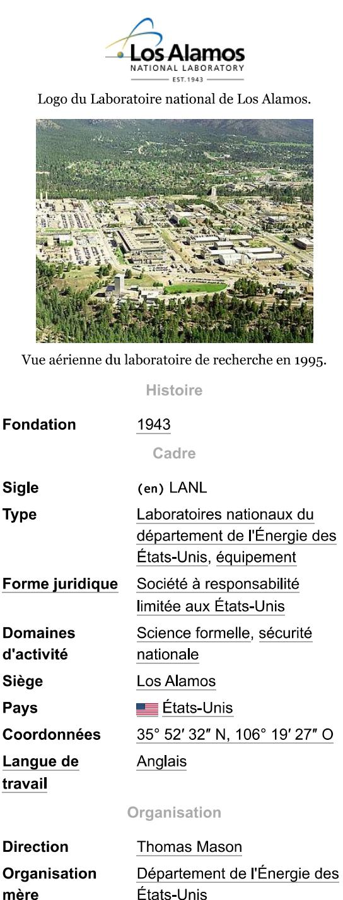
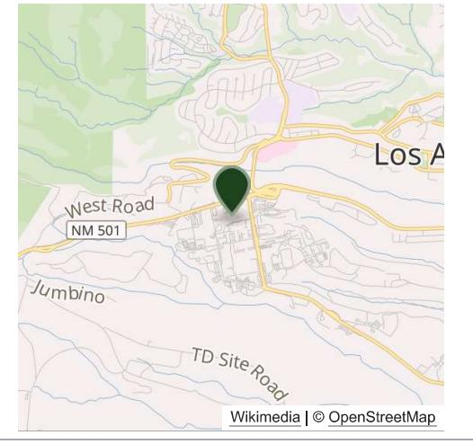
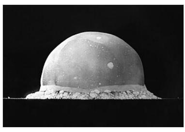

# WIKIPÉDIA Laboratoire national de Los Alamos

Le laboratoire national de Los Alamos (en anglais : Los Alamos National Laboratory : LANL, connu aussi sous les noms Los Alamos Laboratory et Los Alamos Scientific Laboratory) est un laboratoire du département de l'Énergie des États-Unis, géré par l'université de Californie, situé à Los Alamos, dans l'État du Nouveau-Mexique. Le laboratoire est une des plus grandes institutions multidisciplinaires du monde. Il est la plus grande institution et le plus gros employeur dans le Nord du Nouveau-Mexique avec environ 10 000 employés de l'université de Californie plus environ 3 000 sous contrat [Quand ?]

Un tiers des membres de l'équipe technique sont des physiciens, un quart des ingénieurs, un sixième des chimistes, le reste travaillant en mathématiques, informatique, biologie, géologie et d'autres disciplines. Des scientifiques et des étudiants viennent aussi à Los Alamos comme visiteurs pour participer aux projets de recherche. L'équipe travaille à des recherches fondamentales et appliquées en partenariat avec des universités et l'industrie. Le budget annuel est d'environ deux milliards de dollars américains [Quand ?]

Los Alamos est l'un des deux laboratoires américains avec le laboratoire national de Lawrence Livermore où des recherches sur les armes nucléaires sont entreprises.

### Le projet Manhattan

Le laboratoire a été fondé pendant la Seconde Guerre mondiale, en 1943, comme un lieu secret pour centraliser les recherches scientifiques du projet Manhattan, le projet américain de développement des premières armes nucléaires. En septembre 1942, au vu des difficultés créées par la dispersion à travers tous les États-Unis des universités conduisant des recherches préliminaires sur les armes nucléaires, il paraissait nécessaire de disposer d'un laboratoire dédié uniquement à ce projet. Le directeur scientifique du projet Manhattan, Robert Oppenheimer, qui dans sa jeunesse avait passé beaucoup de temps au Nouveau-Mexique, explora la région avec le général Leslie Groves et le physicien Ernest Orlando Lawrence, et choisit comme lieu d'implantation une mesa qui accueillait auparavant la Los Alamos Ranch School. Oppenheimer devint le premier directeur du laboratoire.

Durant le projet Manhattan, le laboratoire portait le nom de Site Y et il accueillit secrètement des milliers d'employés, parmi lesquels figuraient trois lauréats du prix Nobel de physique : Niels Bohr, James Chadwick et Enrico Fermi. Sa seule adresse était une boîte postale, numéro 1663, à Santa Fe. Bien que son contrat avec l'université de Californie fût initialement conçu comme temporaire, le lien fut conservé bien après la guerre. Jusqu'aux bombardements

Laboratoire national de Los

Alamos

National High Magnetic Field Laboratory (en)

Organisme

affilié

Site web

(en) www.lanl.gov (https://ww w.lanl.gov/)

Laboratoire national de Los Alamos — Wikipédia

atomiques d'Hiroshima et Nagasaki, Robert Sproul, le président de l'université de Californie, ignorait l'objectif du laboratoire et imaginait qu'il fabriquait un « rayon mortel » (en anglais : death ray)-. Le seul membre de l'administration de l'université qui connaissait son véritable objectif ainsi que sa situation géographique précise était le secrétaire-trésorier Robert Underhill, chargé des contrats militaires.

Les recherches du laboratoire aboutirent à la création de trois bombes atomiques. La première, une bombe au plutonium (appelée « Gadget »), fut testée le 16 juillet 1945 dans le désert près de Alamogordo dans l'État du Nouveau-Mexique. Les deux suivantes, l'une à l'uranium et l'autre au plutonium (appelées « Little Boy » et « Fat Man »), furent larguées respectivement sur les villes japonaises de Hiroshima le 6 août 1945 et Nagasaki le 9 août.

## Pendant la guerre froide

À la fin de la guerre, Oppenheimer quitte son poste de directeur. Il est remplacé par Norris Bradbury, dont la première mission consiste à rendre possible la production en masse et l'utilisation de la bombe atomique sans qu'il soit nécessaire de recourir à des scientifiques de haut niveau. Beaucoup de ces derniers choisissent de quitter le laboratoire et certains deviennent même des opposants déclarés au développement de nouvelles armes nucléaires.

Les premières étapes d'une explosion du test nucléaire Trinity.

Le laboratoire est chargé de développer la bombe H, ainsi que des variantes de l'arme nucléaire et d'autres explosifs tels l'explosif en poudre polymérisé. En 1952, les États-Unis fondent le laboratoire national de Lawrence Livermore afin de concurrencer le laboratoire national de Los Alamos, dans l'espoir de favoriser l'innovation dans ce domaine. Les deux laboratoires développèrent tout l'arsenal nucléaire des États-Unis. D'autres travaux de recherche fondamentale portaient sur le développement d'accélérateurs de particules ou sur la fusion nucléaire (dans le cadre du Project Sherwood).

Environ 600 cœurs fissiles au plutonium ont été fabriqués sur ce site entre 1945 et 1995. Environ 100 kilogrammes ont été utilisés dans des engins pour des essais hydronucléaires ou autres é.

# Après la guerre froide

À la fin de la guerre froide, les deux laboratoires traversèrent une période d'intense diversification de leurs programmes de recherche afin de s'adapter aux nouvelles conditions politiques et à la baisse des crédits en matière d'armement nucléaire. Aujourd'hui, les recherches du Laboratoire national de Los Alamos sont principalement orientées vers la simulation informatique, les énergies renouvelables (géothermie, énergie solaire) - l'astrophysique et le stockpile stewardship.

Le laboratoire a connu de nombreux scandales. En 1999, Wen Ho Lee, scientifique travaillant à Los Alamos, fut accusé d'avoir à 59 reprises copié des données secrètes utilisées pour la simulation informatique de tests nucléaires et de les avoir sorties du laboratoire. Après dix mois d'emprisonnement, Lee plaida coupable pour un seul des chefs d'inculpation et les 58 autres furent rejetés. Le juge James Park s'excusa pour son incarcération. Lee fut un temps suspecté d'avoir communiqué des secrets nucléaires à la Chine, mais l'enontra le contraire. En 2000, deux disques durs contenant des données classifiés furent d'une zone sécurisée du laboratoire avant d'être retrouvés derrière un photocopieur. Pendant les années 2001 et 2002, 22 ordinateurs portables ne purent être retrouvés . En 2003, le directeur du laboratoire John C. Browne (en) et son adjoint démissionnèrent à la suite d'accusations selon lesquelles ils avaient renvoyé deux employés qui avaient averti de vols répétés dans le laboratoire.

Ces scandales conduisirent en 2003 le département de l'Énergie des États-Unis à remettre en cause son contrat avec l'université de Californie et à lancer un appel d'offres. C'était la première fois que l'université devait concourir pour gérer le laboratoire. Elle a fait une offre pour gérer le laboratoire en partenariat avec Bechtel. L'université du Texas [Laquelle ?] a fait une offre concurrente en partenariat avec Lockheed-Martin.

3/5/25, 10:34 AM

#### Laboratoire national de Los Alamos — Wikipédia

En juillet 2004, un inventaire des données classifiées concernant les armes nucléaires révéla que quatre disques durs avaient disparu. Il s'avéra par la suite que deux d'entre eux avaient été déplacés par erreur dans un autre bâtiment, mais les deux autres restèrent introuvables. Le directeur du laboratoire Peter Nanos (en) ferma une grande partie du laboratoire et reprocha publiquement aux scientifiques qui y travaillaient leur laxisme vis-à-vis des de sécurité. Cependant, un rapport rendu public en janvier 2005 révéla que les deux disques durs manquants étaient en fait un artefact dû à un système d'inventaire défaillant et n'avaient jamais existé. Cet incident contribua à discréditer l'équipe dirigeante du laboratoire. En mars 2005, Nanos démissionna.

Au début de février 2009, les responsables du laboratoire ont avoir perdu 67 ordinateurs, 13 ayant disparu au cours de l'année 20082

Le 25 juin 2011 un feu de broussaille qui dure plusieurs jours menace le laboratoire et ses 20 000 barils de 200 litres contenant des résidus des expériences . Le 28 juin 2011, 12 000 personnes ont été évacuées de la ville-

### Directeurs

- = 1943-1945 : Robert Oppenheimer
- 1945-1970 : Norris Bradbury .
- 1970-1979 : Harold Agnew ■
- 1979-1986 : Donald Kerr (en) ■
- . 1986-1997 : Sig Hecker (en)
- 1997-2003 : John C. Browne (en)
- = 2003-2005 : George Peter Nanos (en)
- = 2005-2006 : Robert W. Kuckuck
- = 2006-2011 : Michael R. Anastasio (en)
- 2011-2017 : Charles F. McMillan (en)
- = 2018 : Terry Wallace (en)
- Depuis 2018 : Thomas Mason

## Notes et références

- 1. Oppenheimer: A Life (http://cstms.berkeley.edu/archive/oppenheimer/exhibit/chapter3.html), http://cstms.berkeley.edu
- 2. Arjun Makhijani, « De dangereuses anomalies : Du plutonium manquant dans le complexe nucléaire militaire américain ? (http://www.ieer.org/ensec/no-36/no36frnc/anomalies.html) », sur Institut pour la recherche sur l'énergie et l'environnement, 2006
- 3. Dossier : l'Amérique des déserts, Grands Reportages, nº 125, juin 1992, p. 117
- 4. (en) Patricia Daukantas, « Energy IG pans notebook lapses at Los Alamos », Government Computer News, 1ª mai 2003 (lire en ligne (http://gcn.com/Articles/2003/05/01/Energy-IG-pans-notebook-lapses-at-Los-Alamos.as px), consulté le 14 février 2009)
- 5. (en) Sylvie Barak, « U.S. nuclear weapons lab loses 67 computers », iTnews Australia, 13 février 2009 (lire en ligne (http://www.itnews.com.au/News/96260,us-nuclear-weapons-lab-loses-67-computers.aspx), consulté le 13 février 2009)
- 6. Caroline Bruneau. « USA : Un feu menace le centre nucléaire de Los Alamos », Le FigaroThousands in N.M. town ordered to evacuate in face of approaching wildfire, 29 juin 2011 (lire en ligne (http://www.lefigaro.fr/international/2 011/06/29/01003-20110629ARTFIG00451-usa-un-feu-menace-le-centre-nucleaire-de-los-alamos.php), consulté le 29 juin 2011)
- 7. (en) « Thousands in N.M. town ordered to evacuate in face of approaching wildfire (http://articles.boston.com/2011 -06-28/news/29713705\_1\_alamos-county-fire-wildfire-santa-fe-national-forest) »/Archive.org/web/"htt p://articles.boston.com/2011-06-28/news/29713705\_1\_alamos-county-fre-wildfire-santa-forest) • Wikiwix (https://archive.wikiwix.com/cache/? url=http://ariides.boston.com/2011-06-28hews/29713705\_1\_alamos-county-fre-wildfress/1.aline.is (http://archive.is/http://artic les.boston.com/2011-06-28/news/29713705\_1\_alamos-county-fre-widfre-santa-forest) • Google (https://webcache.googleusercontent.com/s

earch?hl=fr&q=ache:http://articles.boston.com/2011-06-28/news/29713705\_1\_alamos-county-fire-wildfire-santa-fe-national-forest) • Que faire ?) • Que faire ?) • Que faire ?) •

Boston.com

### Voir aussi

#### Articles connexes

- Projet Manhattan
- Laboratoire national de Lawrence Livermore
- · Dual-Axis Radiographic Hydrodynamics Test Facility
- Institut panrusse de recherche scientifique en physique expérimentale (équivalent russe du LANL)
- Robert Oppenheimer ■
- Theodore Taylor .
- Adele Goldstine

#### Liens externes

- = (en) Site officiel (https://www.lanl.gov/)
- Ressource relative à l'architecture : Registre national des lieux historiques (https://npgallery.nps.gov/AssetDet ail/NRIS/66000893)
- Ressource relative à la géographic Names Information System (https://edits.nationalmap.gov/ap ps/gaz-domestic/public/summary/916039)
- Ressource relative à la recherche : CrossRef (https://search.crossref.org/funding?q=100008902)
- Notices dans des dictionnaires ou encyclopédies généralistes : Britannica (https://www.britannica.com/topic/L os-Alamos-National-Laboratory) · Store norske leksikon (https://snl.no/Los Alamos National Laboratory)
- Notices d'autorité : VIAF (http://viaf.org/viaf/127685061) ISNI (https://isni.org/isni/000000011087915X) ■ BnF (https://catalogue.bnf.fr/ark:/12148/cb12339442s) (données (https://data.bnf.fr/ark:112148/cb12339442s)) · ldRef (http://www.idref.fr/032347391) · LCCN (http://id.loc.gov/authorities/n82002711) GND (http://d-nb.info/gnd/2083466-4) · CiNii (http://ci.nii.ac.jp/author/DA03725371?l=en) · Pologne (https://dbn.bn.org.pl/descriptor-details/9814081667605606) · lsraël (http://olduli.nli.org.il/F/?func=find-b&local\_base=NLX10&find\_code=UID&request=987007264612905171) • NUKAT (http://nukat.edu.pl/aut/n%202006053841) • Australie (http://nla.gov.au/anbd.aut-an36557438) • Norvège (https://authority.bibsys.no/authority/rest/authorities/html/90051304) · WorldCat (http://www.worldcat.org/identities/lccn-n82-002711)

Ce document provient de « https://fr.wikipedia.org/w/index.php?title=Laboratoire\_national\_de\_Los\_Alamos&oldid=218749005 ».